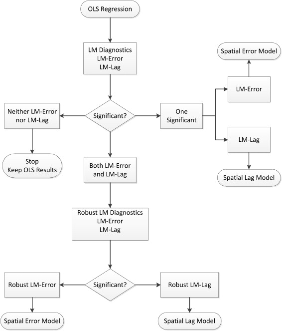

---
output:
  md_document
  
editor_options: 
  markdown: 
    wrap: 72
---

# SEAI 2022 - R - Lab 6

# Spatial Econometrics Modelling with R

Vincenzo Nardelli -
[vincnardelli\@gmail.com](mailto:vincnardelli@gmail.com){.email} -
<https://github.com/vincnardelli>

## Lab structure

Let's load columbus data

```{r}
library(sf)
library(dplyr)
library(spdep)
library(spatialreg)
library(lmtest)
library(tseries)

columbus <- read_sf("data/columbus/columbus.shp")
nb<-poly2nb(columbus, queen=T)
listw <- nb2listw(nb)
listw
```

## OLS

```{r}
ols <- lm (CRIME ~ INC + HOVAL, data=columbus)
summary(ols)
```

```{r}
coefficients(ols)
```

```{r}
res <- residuals(ols)
res
```

```{r}
hist(res,main='histogram of residuals')
```

```{r}
predict(ols, columbus)
```

Test for heteroskedasticity - [Breush
Pagan](https://en.wikipedia.org/wiki/Breusch%E2%80%93Pagan_test)

H0: homoschedasticity vs H1: heteroschedasticity

```{r}
bptest(ols)
```

Test for normality - [Jarque-Bera](https://en.wikipedia.org/wiki/Jarque%E2%80%93Bera_test)

```{r}
jarque.bera.test(ols$residuals)
```
Shapiro test
```{r}
shapiro.test(ols$residuals)
```

```{r}
lm.morantest(ols, listw)
```

{width="300"}

```{r}
lm.LMtests(ols, listw, test="all")
```

## Spatial lag

```{r}
lag<-lagsarlm(CRIME ~ INC + HOVAL,listw = listw, data=columbus)
summary(lag)
```

```{r}
lag_gmm<-stsls(CRIME ~ INC + HOVAL,listw = listw, data=columbus)
summary(lag_gmm)
```

## Spatial error

```{r}
error<-errorsarlm(CRIME ~ INC + HOVAL,listw = listw, data=columbus)
summary(error)
```

```{r}
error_gmm<-GMerrorsar(CRIME ~ INC + HOVAL,listw = listw, data=columbus)
summary(error_gmm)
```

## SARAR Model

```{r}
sarar<-sacsarlm(CRIME ~ INC + HOVAL,listw = listw, data=columbus)
summary(sarar)
```

```{r}
sarar_gmm<- gstsls(CRIME ~ INC + HOVAL,listw = listw, data=columbus)
summary(sarar_gmm)
```
