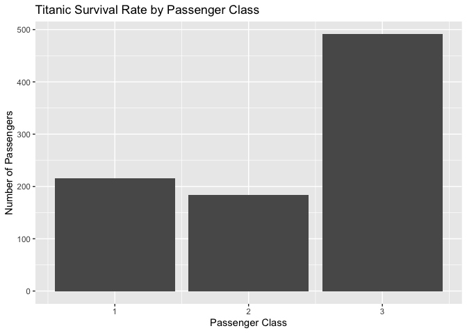
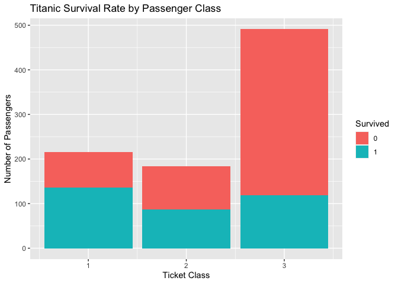
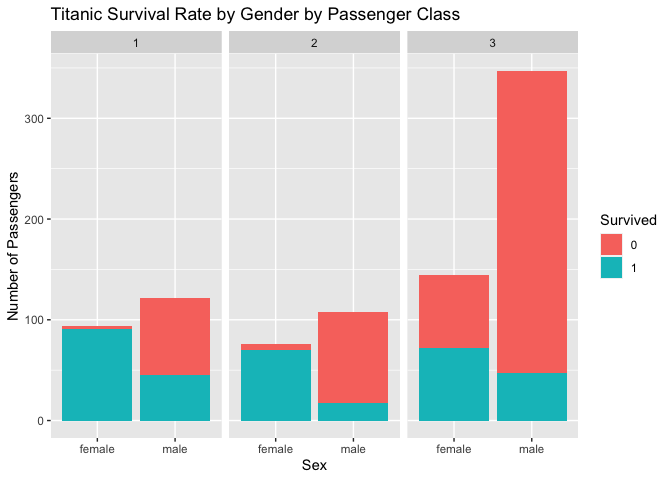
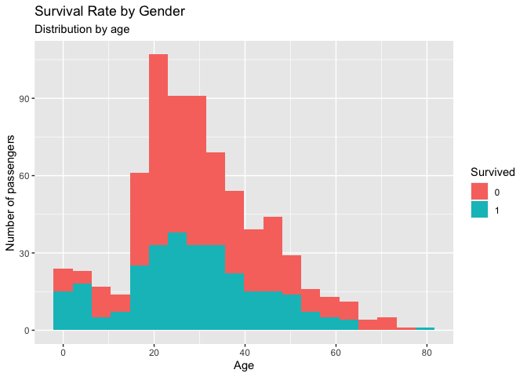
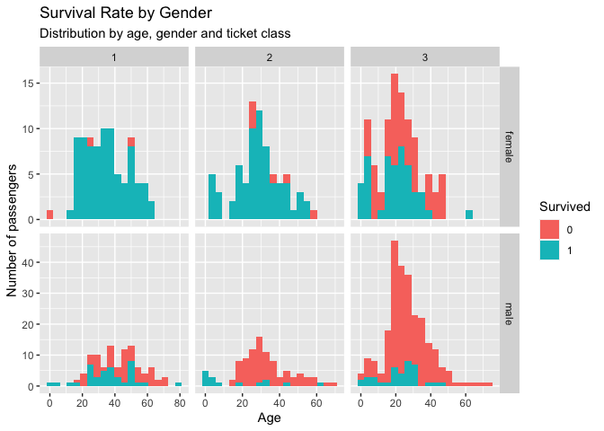
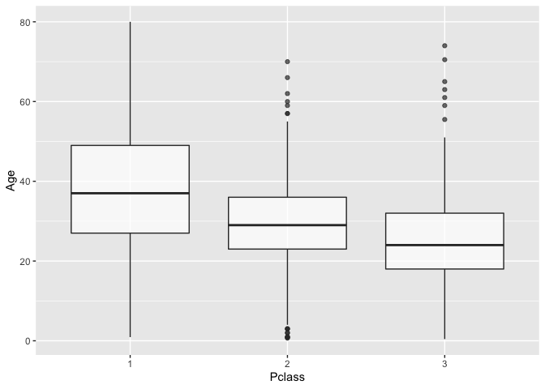
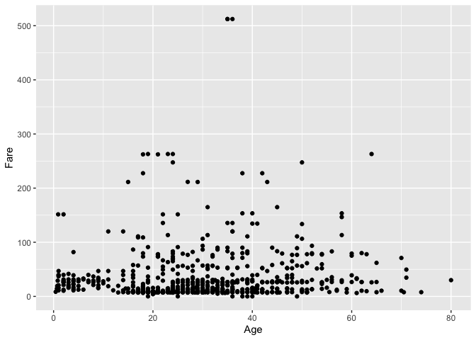
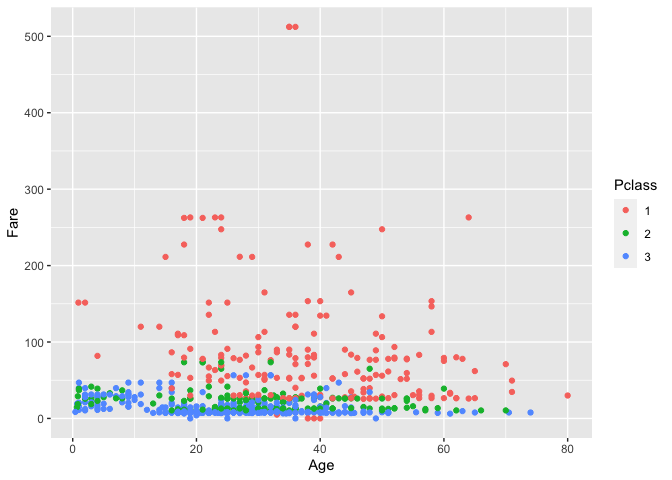

# SEAI 2022 - R - Lab 2

# Intro to R

Vincenzo Nardelli - <vincnardelli@gmail.com> -
<https://github.com/vincnardelli>

## Lab structure

-   Intro
-   Matrix computation
-   Data manipulation with dplyr
-   Graphs with ggplot2

Let’s start from the basics!

    3 + 5

    ## [1] 8

    12/7

    ## [1] 1.714286

    result <- 3 + 5
    result

    ## [1] 8

    print(result)

    ## [1] 8

    result <- result * 3.1415
    print(result)

    ## [1] 25.132

    vector = c(1, 3, 8, 13)
    vector

    ## [1]  1  3  8 13

Unlike Python, the basic version of R allow operations between scalars
and matrices without loading any external packages.

    vector[1]

    ## [1] 1

The subset is very similar to Python but the index starts from 1 instead
of 0.

Furthermore, in the case of multiple selection, the index starts from 1
and the second value representing the last element is included in the
subset (unlike Python which is NOT included).

    vector[1:3]

    ## [1] 1 3 8

    vector[c(FALSE, TRUE, TRUE, FALSE)]

    ## [1] 3 8

    vector < 3

    ## [1]  TRUE FALSE FALSE FALSE

    vector[vector < 3]

    ## [1] 1

    1:10

    ##  [1]  1  2  3  4  5  6  7  8  9 10

    seq(from=1, to=10, by=1)

    ##  [1]  1  2  3  4  5  6  7  8  9 10

Inside a vector we can insert just homogeneous class object.

    class("a")

    ## [1] "character"

    class(1)

    ## [1] "numeric"

    c(1, "a")

    ## [1] "1" "a"

    class(c(1, "a"))

    ## [1] "character"

# 1 - Matrix computation

    a <- matrix(c(10, 8, 5, 12), nrow=2, ncol=2, byrow=TRUE)
    a

    ##      [,1] [,2]
    ## [1,]   10    8
    ## [2,]    5   12

    dim(a)

    ## [1] 2 2

Subsetting in two dimension

    a[1, ]

    ## [1] 10  8

    a[, 1]

    ## [1] 10  5

    a[1, 1]

    ## [1] 10

Operations with matrices

    a + 2

    ##      [,1] [,2]
    ## [1,]   12   10
    ## [2,]    7   14

    a * 2

    ##      [,1] [,2]
    ## [1,]   20   16
    ## [2,]   10   24

    t(a)

    ##      [,1] [,2]
    ## [1,]   10    5
    ## [2,]    8   12

    b <- matrix(c(5, 3, 15, 6), ncol = 2, byrow = TRUE)
    b

    ##      [,1] [,2]
    ## [1,]    5    3
    ## [2,]   15    6

    a + b

    ##      [,1] [,2]
    ## [1,]   15   11
    ## [2,]   20   18

Element-wise multiplication

    a * b 

    ##      [,1] [,2]
    ## [1,]   50   24
    ## [2,]   75   72

Matrix multiplication (matricial multiplication)

    a %*% b

    ##      [,1] [,2]
    ## [1,]  170   78
    ## [2,]  205   87

    crossprod(a,b)

    ##      [,1] [,2]
    ## [1,]  125   60
    ## [2,]  220   96

    t(a) %*% b

    ##      [,1] [,2]
    ## [1,]  125   60
    ## [2,]  220   96

Kronecker product

    a %x% b

    ##      [,1] [,2] [,3] [,4]
    ## [1,]   50   30   40   24
    ## [2,]  150   60  120   48
    ## [3,]   25   15   60   36
    ## [4,]   75   30  180   72

Determinant

    det(a)

    ## [1] 80

Inverse of a matrix

    solve(a)

    ##         [,1]   [,2]
    ## [1,]  0.1500 -0.100
    ## [2,] -0.0625  0.125

# 2 - Data manipulation with dplyr

Let’s start loading same data from R.

    data(mtcars)
    mtcars

    ##                      mpg cyl  disp  hp drat    wt  qsec vs am gear carb
    ## Mazda RX4           21.0   6 160.0 110 3.90 2.620 16.46  0  1    4    4
    ## Mazda RX4 Wag       21.0   6 160.0 110 3.90 2.875 17.02  0  1    4    4
    ## Datsun 710          22.8   4 108.0  93 3.85 2.320 18.61  1  1    4    1
    ## Hornet 4 Drive      21.4   6 258.0 110 3.08 3.215 19.44  1  0    3    1
    ## Hornet Sportabout   18.7   8 360.0 175 3.15 3.440 17.02  0  0    3    2
    ## Valiant             18.1   6 225.0 105 2.76 3.460 20.22  1  0    3    1
    ## Duster 360          14.3   8 360.0 245 3.21 3.570 15.84  0  0    3    4
    ## Merc 240D           24.4   4 146.7  62 3.69 3.190 20.00  1  0    4    2
    ## Merc 230            22.8   4 140.8  95 3.92 3.150 22.90  1  0    4    2
    ## Merc 280            19.2   6 167.6 123 3.92 3.440 18.30  1  0    4    4
    ## Merc 280C           17.8   6 167.6 123 3.92 3.440 18.90  1  0    4    4
    ## Merc 450SE          16.4   8 275.8 180 3.07 4.070 17.40  0  0    3    3
    ## Merc 450SL          17.3   8 275.8 180 3.07 3.730 17.60  0  0    3    3
    ## Merc 450SLC         15.2   8 275.8 180 3.07 3.780 18.00  0  0    3    3
    ## Cadillac Fleetwood  10.4   8 472.0 205 2.93 5.250 17.98  0  0    3    4
    ## Lincoln Continental 10.4   8 460.0 215 3.00 5.424 17.82  0  0    3    4
    ## Chrysler Imperial   14.7   8 440.0 230 3.23 5.345 17.42  0  0    3    4
    ## Fiat 128            32.4   4  78.7  66 4.08 2.200 19.47  1  1    4    1
    ## Honda Civic         30.4   4  75.7  52 4.93 1.615 18.52  1  1    4    2
    ## Toyota Corolla      33.9   4  71.1  65 4.22 1.835 19.90  1  1    4    1
    ## Toyota Corona       21.5   4 120.1  97 3.70 2.465 20.01  1  0    3    1
    ## Dodge Challenger    15.5   8 318.0 150 2.76 3.520 16.87  0  0    3    2
    ## AMC Javelin         15.2   8 304.0 150 3.15 3.435 17.30  0  0    3    2
    ## Camaro Z28          13.3   8 350.0 245 3.73 3.840 15.41  0  0    3    4
    ## Pontiac Firebird    19.2   8 400.0 175 3.08 3.845 17.05  0  0    3    2
    ## Fiat X1-9           27.3   4  79.0  66 4.08 1.935 18.90  1  1    4    1
    ## Porsche 914-2       26.0   4 120.3  91 4.43 2.140 16.70  0  1    5    2
    ## Lotus Europa        30.4   4  95.1 113 3.77 1.513 16.90  1  1    5    2
    ## Ford Pantera L      15.8   8 351.0 264 4.22 3.170 14.50  0  1    5    4
    ## Ferrari Dino        19.7   6 145.0 175 3.62 2.770 15.50  0  1    5    6
    ## Maserati Bora       15.0   8 301.0 335 3.54 3.570 14.60  0  1    5    8
    ## Volvo 142E          21.4   4 121.0 109 4.11 2.780 18.60  1  1    4    2

    class(mtcars)

    ## [1] "data.frame"

A `data.frame` is an analog of a matrix which can contains a difference
classes of objects for each column. It is the perfect class to store the
data which we commonly use for our analysis.

    dim(mtcars)

    ## [1] 32 11

    colnames(mtcars)

    ##  [1] "mpg"  "cyl"  "disp" "hp"   "drat" "wt"   "qsec" "vs"   "am"   "gear"
    ## [11] "carb"

    summary(mtcars)

    ##       mpg             cyl             disp             hp       
    ##  Min.   :10.40   Min.   :4.000   Min.   : 71.1   Min.   : 52.0  
    ##  1st Qu.:15.43   1st Qu.:4.000   1st Qu.:120.8   1st Qu.: 96.5  
    ##  Median :19.20   Median :6.000   Median :196.3   Median :123.0  
    ##  Mean   :20.09   Mean   :6.188   Mean   :230.7   Mean   :146.7  
    ##  3rd Qu.:22.80   3rd Qu.:8.000   3rd Qu.:326.0   3rd Qu.:180.0  
    ##  Max.   :33.90   Max.   :8.000   Max.   :472.0   Max.   :335.0  
    ##       drat             wt             qsec             vs        
    ##  Min.   :2.760   Min.   :1.513   Min.   :14.50   Min.   :0.0000  
    ##  1st Qu.:3.080   1st Qu.:2.581   1st Qu.:16.89   1st Qu.:0.0000  
    ##  Median :3.695   Median :3.325   Median :17.71   Median :0.0000  
    ##  Mean   :3.597   Mean   :3.217   Mean   :17.85   Mean   :0.4375  
    ##  3rd Qu.:3.920   3rd Qu.:3.610   3rd Qu.:18.90   3rd Qu.:1.0000  
    ##  Max.   :4.930   Max.   :5.424   Max.   :22.90   Max.   :1.0000  
    ##        am              gear            carb      
    ##  Min.   :0.0000   Min.   :3.000   Min.   :1.000  
    ##  1st Qu.:0.0000   1st Qu.:3.000   1st Qu.:2.000  
    ##  Median :0.0000   Median :4.000   Median :2.000  
    ##  Mean   :0.4062   Mean   :3.688   Mean   :2.812  
    ##  3rd Qu.:1.0000   3rd Qu.:4.000   3rd Qu.:4.000  
    ##  Max.   :1.0000   Max.   :5.000   Max.   :8.000

Subset a dataframe with base R

    mtcars[1,]

    ##           mpg cyl disp  hp drat   wt  qsec vs am gear carb
    ## Mazda RX4  21   6  160 110  3.9 2.62 16.46  0  1    4    4

    mtcars[1:3, ]

    ##                mpg cyl disp  hp drat    wt  qsec vs am gear carb
    ## Mazda RX4     21.0   6  160 110 3.90 2.620 16.46  0  1    4    4
    ## Mazda RX4 Wag 21.0   6  160 110 3.90 2.875 17.02  0  1    4    4
    ## Datsun 710    22.8   4  108  93 3.85 2.320 18.61  1  1    4    1

    mtcars[, 1]

    ##  [1] 21.0 21.0 22.8 21.4 18.7 18.1 14.3 24.4 22.8 19.2 17.8 16.4 17.3 15.2 10.4
    ## [16] 10.4 14.7 32.4 30.4 33.9 21.5 15.5 15.2 13.3 19.2 27.3 26.0 30.4 15.8 19.7
    ## [31] 15.0 21.4

    mtcars$hp

    ##  [1] 110 110  93 110 175 105 245  62  95 123 123 180 180 180 205 215 230  66  52
    ## [20]  65  97 150 150 245 175  66  91 113 264 175 335 109

## Data loading

    path = "https://raw.githubusercontent.com/pandas-dev/pandas/master/doc/data/titanic.csv"
    titanic = read.csv(path)
    head(titanic)

    ##   PassengerId Survived Pclass
    ## 1           1        0      3
    ## 2           2        1      1
    ## 3           3        1      3
    ## 4           4        1      1
    ## 5           5        0      3
    ## 6           6        0      3
    ##                                                  Name    Sex Age SibSp Parch
    ## 1                             Braund, Mr. Owen Harris   male  22     1     0
    ## 2 Cumings, Mrs. John Bradley (Florence Briggs Thayer) female  38     1     0
    ## 3                              Heikkinen, Miss. Laina female  26     0     0
    ## 4        Futrelle, Mrs. Jacques Heath (Lily May Peel) female  35     1     0
    ## 5                            Allen, Mr. William Henry   male  35     0     0
    ## 6                                    Moran, Mr. James   male  NA     0     0
    ##             Ticket    Fare Cabin Embarked
    ## 1        A/5 21171  7.2500              S
    ## 2         PC 17599 71.2833   C85        C
    ## 3 STON/O2. 3101282  7.9250              S
    ## 4           113803 53.1000  C123        S
    ## 5           373450  8.0500              S
    ## 6           330877  8.4583              Q

Now we will explore the use of dplyr in subsetting, manipulating and
summarising our data frame. Most of the task that we will cover are
possible also in base R without the use of others packages but dplyr
simplify a lot the work.

## R packages

How to install an R package from CRAN

    #install.packages("dplyr")

Load package in the environment

    library(dplyr)

    ## 
    ## Attaching package: 'dplyr'

    ## The following objects are masked from 'package:stats':
    ## 
    ##     filter, lag

    ## The following objects are masked from 'package:base':
    ## 
    ##     intersect, setdiff, setequal, union

## Subset variables (columns)

    select(titanic, PassengerId, Age)

    ##     PassengerId   Age
    ## 1             1 22.00
    ## 2             2 38.00
    ## 3             3 26.00
    ## 4             4 35.00
    ## 5             5 35.00
    ## 6             6    NA
    ## 7             7 54.00
    ## 8             8  2.00
    ## 9             9 27.00
    ## 10           10 14.00
    ## 11           11  4.00
    ## 12           12 58.00
    ## 13           13 20.00
    ## 14           14 39.00
    ## 15           15 14.00
    ## 16           16 55.00
    ## 17           17  2.00
    ## 18           18    NA
    ## 19           19 31.00
    ## 20           20    NA
    ## 21           21 35.00
    ## 22           22 34.00
    ## 23           23 15.00
    ## 24           24 28.00
    ## 25           25  8.00
    ## 26           26 38.00
    ## 27           27    NA
    ## 28           28 19.00
    ## 29           29    NA
    ## 30           30    NA
    ## 31           31 40.00
    ## 32           32    NA
    ## 33           33    NA
    ## 34           34 66.00
    ## 35           35 28.00
    ## 36           36 42.00
    ## 37           37    NA
    ## 38           38 21.00
    ## 39           39 18.00
    ## 40           40 14.00
    ## 41           41 40.00
    ## 42           42 27.00
    ## 43           43    NA
    ## 44           44  3.00
    ## 45           45 19.00
    ## 46           46    NA
    ## 47           47    NA
    ## 48           48    NA
    ## 49           49    NA
    ## 50           50 18.00
    ## 51           51  7.00
    ## 52           52 21.00
    ## 53           53 49.00
    ## 54           54 29.00
    ## 55           55 65.00
    ## 56           56    NA
    ## 57           57 21.00
    ## 58           58 28.50
    ## 59           59  5.00
    ## 60           60 11.00
    ## 61           61 22.00
    ## 62           62 38.00
    ## 63           63 45.00
    ## 64           64  4.00
    ## 65           65    NA
    ## 66           66    NA
    ## 67           67 29.00
    ## 68           68 19.00
    ## 69           69 17.00
    ## 70           70 26.00
    ## 71           71 32.00
    ## 72           72 16.00
    ## 73           73 21.00
    ## 74           74 26.00
    ## 75           75 32.00
    ## 76           76 25.00
    ## 77           77    NA
    ## 78           78    NA
    ## 79           79  0.83
    ## 80           80 30.00
    ## 81           81 22.00
    ## 82           82 29.00
    ## 83           83    NA
    ## 84           84 28.00
    ## 85           85 17.00
    ## 86           86 33.00
    ## 87           87 16.00
    ## 88           88    NA
    ## 89           89 23.00
    ## 90           90 24.00
    ## 91           91 29.00
    ## 92           92 20.00
    ## 93           93 46.00
    ## 94           94 26.00
    ## 95           95 59.00
    ## 96           96    NA
    ## 97           97 71.00
    ## 98           98 23.00
    ## 99           99 34.00
    ## 100         100 34.00
    ## 101         101 28.00
    ## 102         102    NA
    ## 103         103 21.00
    ## 104         104 33.00
    ## 105         105 37.00
    ## 106         106 28.00
    ## 107         107 21.00
    ## 108         108    NA
    ## 109         109 38.00
    ## 110         110    NA
    ## 111         111 47.00
    ## 112         112 14.50
    ## 113         113 22.00
    ## 114         114 20.00
    ## 115         115 17.00
    ## 116         116 21.00
    ## 117         117 70.50
    ## 118         118 29.00
    ## 119         119 24.00
    ## 120         120  2.00
    ## 121         121 21.00
    ## 122         122    NA
    ## 123         123 32.50
    ## 124         124 32.50
    ## 125         125 54.00
    ## 126         126 12.00
    ## 127         127    NA
    ## 128         128 24.00
    ## 129         129    NA
    ## 130         130 45.00
    ## 131         131 33.00
    ## 132         132 20.00
    ## 133         133 47.00
    ## 134         134 29.00
    ## 135         135 25.00
    ## 136         136 23.00
    ## 137         137 19.00
    ## 138         138 37.00
    ## 139         139 16.00
    ## 140         140 24.00
    ## 141         141    NA
    ## 142         142 22.00
    ## 143         143 24.00
    ## 144         144 19.00
    ## 145         145 18.00
    ## 146         146 19.00
    ## 147         147 27.00
    ## 148         148  9.00
    ## 149         149 36.50
    ## 150         150 42.00
    ## 151         151 51.00
    ## 152         152 22.00
    ## 153         153 55.50
    ## 154         154 40.50
    ## 155         155    NA
    ## 156         156 51.00
    ## 157         157 16.00
    ## 158         158 30.00
    ## 159         159    NA
    ## 160         160    NA
    ## 161         161 44.00
    ## 162         162 40.00
    ## 163         163 26.00
    ## 164         164 17.00
    ## 165         165  1.00
    ## 166         166  9.00
    ## 167         167    NA
    ## 168         168 45.00
    ## 169         169    NA
    ## 170         170 28.00
    ## 171         171 61.00
    ## 172         172  4.00
    ## 173         173  1.00
    ## 174         174 21.00
    ## 175         175 56.00
    ## 176         176 18.00
    ## 177         177    NA
    ## 178         178 50.00
    ## 179         179 30.00
    ## 180         180 36.00
    ## 181         181    NA
    ## 182         182    NA
    ## 183         183  9.00
    ## 184         184  1.00
    ## 185         185  4.00
    ## 186         186    NA
    ## 187         187    NA
    ## 188         188 45.00
    ## 189         189 40.00
    ## 190         190 36.00
    ## 191         191 32.00
    ## 192         192 19.00
    ## 193         193 19.00
    ## 194         194  3.00
    ## 195         195 44.00
    ## 196         196 58.00
    ## 197         197    NA
    ## 198         198 42.00
    ## 199         199    NA
    ## 200         200 24.00
    ## 201         201 28.00
    ## 202         202    NA
    ## 203         203 34.00
    ## 204         204 45.50
    ## 205         205 18.00
    ## 206         206  2.00
    ## 207         207 32.00
    ## 208         208 26.00
    ## 209         209 16.00
    ## 210         210 40.00
    ## 211         211 24.00
    ## 212         212 35.00
    ## 213         213 22.00
    ## 214         214 30.00
    ## 215         215    NA
    ## 216         216 31.00
    ## 217         217 27.00
    ## 218         218 42.00
    ## 219         219 32.00
    ## 220         220 30.00
    ## 221         221 16.00
    ## 222         222 27.00
    ## 223         223 51.00
    ## 224         224    NA
    ## 225         225 38.00
    ## 226         226 22.00
    ## 227         227 19.00
    ## 228         228 20.50
    ## 229         229 18.00
    ## 230         230    NA
    ## 231         231 35.00
    ## 232         232 29.00
    ## 233         233 59.00
    ## 234         234  5.00
    ## 235         235 24.00
    ## 236         236    NA
    ## 237         237 44.00
    ## 238         238  8.00
    ## 239         239 19.00
    ## 240         240 33.00
    ## 241         241    NA
    ## 242         242    NA
    ## 243         243 29.00
    ## 244         244 22.00
    ## 245         245 30.00
    ## 246         246 44.00
    ## 247         247 25.00
    ## 248         248 24.00
    ## 249         249 37.00
    ## 250         250 54.00
    ## 251         251    NA
    ## 252         252 29.00
    ## 253         253 62.00
    ## 254         254 30.00
    ## 255         255 41.00
    ## 256         256 29.00
    ## 257         257    NA
    ## 258         258 30.00
    ## 259         259 35.00
    ## 260         260 50.00
    ## 261         261    NA
    ## 262         262  3.00
    ## 263         263 52.00
    ## 264         264 40.00
    ## 265         265    NA
    ## 266         266 36.00
    ## 267         267 16.00
    ## 268         268 25.00
    ## 269         269 58.00
    ## 270         270 35.00
    ## 271         271    NA
    ## 272         272 25.00
    ## 273         273 41.00
    ## 274         274 37.00
    ## 275         275    NA
    ## 276         276 63.00
    ## 277         277 45.00
    ## 278         278    NA
    ## 279         279  7.00
    ## 280         280 35.00
    ## 281         281 65.00
    ## 282         282 28.00
    ## 283         283 16.00
    ## 284         284 19.00
    ## 285         285    NA
    ## 286         286 33.00
    ## 287         287 30.00
    ## 288         288 22.00
    ## 289         289 42.00
    ## 290         290 22.00
    ## 291         291 26.00
    ## 292         292 19.00
    ## 293         293 36.00
    ## 294         294 24.00
    ## 295         295 24.00
    ## 296         296    NA
    ## 297         297 23.50
    ## 298         298  2.00
    ## 299         299    NA
    ## 300         300 50.00
    ## 301         301    NA
    ## 302         302    NA
    ## 303         303 19.00
    ## 304         304    NA
    ## 305         305    NA
    ## 306         306  0.92
    ## 307         307    NA
    ## 308         308 17.00
    ## 309         309 30.00
    ## 310         310 30.00
    ## 311         311 24.00
    ## 312         312 18.00
    ## 313         313 26.00
    ## 314         314 28.00
    ## 315         315 43.00
    ## 316         316 26.00
    ## 317         317 24.00
    ## 318         318 54.00
    ## 319         319 31.00
    ## 320         320 40.00
    ## 321         321 22.00
    ## 322         322 27.00
    ## 323         323 30.00
    ## 324         324 22.00
    ## 325         325    NA
    ## 326         326 36.00
    ## 327         327 61.00
    ## 328         328 36.00
    ## 329         329 31.00
    ## 330         330 16.00
    ## 331         331    NA
    ## 332         332 45.50
    ## 333         333 38.00
    ## 334         334 16.00
    ## 335         335    NA
    ## 336         336    NA
    ## 337         337 29.00
    ## 338         338 41.00
    ## 339         339 45.00
    ## 340         340 45.00
    ## 341         341  2.00
    ## 342         342 24.00
    ## 343         343 28.00
    ## 344         344 25.00
    ## 345         345 36.00
    ## 346         346 24.00
    ## 347         347 40.00
    ## 348         348    NA
    ## 349         349  3.00
    ## 350         350 42.00
    ## 351         351 23.00
    ## 352         352    NA
    ## 353         353 15.00
    ## 354         354 25.00
    ## 355         355    NA
    ## 356         356 28.00
    ## 357         357 22.00
    ## 358         358 38.00
    ## 359         359    NA
    ## 360         360    NA
    ## 361         361 40.00
    ## 362         362 29.00
    ## 363         363 45.00
    ## 364         364 35.00
    ## 365         365    NA
    ## 366         366 30.00
    ## 367         367 60.00
    ## 368         368    NA
    ## 369         369    NA
    ## 370         370 24.00
    ## 371         371 25.00
    ## 372         372 18.00
    ## 373         373 19.00
    ## 374         374 22.00
    ## 375         375  3.00
    ## 376         376    NA
    ## 377         377 22.00
    ## 378         378 27.00
    ## 379         379 20.00
    ## 380         380 19.00
    ## 381         381 42.00
    ## 382         382  1.00
    ## 383         383 32.00
    ## 384         384 35.00
    ## 385         385    NA
    ## 386         386 18.00
    ## 387         387  1.00
    ## 388         388 36.00
    ## 389         389    NA
    ## 390         390 17.00
    ## 391         391 36.00
    ## 392         392 21.00
    ## 393         393 28.00
    ## 394         394 23.00
    ## 395         395 24.00
    ## 396         396 22.00
    ## 397         397 31.00
    ## 398         398 46.00
    ## 399         399 23.00
    ## 400         400 28.00
    ## 401         401 39.00
    ## 402         402 26.00
    ## 403         403 21.00
    ## 404         404 28.00
    ## 405         405 20.00
    ## 406         406 34.00
    ## 407         407 51.00
    ## 408         408  3.00
    ## 409         409 21.00
    ## 410         410    NA
    ## 411         411    NA
    ## 412         412    NA
    ## 413         413 33.00
    ## 414         414    NA
    ## 415         415 44.00
    ## 416         416    NA
    ## 417         417 34.00
    ## 418         418 18.00
    ## 419         419 30.00
    ## 420         420 10.00
    ## 421         421    NA
    ## 422         422 21.00
    ## 423         423 29.00
    ## 424         424 28.00
    ## 425         425 18.00
    ## 426         426    NA
    ## 427         427 28.00
    ## 428         428 19.00
    ## 429         429    NA
    ## 430         430 32.00
    ## 431         431 28.00
    ## 432         432    NA
    ## 433         433 42.00
    ## 434         434 17.00
    ## 435         435 50.00
    ## 436         436 14.00
    ## 437         437 21.00
    ## 438         438 24.00
    ## 439         439 64.00
    ## 440         440 31.00
    ## 441         441 45.00
    ## 442         442 20.00
    ## 443         443 25.00
    ## 444         444 28.00
    ## 445         445    NA
    ## 446         446  4.00
    ## 447         447 13.00
    ## 448         448 34.00
    ## 449         449  5.00
    ## 450         450 52.00
    ## 451         451 36.00
    ## 452         452    NA
    ## 453         453 30.00
    ## 454         454 49.00
    ## 455         455    NA
    ## 456         456 29.00
    ## 457         457 65.00
    ## 458         458    NA
    ## 459         459 50.00
    ## 460         460    NA
    ## 461         461 48.00
    ## 462         462 34.00
    ## 463         463 47.00
    ## 464         464 48.00
    ## 465         465    NA
    ## 466         466 38.00
    ## 467         467    NA
    ## 468         468 56.00
    ## 469         469    NA
    ## 470         470  0.75
    ## 471         471    NA
    ## 472         472 38.00
    ## 473         473 33.00
    ## 474         474 23.00
    ## 475         475 22.00
    ## 476         476    NA
    ## 477         477 34.00
    ## 478         478 29.00
    ## 479         479 22.00
    ## 480         480  2.00
    ## 481         481  9.00
    ## 482         482    NA
    ## 483         483 50.00
    ## 484         484 63.00
    ## 485         485 25.00
    ## 486         486    NA
    ## 487         487 35.00
    ## 488         488 58.00
    ## 489         489 30.00
    ## 490         490  9.00
    ## 491         491    NA
    ## 492         492 21.00
    ## 493         493 55.00
    ## 494         494 71.00
    ## 495         495 21.00
    ## 496         496    NA
    ## 497         497 54.00
    ## 498         498    NA
    ## 499         499 25.00
    ## 500         500 24.00
    ## 501         501 17.00
    ## 502         502 21.00
    ## 503         503    NA
    ## 504         504 37.00
    ## 505         505 16.00
    ## 506         506 18.00
    ## 507         507 33.00
    ## 508         508    NA
    ## 509         509 28.00
    ## 510         510 26.00
    ## 511         511 29.00
    ## 512         512    NA
    ## 513         513 36.00
    ## 514         514 54.00
    ## 515         515 24.00
    ## 516         516 47.00
    ## 517         517 34.00
    ## 518         518    NA
    ## 519         519 36.00
    ## 520         520 32.00
    ## 521         521 30.00
    ## 522         522 22.00
    ## 523         523    NA
    ## 524         524 44.00
    ## 525         525    NA
    ## 526         526 40.50
    ## 527         527 50.00
    ## 528         528    NA
    ## 529         529 39.00
    ## 530         530 23.00
    ## 531         531  2.00
    ## 532         532    NA
    ## 533         533 17.00
    ## 534         534    NA
    ## 535         535 30.00
    ## 536         536  7.00
    ## 537         537 45.00
    ## 538         538 30.00
    ## 539         539    NA
    ## 540         540 22.00
    ## 541         541 36.00
    ## 542         542  9.00
    ## 543         543 11.00
    ## 544         544 32.00
    ## 545         545 50.00
    ## 546         546 64.00
    ## 547         547 19.00
    ## 548         548    NA
    ## 549         549 33.00
    ## 550         550  8.00
    ## 551         551 17.00
    ## 552         552 27.00
    ## 553         553    NA
    ## 554         554 22.00
    ## 555         555 22.00
    ## 556         556 62.00
    ## 557         557 48.00
    ## 558         558    NA
    ## 559         559 39.00
    ## 560         560 36.00
    ## 561         561    NA
    ## 562         562 40.00
    ## 563         563 28.00
    ## 564         564    NA
    ## 565         565    NA
    ## 566         566 24.00
    ## 567         567 19.00
    ## 568         568 29.00
    ## 569         569    NA
    ## 570         570 32.00
    ## 571         571 62.00
    ## 572         572 53.00
    ## 573         573 36.00
    ## 574         574    NA
    ## 575         575 16.00
    ## 576         576 19.00
    ## 577         577 34.00
    ## 578         578 39.00
    ## 579         579    NA
    ## 580         580 32.00
    ## 581         581 25.00
    ## 582         582 39.00
    ## 583         583 54.00
    ## 584         584 36.00
    ## 585         585    NA
    ## 586         586 18.00
    ## 587         587 47.00
    ## 588         588 60.00
    ## 589         589 22.00
    ## 590         590    NA
    ## 591         591 35.00
    ## 592         592 52.00
    ## 593         593 47.00
    ## 594         594    NA
    ## 595         595 37.00
    ## 596         596 36.00
    ## 597         597    NA
    ## 598         598 49.00
    ## 599         599    NA
    ## 600         600 49.00
    ## 601         601 24.00
    ## 602         602    NA
    ## 603         603    NA
    ## 604         604 44.00
    ## 605         605 35.00
    ## 606         606 36.00
    ## 607         607 30.00
    ## 608         608 27.00
    ## 609         609 22.00
    ## 610         610 40.00
    ## 611         611 39.00
    ## 612         612    NA
    ## 613         613    NA
    ## 614         614    NA
    ## 615         615 35.00
    ## 616         616 24.00
    ## 617         617 34.00
    ## 618         618 26.00
    ## 619         619  4.00
    ## 620         620 26.00
    ## 621         621 27.00
    ## 622         622 42.00
    ## 623         623 20.00
    ## 624         624 21.00
    ## 625         625 21.00
    ## 626         626 61.00
    ## 627         627 57.00
    ## 628         628 21.00
    ## 629         629 26.00
    ## 630         630    NA
    ## 631         631 80.00
    ## 632         632 51.00
    ## 633         633 32.00
    ## 634         634    NA
    ## 635         635  9.00
    ## 636         636 28.00
    ## 637         637 32.00
    ## 638         638 31.00
    ## 639         639 41.00
    ## 640         640    NA
    ## 641         641 20.00
    ## 642         642 24.00
    ## 643         643  2.00
    ## 644         644    NA
    ## 645         645  0.75
    ## 646         646 48.00
    ## 647         647 19.00
    ## 648         648 56.00
    ## 649         649    NA
    ## 650         650 23.00
    ## 651         651    NA
    ## 652         652 18.00
    ## 653         653 21.00
    ## 654         654    NA
    ## 655         655 18.00
    ## 656         656 24.00
    ## 657         657    NA
    ## 658         658 32.00
    ## 659         659 23.00
    ## 660         660 58.00
    ## 661         661 50.00
    ## 662         662 40.00
    ## 663         663 47.00
    ## 664         664 36.00
    ## 665         665 20.00
    ## 666         666 32.00
    ## 667         667 25.00
    ## 668         668    NA
    ## 669         669 43.00
    ## 670         670    NA
    ## 671         671 40.00
    ## 672         672 31.00
    ## 673         673 70.00
    ## 674         674 31.00
    ## 675         675    NA
    ## 676         676 18.00
    ## 677         677 24.50
    ## 678         678 18.00
    ## 679         679 43.00
    ## 680         680 36.00
    ## 681         681    NA
    ## 682         682 27.00
    ## 683         683 20.00
    ## 684         684 14.00
    ## 685         685 60.00
    ## 686         686 25.00
    ## 687         687 14.00
    ## 688         688 19.00
    ## 689         689 18.00
    ## 690         690 15.00
    ## 691         691 31.00
    ## 692         692  4.00
    ## 693         693    NA
    ## 694         694 25.00
    ## 695         695 60.00
    ## 696         696 52.00
    ## 697         697 44.00
    ## 698         698    NA
    ## 699         699 49.00
    ## 700         700 42.00
    ## 701         701 18.00
    ## 702         702 35.00
    ## 703         703 18.00
    ## 704         704 25.00
    ## 705         705 26.00
    ## 706         706 39.00
    ## 707         707 45.00
    ## 708         708 42.00
    ## 709         709 22.00
    ## 710         710    NA
    ## 711         711 24.00
    ## 712         712    NA
    ## 713         713 48.00
    ## 714         714 29.00
    ## 715         715 52.00
    ## 716         716 19.00
    ## 717         717 38.00
    ## 718         718 27.00
    ## 719         719    NA
    ## 720         720 33.00
    ## 721         721  6.00
    ## 722         722 17.00
    ## 723         723 34.00
    ## 724         724 50.00
    ## 725         725 27.00
    ## 726         726 20.00
    ## 727         727 30.00
    ## 728         728    NA
    ## 729         729 25.00
    ## 730         730 25.00
    ## 731         731 29.00
    ## 732         732 11.00
    ## 733         733    NA
    ## 734         734 23.00
    ## 735         735 23.00
    ## 736         736 28.50
    ## 737         737 48.00
    ## 738         738 35.00
    ## 739         739    NA
    ## 740         740    NA
    ## 741         741    NA
    ## 742         742 36.00
    ## 743         743 21.00
    ## 744         744 24.00
    ## 745         745 31.00
    ## 746         746 70.00
    ## 747         747 16.00
    ## 748         748 30.00
    ## 749         749 19.00
    ## 750         750 31.00
    ## 751         751  4.00
    ## 752         752  6.00
    ## 753         753 33.00
    ## 754         754 23.00
    ## 755         755 48.00
    ## 756         756  0.67
    ## 757         757 28.00
    ## 758         758 18.00
    ## 759         759 34.00
    ## 760         760 33.00
    ## 761         761    NA
    ## 762         762 41.00
    ## 763         763 20.00
    ## 764         764 36.00
    ## 765         765 16.00
    ## 766         766 51.00
    ## 767         767    NA
    ## 768         768 30.50
    ## 769         769    NA
    ## 770         770 32.00
    ## 771         771 24.00
    ## 772         772 48.00
    ## 773         773 57.00
    ## 774         774    NA
    ## 775         775 54.00
    ## 776         776 18.00
    ## 777         777    NA
    ## 778         778  5.00
    ## 779         779    NA
    ## 780         780 43.00
    ## 781         781 13.00
    ## 782         782 17.00
    ## 783         783 29.00
    ## 784         784    NA
    ## 785         785 25.00
    ## 786         786 25.00
    ## 787         787 18.00
    ## 788         788  8.00
    ## 789         789  1.00
    ## 790         790 46.00
    ## 791         791    NA
    ## 792         792 16.00
    ## 793         793    NA
    ## 794         794    NA
    ## 795         795 25.00
    ## 796         796 39.00
    ## 797         797 49.00
    ## 798         798 31.00
    ## 799         799 30.00
    ## 800         800 30.00
    ## 801         801 34.00
    ## 802         802 31.00
    ## 803         803 11.00
    ## 804         804  0.42
    ## 805         805 27.00
    ## 806         806 31.00
    ## 807         807 39.00
    ## 808         808 18.00
    ## 809         809 39.00
    ## 810         810 33.00
    ## 811         811 26.00
    ## 812         812 39.00
    ## 813         813 35.00
    ## 814         814  6.00
    ## 815         815 30.50
    ## 816         816    NA
    ## 817         817 23.00
    ## 818         818 31.00
    ## 819         819 43.00
    ## 820         820 10.00
    ## 821         821 52.00
    ## 822         822 27.00
    ## 823         823 38.00
    ## 824         824 27.00
    ## 825         825  2.00
    ## 826         826    NA
    ## 827         827    NA
    ## 828         828  1.00
    ## 829         829    NA
    ## 830         830 62.00
    ## 831         831 15.00
    ## 832         832  0.83
    ## 833         833    NA
    ## 834         834 23.00
    ## 835         835 18.00
    ## 836         836 39.00
    ## 837         837 21.00
    ## 838         838    NA
    ## 839         839 32.00
    ## 840         840    NA
    ## 841         841 20.00
    ## 842         842 16.00
    ## 843         843 30.00
    ## 844         844 34.50
    ## 845         845 17.00
    ## 846         846 42.00
    ## 847         847    NA
    ## 848         848 35.00
    ## 849         849 28.00
    ## 850         850    NA
    ## 851         851  4.00
    ## 852         852 74.00
    ## 853         853  9.00
    ## 854         854 16.00
    ## 855         855 44.00
    ## 856         856 18.00
    ## 857         857 45.00
    ## 858         858 51.00
    ## 859         859 24.00
    ## 860         860    NA
    ## 861         861 41.00
    ## 862         862 21.00
    ## 863         863 48.00
    ## 864         864    NA
    ## 865         865 24.00
    ## 866         866 42.00
    ## 867         867 27.00
    ## 868         868 31.00
    ## 869         869    NA
    ## 870         870  4.00
    ## 871         871 26.00
    ## 872         872 47.00
    ## 873         873 33.00
    ## 874         874 47.00
    ## 875         875 28.00
    ## 876         876 15.00
    ## 877         877 20.00
    ## 878         878 19.00
    ## 879         879    NA
    ## 880         880 56.00
    ## 881         881 25.00
    ## 882         882 33.00
    ## 883         883 22.00
    ## 884         884 28.00
    ## 885         885 25.00
    ## 886         886 39.00
    ## 887         887 27.00
    ## 888         888 19.00
    ## 889         889    NA
    ## 890         890 26.00
    ## 891         891 32.00

## Subset observations (Rows)

    filter(titanic, Age < 18)

    ##     PassengerId Survived Pclass
    ## 1             8        0      3
    ## 2            10        1      2
    ## 3            11        1      3
    ## 4            15        0      3
    ## 5            17        0      3
    ## 6            23        1      3
    ## 7            25        0      3
    ## 8            40        1      3
    ## 9            44        1      2
    ## 10           51        0      3
    ## 11           59        1      2
    ## 12           60        0      3
    ## 13           64        0      3
    ## 14           69        1      3
    ## 15           72        0      3
    ## 16           79        1      2
    ## 17           85        1      2
    ## 18           87        0      3
    ## 19          112        0      3
    ## 20          115        0      3
    ## 21          120        0      3
    ## 22          126        1      3
    ## 23          139        0      3
    ## 24          148        0      3
    ## 25          157        1      3
    ## 26          164        0      3
    ## 27          165        0      3
    ## 28          166        1      3
    ## 29          172        0      3
    ## 30          173        1      3
    ## 31          183        0      3
    ## 32          184        1      2
    ## 33          185        1      3
    ## 34          194        1      2
    ## 35          206        0      3
    ## 36          209        1      3
    ## 37          221        1      3
    ## 38          234        1      3
    ## 39          238        1      2
    ## 40          262        1      3
    ## 41          267        0      3
    ## 42          279        0      3
    ## 43          283        0      3
    ## 44          298        0      1
    ## 45          306        1      1
    ## 46          308        1      1
    ## 47          330        1      1
    ## 48          334        0      3
    ## 49          341        1      2
    ## 50          349        1      3
    ## 51          353        0      3
    ## 52          375        0      3
    ## 53          382        1      3
    ## 54          387        0      3
    ## 55          390        1      2
    ## 56          408        1      2
    ## 57          420        0      3
    ## 58          434        0      3
    ## 59          436        1      1
    ## 60          446        1      1
    ## 61          447        1      2
    ## 62          449        1      3
    ## 63          470        1      3
    ## 64          480        1      3
    ## 65          481        0      3
    ## 66          490        1      3
    ## 67          501        0      3
    ## 68          505        1      1
    ## 69          531        1      2
    ## 70          533        0      3
    ## 71          536        1      2
    ## 72          542        0      3
    ## 73          543        0      3
    ## 74          550        1      2
    ## 75          551        1      1
    ## 76          575        0      3
    ## 77          619        1      2
    ## 78          635        0      3
    ## 79          643        0      3
    ## 80          645        1      3
    ## 81          684        0      3
    ## 82          687        0      3
    ## 83          690        1      1
    ## 84          692        1      3
    ## 85          721        1      2
    ## 86          722        0      3
    ## 87          732        0      3
    ## 88          747        0      3
    ## 89          751        1      2
    ## 90          752        1      3
    ## 91          756        1      2
    ## 92          765        0      3
    ## 93          778        1      3
    ## 94          781        1      3
    ## 95          782        1      1
    ## 96          788        0      3
    ## 97          789        1      3
    ## 98          792        0      2
    ## 99          803        1      1
    ## 100         804        1      3
    ## 101         814        0      3
    ## 102         820        0      3
    ## 103         825        0      3
    ## 104         828        1      2
    ## 105         831        1      3
    ## 106         832        1      2
    ## 107         842        0      2
    ## 108         845        0      3
    ## 109         851        0      3
    ## 110         853        0      3
    ## 111         854        1      1
    ## 112         870        1      3
    ## 113         876        1      3
    ##                                                                                   Name
    ## 1                                                       Palsson, Master. Gosta Leonard
    ## 2                                                  Nasser, Mrs. Nicholas (Adele Achem)
    ## 3                                                      Sandstrom, Miss. Marguerite Rut
    ## 4                                                 Vestrom, Miss. Hulda Amanda Adolfina
    ## 5                                                                 Rice, Master. Eugene
    ## 6                                                          McGowan, Miss. Anna "Annie"
    ## 7                                                        Palsson, Miss. Torborg Danira
    ## 8                                                          Nicola-Yarred, Miss. Jamila
    ## 9                                             Laroche, Miss. Simonne Marie Anne Andree
    ## 10                                                          Panula, Master. Juha Niilo
    ## 11                                                        West, Miss. Constance Mirium
    ## 12                                                  Goodwin, Master. William Frederick
    ## 13                                                               Skoog, Master. Harald
    ## 14                                                     Andersson, Miss. Erna Alexandra
    ## 15                                                          Goodwin, Miss. Lillian Amy
    ## 16                                                       Caldwell, Master. Alden Gates
    ## 17                                                                 Ilett, Miss. Bertha
    ## 18                                                              Ford, Mr. William Neal
    ## 19                                                                Zabour, Miss. Hileni
    ## 20                                                               Attalah, Miss. Malake
    ## 21                                                   Andersson, Miss. Ellis Anna Maria
    ## 22                                                        Nicola-Yarred, Master. Elias
    ## 23                                                                 Osen, Mr. Olaf Elon
    ## 24                                                    Ford, Miss. Robina Maggie "Ruby"
    ## 25                                                    Gilnagh, Miss. Katherine "Katie"
    ## 26                                                                     Calic, Mr. Jovo
    ## 27                                                        Panula, Master. Eino Viljami
    ## 28                                     Goldsmith, Master. Frank John William "Frankie"
    ## 29                                                                Rice, Master. Arthur
    ## 30                                                        Johnson, Miss. Eleanor Ileen
    ## 31                                               Asplund, Master. Clarence Gustaf Hugo
    ## 32                                                           Becker, Master. Richard F
    ## 33                                                 Kink-Heilmann, Miss. Luise Gretchen
    ## 34                                                          Navratil, Master. Michel M
    ## 35                                                          Strom, Miss. Telma Matilda
    ## 36                                                           Carr, Miss. Helen "Ellen"
    ## 37                                                      Sunderland, Mr. Victor Francis
    ## 38                                                      Asplund, Miss. Lillian Gertrud
    ## 39                                                    Collyer, Miss. Marjorie "Lottie"
    ## 40                                                   Asplund, Master. Edvin Rojj Felix
    ## 41                                                           Panula, Mr. Ernesti Arvid
    ## 42                                                                  Rice, Master. Eric
    ## 43                                                           de Pelsmaeker, Mr. Alfons
    ## 44                                                        Allison, Miss. Helen Loraine
    ## 45                                                      Allison, Master. Hudson Trevor
    ## 46  Penasco y Castellana, Mrs. Victor de Satode (Maria Josefa Perez de Soto y Vallejo)
    ## 47                                                        Hippach, Miss. Jean Gertrude
    ## 48                                                     Vander Planke, Mr. Leo Edmondus
    ## 49                                                      Navratil, Master. Edmond Roger
    ## 50                                              Coutts, Master. William Loch "William"
    ## 51                                                                  Elias, Mr. Tannous
    ## 52                                                          Palsson, Miss. Stina Viola
    ## 53                                                         Nakid, Miss. Maria ("Mary")
    ## 54                                                     Goodwin, Master. Sidney Leonard
    ## 55                                                               Lehmann, Miss. Bertha
    ## 56                                                      Richards, Master. William Rowe
    ## 57                                                           Van Impe, Miss. Catharina
    ## 58                                                          Kallio, Mr. Nikolai Erland
    ## 59                                                           Carter, Miss. Lucile Polk
    ## 60                                                           Dodge, Master. Washington
    ## 61                                                   Mellinger, Miss. Madeleine Violet
    ## 62                                                      Baclini, Miss. Marie Catherine
    ## 63                                                       Baclini, Miss. Helene Barbara
    ## 64                                                            Hirvonen, Miss. Hildur E
    ## 65                                                      Goodwin, Master. Harold Victor
    ## 66                                               Coutts, Master. Eden Leslie "Neville"
    ## 67                                                                    Calic, Mr. Petar
    ## 68                                                               Maioni, Miss. Roberta
    ## 69                                                            Quick, Miss. Phyllis May
    ## 70                                                                Elias, Mr. Joseph Jr
    ## 71                                                              Hart, Miss. Eva Miriam
    ## 72                                                Andersson, Miss. Ingeborg Constanzia
    ## 73                                                   Andersson, Miss. Sigrid Elisabeth
    ## 74                                                      Davies, Master. John Morgan Jr
    ## 75                                                         Thayer, Mr. John Borland Jr
    ## 76                                                        Rush, Mr. Alfred George John
    ## 77                                                         Becker, Miss. Marion Louise
    ## 78                                                                  Skoog, Miss. Mabel
    ## 79                                                       Skoog, Miss. Margit Elizabeth
    ## 80                                                              Baclini, Miss. Eugenie
    ## 81                                                         Goodwin, Mr. Charles Edward
    ## 82                                                            Panula, Mr. Jaako Arnold
    ## 83                                                   Madill, Miss. Georgette Alexandra
    ## 84                                                                  Karun, Miss. Manca
    ## 85                                                   Harper, Miss. Annie Jessie "Nina"
    ## 86                                                           Jensen, Mr. Svend Lauritz
    ## 87                                                            Hassan, Mr. Houssein G N
    ## 88                                                         Abbott, Mr. Rossmore Edward
    ## 89                                                                   Wells, Miss. Joan
    ## 90                                                                 Moor, Master. Meier
    ## 91                                                           Hamalainen, Master. Viljo
    ## 92                                                              Eklund, Mr. Hans Linus
    ## 93                                                       Emanuel, Miss. Virginia Ethel
    ## 94                                                                Ayoub, Miss. Banoura
    ## 95                                           Dick, Mrs. Albert Adrian (Vera Gillespie)
    ## 96                                                           Rice, Master. George Hugh
    ## 97                                                          Dean, Master. Bertram Vere
    ## 98                                                                 Gaskell, Mr. Alfred
    ## 99                                                 Carter, Master. William Thornton II
    ## 100                                                    Thomas, Master. Assad Alexander
    ## 101                                                 Andersson, Miss. Ebba Iris Alfrida
    ## 102                                                       Skoog, Master. Karl Thorsten
    ## 103                                                       Panula, Master. Urho Abraham
    ## 104                                                              Mallet, Master. Andre
    ## 105                                            Yasbeck, Mrs. Antoni (Selini Alexander)
    ## 106                                                    Richards, Master. George Sibley
    ## 107                                                           Mudd, Mr. Thomas Charles
    ## 108                                                                Culumovic, Mr. Jeso
    ## 109                                            Andersson, Master. Sigvard Harald Elias
    ## 110                                                            Boulos, Miss. Nourelain
    ## 111                                                          Lines, Miss. Mary Conover
    ## 112                                                    Johnson, Master. Harold Theodor
    ## 113                                                   Najib, Miss. Adele Kiamie "Jane"
    ##        Sex   Age SibSp Parch            Ticket     Fare   Cabin Embarked
    ## 1     male  2.00     3     1            349909  21.0750                S
    ## 2   female 14.00     1     0            237736  30.0708                C
    ## 3   female  4.00     1     1           PP 9549  16.7000      G6        S
    ## 4   female 14.00     0     0            350406   7.8542                S
    ## 5     male  2.00     4     1            382652  29.1250                Q
    ## 6   female 15.00     0     0            330923   8.0292                Q
    ## 7   female  8.00     3     1            349909  21.0750                S
    ## 8   female 14.00     1     0              2651  11.2417                C
    ## 9   female  3.00     1     2     SC/Paris 2123  41.5792                C
    ## 10    male  7.00     4     1           3101295  39.6875                S
    ## 11  female  5.00     1     2        C.A. 34651  27.7500                S
    ## 12    male 11.00     5     2           CA 2144  46.9000                S
    ## 13    male  4.00     3     2            347088  27.9000                S
    ## 14  female 17.00     4     2           3101281   7.9250                S
    ## 15  female 16.00     5     2           CA 2144  46.9000                S
    ## 16    male  0.83     0     2            248738  29.0000                S
    ## 17  female 17.00     0     0        SO/C 14885  10.5000                S
    ## 18    male 16.00     1     3        W./C. 6608  34.3750                S
    ## 19  female 14.50     1     0              2665  14.4542                C
    ## 20  female 17.00     0     0              2627  14.4583                C
    ## 21  female  2.00     4     2            347082  31.2750                S
    ## 22    male 12.00     1     0              2651  11.2417                C
    ## 23    male 16.00     0     0              7534   9.2167                S
    ## 24  female  9.00     2     2        W./C. 6608  34.3750                S
    ## 25  female 16.00     0     0             35851   7.7333                Q
    ## 26    male 17.00     0     0            315093   8.6625                S
    ## 27    male  1.00     4     1           3101295  39.6875                S
    ## 28    male  9.00     0     2            363291  20.5250                S
    ## 29    male  4.00     4     1            382652  29.1250                Q
    ## 30  female  1.00     1     1            347742  11.1333                S
    ## 31    male  9.00     4     2            347077  31.3875                S
    ## 32    male  1.00     2     1            230136  39.0000      F4        S
    ## 33  female  4.00     0     2            315153  22.0250                S
    ## 34    male  3.00     1     1            230080  26.0000      F2        S
    ## 35  female  2.00     0     1            347054  10.4625      G6        S
    ## 36  female 16.00     0     0            367231   7.7500                Q
    ## 37    male 16.00     0     0   SOTON/OQ 392089   8.0500                S
    ## 38  female  5.00     4     2            347077  31.3875                S
    ## 39  female  8.00     0     2        C.A. 31921  26.2500                S
    ## 40    male  3.00     4     2            347077  31.3875                S
    ## 41    male 16.00     4     1           3101295  39.6875                S
    ## 42    male  7.00     4     1            382652  29.1250                Q
    ## 43    male 16.00     0     0            345778   9.5000                S
    ## 44  female  2.00     1     2            113781 151.5500 C22 C26        S
    ## 45    male  0.92     1     2            113781 151.5500 C22 C26        S
    ## 46  female 17.00     1     0          PC 17758 108.9000     C65        C
    ## 47  female 16.00     0     1            111361  57.9792     B18        C
    ## 48    male 16.00     2     0            345764  18.0000                S
    ## 49    male  2.00     1     1            230080  26.0000      F2        S
    ## 50    male  3.00     1     1        C.A. 37671  15.9000                S
    ## 51    male 15.00     1     1              2695   7.2292                C
    ## 52  female  3.00     3     1            349909  21.0750                S
    ## 53  female  1.00     0     2              2653  15.7417                C
    ## 54    male  1.00     5     2           CA 2144  46.9000                S
    ## 55  female 17.00     0     0           SC 1748  12.0000                C
    ## 56    male  3.00     1     1             29106  18.7500                S
    ## 57  female 10.00     0     2            345773  24.1500                S
    ## 58    male 17.00     0     0 STON/O 2. 3101274   7.1250                S
    ## 59  female 14.00     1     2            113760 120.0000 B96 B98        S
    ## 60    male  4.00     0     2             33638  81.8583     A34        S
    ## 61  female 13.00     0     1            250644  19.5000                S
    ## 62  female  5.00     2     1              2666  19.2583                C
    ## 63  female  0.75     2     1              2666  19.2583                C
    ## 64  female  2.00     0     1           3101298  12.2875                S
    ## 65    male  9.00     5     2           CA 2144  46.9000                S
    ## 66    male  9.00     1     1        C.A. 37671  15.9000                S
    ## 67    male 17.00     0     0            315086   8.6625                S
    ## 68  female 16.00     0     0            110152  86.5000     B79        S
    ## 69  female  2.00     1     1             26360  26.0000                S
    ## 70    male 17.00     1     1              2690   7.2292                C
    ## 71  female  7.00     0     2      F.C.C. 13529  26.2500                S
    ## 72  female  9.00     4     2            347082  31.2750                S
    ## 73  female 11.00     4     2            347082  31.2750                S
    ## 74    male  8.00     1     1        C.A. 33112  36.7500                S
    ## 75    male 17.00     0     2             17421 110.8833     C70        C
    ## 76    male 16.00     0     0        A/4. 20589   8.0500                S
    ## 77  female  4.00     2     1            230136  39.0000      F4        S
    ## 78  female  9.00     3     2            347088  27.9000                S
    ## 79  female  2.00     3     2            347088  27.9000                S
    ## 80  female  0.75     2     1              2666  19.2583                C
    ## 81    male 14.00     5     2           CA 2144  46.9000                S
    ## 82    male 14.00     4     1           3101295  39.6875                S
    ## 83  female 15.00     0     1             24160 211.3375      B5        S
    ## 84  female  4.00     0     1            349256  13.4167                C
    ## 85  female  6.00     0     1            248727  33.0000                S
    ## 86    male 17.00     1     0            350048   7.0542                S
    ## 87    male 11.00     0     0              2699  18.7875                C
    ## 88    male 16.00     1     1         C.A. 2673  20.2500                S
    ## 89  female  4.00     1     1             29103  23.0000                S
    ## 90    male  6.00     0     1            392096  12.4750    E121        S
    ## 91    male  0.67     1     1            250649  14.5000                S
    ## 92    male 16.00     0     0            347074   7.7750                S
    ## 93  female  5.00     0     0            364516  12.4750                S
    ## 94  female 13.00     0     0              2687   7.2292                C
    ## 95  female 17.00     1     0             17474  57.0000     B20        S
    ## 96    male  8.00     4     1            382652  29.1250                Q
    ## 97    male  1.00     1     2         C.A. 2315  20.5750                S
    ## 98    male 16.00     0     0            239865  26.0000                S
    ## 99    male 11.00     1     2            113760 120.0000 B96 B98        S
    ## 100   male  0.42     0     1              2625   8.5167                C
    ## 101 female  6.00     4     2            347082  31.2750                S
    ## 102   male 10.00     3     2            347088  27.9000                S
    ## 103   male  2.00     4     1           3101295  39.6875                S
    ## 104   male  1.00     0     2   S.C./PARIS 2079  37.0042                C
    ## 105 female 15.00     1     0              2659  14.4542                C
    ## 106   male  0.83     1     1             29106  18.7500                S
    ## 107   male 16.00     0     0       S.O./P.P. 3  10.5000                S
    ## 108   male 17.00     0     0            315090   8.6625                S
    ## 109   male  4.00     4     2            347082  31.2750                S
    ## 110 female  9.00     1     1              2678  15.2458                C
    ## 111 female 16.00     0     1          PC 17592  39.4000     D28        S
    ## 112   male  4.00     1     1            347742  11.1333                S
    ## 113 female 15.00     0     0              2667   7.2250                C

## The pipe function

The pipe function %&gt;% helps to create a series of function to perform
the data wrangling and makes the code more readable. For example if we
want to select some columns and filter some rows we can write…

    filter(select(titanic, PassengerId, Age), Age <18)

    ##     PassengerId   Age
    ## 1             8  2.00
    ## 2            10 14.00
    ## 3            11  4.00
    ## 4            15 14.00
    ## 5            17  2.00
    ## 6            23 15.00
    ## 7            25  8.00
    ## 8            40 14.00
    ## 9            44  3.00
    ## 10           51  7.00
    ## 11           59  5.00
    ## 12           60 11.00
    ## 13           64  4.00
    ## 14           69 17.00
    ## 15           72 16.00
    ## 16           79  0.83
    ## 17           85 17.00
    ## 18           87 16.00
    ## 19          112 14.50
    ## 20          115 17.00
    ## 21          120  2.00
    ## 22          126 12.00
    ## 23          139 16.00
    ## 24          148  9.00
    ## 25          157 16.00
    ## 26          164 17.00
    ## 27          165  1.00
    ## 28          166  9.00
    ## 29          172  4.00
    ## 30          173  1.00
    ## 31          183  9.00
    ## 32          184  1.00
    ## 33          185  4.00
    ## 34          194  3.00
    ## 35          206  2.00
    ## 36          209 16.00
    ## 37          221 16.00
    ## 38          234  5.00
    ## 39          238  8.00
    ## 40          262  3.00
    ## 41          267 16.00
    ## 42          279  7.00
    ## 43          283 16.00
    ## 44          298  2.00
    ## 45          306  0.92
    ## 46          308 17.00
    ## 47          330 16.00
    ## 48          334 16.00
    ## 49          341  2.00
    ## 50          349  3.00
    ## 51          353 15.00
    ## 52          375  3.00
    ## 53          382  1.00
    ## 54          387  1.00
    ## 55          390 17.00
    ## 56          408  3.00
    ## 57          420 10.00
    ## 58          434 17.00
    ## 59          436 14.00
    ## 60          446  4.00
    ## 61          447 13.00
    ## 62          449  5.00
    ## 63          470  0.75
    ## 64          480  2.00
    ## 65          481  9.00
    ## 66          490  9.00
    ## 67          501 17.00
    ## 68          505 16.00
    ## 69          531  2.00
    ## 70          533 17.00
    ## 71          536  7.00
    ## 72          542  9.00
    ## 73          543 11.00
    ## 74          550  8.00
    ## 75          551 17.00
    ## 76          575 16.00
    ## 77          619  4.00
    ## 78          635  9.00
    ## 79          643  2.00
    ## 80          645  0.75
    ## 81          684 14.00
    ## 82          687 14.00
    ## 83          690 15.00
    ## 84          692  4.00
    ## 85          721  6.00
    ## 86          722 17.00
    ## 87          732 11.00
    ## 88          747 16.00
    ## 89          751  4.00
    ## 90          752  6.00
    ## 91          756  0.67
    ## 92          765 16.00
    ## 93          778  5.00
    ## 94          781 13.00
    ## 95          782 17.00
    ## 96          788  8.00
    ## 97          789  1.00
    ## 98          792 16.00
    ## 99          803 11.00
    ## 100         804  0.42
    ## 101         814  6.00
    ## 102         820 10.00
    ## 103         825  2.00
    ## 104         828  1.00
    ## 105         831 15.00
    ## 106         832  0.83
    ## 107         842 16.00
    ## 108         845 17.00
    ## 109         851  4.00
    ## 110         853  9.00
    ## 111         854 16.00
    ## 112         870  4.00
    ## 113         876 15.00

As you can see the select function is nested in the filter function to
keep the order we decided. Using pipes the code could be writed as:

    titanic %>% 
      select(PassengerId, Age) %>% 
      filter(Age < 18)

    ##     PassengerId   Age
    ## 1             8  2.00
    ## 2            10 14.00
    ## 3            11  4.00
    ## 4            15 14.00
    ## 5            17  2.00
    ## 6            23 15.00
    ## 7            25  8.00
    ## 8            40 14.00
    ## 9            44  3.00
    ## 10           51  7.00
    ## 11           59  5.00
    ## 12           60 11.00
    ## 13           64  4.00
    ## 14           69 17.00
    ## 15           72 16.00
    ## 16           79  0.83
    ## 17           85 17.00
    ## 18           87 16.00
    ## 19          112 14.50
    ## 20          115 17.00
    ## 21          120  2.00
    ## 22          126 12.00
    ## 23          139 16.00
    ## 24          148  9.00
    ## 25          157 16.00
    ## 26          164 17.00
    ## 27          165  1.00
    ## 28          166  9.00
    ## 29          172  4.00
    ## 30          173  1.00
    ## 31          183  9.00
    ## 32          184  1.00
    ## 33          185  4.00
    ## 34          194  3.00
    ## 35          206  2.00
    ## 36          209 16.00
    ## 37          221 16.00
    ## 38          234  5.00
    ## 39          238  8.00
    ## 40          262  3.00
    ## 41          267 16.00
    ## 42          279  7.00
    ## 43          283 16.00
    ## 44          298  2.00
    ## 45          306  0.92
    ## 46          308 17.00
    ## 47          330 16.00
    ## 48          334 16.00
    ## 49          341  2.00
    ## 50          349  3.00
    ## 51          353 15.00
    ## 52          375  3.00
    ## 53          382  1.00
    ## 54          387  1.00
    ## 55          390 17.00
    ## 56          408  3.00
    ## 57          420 10.00
    ## 58          434 17.00
    ## 59          436 14.00
    ## 60          446  4.00
    ## 61          447 13.00
    ## 62          449  5.00
    ## 63          470  0.75
    ## 64          480  2.00
    ## 65          481  9.00
    ## 66          490  9.00
    ## 67          501 17.00
    ## 68          505 16.00
    ## 69          531  2.00
    ## 70          533 17.00
    ## 71          536  7.00
    ## 72          542  9.00
    ## 73          543 11.00
    ## 74          550  8.00
    ## 75          551 17.00
    ## 76          575 16.00
    ## 77          619  4.00
    ## 78          635  9.00
    ## 79          643  2.00
    ## 80          645  0.75
    ## 81          684 14.00
    ## 82          687 14.00
    ## 83          690 15.00
    ## 84          692  4.00
    ## 85          721  6.00
    ## 86          722 17.00
    ## 87          732 11.00
    ## 88          747 16.00
    ## 89          751  4.00
    ## 90          752  6.00
    ## 91          756  0.67
    ## 92          765 16.00
    ## 93          778  5.00
    ## 94          781 13.00
    ## 95          782 17.00
    ## 96          788  8.00
    ## 97          789  1.00
    ## 98          792 16.00
    ## 99          803 11.00
    ## 100         804  0.42
    ## 101         814  6.00
    ## 102         820 10.00
    ## 103         825  2.00
    ## 104         828  1.00
    ## 105         831 15.00
    ## 106         832  0.83
    ## 107         842 16.00
    ## 108         845 17.00
    ## 109         851  4.00
    ## 110         853  9.00
    ## 111         854 16.00
    ## 112         870  4.00
    ## 113         876 15.00

You can think a pipe as the command “then”. The previous algorithm can
be interpreted as: - Load data then - Select Id and Age then - Filter
Age less then 18

## Make new variables

    titanic %>% 
      select(PassengerId, Age) %>% 
      filter(!is.na(Age)) %>% 
      mutate(Age_Bracket = ifelse(Age < 18, 'Minor','Major'))

    ##     PassengerId   Age Age_Bracket
    ## 1             1 22.00       Major
    ## 2             2 38.00       Major
    ## 3             3 26.00       Major
    ## 4             4 35.00       Major
    ## 5             5 35.00       Major
    ## 6             7 54.00       Major
    ## 7             8  2.00       Minor
    ## 8             9 27.00       Major
    ## 9            10 14.00       Minor
    ## 10           11  4.00       Minor
    ## 11           12 58.00       Major
    ## 12           13 20.00       Major
    ## 13           14 39.00       Major
    ## 14           15 14.00       Minor
    ## 15           16 55.00       Major
    ## 16           17  2.00       Minor
    ## 17           19 31.00       Major
    ## 18           21 35.00       Major
    ## 19           22 34.00       Major
    ## 20           23 15.00       Minor
    ## 21           24 28.00       Major
    ## 22           25  8.00       Minor
    ## 23           26 38.00       Major
    ## 24           28 19.00       Major
    ## 25           31 40.00       Major
    ## 26           34 66.00       Major
    ## 27           35 28.00       Major
    ## 28           36 42.00       Major
    ## 29           38 21.00       Major
    ## 30           39 18.00       Major
    ## 31           40 14.00       Minor
    ## 32           41 40.00       Major
    ## 33           42 27.00       Major
    ## 34           44  3.00       Minor
    ## 35           45 19.00       Major
    ## 36           50 18.00       Major
    ## 37           51  7.00       Minor
    ## 38           52 21.00       Major
    ## 39           53 49.00       Major
    ## 40           54 29.00       Major
    ## 41           55 65.00       Major
    ## 42           57 21.00       Major
    ## 43           58 28.50       Major
    ## 44           59  5.00       Minor
    ## 45           60 11.00       Minor
    ## 46           61 22.00       Major
    ## 47           62 38.00       Major
    ## 48           63 45.00       Major
    ## 49           64  4.00       Minor
    ## 50           67 29.00       Major
    ## 51           68 19.00       Major
    ## 52           69 17.00       Minor
    ## 53           70 26.00       Major
    ## 54           71 32.00       Major
    ## 55           72 16.00       Minor
    ## 56           73 21.00       Major
    ## 57           74 26.00       Major
    ## 58           75 32.00       Major
    ## 59           76 25.00       Major
    ## 60           79  0.83       Minor
    ## 61           80 30.00       Major
    ## 62           81 22.00       Major
    ## 63           82 29.00       Major
    ## 64           84 28.00       Major
    ## 65           85 17.00       Minor
    ## 66           86 33.00       Major
    ## 67           87 16.00       Minor
    ## 68           89 23.00       Major
    ## 69           90 24.00       Major
    ## 70           91 29.00       Major
    ## 71           92 20.00       Major
    ## 72           93 46.00       Major
    ## 73           94 26.00       Major
    ## 74           95 59.00       Major
    ## 75           97 71.00       Major
    ## 76           98 23.00       Major
    ## 77           99 34.00       Major
    ## 78          100 34.00       Major
    ## 79          101 28.00       Major
    ## 80          103 21.00       Major
    ## 81          104 33.00       Major
    ## 82          105 37.00       Major
    ## 83          106 28.00       Major
    ## 84          107 21.00       Major
    ## 85          109 38.00       Major
    ## 86          111 47.00       Major
    ## 87          112 14.50       Minor
    ## 88          113 22.00       Major
    ## 89          114 20.00       Major
    ## 90          115 17.00       Minor
    ## 91          116 21.00       Major
    ## 92          117 70.50       Major
    ## 93          118 29.00       Major
    ## 94          119 24.00       Major
    ## 95          120  2.00       Minor
    ## 96          121 21.00       Major
    ## 97          123 32.50       Major
    ## 98          124 32.50       Major
    ## 99          125 54.00       Major
    ## 100         126 12.00       Minor
    ## 101         128 24.00       Major
    ## 102         130 45.00       Major
    ## 103         131 33.00       Major
    ## 104         132 20.00       Major
    ## 105         133 47.00       Major
    ## 106         134 29.00       Major
    ## 107         135 25.00       Major
    ## 108         136 23.00       Major
    ## 109         137 19.00       Major
    ## 110         138 37.00       Major
    ## 111         139 16.00       Minor
    ## 112         140 24.00       Major
    ## 113         142 22.00       Major
    ## 114         143 24.00       Major
    ## 115         144 19.00       Major
    ## 116         145 18.00       Major
    ## 117         146 19.00       Major
    ## 118         147 27.00       Major
    ## 119         148  9.00       Minor
    ## 120         149 36.50       Major
    ## 121         150 42.00       Major
    ## 122         151 51.00       Major
    ## 123         152 22.00       Major
    ## 124         153 55.50       Major
    ## 125         154 40.50       Major
    ## 126         156 51.00       Major
    ## 127         157 16.00       Minor
    ## 128         158 30.00       Major
    ## 129         161 44.00       Major
    ## 130         162 40.00       Major
    ## 131         163 26.00       Major
    ## 132         164 17.00       Minor
    ## 133         165  1.00       Minor
    ## 134         166  9.00       Minor
    ## 135         168 45.00       Major
    ## 136         170 28.00       Major
    ## 137         171 61.00       Major
    ## 138         172  4.00       Minor
    ## 139         173  1.00       Minor
    ## 140         174 21.00       Major
    ## 141         175 56.00       Major
    ## 142         176 18.00       Major
    ## 143         178 50.00       Major
    ## 144         179 30.00       Major
    ## 145         180 36.00       Major
    ## 146         183  9.00       Minor
    ## 147         184  1.00       Minor
    ## 148         185  4.00       Minor
    ## 149         188 45.00       Major
    ## 150         189 40.00       Major
    ## 151         190 36.00       Major
    ## 152         191 32.00       Major
    ## 153         192 19.00       Major
    ## 154         193 19.00       Major
    ## 155         194  3.00       Minor
    ## 156         195 44.00       Major
    ## 157         196 58.00       Major
    ## 158         198 42.00       Major
    ## 159         200 24.00       Major
    ## 160         201 28.00       Major
    ## 161         203 34.00       Major
    ## 162         204 45.50       Major
    ## 163         205 18.00       Major
    ## 164         206  2.00       Minor
    ## 165         207 32.00       Major
    ## 166         208 26.00       Major
    ## 167         209 16.00       Minor
    ## 168         210 40.00       Major
    ## 169         211 24.00       Major
    ## 170         212 35.00       Major
    ## 171         213 22.00       Major
    ## 172         214 30.00       Major
    ## 173         216 31.00       Major
    ## 174         217 27.00       Major
    ## 175         218 42.00       Major
    ## 176         219 32.00       Major
    ## 177         220 30.00       Major
    ## 178         221 16.00       Minor
    ## 179         222 27.00       Major
    ## 180         223 51.00       Major
    ## 181         225 38.00       Major
    ## 182         226 22.00       Major
    ## 183         227 19.00       Major
    ## 184         228 20.50       Major
    ## 185         229 18.00       Major
    ## 186         231 35.00       Major
    ## 187         232 29.00       Major
    ## 188         233 59.00       Major
    ## 189         234  5.00       Minor
    ## 190         235 24.00       Major
    ## 191         237 44.00       Major
    ## 192         238  8.00       Minor
    ## 193         239 19.00       Major
    ## 194         240 33.00       Major
    ## 195         243 29.00       Major
    ## 196         244 22.00       Major
    ## 197         245 30.00       Major
    ## 198         246 44.00       Major
    ## 199         247 25.00       Major
    ## 200         248 24.00       Major
    ## 201         249 37.00       Major
    ## 202         250 54.00       Major
    ## 203         252 29.00       Major
    ## 204         253 62.00       Major
    ## 205         254 30.00       Major
    ## 206         255 41.00       Major
    ## 207         256 29.00       Major
    ## 208         258 30.00       Major
    ## 209         259 35.00       Major
    ## 210         260 50.00       Major
    ## 211         262  3.00       Minor
    ## 212         263 52.00       Major
    ## 213         264 40.00       Major
    ## 214         266 36.00       Major
    ## 215         267 16.00       Minor
    ## 216         268 25.00       Major
    ## 217         269 58.00       Major
    ## 218         270 35.00       Major
    ## 219         272 25.00       Major
    ## 220         273 41.00       Major
    ## 221         274 37.00       Major
    ## 222         276 63.00       Major
    ## 223         277 45.00       Major
    ## 224         279  7.00       Minor
    ## 225         280 35.00       Major
    ## 226         281 65.00       Major
    ## 227         282 28.00       Major
    ## 228         283 16.00       Minor
    ## 229         284 19.00       Major
    ## 230         286 33.00       Major
    ## 231         287 30.00       Major
    ## 232         288 22.00       Major
    ## 233         289 42.00       Major
    ## 234         290 22.00       Major
    ## 235         291 26.00       Major
    ## 236         292 19.00       Major
    ## 237         293 36.00       Major
    ## 238         294 24.00       Major
    ## 239         295 24.00       Major
    ## 240         297 23.50       Major
    ## 241         298  2.00       Minor
    ## 242         300 50.00       Major
    ## 243         303 19.00       Major
    ## 244         306  0.92       Minor
    ## 245         308 17.00       Minor
    ## 246         309 30.00       Major
    ## 247         310 30.00       Major
    ## 248         311 24.00       Major
    ## 249         312 18.00       Major
    ## 250         313 26.00       Major
    ## 251         314 28.00       Major
    ## 252         315 43.00       Major
    ## 253         316 26.00       Major
    ## 254         317 24.00       Major
    ## 255         318 54.00       Major
    ## 256         319 31.00       Major
    ## 257         320 40.00       Major
    ## 258         321 22.00       Major
    ## 259         322 27.00       Major
    ## 260         323 30.00       Major
    ## 261         324 22.00       Major
    ## 262         326 36.00       Major
    ## 263         327 61.00       Major
    ## 264         328 36.00       Major
    ## 265         329 31.00       Major
    ## 266         330 16.00       Minor
    ## 267         332 45.50       Major
    ## 268         333 38.00       Major
    ## 269         334 16.00       Minor
    ## 270         337 29.00       Major
    ## 271         338 41.00       Major
    ## 272         339 45.00       Major
    ## 273         340 45.00       Major
    ## 274         341  2.00       Minor
    ## 275         342 24.00       Major
    ## 276         343 28.00       Major
    ## 277         344 25.00       Major
    ## 278         345 36.00       Major
    ## 279         346 24.00       Major
    ## 280         347 40.00       Major
    ## 281         349  3.00       Minor
    ## 282         350 42.00       Major
    ## 283         351 23.00       Major
    ## 284         353 15.00       Minor
    ## 285         354 25.00       Major
    ## 286         356 28.00       Major
    ## 287         357 22.00       Major
    ## 288         358 38.00       Major
    ## 289         361 40.00       Major
    ## 290         362 29.00       Major
    ## 291         363 45.00       Major
    ## 292         364 35.00       Major
    ## 293         366 30.00       Major
    ## 294         367 60.00       Major
    ## 295         370 24.00       Major
    ## 296         371 25.00       Major
    ## 297         372 18.00       Major
    ## 298         373 19.00       Major
    ## 299         374 22.00       Major
    ## 300         375  3.00       Minor
    ## 301         377 22.00       Major
    ## 302         378 27.00       Major
    ## 303         379 20.00       Major
    ## 304         380 19.00       Major
    ## 305         381 42.00       Major
    ## 306         382  1.00       Minor
    ## 307         383 32.00       Major
    ## 308         384 35.00       Major
    ## 309         386 18.00       Major
    ## 310         387  1.00       Minor
    ## 311         388 36.00       Major
    ## 312         390 17.00       Minor
    ## 313         391 36.00       Major
    ## 314         392 21.00       Major
    ## 315         393 28.00       Major
    ## 316         394 23.00       Major
    ## 317         395 24.00       Major
    ## 318         396 22.00       Major
    ## 319         397 31.00       Major
    ## 320         398 46.00       Major
    ## 321         399 23.00       Major
    ## 322         400 28.00       Major
    ## 323         401 39.00       Major
    ## 324         402 26.00       Major
    ## 325         403 21.00       Major
    ## 326         404 28.00       Major
    ## 327         405 20.00       Major
    ## 328         406 34.00       Major
    ## 329         407 51.00       Major
    ## 330         408  3.00       Minor
    ## 331         409 21.00       Major
    ## 332         413 33.00       Major
    ## 333         415 44.00       Major
    ## 334         417 34.00       Major
    ## 335         418 18.00       Major
    ## 336         419 30.00       Major
    ## 337         420 10.00       Minor
    ## 338         422 21.00       Major
    ## 339         423 29.00       Major
    ## 340         424 28.00       Major
    ## 341         425 18.00       Major
    ## 342         427 28.00       Major
    ## 343         428 19.00       Major
    ## 344         430 32.00       Major
    ## 345         431 28.00       Major
    ## 346         433 42.00       Major
    ## 347         434 17.00       Minor
    ## 348         435 50.00       Major
    ## 349         436 14.00       Minor
    ## 350         437 21.00       Major
    ## 351         438 24.00       Major
    ## 352         439 64.00       Major
    ## 353         440 31.00       Major
    ## 354         441 45.00       Major
    ## 355         442 20.00       Major
    ## 356         443 25.00       Major
    ## 357         444 28.00       Major
    ## 358         446  4.00       Minor
    ## 359         447 13.00       Minor
    ## 360         448 34.00       Major
    ## 361         449  5.00       Minor
    ## 362         450 52.00       Major
    ## 363         451 36.00       Major
    ## 364         453 30.00       Major
    ## 365         454 49.00       Major
    ## 366         456 29.00       Major
    ## 367         457 65.00       Major
    ## 368         459 50.00       Major
    ## 369         461 48.00       Major
    ## 370         462 34.00       Major
    ## 371         463 47.00       Major
    ## 372         464 48.00       Major
    ## 373         466 38.00       Major
    ## 374         468 56.00       Major
    ## 375         470  0.75       Minor
    ## 376         472 38.00       Major
    ## 377         473 33.00       Major
    ## 378         474 23.00       Major
    ## 379         475 22.00       Major
    ## 380         477 34.00       Major
    ## 381         478 29.00       Major
    ## 382         479 22.00       Major
    ## 383         480  2.00       Minor
    ## 384         481  9.00       Minor
    ## 385         483 50.00       Major
    ## 386         484 63.00       Major
    ## 387         485 25.00       Major
    ## 388         487 35.00       Major
    ## 389         488 58.00       Major
    ## 390         489 30.00       Major
    ## 391         490  9.00       Minor
    ## 392         492 21.00       Major
    ## 393         493 55.00       Major
    ## 394         494 71.00       Major
    ## 395         495 21.00       Major
    ## 396         497 54.00       Major
    ## 397         499 25.00       Major
    ## 398         500 24.00       Major
    ## 399         501 17.00       Minor
    ## 400         502 21.00       Major
    ## 401         504 37.00       Major
    ## 402         505 16.00       Minor
    ## 403         506 18.00       Major
    ## 404         507 33.00       Major
    ## 405         509 28.00       Major
    ## 406         510 26.00       Major
    ## 407         511 29.00       Major
    ## 408         513 36.00       Major
    ## 409         514 54.00       Major
    ## 410         515 24.00       Major
    ## 411         516 47.00       Major
    ## 412         517 34.00       Major
    ## 413         519 36.00       Major
    ## 414         520 32.00       Major
    ## 415         521 30.00       Major
    ## 416         522 22.00       Major
    ## 417         524 44.00       Major
    ## 418         526 40.50       Major
    ## 419         527 50.00       Major
    ## 420         529 39.00       Major
    ## 421         530 23.00       Major
    ## 422         531  2.00       Minor
    ## 423         533 17.00       Minor
    ## 424         535 30.00       Major
    ## 425         536  7.00       Minor
    ## 426         537 45.00       Major
    ## 427         538 30.00       Major
    ## 428         540 22.00       Major
    ## 429         541 36.00       Major
    ## 430         542  9.00       Minor
    ## 431         543 11.00       Minor
    ## 432         544 32.00       Major
    ## 433         545 50.00       Major
    ## 434         546 64.00       Major
    ## 435         547 19.00       Major
    ## 436         549 33.00       Major
    ## 437         550  8.00       Minor
    ## 438         551 17.00       Minor
    ## 439         552 27.00       Major
    ## 440         554 22.00       Major
    ## 441         555 22.00       Major
    ## 442         556 62.00       Major
    ## 443         557 48.00       Major
    ## 444         559 39.00       Major
    ## 445         560 36.00       Major
    ## 446         562 40.00       Major
    ## 447         563 28.00       Major
    ## 448         566 24.00       Major
    ## 449         567 19.00       Major
    ## 450         568 29.00       Major
    ## 451         570 32.00       Major
    ## 452         571 62.00       Major
    ## 453         572 53.00       Major
    ## 454         573 36.00       Major
    ## 455         575 16.00       Minor
    ## 456         576 19.00       Major
    ## 457         577 34.00       Major
    ## 458         578 39.00       Major
    ## 459         580 32.00       Major
    ## 460         581 25.00       Major
    ## 461         582 39.00       Major
    ## 462         583 54.00       Major
    ## 463         584 36.00       Major
    ## 464         586 18.00       Major
    ## 465         587 47.00       Major
    ## 466         588 60.00       Major
    ## 467         589 22.00       Major
    ## 468         591 35.00       Major
    ## 469         592 52.00       Major
    ## 470         593 47.00       Major
    ## 471         595 37.00       Major
    ## 472         596 36.00       Major
    ## 473         598 49.00       Major
    ## 474         600 49.00       Major
    ## 475         601 24.00       Major
    ## 476         604 44.00       Major
    ## 477         605 35.00       Major
    ## 478         606 36.00       Major
    ## 479         607 30.00       Major
    ## 480         608 27.00       Major
    ## 481         609 22.00       Major
    ## 482         610 40.00       Major
    ## 483         611 39.00       Major
    ## 484         615 35.00       Major
    ## 485         616 24.00       Major
    ## 486         617 34.00       Major
    ## 487         618 26.00       Major
    ## 488         619  4.00       Minor
    ## 489         620 26.00       Major
    ## 490         621 27.00       Major
    ## 491         622 42.00       Major
    ## 492         623 20.00       Major
    ## 493         624 21.00       Major
    ## 494         625 21.00       Major
    ## 495         626 61.00       Major
    ## 496         627 57.00       Major
    ## 497         628 21.00       Major
    ## 498         629 26.00       Major
    ## 499         631 80.00       Major
    ## 500         632 51.00       Major
    ## 501         633 32.00       Major
    ## 502         635  9.00       Minor
    ## 503         636 28.00       Major
    ## 504         637 32.00       Major
    ## 505         638 31.00       Major
    ## 506         639 41.00       Major
    ## 507         641 20.00       Major
    ## 508         642 24.00       Major
    ## 509         643  2.00       Minor
    ## 510         645  0.75       Minor
    ## 511         646 48.00       Major
    ## 512         647 19.00       Major
    ## 513         648 56.00       Major
    ## 514         650 23.00       Major
    ## 515         652 18.00       Major
    ## 516         653 21.00       Major
    ## 517         655 18.00       Major
    ## 518         656 24.00       Major
    ## 519         658 32.00       Major
    ## 520         659 23.00       Major
    ## 521         660 58.00       Major
    ## 522         661 50.00       Major
    ## 523         662 40.00       Major
    ## 524         663 47.00       Major
    ## 525         664 36.00       Major
    ## 526         665 20.00       Major
    ## 527         666 32.00       Major
    ## 528         667 25.00       Major
    ## 529         669 43.00       Major
    ## 530         671 40.00       Major
    ## 531         672 31.00       Major
    ## 532         673 70.00       Major
    ## 533         674 31.00       Major
    ## 534         676 18.00       Major
    ## 535         677 24.50       Major
    ## 536         678 18.00       Major
    ## 537         679 43.00       Major
    ## 538         680 36.00       Major
    ## 539         682 27.00       Major
    ## 540         683 20.00       Major
    ## 541         684 14.00       Minor
    ## 542         685 60.00       Major
    ## 543         686 25.00       Major
    ## 544         687 14.00       Minor
    ## 545         688 19.00       Major
    ## 546         689 18.00       Major
    ## 547         690 15.00       Minor
    ## 548         691 31.00       Major
    ## 549         692  4.00       Minor
    ## 550         694 25.00       Major
    ## 551         695 60.00       Major
    ## 552         696 52.00       Major
    ## 553         697 44.00       Major
    ## 554         699 49.00       Major
    ## 555         700 42.00       Major
    ## 556         701 18.00       Major
    ## 557         702 35.00       Major
    ## 558         703 18.00       Major
    ## 559         704 25.00       Major
    ## 560         705 26.00       Major
    ## 561         706 39.00       Major
    ## 562         707 45.00       Major
    ## 563         708 42.00       Major
    ## 564         709 22.00       Major
    ## 565         711 24.00       Major
    ## 566         713 48.00       Major
    ## 567         714 29.00       Major
    ## 568         715 52.00       Major
    ## 569         716 19.00       Major
    ## 570         717 38.00       Major
    ## 571         718 27.00       Major
    ## 572         720 33.00       Major
    ## 573         721  6.00       Minor
    ## 574         722 17.00       Minor
    ## 575         723 34.00       Major
    ## 576         724 50.00       Major
    ## 577         725 27.00       Major
    ## 578         726 20.00       Major
    ## 579         727 30.00       Major
    ## 580         729 25.00       Major
    ## 581         730 25.00       Major
    ## 582         731 29.00       Major
    ## 583         732 11.00       Minor
    ## 584         734 23.00       Major
    ## 585         735 23.00       Major
    ## 586         736 28.50       Major
    ## 587         737 48.00       Major
    ## 588         738 35.00       Major
    ## 589         742 36.00       Major
    ## 590         743 21.00       Major
    ## 591         744 24.00       Major
    ## 592         745 31.00       Major
    ## 593         746 70.00       Major
    ## 594         747 16.00       Minor
    ## 595         748 30.00       Major
    ## 596         749 19.00       Major
    ## 597         750 31.00       Major
    ## 598         751  4.00       Minor
    ## 599         752  6.00       Minor
    ## 600         753 33.00       Major
    ## 601         754 23.00       Major
    ## 602         755 48.00       Major
    ## 603         756  0.67       Minor
    ## 604         757 28.00       Major
    ## 605         758 18.00       Major
    ## 606         759 34.00       Major
    ## 607         760 33.00       Major
    ## 608         762 41.00       Major
    ## 609         763 20.00       Major
    ## 610         764 36.00       Major
    ## 611         765 16.00       Minor
    ## 612         766 51.00       Major
    ## 613         768 30.50       Major
    ## 614         770 32.00       Major
    ## 615         771 24.00       Major
    ## 616         772 48.00       Major
    ## 617         773 57.00       Major
    ## 618         775 54.00       Major
    ## 619         776 18.00       Major
    ## 620         778  5.00       Minor
    ## 621         780 43.00       Major
    ## 622         781 13.00       Minor
    ## 623         782 17.00       Minor
    ## 624         783 29.00       Major
    ## 625         785 25.00       Major
    ## 626         786 25.00       Major
    ## 627         787 18.00       Major
    ## 628         788  8.00       Minor
    ## 629         789  1.00       Minor
    ## 630         790 46.00       Major
    ## 631         792 16.00       Minor
    ## 632         795 25.00       Major
    ## 633         796 39.00       Major
    ## 634         797 49.00       Major
    ## 635         798 31.00       Major
    ## 636         799 30.00       Major
    ## 637         800 30.00       Major
    ## 638         801 34.00       Major
    ## 639         802 31.00       Major
    ## 640         803 11.00       Minor
    ## 641         804  0.42       Minor
    ## 642         805 27.00       Major
    ## 643         806 31.00       Major
    ## 644         807 39.00       Major
    ## 645         808 18.00       Major
    ## 646         809 39.00       Major
    ## 647         810 33.00       Major
    ## 648         811 26.00       Major
    ## 649         812 39.00       Major
    ## 650         813 35.00       Major
    ## 651         814  6.00       Minor
    ## 652         815 30.50       Major
    ## 653         817 23.00       Major
    ## 654         818 31.00       Major
    ## 655         819 43.00       Major
    ## 656         820 10.00       Minor
    ## 657         821 52.00       Major
    ## 658         822 27.00       Major
    ## 659         823 38.00       Major
    ## 660         824 27.00       Major
    ## 661         825  2.00       Minor
    ## 662         828  1.00       Minor
    ## 663         830 62.00       Major
    ## 664         831 15.00       Minor
    ## 665         832  0.83       Minor
    ## 666         834 23.00       Major
    ## 667         835 18.00       Major
    ## 668         836 39.00       Major
    ## 669         837 21.00       Major
    ## 670         839 32.00       Major
    ## 671         841 20.00       Major
    ## 672         842 16.00       Minor
    ## 673         843 30.00       Major
    ## 674         844 34.50       Major
    ## 675         845 17.00       Minor
    ## 676         846 42.00       Major
    ## 677         848 35.00       Major
    ## 678         849 28.00       Major
    ## 679         851  4.00       Minor
    ## 680         852 74.00       Major
    ## 681         853  9.00       Minor
    ## 682         854 16.00       Minor
    ## 683         855 44.00       Major
    ## 684         856 18.00       Major
    ## 685         857 45.00       Major
    ## 686         858 51.00       Major
    ## 687         859 24.00       Major
    ## 688         861 41.00       Major
    ## 689         862 21.00       Major
    ## 690         863 48.00       Major
    ## 691         865 24.00       Major
    ## 692         866 42.00       Major
    ## 693         867 27.00       Major
    ## 694         868 31.00       Major
    ## 695         870  4.00       Minor
    ## 696         871 26.00       Major
    ## 697         872 47.00       Major
    ## 698         873 33.00       Major
    ## 699         874 47.00       Major
    ## 700         875 28.00       Major
    ## 701         876 15.00       Minor
    ## 702         877 20.00       Major
    ## 703         878 19.00       Major
    ## 704         880 56.00       Major
    ## 705         881 25.00       Major
    ## 706         882 33.00       Major
    ## 707         883 22.00       Major
    ## 708         884 28.00       Major
    ## 709         885 25.00       Major
    ## 710         886 39.00       Major
    ## 711         887 27.00       Major
    ## 712         888 19.00       Major
    ## 713         890 26.00       Major
    ## 714         891 32.00       Major

# Arrange data

    titanic %>% 
      select(PassengerId, Age) %>% 
      filter(!is.na(Age)) %>% 
      mutate(Age_Bracket = ifelse(Age < 18, 'Minor','Major')) %>% 
      arrange(Age)

    ##     PassengerId   Age Age_Bracket
    ## 1           804  0.42       Minor
    ## 2           756  0.67       Minor
    ## 3           470  0.75       Minor
    ## 4           645  0.75       Minor
    ## 5            79  0.83       Minor
    ## 6           832  0.83       Minor
    ## 7           306  0.92       Minor
    ## 8           165  1.00       Minor
    ## 9           173  1.00       Minor
    ## 10          184  1.00       Minor
    ## 11          382  1.00       Minor
    ## 12          387  1.00       Minor
    ## 13          789  1.00       Minor
    ## 14          828  1.00       Minor
    ## 15            8  2.00       Minor
    ## 16           17  2.00       Minor
    ## 17          120  2.00       Minor
    ## 18          206  2.00       Minor
    ## 19          298  2.00       Minor
    ## 20          341  2.00       Minor
    ## 21          480  2.00       Minor
    ## 22          531  2.00       Minor
    ## 23          643  2.00       Minor
    ## 24          825  2.00       Minor
    ## 25           44  3.00       Minor
    ## 26          194  3.00       Minor
    ## 27          262  3.00       Minor
    ## 28          349  3.00       Minor
    ## 29          375  3.00       Minor
    ## 30          408  3.00       Minor
    ## 31           11  4.00       Minor
    ## 32           64  4.00       Minor
    ## 33          172  4.00       Minor
    ## 34          185  4.00       Minor
    ## 35          446  4.00       Minor
    ## 36          619  4.00       Minor
    ## 37          692  4.00       Minor
    ## 38          751  4.00       Minor
    ## 39          851  4.00       Minor
    ## 40          870  4.00       Minor
    ## 41           59  5.00       Minor
    ## 42          234  5.00       Minor
    ## 43          449  5.00       Minor
    ## 44          778  5.00       Minor
    ## 45          721  6.00       Minor
    ## 46          752  6.00       Minor
    ## 47          814  6.00       Minor
    ## 48           51  7.00       Minor
    ## 49          279  7.00       Minor
    ## 50          536  7.00       Minor
    ## 51           25  8.00       Minor
    ## 52          238  8.00       Minor
    ## 53          550  8.00       Minor
    ## 54          788  8.00       Minor
    ## 55          148  9.00       Minor
    ## 56          166  9.00       Minor
    ## 57          183  9.00       Minor
    ## 58          481  9.00       Minor
    ## 59          490  9.00       Minor
    ## 60          542  9.00       Minor
    ## 61          635  9.00       Minor
    ## 62          853  9.00       Minor
    ## 63          420 10.00       Minor
    ## 64          820 10.00       Minor
    ## 65           60 11.00       Minor
    ## 66          543 11.00       Minor
    ## 67          732 11.00       Minor
    ## 68          803 11.00       Minor
    ## 69          126 12.00       Minor
    ## 70          447 13.00       Minor
    ## 71          781 13.00       Minor
    ## 72           10 14.00       Minor
    ## 73           15 14.00       Minor
    ## 74           40 14.00       Minor
    ## 75          436 14.00       Minor
    ## 76          684 14.00       Minor
    ## 77          687 14.00       Minor
    ## 78          112 14.50       Minor
    ## 79           23 15.00       Minor
    ## 80          353 15.00       Minor
    ## 81          690 15.00       Minor
    ## 82          831 15.00       Minor
    ## 83          876 15.00       Minor
    ## 84           72 16.00       Minor
    ## 85           87 16.00       Minor
    ## 86          139 16.00       Minor
    ## 87          157 16.00       Minor
    ## 88          209 16.00       Minor
    ## 89          221 16.00       Minor
    ## 90          267 16.00       Minor
    ## 91          283 16.00       Minor
    ## 92          330 16.00       Minor
    ## 93          334 16.00       Minor
    ## 94          505 16.00       Minor
    ## 95          575 16.00       Minor
    ## 96          747 16.00       Minor
    ## 97          765 16.00       Minor
    ## 98          792 16.00       Minor
    ## 99          842 16.00       Minor
    ## 100         854 16.00       Minor
    ## 101          69 17.00       Minor
    ## 102          85 17.00       Minor
    ## 103         115 17.00       Minor
    ## 104         164 17.00       Minor
    ## 105         308 17.00       Minor
    ## 106         390 17.00       Minor
    ## 107         434 17.00       Minor
    ## 108         501 17.00       Minor
    ## 109         533 17.00       Minor
    ## 110         551 17.00       Minor
    ## 111         722 17.00       Minor
    ## 112         782 17.00       Minor
    ## 113         845 17.00       Minor
    ## 114          39 18.00       Major
    ## 115          50 18.00       Major
    ## 116         145 18.00       Major
    ## 117         176 18.00       Major
    ## 118         205 18.00       Major
    ## 119         229 18.00       Major
    ## 120         312 18.00       Major
    ## 121         372 18.00       Major
    ## 122         386 18.00       Major
    ## 123         418 18.00       Major
    ## 124         425 18.00       Major
    ## 125         506 18.00       Major
    ## 126         586 18.00       Major
    ## 127         652 18.00       Major
    ## 128         655 18.00       Major
    ## 129         676 18.00       Major
    ## 130         678 18.00       Major
    ## 131         689 18.00       Major
    ## 132         701 18.00       Major
    ## 133         703 18.00       Major
    ## 134         758 18.00       Major
    ## 135         776 18.00       Major
    ## 136         787 18.00       Major
    ## 137         808 18.00       Major
    ## 138         835 18.00       Major
    ## 139         856 18.00       Major
    ## 140          28 19.00       Major
    ## 141          45 19.00       Major
    ## 142          68 19.00       Major
    ## 143         137 19.00       Major
    ## 144         144 19.00       Major
    ## 145         146 19.00       Major
    ## 146         192 19.00       Major
    ## 147         193 19.00       Major
    ## 148         227 19.00       Major
    ## 149         239 19.00       Major
    ## 150         284 19.00       Major
    ## 151         292 19.00       Major
    ## 152         303 19.00       Major
    ## 153         373 19.00       Major
    ## 154         380 19.00       Major
    ## 155         428 19.00       Major
    ## 156         547 19.00       Major
    ## 157         567 19.00       Major
    ## 158         576 19.00       Major
    ## 159         647 19.00       Major
    ## 160         688 19.00       Major
    ## 161         716 19.00       Major
    ## 162         749 19.00       Major
    ## 163         878 19.00       Major
    ## 164         888 19.00       Major
    ## 165          13 20.00       Major
    ## 166          92 20.00       Major
    ## 167         114 20.00       Major
    ## 168         132 20.00       Major
    ## 169         379 20.00       Major
    ## 170         405 20.00       Major
    ## 171         442 20.00       Major
    ## 172         623 20.00       Major
    ## 173         641 20.00       Major
    ## 174         665 20.00       Major
    ## 175         683 20.00       Major
    ## 176         726 20.00       Major
    ## 177         763 20.00       Major
    ## 178         841 20.00       Major
    ## 179         877 20.00       Major
    ## 180         228 20.50       Major
    ## 181          38 21.00       Major
    ## 182          52 21.00       Major
    ## 183          57 21.00       Major
    ## 184          73 21.00       Major
    ## 185         103 21.00       Major
    ## 186         107 21.00       Major
    ## 187         116 21.00       Major
    ## 188         121 21.00       Major
    ## 189         174 21.00       Major
    ## 190         392 21.00       Major
    ## 191         403 21.00       Major
    ## 192         409 21.00       Major
    ## 193         422 21.00       Major
    ## 194         437 21.00       Major
    ## 195         492 21.00       Major
    ## 196         495 21.00       Major
    ## 197         502 21.00       Major
    ## 198         624 21.00       Major
    ## 199         625 21.00       Major
    ## 200         628 21.00       Major
    ## 201         653 21.00       Major
    ## 202         743 21.00       Major
    ## 203         837 21.00       Major
    ## 204         862 21.00       Major
    ## 205           1 22.00       Major
    ## 206          61 22.00       Major
    ## 207          81 22.00       Major
    ## 208         113 22.00       Major
    ## 209         142 22.00       Major
    ## 210         152 22.00       Major
    ## 211         213 22.00       Major
    ## 212         226 22.00       Major
    ## 213         244 22.00       Major
    ## 214         288 22.00       Major
    ## 215         290 22.00       Major
    ## 216         321 22.00       Major
    ## 217         324 22.00       Major
    ## 218         357 22.00       Major
    ## 219         374 22.00       Major
    ## 220         377 22.00       Major
    ## 221         396 22.00       Major
    ## 222         475 22.00       Major
    ## 223         479 22.00       Major
    ## 224         522 22.00       Major
    ## 225         540 22.00       Major
    ## 226         554 22.00       Major
    ## 227         555 22.00       Major
    ## 228         589 22.00       Major
    ## 229         609 22.00       Major
    ## 230         709 22.00       Major
    ## 231         883 22.00       Major
    ## 232          89 23.00       Major
    ## 233          98 23.00       Major
    ## 234         136 23.00       Major
    ## 235         351 23.00       Major
    ## 236         394 23.00       Major
    ## 237         399 23.00       Major
    ## 238         474 23.00       Major
    ## 239         530 23.00       Major
    ## 240         650 23.00       Major
    ## 241         659 23.00       Major
    ## 242         734 23.00       Major
    ## 243         735 23.00       Major
    ## 244         754 23.00       Major
    ## 245         817 23.00       Major
    ## 246         834 23.00       Major
    ## 247         297 23.50       Major
    ## 248          90 24.00       Major
    ## 249         119 24.00       Major
    ## 250         128 24.00       Major
    ## 251         140 24.00       Major
    ## 252         143 24.00       Major
    ## 253         200 24.00       Major
    ## 254         211 24.00       Major
    ## 255         235 24.00       Major
    ## 256         248 24.00       Major
    ## 257         294 24.00       Major
    ## 258         295 24.00       Major
    ## 259         311 24.00       Major
    ## 260         317 24.00       Major
    ## 261         342 24.00       Major
    ## 262         346 24.00       Major
    ## 263         370 24.00       Major
    ## 264         395 24.00       Major
    ## 265         438 24.00       Major
    ## 266         500 24.00       Major
    ## 267         515 24.00       Major
    ## 268         566 24.00       Major
    ## 269         601 24.00       Major
    ## 270         616 24.00       Major
    ## 271         642 24.00       Major
    ## 272         656 24.00       Major
    ## 273         711 24.00       Major
    ## 274         744 24.00       Major
    ## 275         771 24.00       Major
    ## 276         859 24.00       Major
    ## 277         865 24.00       Major
    ## 278         677 24.50       Major
    ## 279          76 25.00       Major
    ## 280         135 25.00       Major
    ## 281         247 25.00       Major
    ## 282         268 25.00       Major
    ## 283         272 25.00       Major
    ## 284         344 25.00       Major
    ## 285         354 25.00       Major
    ## 286         371 25.00       Major
    ## 287         443 25.00       Major
    ## 288         485 25.00       Major
    ## 289         499 25.00       Major
    ## 290         581 25.00       Major
    ## 291         667 25.00       Major
    ## 292         686 25.00       Major
    ## 293         694 25.00       Major
    ## 294         704 25.00       Major
    ## 295         729 25.00       Major
    ## 296         730 25.00       Major
    ## 297         785 25.00       Major
    ## 298         786 25.00       Major
    ## 299         795 25.00       Major
    ## 300         881 25.00       Major
    ## 301         885 25.00       Major
    ## 302           3 26.00       Major
    ## 303          70 26.00       Major
    ## 304          74 26.00       Major
    ## 305          94 26.00       Major
    ## 306         163 26.00       Major
    ## 307         208 26.00       Major
    ## 308         291 26.00       Major
    ## 309         313 26.00       Major
    ## 310         316 26.00       Major
    ## 311         402 26.00       Major
    ## 312         510 26.00       Major
    ## 313         618 26.00       Major
    ## 314         620 26.00       Major
    ## 315         629 26.00       Major
    ## 316         705 26.00       Major
    ## 317         811 26.00       Major
    ## 318         871 26.00       Major
    ## 319         890 26.00       Major
    ## 320           9 27.00       Major
    ## 321          42 27.00       Major
    ## 322         147 27.00       Major
    ## 323         217 27.00       Major
    ## 324         222 27.00       Major
    ## 325         322 27.00       Major
    ## 326         378 27.00       Major
    ## 327         552 27.00       Major
    ## 328         608 27.00       Major
    ## 329         621 27.00       Major
    ## 330         682 27.00       Major
    ## 331         718 27.00       Major
    ## 332         725 27.00       Major
    ## 333         805 27.00       Major
    ## 334         822 27.00       Major
    ## 335         824 27.00       Major
    ## 336         867 27.00       Major
    ## 337         887 27.00       Major
    ## 338          24 28.00       Major
    ## 339          35 28.00       Major
    ## 340          84 28.00       Major
    ## 341         101 28.00       Major
    ## 342         106 28.00       Major
    ## 343         170 28.00       Major
    ## 344         201 28.00       Major
    ## 345         282 28.00       Major
    ## 346         314 28.00       Major
    ## 347         343 28.00       Major
    ## 348         356 28.00       Major
    ## 349         393 28.00       Major
    ## 350         400 28.00       Major
    ## 351         404 28.00       Major
    ## 352         424 28.00       Major
    ## 353         427 28.00       Major
    ## 354         431 28.00       Major
    ## 355         444 28.00       Major
    ## 356         509 28.00       Major
    ## 357         563 28.00       Major
    ## 358         636 28.00       Major
    ## 359         757 28.00       Major
    ## 360         849 28.00       Major
    ## 361         875 28.00       Major
    ## 362         884 28.00       Major
    ## 363          58 28.50       Major
    ## 364         736 28.50       Major
    ## 365          54 29.00       Major
    ## 366          67 29.00       Major
    ## 367          82 29.00       Major
    ## 368          91 29.00       Major
    ## 369         118 29.00       Major
    ## 370         134 29.00       Major
    ## 371         232 29.00       Major
    ## 372         243 29.00       Major
    ## 373         252 29.00       Major
    ## 374         256 29.00       Major
    ## 375         337 29.00       Major
    ## 376         362 29.00       Major
    ## 377         423 29.00       Major
    ## 378         456 29.00       Major
    ## 379         478 29.00       Major
    ## 380         511 29.00       Major
    ## 381         568 29.00       Major
    ## 382         714 29.00       Major
    ## 383         731 29.00       Major
    ## 384         783 29.00       Major
    ## 385          80 30.00       Major
    ## 386         158 30.00       Major
    ## 387         179 30.00       Major
    ## 388         214 30.00       Major
    ## 389         220 30.00       Major
    ## 390         245 30.00       Major
    ## 391         254 30.00       Major
    ## 392         258 30.00       Major
    ## 393         287 30.00       Major
    ## 394         309 30.00       Major
    ## 395         310 30.00       Major
    ## 396         323 30.00       Major
    ## 397         366 30.00       Major
    ## 398         419 30.00       Major
    ## 399         453 30.00       Major
    ## 400         489 30.00       Major
    ## 401         521 30.00       Major
    ## 402         535 30.00       Major
    ## 403         538 30.00       Major
    ## 404         607 30.00       Major
    ## 405         727 30.00       Major
    ## 406         748 30.00       Major
    ## 407         799 30.00       Major
    ## 408         800 30.00       Major
    ## 409         843 30.00       Major
    ## 410         768 30.50       Major
    ## 411         815 30.50       Major
    ## 412          19 31.00       Major
    ## 413         216 31.00       Major
    ## 414         319 31.00       Major
    ## 415         329 31.00       Major
    ## 416         397 31.00       Major
    ## 417         440 31.00       Major
    ## 418         638 31.00       Major
    ## 419         672 31.00       Major
    ## 420         674 31.00       Major
    ## 421         691 31.00       Major
    ## 422         745 31.00       Major
    ## 423         750 31.00       Major
    ## 424         798 31.00       Major
    ## 425         802 31.00       Major
    ## 426         806 31.00       Major
    ## 427         818 31.00       Major
    ## 428         868 31.00       Major
    ## 429          71 32.00       Major
    ## 430          75 32.00       Major
    ## 431         191 32.00       Major
    ## 432         207 32.00       Major
    ## 433         219 32.00       Major
    ## 434         383 32.00       Major
    ## 435         430 32.00       Major
    ## 436         520 32.00       Major
    ## 437         544 32.00       Major
    ## 438         570 32.00       Major
    ## 439         580 32.00       Major
    ## 440         633 32.00       Major
    ## 441         637 32.00       Major
    ## 442         658 32.00       Major
    ## 443         666 32.00       Major
    ## 444         770 32.00       Major
    ## 445         839 32.00       Major
    ## 446         891 32.00       Major
    ## 447         123 32.50       Major
    ## 448         124 32.50       Major
    ## 449          86 33.00       Major
    ## 450         104 33.00       Major
    ## 451         131 33.00       Major
    ## 452         240 33.00       Major
    ## 453         286 33.00       Major
    ## 454         413 33.00       Major
    ## 455         473 33.00       Major
    ## 456         507 33.00       Major
    ## 457         549 33.00       Major
    ## 458         720 33.00       Major
    ## 459         753 33.00       Major
    ## 460         760 33.00       Major
    ## 461         810 33.00       Major
    ## 462         873 33.00       Major
    ## 463         882 33.00       Major
    ## 464          22 34.00       Major
    ## 465          99 34.00       Major
    ## 466         100 34.00       Major
    ## 467         203 34.00       Major
    ## 468         406 34.00       Major
    ## 469         417 34.00       Major
    ## 470         448 34.00       Major
    ## 471         462 34.00       Major
    ## 472         477 34.00       Major
    ## 473         517 34.00       Major
    ## 474         577 34.00       Major
    ## 475         617 34.00       Major
    ## 476         723 34.00       Major
    ## 477         759 34.00       Major
    ## 478         801 34.00       Major
    ## 479         844 34.50       Major
    ## 480           4 35.00       Major
    ## 481           5 35.00       Major
    ## 482          21 35.00       Major
    ## 483         212 35.00       Major
    ## 484         231 35.00       Major
    ## 485         259 35.00       Major
    ## 486         270 35.00       Major
    ## 487         280 35.00       Major
    ## 488         364 35.00       Major
    ## 489         384 35.00       Major
    ## 490         487 35.00       Major
    ## 491         591 35.00       Major
    ## 492         605 35.00       Major
    ## 493         615 35.00       Major
    ## 494         702 35.00       Major
    ## 495         738 35.00       Major
    ## 496         813 35.00       Major
    ## 497         848 35.00       Major
    ## 498         180 36.00       Major
    ## 499         190 36.00       Major
    ## 500         266 36.00       Major
    ## 501         293 36.00       Major
    ## 502         326 36.00       Major
    ## 503         328 36.00       Major
    ## 504         345 36.00       Major
    ## 505         388 36.00       Major
    ## 506         391 36.00       Major
    ## 507         451 36.00       Major
    ## 508         513 36.00       Major
    ## 509         519 36.00       Major
    ## 510         541 36.00       Major
    ## 511         560 36.00       Major
    ## 512         573 36.00       Major
    ## 513         584 36.00       Major
    ## 514         596 36.00       Major
    ## 515         606 36.00       Major
    ## 516         664 36.00       Major
    ## 517         680 36.00       Major
    ## 518         742 36.00       Major
    ## 519         764 36.00       Major
    ## 520         149 36.50       Major
    ## 521         105 37.00       Major
    ## 522         138 37.00       Major
    ## 523         249 37.00       Major
    ## 524         274 37.00       Major
    ## 525         504 37.00       Major
    ## 526         595 37.00       Major
    ## 527           2 38.00       Major
    ## 528          26 38.00       Major
    ## 529          62 38.00       Major
    ## 530         109 38.00       Major
    ## 531         225 38.00       Major
    ## 532         333 38.00       Major
    ## 533         358 38.00       Major
    ## 534         466 38.00       Major
    ## 535         472 38.00       Major
    ## 536         717 38.00       Major
    ## 537         823 38.00       Major
    ## 538          14 39.00       Major
    ## 539         401 39.00       Major
    ## 540         529 39.00       Major
    ## 541         559 39.00       Major
    ## 542         578 39.00       Major
    ## 543         582 39.00       Major
    ## 544         611 39.00       Major
    ## 545         706 39.00       Major
    ## 546         796 39.00       Major
    ## 547         807 39.00       Major
    ## 548         809 39.00       Major
    ## 549         812 39.00       Major
    ## 550         836 39.00       Major
    ## 551         886 39.00       Major
    ## 552          31 40.00       Major
    ## 553          41 40.00       Major
    ## 554         162 40.00       Major
    ## 555         189 40.00       Major
    ## 556         210 40.00       Major
    ## 557         264 40.00       Major
    ## 558         320 40.00       Major
    ## 559         347 40.00       Major
    ## 560         361 40.00       Major
    ## 561         562 40.00       Major
    ## 562         610 40.00       Major
    ## 563         662 40.00       Major
    ## 564         671 40.00       Major
    ## 565         154 40.50       Major
    ## 566         526 40.50       Major
    ## 567         255 41.00       Major
    ## 568         273 41.00       Major
    ## 569         338 41.00       Major
    ## 570         639 41.00       Major
    ## 571         762 41.00       Major
    ## 572         861 41.00       Major
    ## 573          36 42.00       Major
    ## 574         150 42.00       Major
    ## 575         198 42.00       Major
    ## 576         218 42.00       Major
    ## 577         289 42.00       Major
    ## 578         350 42.00       Major
    ## 579         381 42.00       Major
    ## 580         433 42.00       Major
    ## 581         622 42.00       Major
    ## 582         700 42.00       Major
    ## 583         708 42.00       Major
    ## 584         846 42.00       Major
    ## 585         866 42.00       Major
    ## 586         315 43.00       Major
    ## 587         669 43.00       Major
    ## 588         679 43.00       Major
    ## 589         780 43.00       Major
    ## 590         819 43.00       Major
    ## 591         161 44.00       Major
    ## 592         195 44.00       Major
    ## 593         237 44.00       Major
    ## 594         246 44.00       Major
    ## 595         415 44.00       Major
    ## 596         524 44.00       Major
    ## 597         604 44.00       Major
    ## 598         697 44.00       Major
    ## 599         855 44.00       Major
    ## 600          63 45.00       Major
    ## 601         130 45.00       Major
    ## 602         168 45.00       Major
    ## 603         188 45.00       Major
    ## 604         277 45.00       Major
    ## 605         339 45.00       Major
    ## 606         340 45.00       Major
    ## 607         363 45.00       Major
    ## 608         441 45.00       Major
    ## 609         537 45.00       Major
    ## 610         707 45.00       Major
    ## 611         857 45.00       Major
    ## 612         204 45.50       Major
    ## 613         332 45.50       Major
    ## 614          93 46.00       Major
    ## 615         398 46.00       Major
    ## 616         790 46.00       Major
    ## 617         111 47.00       Major
    ## 618         133 47.00       Major
    ## 619         463 47.00       Major
    ## 620         516 47.00       Major
    ## 621         587 47.00       Major
    ## 622         593 47.00       Major
    ## 623         663 47.00       Major
    ## 624         872 47.00       Major
    ## 625         874 47.00       Major
    ## 626         461 48.00       Major
    ## 627         464 48.00       Major
    ## 628         557 48.00       Major
    ## 629         646 48.00       Major
    ## 630         713 48.00       Major
    ## 631         737 48.00       Major
    ## 632         755 48.00       Major
    ## 633         772 48.00       Major
    ## 634         863 48.00       Major
    ## 635          53 49.00       Major
    ## 636         454 49.00       Major
    ## 637         598 49.00       Major
    ## 638         600 49.00       Major
    ## 639         699 49.00       Major
    ## 640         797 49.00       Major
    ## 641         178 50.00       Major
    ## 642         260 50.00       Major
    ## 643         300 50.00       Major
    ## 644         435 50.00       Major
    ## 645         459 50.00       Major
    ## 646         483 50.00       Major
    ## 647         527 50.00       Major
    ## 648         545 50.00       Major
    ## 649         661 50.00       Major
    ## 650         724 50.00       Major
    ## 651         151 51.00       Major
    ## 652         156 51.00       Major
    ## 653         223 51.00       Major
    ## 654         407 51.00       Major
    ## 655         632 51.00       Major
    ## 656         766 51.00       Major
    ## 657         858 51.00       Major
    ## 658         263 52.00       Major
    ## 659         450 52.00       Major
    ## 660         592 52.00       Major
    ## 661         696 52.00       Major
    ## 662         715 52.00       Major
    ## 663         821 52.00       Major
    ## 664         572 53.00       Major
    ## 665           7 54.00       Major
    ## 666         125 54.00       Major
    ## 667         250 54.00       Major
    ## 668         318 54.00       Major
    ## 669         497 54.00       Major
    ## 670         514 54.00       Major
    ## 671         583 54.00       Major
    ## 672         775 54.00       Major
    ## 673          16 55.00       Major
    ## 674         493 55.00       Major
    ## 675         153 55.50       Major
    ## 676         175 56.00       Major
    ## 677         468 56.00       Major
    ## 678         648 56.00       Major
    ## 679         880 56.00       Major
    ## 680         627 57.00       Major
    ## 681         773 57.00       Major
    ## 682          12 58.00       Major
    ## 683         196 58.00       Major
    ## 684         269 58.00       Major
    ## 685         488 58.00       Major
    ## 686         660 58.00       Major
    ## 687          95 59.00       Major
    ## 688         233 59.00       Major
    ## 689         367 60.00       Major
    ## 690         588 60.00       Major
    ## 691         685 60.00       Major
    ## 692         695 60.00       Major
    ## 693         171 61.00       Major
    ## 694         327 61.00       Major
    ## 695         626 61.00       Major
    ## 696         253 62.00       Major
    ## 697         556 62.00       Major
    ## 698         571 62.00       Major
    ## 699         830 62.00       Major
    ## 700         276 63.00       Major
    ## 701         484 63.00       Major
    ## 702         439 64.00       Major
    ## 703         546 64.00       Major
    ## 704          55 65.00       Major
    ## 705         281 65.00       Major
    ## 706         457 65.00       Major
    ## 707          34 66.00       Major
    ## 708         673 70.00       Major
    ## 709         746 70.00       Major
    ## 710         117 70.50       Major
    ## 711          97 71.00       Major
    ## 712         494 71.00       Major
    ## 713         852 74.00       Major
    ## 714         631 80.00       Major

## Group and summarise data

    titanic %>% 
      select(PassengerId, Survived, Sex) %>% 
      group_by(Sex) %>% 
      summarise(survived_perc = mean(Survived))

    ## # A tibble: 2 × 2
    ##   Sex    survived_perc
    ##   <chr>          <dbl>
    ## 1 female         0.742
    ## 2 male           0.189

    titanic %>% 
      select(PassengerId, Survived, Age) %>% 
      filter(!is.na(Age)) %>% 
      mutate(Age_Bracket = ifelse(Age < 18, 'Minor','Major')) %>% 
      group_by(Age_Bracket) %>% 
      summarise(survived_perc = mean(Survived))

    ## # A tibble: 2 × 2
    ##   Age_Bracket survived_perc
    ##   <chr>               <dbl>
    ## 1 Major               0.381
    ## 2 Minor               0.540

    titanic %>% 
      select(PassengerId, Survived, Age, Sex) %>% 
      filter(!is.na(Age)) %>% 
      mutate(Age_Bracket = ifelse(Age < 18, 'Minor','Major')) %>% 
      group_by(Age_Bracket, Sex) %>% 
      summarise(survived_perc = mean(Survived))

    ## `summarise()` has grouped output by 'Age_Bracket'. You can override using the
    ## `.groups` argument.

    ## # A tibble: 4 × 3
    ## # Groups:   Age_Bracket [2]
    ##   Age_Bracket Sex    survived_perc
    ##   <chr>       <chr>          <dbl>
    ## 1 Major       female         0.772
    ## 2 Major       male           0.177
    ## 3 Minor       female         0.691
    ## 4 Minor       male           0.397

    titanic %>% 
      filter(Sex == 'male') %>%
      group_by(Embarked) %>%
      count()

    ## # A tibble: 3 × 2
    ## # Groups:   Embarked [3]
    ##   Embarked     n
    ##   <chr>    <int>
    ## 1 C           95
    ## 2 Q           41
    ## 3 S          441

# 2 - Data visualization with ggplot2

    #install.packages("ggplot2")
    library(ggplot2)

## Geom bar

    ggplot(titanic, aes(x=Pclass, fill=Survived)) + 
      geom_bar() +
      labs( y="Number of Passengers", x="Passenger Class", title="Titanic Survival Rate by Passenger Class")

    titanic <- mutate(titanic, Survived = as.factor(Survived))
    ggplot(titanic, aes(x=Pclass, fill=Survived)) + 
      geom_bar() +
      labs( y="Number of Passengers", x="Ticket Class", title="Titanic Survival Rate by Passenger Class")

    ggplot(titanic, aes(x=Sex, fill=Survived)) +
      geom_bar() +
      labs( y="Number of Passengers", title="Titanic Survival Rate by Gender by Passenger Class")+ 
      facet_wrap(~Pclass)

    ggplot(titanic, aes(x=Age, fill=Survived))+
      geom_histogram(bins=20) +
      labs(title="Survival Rate by Gender", y="Number of passengers", subtitle = "Distribution by age")

    ## Warning: Removed 177 rows containing non-finite values (stat_bin).

    ggplot(titanic, aes(x=Age, fill=Survived))+
      geom_histogram(bins=20) +
      labs(title="Survival Rate by Gender", y="Number of passengers", subtitle = "Distribution by age, gender and ticket class")+
      facet_grid(Sex~Pclass, scales="free")

    ## Warning: Removed 177 rows containing non-finite values (stat_bin).

    titanic <- mutate(titanic, Pclass = as.factor(Pclass))
     ggplot(data = titanic, aes(x=Pclass, y=Age)) +
      geom_boxplot(alpha=0.7)

    ## Warning: Removed 177 rows containing non-finite values (stat_boxplot).

     ggplot(data = titanic, aes(x=Age, y=Fare)) +
      geom_point()

    ## Warning: Removed 177 rows containing missing values (geom_point).

     ggplot(data = titanic, aes(x=Age, y=Fare, color=Pclass)) +
      geom_point()

    ## Warning: Removed 177 rows containing missing values (geom_point).

