# SEAI 2022 - R - Lab 3

# Intro to R

Vincenzo Nardelli - <vincnardelli@gmail.com> -
<https://github.com/vincnardelli>

## Lab structure

Loading and plotting spatial data

    library(dplyr)

    ## 
    ## Attaching package: 'dplyr'

    ## The following objects are masked from 'package:stats':
    ## 
    ##     filter, lag

    ## The following objects are masked from 'package:base':
    ## 
    ##     intersect, setdiff, setequal, union

    data = read.csv("data/dataNUTS3/dataNUTS3.csv")
    head(data)

    ##   NUTS_ID year alpine            category pcgdp employ_1564 employ_1564_male
    ## 1   AT113 1977     No Predominantly rural    NA          NA               NA
    ## 2   AT112 1977     No Predominantly rural    NA          NA               NA
    ## 3   AT111 1977     No Predominantly rural    NA          NA               NA
    ## 4   AT111 1978     No Predominantly rural    NA          NA               NA
    ## 5   AT112 1978     No Predominantly rural    NA          NA               NA
    ## 6   AT113 1978     No Predominantly rural    NA          NA               NA
    ##   employ_1564_female employ_5564 unempl educ_2564 fertility pop pop_dens
    ## 1                 NA          NA     NA        NA        NA  NA       NA
    ## 2                 NA          NA     NA        NA        NA  NA       NA
    ## 3                 NA          NA     NA        NA        NA  NA       NA
    ## 4                 NA          NA     NA        NA        NA  NA       NA
    ## 5                 NA          NA     NA        NA        NA  NA       NA
    ## 6                 NA          NA     NA        NA        NA  NA       NA
    ##   ppopGE65 ppopLT15 research_exp state
    ## 1       NA       NA           NA    AT
    ## 2       NA       NA           NA    AT
    ## 3       NA       NA           NA    AT
    ## 4       NA       NA           NA    AT
    ## 5       NA       NA           NA    AT
    ## 6       NA       NA           NA    AT

    data <- data %>% 
      filter(year == 2012)

    head(data)

    ##   NUTS_ID year alpine            category pcgdp employ_1564 employ_1564_male
    ## 1   AT111 2012     No Predominantly rural 20600        70.4             75.9
    ## 2   AT113 2012     No Predominantly rural 22900        70.4             75.9
    ## 3   AT112 2012     No Predominantly rural 28500        70.4             75.9
    ## 4   AT127 2012     No Predominantly urban 43200        72.6             77.2
    ## 5   AT124 2012     No Predominantly rural 25300        72.6             77.2
    ## 6   AT125 2012     No Predominantly rural 19000        72.6             77.2
    ##   employ_1564_female employ_5564 unempl educ_2564 fertility    pop pop_dens
    ## 1               64.8        38.7    4.6      13.9      1.30  37561     54.1
    ## 2               64.8        38.7    4.6      13.9      1.30  97721     67.4
    ## 3               64.8        38.7    4.6      13.9      1.30 150500     99.0
    ## 4               68.1        42.9    4.6      17.2      1.49 320945    223.1
    ## 5               68.1        42.9    4.6      17.2      1.49 219354     48.1
    ## 6               68.1        42.9    4.6      17.2      1.49 123374     51.6
    ##    ppopGE65  ppopLT15 research_exp state
    ## 1 0.2108836 0.1269934           NA    AT
    ## 2 0.2007347 0.1280994           NA    AT
    ## 3 0.1879601 0.1367442           NA    AT
    ## 4 0.1863808 0.1476172           NA    AT
    ## 5 0.2069577 0.1352015           NA    AT
    ## 6 0.1995396 0.1324752           NA    AT

    summary(data$category)

    ##    Length     Class      Mode 
    ##      1474 character character

    data <- data %>% 
      mutate(category = as.factor(category), 
             state = as.factor(state))
    summary(data$category)

    ##        Intermediate Predominantly rural Predominantly urban                NA's 
    ##                 450                 416                 261                 347

    summary(data$state)

    ##  AT  BE  BG  CH  CY  CZ  DE  DK  EE  EL  ES  FI  FR  HR  HU  IE  IS  IT  LI  LT 
    ##  35  44  28  26   1  14 396  11   5  52  59  19 101  21  20   8   2 110   1  10 
    ##  LU  LV  ME  MK  MT  NL  NO  PL  PT  RO  SE  SI  SK  TR  UK 
    ##   1   6   1   8   2  40  19  72  25  42  21  12   8  81 173

    library(ggplot2)

    data <- data %>% 
      mutate(pop_dens_log = log(pop_dens), 
             pcgdp_log = log(pcgdp))

    ggplot(data) + 
      geom_point(aes(pop_dens_log, pcgdp_log))

    ## Warning: Removed 236 rows containing missing values (geom_point).

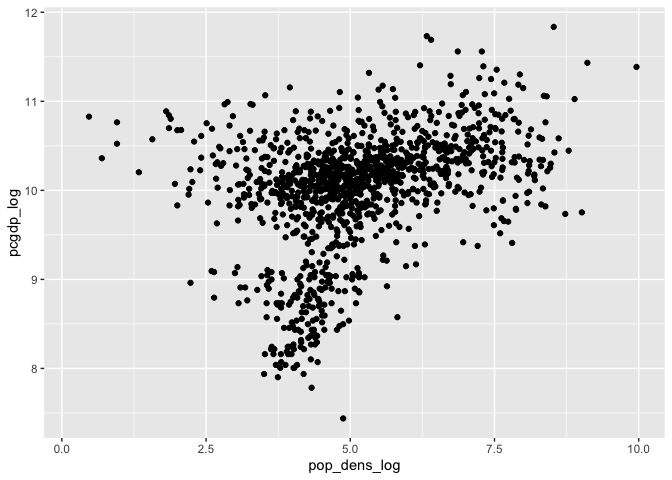

    ggplot(data) + 
      geom_point(aes(pop_dens_log, pcgdp_log, color=state), alpha=0.3)

    ## Warning: Removed 236 rows containing missing values (geom_point).

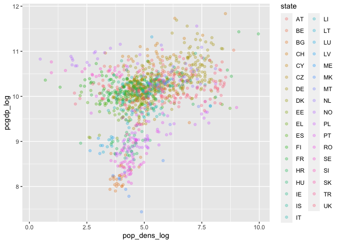

# Areal data

sf package [Link](https://r-spatial.github.io/sf/)

Package sf represents simple features as records in a data.frame or
tibble with a geometry list-column and natively in R all 17 simple
feature types for all dimensions (XY, XYZ, XYM, XYZM)

Simple features or simple feature access refers to a formal standard
(ISO 19125-1:2004) that describes how objects in the real world can be
represented in computers, with emphasis on the spatial geometry of these
objects. It also describes how such objects can be stored in and
retrieved from databases, and which geometrical operations should be
defined for them.

The standard is widely implemented in spatial databases (such as
PostGIS), commercial GIS (e.g., ESRI ArcGIS) and forms the vector data
basis for libraries such as GDAL. A subset of simple features forms the
GeoJSON standard.

R has well-supported classes for storing spatial data (sp) and
interfacing to the above mentioned environments (rgdal, rgeos), but has
so far lacked a complete implementation of simple features, making
conversions at times convoluted, inefficient or incomplete. The package
sf tries to fill this gap, and aims at succeeding sp in the long term.

    library(sf)

    ## Linking to GEOS 3.10.2, GDAL 3.4.2, PROJ 8.2.1; sf_use_s2() is TRUE

    df_sf <- read_sf("data/dataNUTS3/NUTS_RG_10M_2013.shp")
    df_sf

    ## Simple feature collection with 1951 features and 4 fields
    ## Geometry type: MULTIPOLYGON
    ## Dimension:     XY
    ## Bounding box:  xmin: -63.08826 ymin: -21.38731 xmax: 55.83663 ymax: 71.17354
    ## Geodetic CRS:  ETRS89
    ## # A tibble: 1,951 × 5
    ##    NUTS_ID STAT_LEVL_ SHAPE_AREA SHAPE_LEN                              geometry
    ##    <chr>        <int>      <dbl>     <dbl>                    <MULTIPOLYGON [°]>
    ##  1 AT               0    10.0        23.9  (((15.15733 48.99178, 15.16025 48.94…
    ##  2 AT1              1     2.85       11.2  (((15.15733 48.99178, 15.16025 48.94…
    ##  3 AT11             2     0.473       5.82 (((17.09271 48.09965, 17.06741 48.03…
    ##  4 AT111            3     0.0866      1.23 (((16.64622 47.4466, 16.57575 47.406…
    ##  5 AT112            3     0.212       2.81 (((17.1608 48.00666, 17.09466 47.970…
    ##  6 AT113            3     0.175       2.30 (((16.43376 47.35292, 16.48374 47.28…
    ##  7 AT12             2     2.33        9.92 (((15.15733 48.99178, 15.16025 48.94…
    ##  8 AT121            3     0.404       3.75 (((15.50768 48.3196, 15.52095 48.284…
    ##  9 AT122            3     0.401       3.41 (((16.38889 47.8816, 16.35772 47.866…
    ## 10 AT123            3     0.148       2.37 (((15.99565 48.14571, 15.91586 48.08…
    ## # … with 1,941 more rows

    df_sf <- df_sf %>% 
      left_join(data, by="NUTS_ID") 

    df_sf

    ## Simple feature collection with 1951 features and 23 fields
    ## Geometry type: MULTIPOLYGON
    ## Dimension:     XY
    ## Bounding box:  xmin: -63.08826 ymin: -21.38731 xmax: 55.83663 ymax: 71.17354
    ## Geodetic CRS:  ETRS89
    ## # A tibble: 1,951 × 24
    ##    NUTS_ID STAT_LEVL_ SHAPE_AREA SHAPE_LEN                        geometry  year
    ##    <chr>        <int>      <dbl>     <dbl>              <MULTIPOLYGON [°]> <int>
    ##  1 AT               0    10.0        23.9  (((15.15733 48.99178, 15.16025…    NA
    ##  2 AT1              1     2.85       11.2  (((15.15733 48.99178, 15.16025…    NA
    ##  3 AT11             2     0.473       5.82 (((17.09271 48.09965, 17.06741…    NA
    ##  4 AT111            3     0.0866      1.23 (((16.64622 47.4466, 16.57575 …  2012
    ##  5 AT112            3     0.212       2.81 (((17.1608 48.00666, 17.09466 …  2012
    ##  6 AT113            3     0.175       2.30 (((16.43376 47.35292, 16.48374…  2012
    ##  7 AT12             2     2.33        9.92 (((15.15733 48.99178, 15.16025…    NA
    ##  8 AT121            3     0.404       3.75 (((15.50768 48.3196, 15.52095 …  2012
    ##  9 AT122            3     0.401       3.41 (((16.38889 47.8816, 16.35772 …  2012
    ## 10 AT123            3     0.148       2.37 (((15.99565 48.14571, 15.91586…  2012
    ## # … with 1,941 more rows, and 18 more variables: alpine <chr>, category <fct>,
    ## #   pcgdp <dbl>, employ_1564 <dbl>, employ_1564_male <dbl>,
    ## #   employ_1564_female <dbl>, employ_5564 <dbl>, unempl <dbl>, educ_2564 <dbl>,
    ## #   fertility <dbl>, pop <dbl>, pop_dens <dbl>, ppopGE65 <dbl>, ppopLT15 <dbl>,
    ## #   research_exp <dbl>, state <fct>, pop_dens_log <dbl>, pcgdp_log <dbl>

    ggplot(df_sf) +
      geom_sf(aes(fill=pop_dens))

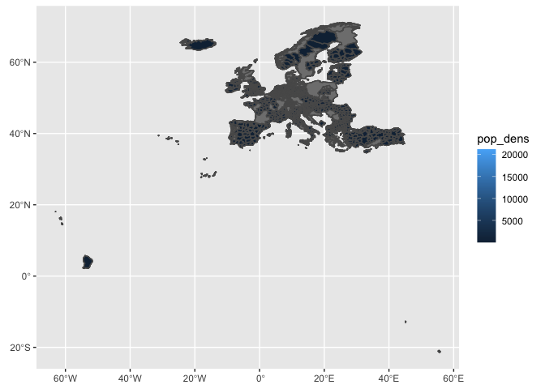

    ggplot(df_sf) +
      geom_sf(aes(fill=pop_dens), lwd=0.1) +
      xlim(-11, 30) +
      ylim(34, 70)

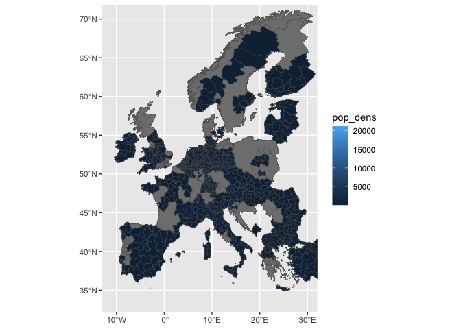

    library(tmap)
    df_sf <- st_make_valid(df_sf)
    tm_shape(df_sf) +
      tm_polygons("pop_dens")

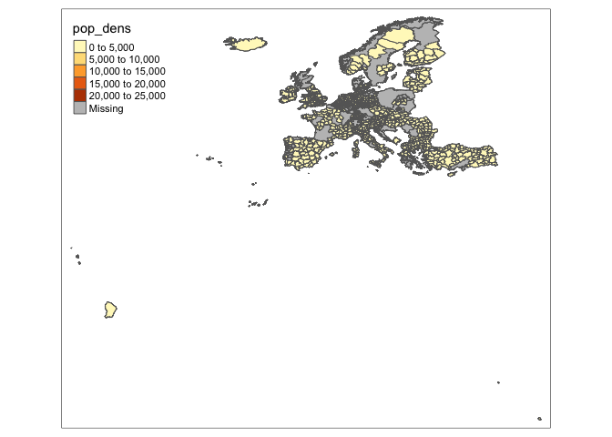

    tm_shape(df_sf, bbox=tmaptools::bb(matrix(c(-11,30,34,70),2,2))) +
        tm_polygons(col = "pop_dens", style = "quantile")

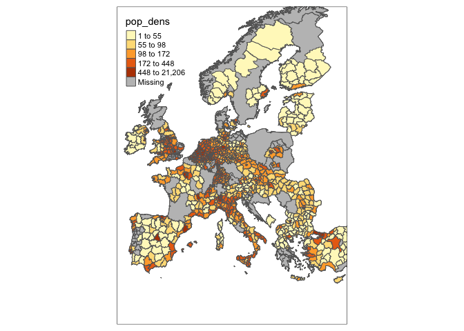

Interactive mapping

    # map <- tm_shape(df_sf, bbox=tmaptools::bb(matrix(c(-11,30,34,70),2,2))) +
    #     tm_polygons(col = "pop_dens", style = "quantile")
    # 
    # tmap_leaflet(map)

# Point data

    kc = read_sf("data/kingcounty/kc_house.shp")
    kc

    ## Simple feature collection with 21613 features and 21 fields
    ## Geometry type: POINT
    ## Dimension:     XY
    ## Bounding box:  xmin: -122.519 ymin: 47.1559 xmax: -121.315 ymax: 47.7776
    ## Geodetic CRS:  WGS 84
    ## # A tibble: 21,613 × 22
    ##           id date   price bedrooms bathrooms sqft_liv sqft_lot floors waterfront
    ##        <dbl> <chr>  <dbl>    <dbl>     <dbl>    <dbl>    <dbl>  <dbl>      <dbl>
    ##  1    7.13e9 2014… 2.22e5        3         1     1180     5650      1          0
    ##  2    6.41e9 2014… 5.38e5        3         2     2570     7242      2          0
    ##  3    5.63e9 2015… 1.8 e5        2         1      770    10000      1          0
    ##  4    2.49e9 2014… 6.04e5        4         3     1960     5000      1          0
    ##  5    1.95e9 2015… 5.1 e5        3         2     1680     8080      1          0
    ##  6    7.24e9 2014… 1.23e6        4         4     5420   101930      1          0
    ##  7    1.32e9 2014… 2.58e5        3         2     1715     6819      2          0
    ##  8    2.01e9 2015… 2.92e5        3         1     1060     9711      1          0
    ##  9    2.41e9 2015… 2.30e5        3         1     1780     7470      1          0
    ## 10    3.79e9 2015… 3.23e5        3         2     1890     6560      2          0
    ## # … with 21,603 more rows, and 13 more variables: view <dbl>, condition <dbl>,
    ## #   grade <dbl>, sqft_above <dbl>, sqft_basmt <dbl>, yr_built <dbl>,
    ## #   yr_renov <dbl>, zipcode <dbl>, lat <dbl>, long <dbl>, sqft_liv15 <dbl>,
    ## #   sqft_lot15 <dbl>, geometry <POINT [°]>

Coordinate Reference Systems

A coordinate reference system (CRS) then defines how the
two-dimensional, projected map in your GIS relates to real places on the
earth. The decision of which map projection and CRS to use depends on
the regional extent of the area you want to work in, on the analysis you
want to do, and often on the availability of data.

<https://datacarpentry.org/organization-geospatial/03-crs/>

    st_crs(kc)

    ## Coordinate Reference System:
    ##   User input: WGS 84 
    ##   wkt:
    ## GEOGCRS["WGS 84",
    ##     DATUM["World Geodetic System 1984",
    ##         ELLIPSOID["WGS 84",6378137,298.257223563,
    ##             LENGTHUNIT["metre",1]]],
    ##     PRIMEM["Greenwich",0,
    ##         ANGLEUNIT["degree",0.0174532925199433]],
    ##     CS[ellipsoidal,2],
    ##         AXIS["latitude",north,
    ##             ORDER[1],
    ##             ANGLEUNIT["degree",0.0174532925199433]],
    ##         AXIS["longitude",east,
    ##             ORDER[2],
    ##             ANGLEUNIT["degree",0.0174532925199433]],
    ##     ID["EPSG",4326]]

Let’s try to do the same starting from non-projected non-spatial dataset
from a csv file!

    kc = read.csv("data/kingcounty/kc_house_data.csv")
    head(kc)

    ##           id            date   price bedrooms bathrooms sqft_living sqft_lot
    ## 1 7129300520 20141013T000000  221900        3      1.00        1180     5650
    ## 2 6414100192 20141209T000000  538000        3      2.25        2570     7242
    ## 3 5631500400 20150225T000000  180000        2      1.00         770    10000
    ## 4 2487200875 20141209T000000  604000        4      3.00        1960     5000
    ## 5 1954400510 20150218T000000  510000        3      2.00        1680     8080
    ## 6 7237550310 20140512T000000 1225000        4      4.50        5420   101930
    ##   floors waterfront view condition grade sqft_above sqft_basement yr_built
    ## 1      1          0    0         3     7       1180             0     1955
    ## 2      2          0    0         3     7       2170           400     1951
    ## 3      1          0    0         3     6        770             0     1933
    ## 4      1          0    0         5     7       1050           910     1965
    ## 5      1          0    0         3     8       1680             0     1987
    ## 6      1          0    0         3    11       3890          1530     2001
    ##   yr_renovated zipcode     lat     long sqft_living15 sqft_lot15
    ## 1            0   98178 47.5112 -122.257          1340       5650
    ## 2         1991   98125 47.7210 -122.319          1690       7639
    ## 3            0   98028 47.7379 -122.233          2720       8062
    ## 4            0   98136 47.5208 -122.393          1360       5000
    ## 5            0   98074 47.6168 -122.045          1800       7503
    ## 6            0   98053 47.6561 -122.005          4760     101930

    kc <- kc %>% 
      st_as_sf(coords = c("long", "lat"), crs = 4326)

    ggplot(kc) +
      geom_sf(aes(color=price))

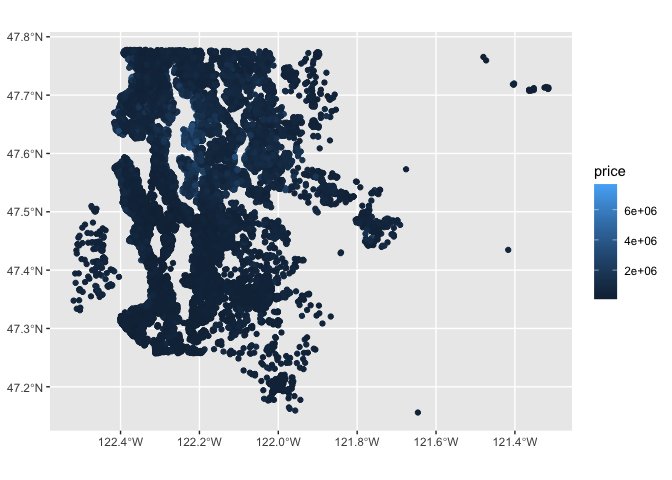

    tm_shape(kc) +
      tm_bubbles(col="price", scale=0.5, alpha=0.8, style="quantile", 
                 border.lwd=0)

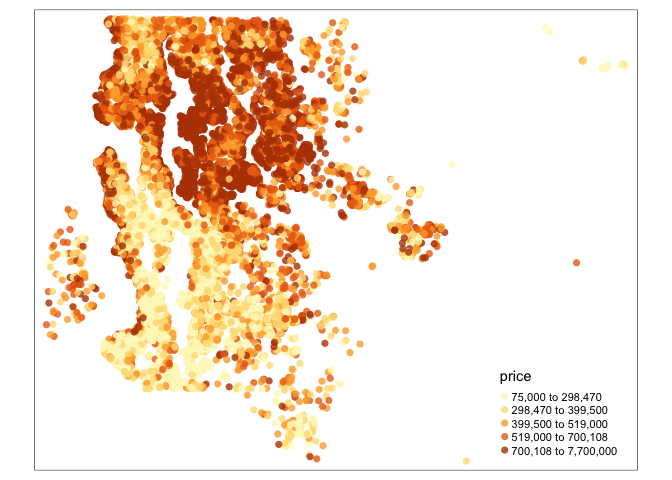

    # map <- kc %>% 
    #   head(1000) %>% 
    #   tm_shape() +
    #   tm_bubbles(col="price", scale=0.2, alpha=0.8, style="quantile", 
    #              border.lwd=0)
    # 
    # tmap_leaflet(map)

# Computation of W matrix

spdep package <https://r-spatial.github.io/spdep/>

## W matrix for regular grid data

    library(spdep)

    ## Loading required package: sp

    ## Loading required package: spData

    ## To access larger datasets in this package, install the spDataLarge
    ## package with: `install.packages('spDataLarge',
    ## repos='https://nowosad.github.io/drat/', type='source')`

    n<-4 #the dimension of the grid is n x n
    nb_grid <- cell2nb(n, n)  
    summary(nb_grid)

    ## Neighbour list object:
    ## Number of regions: 16 
    ## Number of nonzero links: 48 
    ## Percentage nonzero weights: 18.75 
    ## Average number of links: 3 
    ## Link number distribution:
    ## 
    ## 2 3 4 
    ## 4 8 4 
    ## 4 least connected regions:
    ## 1:1 4:1 1:4 4:4 with 2 links
    ## 4 most connected regions:
    ## 2:2 3:2 2:3 3:3 with 4 links

    xyc <- attr(nb_grid, "region.id")
    xy <- matrix(as.integer(unlist(strsplit(xyc, ":"))), ncol=2, byrow=TRUE)
    plot(nb_grid, xy)

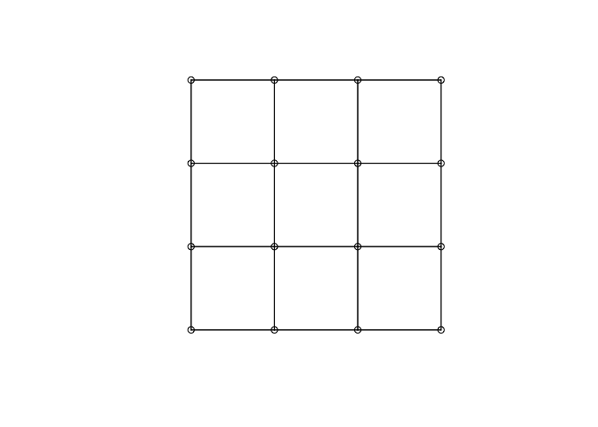

## W matrix for irregular data

In the case of irregular data, it is possible to import a GAL (.gal).

    #nb <- read.gal("path_to_file")

## W matrix from sf

    columbus <- read_sf("data/columbus/columbus.shp")

    nb<-poly2nb(columbus, queen=T)
    nb

    ## Neighbour list object:
    ## Number of regions: 49 
    ## Number of nonzero links: 236 
    ## Percentage nonzero weights: 9.829238 
    ## Average number of links: 4.816327

    summary(nb)

    ## Neighbour list object:
    ## Number of regions: 49 
    ## Number of nonzero links: 236 
    ## Percentage nonzero weights: 9.829238 
    ## Average number of links: 4.816327 
    ## Link number distribution:
    ## 
    ##  2  3  4  5  6  7  8  9 10 
    ##  5  9 12  5  9  3  4  1  1 
    ## 5 least connected regions:
    ## 1 6 42 46 47 with 2 links
    ## 1 most connected region:
    ## 20 with 10 links

    nb[[1]]

    ## [1] 2 3

    columbus_sp <- as(columbus, 'Spatial')

    nb_sf <- as(nb2lines(nb, coords = coordinates(columbus_sp)), 'sf')

    ## Warning in CRS(proj4string): CRS: projargs should not be NULL; set to NA

    nb_sf <- st_set_crs(nb_sf, st_crs(columbus))

    ggplot(columbus) + 
      geom_sf(fill = 'gray', color = 'white') +
      geom_sf(data = nb_sf) +
      theme_minimal() +
      ylab("Latitude") +
      xlab("Longitude")

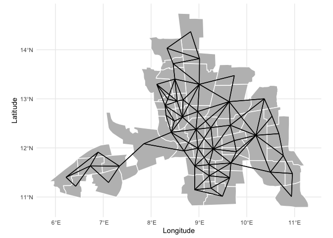 List
W object it resume a W matrix, saving space. A listw object has 3
components: 1) a nb object 2)list of n numeric vectors, each of the same
length as the corresponding non-zero vectors in the nb object. These
give the values of the spatial weights for each i-j neighbour pair.
3)the style of W as a character code: “B” for binary weights taking
values zero or one, “W” for row-standardized matrix,“C” is globally
standardised

    listw <- nb2listw(nb, style="W")
    listw

    ## Characteristics of weights list object:
    ## Neighbour list object:
    ## Number of regions: 49 
    ## Number of nonzero links: 236 
    ## Percentage nonzero weights: 9.829238 
    ## Average number of links: 4.816327 
    ## 
    ## Weights style: W 
    ## Weights constants summary:
    ##    n   nn S0       S1       S2
    ## W 49 2401 49 22.75119 203.7091

    nb2listw(nb, style="B")

    ## Characteristics of weights list object:
    ## Neighbour list object:
    ## Number of regions: 49 
    ## Number of nonzero links: 236 
    ## Percentage nonzero weights: 9.829238 
    ## Average number of links: 4.816327 
    ## 
    ## Weights style: B 
    ## Weights constants summary:
    ##    n   nn  S0  S1   S2
    ## B 49 2401 236 472 5304

## W matrix for point data

    boston <- read_sf("data/boston/boston.shp")

    coord <- cbind(boston$LON,boston$LAT)
    head(coord)

    ##          [,1]    [,2]
    ## [1,] -70.9550 42.2550
    ## [2,] -70.9500 42.2875
    ## [3,] -70.9360 42.2830
    ## [4,] -70.9280 42.2930
    ## [5,] -70.9220 42.2980
    ## [6,] -70.9165 42.3040

### KNN

    knn = knearneigh(coord, k=5)
    nb = knn2nb(knn)
    plot(nb, coord)

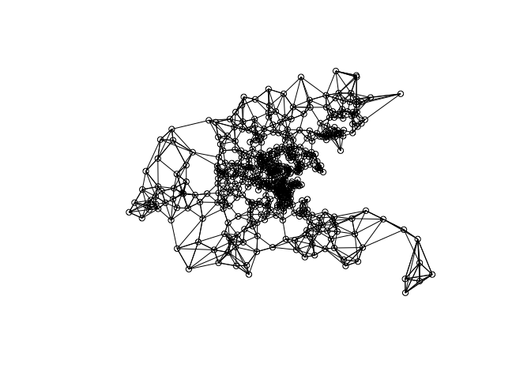

    listw <- nb2listw(nb)
    listw

    ## Characteristics of weights list object:
    ## Neighbour list object:
    ## Number of regions: 506 
    ## Number of nonzero links: 2530 
    ## Percentage nonzero weights: 0.9881423 
    ## Average number of links: 5 
    ## Non-symmetric neighbours list
    ## 
    ## Weights style: W 
    ## Weights constants summary:
    ##     n     nn  S0  S1      S2
    ## W 506 256036 506 178 2087.92

### Distance

    distM<- as.matrix(dist(coord))
    distM[1:5, 1:5]

    ##            1          2          3          4          5
    ## 1 0.00000000 0.03288237 0.03383785 0.04661545 0.05420332
    ## 2 0.03288237 0.00000000 0.01470544 0.02267708 0.02990401
    ## 3 0.03383785 0.01470544 0.00000000 0.01280625 0.02051828
    ## 4 0.04661545 0.02267708 0.01280625 0.00000000 0.00781025
    ## 5 0.05420332 0.02990401 0.02051828 0.00781025 0.00000000

    W1<- 1/(distM)
    diag(W1) <- 0

    W2<- 1/(1+distM)^2
    diag(W2) <- 0 

    W3<- exp(-distM^2)
    diag(W3) <- 0 

    mat2listw(W1)

    ## Characteristics of weights list object:
    ## Neighbour list object:
    ## Number of regions: 506 
    ## Number of nonzero links: 255530 
    ## Percentage nonzero weights: 99.80237 
    ## Average number of links: 505 
    ## 
    ## Weights style: M 
    ## Weights constants summary:
    ##     n     nn      S0        S1           S2
    ## M 506 256036 4006196 414055665 149609290044

Threshold distance

    nb <- dnearneigh(coord, 0, 1.5, longlat = T)
    nb

    ## Neighbour list object:
    ## Number of regions: 506 
    ## Number of nonzero links: 6648 
    ## Percentage nonzero weights: 2.59651 
    ## Average number of links: 13.13834 
    ## 49 regions with no links:
    ## 1 41 55 56 65 66 67 68 196 197 198 199 200 201 203 204 205 253 254 255
    ## 256 257 274 284 285 286 287 288 290 292 300 302 303 304 331 336 342 343
    ## 344 345 348 349 350 351 352 353 354 355 356

    plot(nb, coord)

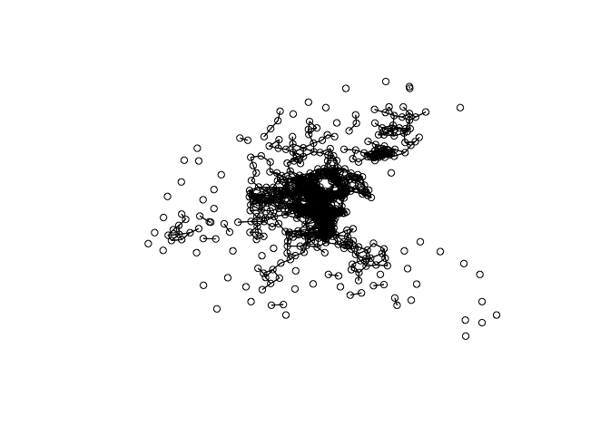

    nb <- dnearneigh(coord, 0, 5, longlat = T)
    nb

    ## Neighbour list object:
    ## Number of regions: 506 
    ## Number of nonzero links: 51400 
    ## Percentage nonzero weights: 20.0753 
    ## Average number of links: 101.581

    listw <- nb2listw(nb)
    listw

    ## Characteristics of weights list object:
    ## Neighbour list object:
    ## Number of regions: 506 
    ## Number of nonzero links: 51400 
    ## Percentage nonzero weights: 20.0753 
    ## Average number of links: 101.581 
    ## 
    ## Weights style: W 
    ## Weights constants summary:
    ##     n     nn  S0      S1       S2
    ## W 506 256036 506 29.0168 2042.721

    plot(nb, coord)

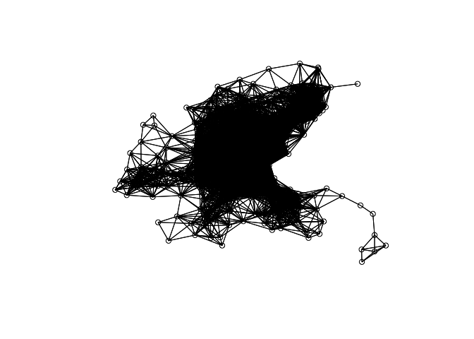
