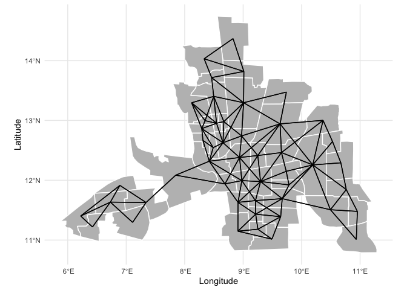

# SEAI 2022 - R - Lab 5

# Spatial Autocorrelation with R

Vincenzo Nardelli - <vincnardelli@gmail.com> -
<https://github.com/vincnardelli>

## Lab structure

Let’s load columbus data

    library(sf)

    ## Linking to GEOS 3.10.2, GDAL 3.4.2, PROJ 8.2.1; sf_use_s2() is TRUE

    library(dplyr)

    ## 
    ## Attaching package: 'dplyr'

    ## The following objects are masked from 'package:stats':
    ## 
    ##     filter, lag

    ## The following objects are masked from 'package:base':
    ## 
    ##     intersect, setdiff, setequal, union

    library(tmap)
    library(spdep)

    ## Loading required package: sp

    ## Loading required package: spData

    ## To access larger datasets in this package, install the spDataLarge
    ## package with: `install.packages('spDataLarge',
    ## repos='https://nowosad.github.io/drat/', type='source')`

    library(ggplot2)

    columbus <- read_sf("data/columbus/columbus.shp")

    tm_shape(columbus) +
      tm_polygons("CRIME")

    tm_shape(columbus) +
      tm_polygons("CRIME")

    nb<-poly2nb(columbus, queen=T)
    nb

    ## Neighbour list object:
    ## Number of regions: 49 
    ## Number of nonzero links: 236 
    ## Percentage nonzero weights: 9.829238 
    ## Average number of links: 4.816327

    listw <- nb2listw(nb)
    listw

    ## Characteristics of weights list object:
    ## Neighbour list object:
    ## Number of regions: 49 
    ## Number of nonzero links: 236 
    ## Percentage nonzero weights: 9.829238 
    ## Average number of links: 4.816327 
    ## 
    ## Weights style: W 
    ## Weights constants summary:
    ##    n   nn S0       S1       S2
    ## W 49 2401 49 22.75119 203.7091

    columbus_sp <- as(columbus, 'Spatial')

    nb_sf <- as(nb2lines(nb, coords = coordinates(columbus_sp)), 'sf')

    ## Warning in CRS(proj4string): CRS: projargs should not be NULL; set to NA

    nb_sf <- st_set_crs(nb_sf, st_crs(columbus))

    ggplot(columbus) + 
      geom_sf(fill = 'gray', color = 'white') +
      geom_sf(data = nb_sf) +
      theme_minimal() +
      ylab("Latitude") +
      xlab("Longitude")

## Spatial lag

Compute the lagged value from the W matrix

*y**l**a**g**i* = ∑*j**w**i*, *j**y**j*

    columbus$CRIME

    ##  [1] 15.725980 18.801754 30.626781 32.387760 50.731510 26.066658  0.178269
    ##  [8] 38.425858 30.515917 34.000835 62.275448 56.705669 46.716129 57.066132
    ## [15] 48.585487 54.838711 36.868774 43.962486 54.521965  0.223797 40.074074
    ## [22] 33.705048 20.048504 38.297871 61.299175 40.969742 52.794430 56.919785
    ## [29] 60.750446 68.892044 17.677214 19.145592 41.968163 23.974028 39.175053
    ## [36] 14.305556 42.445076 53.710938 19.100863 16.241299 18.905146 16.491890
    ## [43] 36.663612 25.962263 29.028488 16.530533 27.822861 26.645266 22.541491

    columbus$CRIME_lag <- lag.listw(listw, columbus$CRIME)
    columbus$CRIME_lag

    ##  [1] 24.71427 26.24684 29.41175 34.64648 40.46533 40.62371 49.72845 41.49913
    ##  [9] 36.94778 25.32838 49.85745 43.25009 38.09398 42.82054 50.10508 52.36547
    ## [17] 18.09105 51.18117 46.44216 32.44636 43.72131 35.90408 18.74605 54.90556
    ## [25] 49.97125 48.62931 33.20420 47.42423 51.79066 48.57333 19.12682 13.85469
    ## [33] 37.27827 22.13718 33.09855 18.75491 50.99422 43.65271 16.17110 21.05449
    ## [41] 21.06992 19.13979 36.16118 35.74727 32.07386 16.70321 17.57322 28.54896
    ## [49] 27.21201

    listw2mat(listw) %*% columbus$CRIME

    ##        [,1]
    ## 1  24.71427
    ## 2  26.24684
    ## 3  29.41175
    ## 4  34.64648
    ## 5  40.46533
    ## 6  40.62371
    ## 7  49.72845
    ## 8  41.49913
    ## 9  36.94778
    ## 10 25.32838
    ## 11 49.85745
    ## 12 43.25009
    ## 13 38.09398
    ## 14 42.82054
    ## 15 50.10508
    ## 16 52.36547
    ## 17 18.09105
    ## 18 51.18117
    ## 19 46.44216
    ## 20 32.44636
    ## 21 43.72131
    ## 22 35.90408
    ## 23 18.74605
    ## 24 54.90556
    ## 25 49.97125
    ## 26 48.62931
    ## 27 33.20420
    ## 28 47.42423
    ## 29 51.79066
    ## 30 48.57333
    ## 31 19.12682
    ## 32 13.85469
    ## 33 37.27827
    ## 34 22.13718
    ## 35 33.09855
    ## 36 18.75491
    ## 37 50.99422
    ## 38 43.65271
    ## 39 16.17110
    ## 40 21.05449
    ## 41 21.06992
    ## 42 19.13979
    ## 43 36.16118
    ## 44 35.74727
    ## 45 32.07386
    ## 46 16.70321
    ## 47 17.57322
    ## 48 28.54896
    ## 49 27.21201

    m1 <- tm_shape(columbus) +
      tm_polygons("CRIME")

    m2 <- tm_shape(columbus) +
      tm_polygons("CRIME_lag")

    tmap_arrange(m1, m2)

## Moran’s Index

    moran.test(columbus$CRIME, listw)

    ## 
    ##  Moran I test under randomisation
    ## 
    ## data:  columbus$CRIME  
    ## weights: listw    
    ## 
    ## Moran I statistic standard deviate = 5.5894, p-value = 1.139e-08
    ## alternative hypothesis: greater
    ## sample estimates:
    ## Moran I statistic       Expectation          Variance 
    ##       0.500188557      -0.020833333       0.008689289

    moran.mc(columbus$CRIME, listw, nsim=1000)

    ## 
    ##  Monte-Carlo simulation of Moran I
    ## 
    ## data:  columbus$CRIME 
    ## weights: listw  
    ## number of simulations + 1: 1001 
    ## 
    ## statistic = 0.50019, observed rank = 1001, p-value = 0.000999
    ## alternative hypothesis: greater

    moran.plot(columbus$CRIME, listw)

    mp <- moran.plot(columbus$CRIME, listw)

    xname <- "CRIME"
    ggplot(mp, aes(x=x, y=wx)) + geom_point(shape=1) + 
        geom_smooth(formula=y ~ x, method="lm") + 
        geom_hline(yintercept=mean(mp$wx), lty=2) + 
        geom_vline(xintercept=mean(mp$x), lty=2) + theme_minimal() + 
        geom_point(data=mp[mp$is_inf,], aes(x=x, y=wx), shape=9) +
        geom_text(data=mp[mp$is_inf,], aes(x=x, y=wx, label=labels, vjust=1.5)) +
        xlab(xname) + ylab(paste0("Spatially lagged ", xname))

 \##
Local Moran

    locm <- localmoran_perm(columbus$CRIME, listw)

    columbus <- columbus %>%
      mutate(CRIME_lag = lag.listw(listw, columbus$CRIME),
             p_value = locm[, 5],
             cluster = case_when(p_value < 0.05 & CRIME > mean(CRIME) & CRIME_lag > mean(CRIME_lag) ~ "HH", 
                                 p_value < 0.05 & CRIME < mean(CRIME) & CRIME_lag < mean(CRIME_lag) ~ "LL", 
                                 p_value < 0.05 & CRIME > mean(CRIME) & CRIME_lag < mean(CRIME_lag) ~ "HL", 
                                 p_value < 0.05 & CRIME < mean(CRIME) & CRIME_lag > mean(CRIME_lag) ~ "LH"), 
             cluster = factor(cluster, levels = c("HH", "LL", "HL", "LH")))

    lisa_palette <- c("#ca0020","#0571b0","#f4a582","#92c5de")
    ggplot(columbus) + 
      geom_sf(aes(fill=cluster), lwd=0.1) + 
      theme_void() + 
      scale_fill_manual(na.value = "lightgray", name="LISA", 
                        values = (lisa_palette)) 

