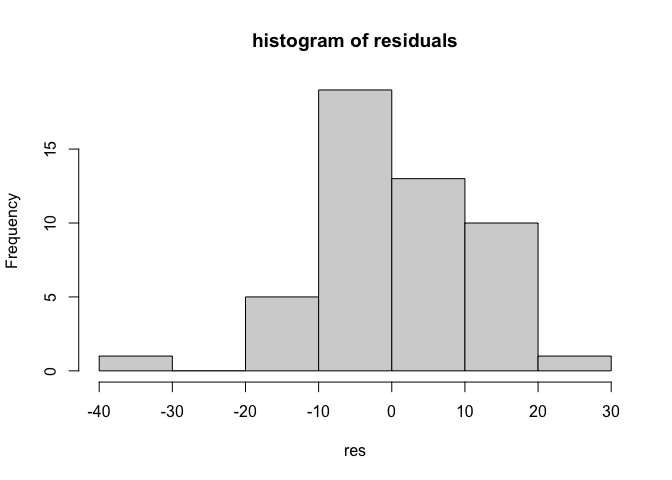

# SEAI 2022 - R - Lab 6

# Spatial Econometrics Modelling with R

Vincenzo Nardelli - <vincnardelli@gmail.com> -
<https://github.com/vincnardelli>

## Lab structure

Let’s load columbus data

    library(sf)

    ## Linking to GEOS 3.10.2, GDAL 3.4.2, PROJ 8.2.1; sf_use_s2() is TRUE

    library(dplyr)

    ## 
    ## Attaching package: 'dplyr'

    ## The following objects are masked from 'package:stats':
    ## 
    ##     filter, lag

    ## The following objects are masked from 'package:base':
    ## 
    ##     intersect, setdiff, setequal, union

    library(spdep)

    ## Loading required package: sp

    ## Loading required package: spData

    ## To access larger datasets in this package, install the spDataLarge
    ## package with: `install.packages('spDataLarge',
    ## repos='https://nowosad.github.io/drat/', type='source')`

    library(spatialreg)

    ## Loading required package: Matrix

    ## 
    ## Attaching package: 'spatialreg'

    ## The following objects are masked from 'package:spdep':
    ## 
    ##     get.ClusterOption, get.coresOption, get.mcOption,
    ##     get.VerboseOption, get.ZeroPolicyOption, set.ClusterOption,
    ##     set.coresOption, set.mcOption, set.VerboseOption,
    ##     set.ZeroPolicyOption

    library(lmtest)

    ## Loading required package: zoo

    ## 
    ## Attaching package: 'zoo'

    ## The following objects are masked from 'package:base':
    ## 
    ##     as.Date, as.Date.numeric

    library(tseries)

    ## Registered S3 method overwritten by 'quantmod':
    ##   method            from
    ##   as.zoo.data.frame zoo

    columbus <- read_sf("data/columbus/columbus.shp")
    nb<-poly2nb(columbus, queen=T)
    listw <- nb2listw(nb)
    listw

    ## Characteristics of weights list object:
    ## Neighbour list object:
    ## Number of regions: 49 
    ## Number of nonzero links: 236 
    ## Percentage nonzero weights: 9.829238 
    ## Average number of links: 4.816327 
    ## 
    ## Weights style: W 
    ## Weights constants summary:
    ##    n   nn S0       S1       S2
    ## W 49 2401 49 22.75119 203.7091

## OLS

    ols <- lm (CRIME ~ INC + HOVAL, data=columbus)
    summary(ols)

    ## 
    ## Call:
    ## lm(formula = CRIME ~ INC + HOVAL, data = columbus)
    ## 
    ## Residuals:
    ##     Min      1Q  Median      3Q     Max 
    ## -34.418  -6.388  -1.580   9.052  28.649 
    ## 
    ## Coefficients:
    ##             Estimate Std. Error t value Pr(>|t|)    
    ## (Intercept)  68.6190     4.7355  14.490  < 2e-16 ***
    ## INC          -1.5973     0.3341  -4.780 1.83e-05 ***
    ## HOVAL        -0.2739     0.1032  -2.654   0.0109 *  
    ## ---
    ## Signif. codes:  0 '***' 0.001 '**' 0.01 '*' 0.05 '.' 0.1 ' ' 1
    ## 
    ## Residual standard error: 11.43 on 46 degrees of freedom
    ## Multiple R-squared:  0.5524, Adjusted R-squared:  0.5329 
    ## F-statistic: 28.39 on 2 and 46 DF,  p-value: 9.341e-09

    coefficients(ols)

    ## (Intercept)         INC       HOVAL 
    ##  68.6189611  -1.5973108  -0.2739315

    res <- residuals(ols)
    res

    ##           1           2           3           4           5           6 
    ##   0.3465419  -3.6947990  -5.2873940 -19.9855151   6.4475490  -9.0734793 
    ##           7           8           9          10          11          12 
    ## -34.4177224  -1.9146840   4.3960594  13.5091017  10.9800573   9.5877236 
    ##          13          14          15          16          17          18 
    ##   4.7728320  16.1128397   0.6675424   3.5491565  -4.6630963  12.8399569 
    ##          19          20          21          22          23          24 
    ##  12.8428644   3.4948724  -6.0537589  -7.8697868  -1.7037730   6.9913819 
    ##          25          26          27          28          29          30 
    ##  11.0984343  -9.1741523  10.8026296   7.1086321  14.9005133  28.6487456 
    ##          31          32          33          34          35          36 
    ## -15.1722792  -8.1776706  -4.3438864 -12.9749799  -1.5798172 -14.4376850 
    ##          37          38          39          40          41          42 
    ##  12.8687861   9.0515532  -9.1569014  12.2449674  -2.7098171   1.3443547 
    ##          43          44          45          46          47          48 
    ##  -3.5432909  -6.3880045  -9.4155428  -1.9731210   1.1150296 -15.7632989 
    ##          49 
    ##  -6.2476690

    hist(res,main='histogram of residuals')

    predict(ols, columbus)

    ##         1         2         3         4         5         6         7         8 
    ## 15.379438 22.496553 35.914175 52.373275 44.283961 35.140137 34.595991 40.340542 
    ##         9        10        11        12        13        14        15        16 
    ## 26.119858 20.491733 51.295391 47.117945 41.943297 40.953292 47.917945 51.289554 
    ##        17        18        19        20        21        22        23        24 
    ## 41.531870 31.122529 41.679101 -3.271075 46.127833 41.574835 21.752277 31.306489 
    ##        25        26        27        28        29        30        31        32 
    ## 50.200741 50.143894 41.991800 49.811153 45.849933 40.243298 32.849493 27.323263 
    ##        33        34        35        36        37        38        39        40 
    ## 46.312049 36.949008 40.754870 28.743241 29.576290 44.659385 28.257764  3.996332 
    ##        41        42        43        44        45        46        47        48 
    ## 21.614963 15.147535 40.206903 32.350268 38.444031 18.503654 26.707831 42.408565 
    ##        49 
    ## 28.789160

Test for heteroskedasticity - [Breush
Pagan](https://en.wikipedia.org/wiki/Breusch%E2%80%93Pagan_test)

H0: homoschedasticity vs H1: heteroschedasticity

    bptest(ols)

    ## 
    ##  studentized Breusch-Pagan test
    ## 
    ## data:  ols
    ## BP = 7.2166, df = 2, p-value = 0.0271

Test for normality -
[Jarque-Bera](https://en.wikipedia.org/wiki/Jarque%E2%80%93Bera_test)

    jarque.bera.test(ols$residuals)

    ## 
    ##  Jarque Bera Test
    ## 
    ## data:  ols$residuals
    ## X-squared = 1.8358, df = 2, p-value = 0.3994

Shapiro test

    shapiro.test(ols$residuals)

    ## 
    ##  Shapiro-Wilk normality test
    ## 
    ## data:  ols$residuals
    ## W = 0.97708, p-value = 0.4497

    lm.morantest(ols, listw)

    ## 
    ##  Global Moran I for regression residuals
    ## 
    ## data:  
    ## model: lm(formula = CRIME ~ INC + HOVAL, data = columbus)
    ## weights: listw
    ## 
    ## Moran I statistic standard deviate = 2.8393, p-value = 0.00226
    ## alternative hypothesis: greater
    ## sample estimates:
    ## Observed Moran I      Expectation         Variance 
    ##      0.222109407     -0.033418335      0.008099305

    lm.LMtests(ols, listw, test="all")

    ## 
    ##  Lagrange multiplier diagnostics for spatial dependence
    ## 
    ## data:  
    ## model: lm(formula = CRIME ~ INC + HOVAL, data = columbus)
    ## weights: listw
    ## 
    ## LMerr = 5.2062, df = 1, p-value = 0.02251
    ## 
    ## 
    ##  Lagrange multiplier diagnostics for spatial dependence
    ## 
    ## data:  
    ## model: lm(formula = CRIME ~ INC + HOVAL, data = columbus)
    ## weights: listw
    ## 
    ## LMlag = 8.898, df = 1, p-value = 0.002855
    ## 
    ## 
    ##  Lagrange multiplier diagnostics for spatial dependence
    ## 
    ## data:  
    ## model: lm(formula = CRIME ~ INC + HOVAL, data = columbus)
    ## weights: listw
    ## 
    ## RLMerr = 0.043906, df = 1, p-value = 0.834
    ## 
    ## 
    ##  Lagrange multiplier diagnostics for spatial dependence
    ## 
    ## data:  
    ## model: lm(formula = CRIME ~ INC + HOVAL, data = columbus)
    ## weights: listw
    ## 
    ## RLMlag = 3.7357, df = 1, p-value = 0.05326
    ## 
    ## 
    ##  Lagrange multiplier diagnostics for spatial dependence
    ## 
    ## data:  
    ## model: lm(formula = CRIME ~ INC + HOVAL, data = columbus)
    ## weights: listw
    ## 
    ## SARMA = 8.9419, df = 2, p-value = 0.01144

## Spatial lag

    lag<-lagsarlm(CRIME ~ INC + HOVAL,listw = listw, data=columbus)
    summary(lag)

    ## 
    ## Call:lagsarlm(formula = CRIME ~ INC + HOVAL, data = columbus, listw = listw)
    ## 
    ## Residuals:
    ##        Min         1Q     Median         3Q        Max 
    ## -37.652017  -5.334611   0.071473   6.107196  23.302618 
    ## 
    ## Type: lag 
    ## Coefficients: (asymptotic standard errors) 
    ##              Estimate Std. Error z value  Pr(>|z|)
    ## (Intercept) 45.603250   7.257404  6.2837 3.306e-10
    ## INC         -1.048728   0.307406 -3.4115  0.000646
    ## HOVAL       -0.266335   0.089096 -2.9893  0.002796
    ## 
    ## Rho: 0.42333, LR test value: 9.4065, p-value: 0.0021621
    ## Asymptotic standard error: 0.11951
    ##     z-value: 3.5422, p-value: 0.00039686
    ## Wald statistic: 12.547, p-value: 0.00039686
    ## 
    ## Log likelihood: -182.674 for lag model
    ## ML residual variance (sigma squared): 96.857, (sigma: 9.8416)
    ## Number of observations: 49 
    ## Number of parameters estimated: 5 
    ## AIC: 375.35, (AIC for lm: 382.75)
    ## LM test for residual autocorrelation
    ## test value: 0.24703, p-value: 0.61917

    lag_gmm<-stsls(CRIME ~ INC + HOVAL,listw = listw, data=columbus)
    summary(lag_gmm)

    ## 
    ## Call:stsls(formula = CRIME ~ INC + HOVAL, data = columbus, listw = listw)
    ## 
    ## Residuals:
    ##       Min        1Q    Median        3Q       Max 
    ## -37.94358  -5.64216  -0.24203   6.22748  22.82069 
    ## 
    ## Coefficients: 
    ##              Estimate Std. Error t value  Pr(>|t|)
    ## Rho          0.461487   0.187939  2.4555  0.014069
    ## (Intercept) 43.528473  11.061569  3.9351 8.316e-05
    ## INC         -0.999276   0.385591 -2.5915  0.009555
    ## HOVAL       -0.265650   0.092391 -2.8753  0.004037
    ## 
    ## Residual variance (sigma squared): 104.66, (sigma: 10.231)

## Spatial error

    error<-errorsarlm(CRIME ~ INC + HOVAL,listw = listw, data=columbus)
    summary(error)

    ## 
    ## Call:errorsarlm(formula = CRIME ~ INC + HOVAL, data = columbus, listw = listw)
    ## 
    ## Residuals:
    ##       Min        1Q    Median        3Q       Max 
    ## -34.65998  -6.16943  -0.70623   7.75392  23.43878 
    ## 
    ## Type: error 
    ## Coefficients: (asymptotic standard errors) 
    ##              Estimate Std. Error z value  Pr(>|z|)
    ## (Intercept) 60.279469   5.365594 11.2344 < 2.2e-16
    ## INC         -0.957305   0.334231 -2.8642 0.0041806
    ## HOVAL       -0.304559   0.092047 -3.3087 0.0009372
    ## 
    ## Lambda: 0.54675, LR test value: 7.2556, p-value: 0.0070679
    ## Asymptotic standard error: 0.13805
    ##     z-value: 3.9605, p-value: 7.4786e-05
    ## Wald statistic: 15.686, p-value: 7.4786e-05
    ## 
    ## Log likelihood: -183.7494 for error model
    ## ML residual variance (sigma squared): 97.674, (sigma: 9.883)
    ## Number of observations: 49 
    ## Number of parameters estimated: 5 
    ## AIC: 377.5, (AIC for lm: 382.75)

    error_gmm<-GMerrorsar(CRIME ~ INC + HOVAL,listw = listw, data=columbus)
    summary(error_gmm)

    ## 
    ## Call:GMerrorsar(formula = CRIME ~ INC + HOVAL, data = columbus, listw = listw)
    ## 
    ## Residuals:
    ##      Min       1Q   Median       3Q      Max 
    ## -30.6689  -6.6664  -2.3305   9.8505  28.6764 
    ## 
    ## Type: GM SAR estimator
    ## Coefficients: (GM standard errors) 
    ##              Estimate Std. Error z value  Pr(>|z|)
    ## (Intercept) 62.918810   5.111018 12.3104 < 2.2e-16
    ## INC         -1.150075   0.341405 -3.3687 0.0007554
    ## HOVAL       -0.298231   0.096707 -3.0839 0.0020434
    ## 
    ## Lambda: 0.38345 (standard error): 0.42729 (z-value): 0.89742
    ## Residual variance (sigma squared): 108.18, (sigma: 10.401)
    ## GM argmin sigma squared: 107.84
    ## Number of observations: 49 
    ## Number of parameters estimated: 5

## SARAR Model

    sarar<-sacsarlm(CRIME ~ INC + HOVAL,listw = listw, data=columbus)
    summary(sarar)

    ## 
    ## Call:sacsarlm(formula = CRIME ~ INC + HOVAL, data = columbus, listw = listw)
    ## 
    ## Residuals:
    ##       Min        1Q    Median        3Q       Max 
    ## -37.35601  -5.04457  -0.18999   6.71177  23.28400 
    ## 
    ## Type: sac 
    ## Coefficients: (asymptotic standard errors) 
    ##              Estimate Std. Error z value  Pr(>|z|)
    ## (Intercept) 47.915359   9.985548  4.7985 1.599e-06
    ## INC         -1.042749   0.328628 -3.1730  0.001509
    ## HOVAL       -0.279841   0.090699 -3.0854  0.002033
    ## 
    ## Rho: 0.36937
    ## Asymptotic standard error: 0.19625
    ##     z-value: 1.8821, p-value: 0.059817
    ## Lambda: 0.14642
    ## Asymptotic standard error: 0.30102
    ##     z-value: 0.4864, p-value: 0.62668
    ## 
    ## LR test value: 9.6444, p-value: 0.0080489
    ## 
    ## Log likelihood: -182.555 for sac model
    ## ML residual variance (sigma squared): 97.043, (sigma: 9.8511)
    ## Number of observations: 49 
    ## Number of parameters estimated: 6 
    ## AIC: 377.11, (AIC for lm: 382.75)

    sarar_gmm<- gstsls(CRIME ~ INC + HOVAL,listw = listw, data=columbus)
    summary(sarar_gmm)

    ## 
    ## Call:gstsls(formula = CRIME ~ INC + HOVAL, data = columbus, listw = listw)
    ## 
    ## Residuals:
    ##       Min        1Q    Median        3Q       Max 
    ## -37.92539  -5.54440  -0.15737   6.11962  22.88118 
    ## 
    ## Type: GM SARAR estimator
    ## Coefficients: (GM standard errors) 
    ##              Estimate Std. Error z value  Pr(>|z|)
    ## Rho_Wy       0.461787   0.187391  2.4643  0.013728
    ## (Intercept) 43.540444  11.090741  3.9258 8.643e-05
    ## INC         -1.005003   0.386718 -2.5988  0.009355
    ## HOVAL       -0.264092   0.092227 -2.8635  0.004190
    ## 
    ## Lambda: -0.016981
    ## Residual variance (sigma squared): 104.72, (sigma: 10.233)
    ## GM argmin sigma squared: 95
    ## Number of observations: 49 
    ## Number of parameters estimated: 6
