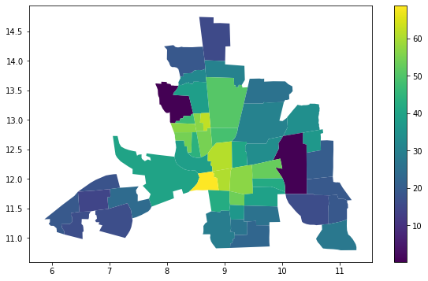
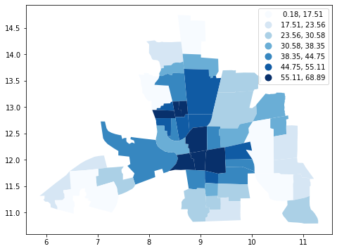
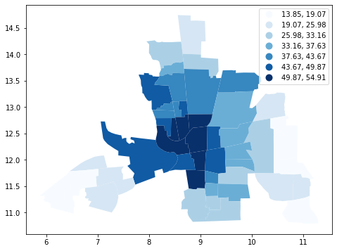
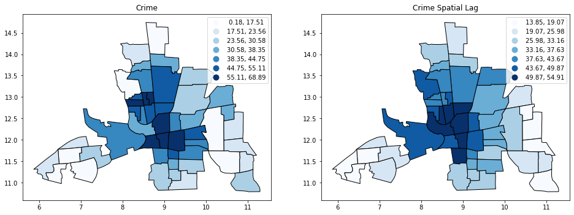
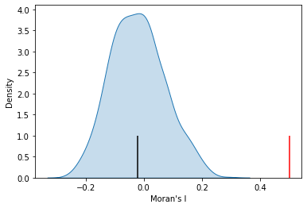
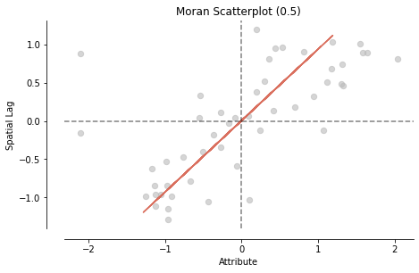
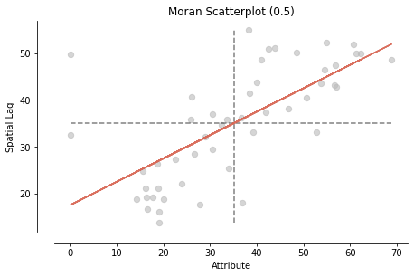
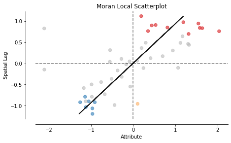
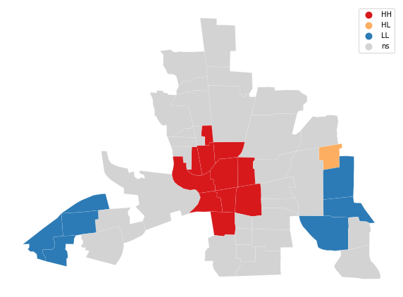
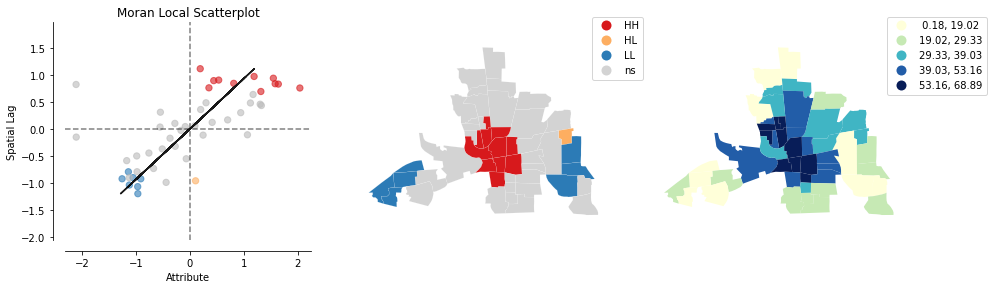

## SEAI 2022 - Python - Lab 7
# ESDA & Spatial Econometrics Models

Vincenzo Nardelli - vincnardelli@gmail.com - https://github.com/vincnardelli


Before to start... install Python Libraries!


```python
! pip install pysal
! pip install cartoframes 
! pip install --user urllib3==1.22
```

    Collecting pysal
      Downloading https://files.pythonhosted.org/packages/c0/3e/179620647a54eef9ef8173ee82a42b0e33b1e80bbce21998ba8ffc62a0f7/pysal-2.4.0.tar.gz
    Collecting libpysal>=4.4.0
    [?25l  Downloading https://files.pythonhosted.org/packages/cc/e9/36be6aeea8b6d6ac797c656e1f80bdaddc075d049433495680432d9aedd9/libpysal-4.4.0-py3-none-any.whl (2.4MB)
         |████████████████████████████████| 2.4MB 33.2MB/s 
    [?25hCollecting access>=1.1.3
      Downloading https://files.pythonhosted.org/packages/41/50/d7fb5466976af95e4c3481f8408f29744e9411e46a3f9d610a95e741f57b/access-1.1.3-py3-none-any.whl
    Collecting esda>=2.3.6
    [?25l  Downloading https://files.pythonhosted.org/packages/20/02/7c36f3c7c22f048f50ada6402ff3fbe51e0c5365f7d0227196b84d43c82b/esda-2.3.6-py3-none-any.whl (102kB)
         |████████████████████████████████| 112kB 58.0MB/s 
    [?25hCollecting giddy>=2.3.3
    [?25l  Downloading https://files.pythonhosted.org/packages/5c/71/f7fc2b41e36b2a06bac30937435d2dedd125f74f3157213ec121ff52d961/giddy-2.3.3-py3-none-any.whl (60kB)
         |████████████████████████████████| 61kB 8.6MB/s 
    [?25hCollecting inequality>=1.0.0
      Downloading https://files.pythonhosted.org/packages/74/0f/9ed2d097f29160d0c873f33ffc0b9806c1083e3611acb2143eb66adcf580/inequality-1.0.0.tar.gz
    Collecting pointpats>=2.2.0
    [?25l  Downloading https://files.pythonhosted.org/packages/5f/2b/a3e99c42b37c3e848eb8e55f2ee2b2d281ae0d49df261f13eaaeba7171a5/pointpats-2.2.0.tar.gz (55kB)
         |████████████████████████████████| 61kB 9.4MB/s 
    [?25hCollecting segregation>=1.5.0
    [?25l  Downloading https://files.pythonhosted.org/packages/21/82/db8d8f2c25d52e774dcdc65861853f87566c7512204764d1b34acf2d7e50/segregation-1.5.0-py3-none-any.whl (82kB)
         |████████████████████████████████| 92kB 11.8MB/s 
    [?25hCollecting spaghetti>=1.5.6
    [?25l  Downloading https://files.pythonhosted.org/packages/cc/fc/3404a77c81b217f5daece7cea5efd1624852b71f225964e2e8bec6bb4ac2/spaghetti-1.6.0-py3-none-any.whl (45kB)
         |████████████████████████████████| 51kB 7.4MB/s 
    [?25hCollecting mgwr>=2.1.2
    [?25l  Downloading https://files.pythonhosted.org/packages/8e/14/e18342b62655ec7f37624ff936d6f273f82b51913cd558110fd4d670794e/mgwr-2.1.2.tar.gz (41kB)
         |████████████████████████████████| 51kB 8.4MB/s 
    [?25hCollecting spglm>=1.0.8
      Downloading https://files.pythonhosted.org/packages/07/8f/03f07807967595d2632dbe0f7c442511a5ff422103b49c76557f9eed40c5/spglm-1.0.8.tar.gz
    Collecting spint>=1.0.7
      Downloading https://files.pythonhosted.org/packages/7e/c5/e4862ab3f745a1886135b07e498e77504c14e468d0a6b89f7270f5def979/spint-1.0.7.tar.gz
    Collecting spreg>=1.2.2
    [?25l  Downloading https://files.pythonhosted.org/packages/40/2d/b6559677b66b2f228fdf02fdb5e7da3466057f9e2c696bea7704138ae346/spreg-1.2.2-py3-none-any.whl (209kB)
         |████████████████████████████████| 215kB 52.3MB/s 
    [?25hCollecting spvcm>=0.3.0
    [?25l  Downloading https://files.pythonhosted.org/packages/b4/c9/43fb98bc60728b76fceee175119a1ff7e5033ed9012d07570e34a2a19a8f/spvcm-0.3.0.tar.gz (5.7MB)
         |████████████████████████████████| 5.7MB 38.5MB/s 
    [?25hCollecting tobler>=0.6.0
      Downloading https://files.pythonhosted.org/packages/5c/88/93acf0ad7c724565975924649928ea9db00e8d94279eb40c7819708b6105/tobler-0.7.0-py3-none-any.whl
    Collecting mapclassify>=2.4.2
      Downloading https://files.pythonhosted.org/packages/22/8e/d968c0945d41bb02de0efaa92e31e43a817dc52d30e82b4dfdda407a1903/mapclassify-2.4.2-py3-none-any.whl
    Collecting splot>=1.1.3
      Downloading https://files.pythonhosted.org/packages/83/1c/afb3e3eeeda4eef065f0b3249ca74cbcc44af3bc59ddb5a21b5445753955/splot-1.1.3.tar.gz
    Collecting spopt>=0.1.1
    [?25l  Downloading https://files.pythonhosted.org/packages/a9/df/c8ce65a07f7ab1e69b721533b950dd9854f2f7e6a472eca60c13f5770e24/spopt-0.1.1-py3-none-any.whl (54kB)
         |████████████████████████████████| 61kB 8.7MB/s 
    [?25hCollecting urllib3>=1.26
    [?25l  Downloading https://files.pythonhosted.org/packages/0c/cd/1e2ec680ec7b09846dc6e605f5a7709dfb9d7128e51a026e7154e18a234e/urllib3-1.26.5-py2.py3-none-any.whl (138kB)
         |████████████████████████████████| 143kB 62.8MB/s 
    [?25hCollecting python-dateutil<=2.8.0
    [?25l  Downloading https://files.pythonhosted.org/packages/41/17/c62faccbfbd163c7f57f3844689e3a78bae1f403648a6afb1d0866d87fbb/python_dateutil-2.8.0-py2.py3-none-any.whl (226kB)
         |████████████████████████████████| 235kB 61.9MB/s 
    [?25hRequirement already satisfied: pytest in /usr/local/lib/python3.7/dist-packages (from pysal) (3.6.4)
    Collecting pytest-cov
      Downloading https://files.pythonhosted.org/packages/ba/84/576b071aef9ac9301e5c0ff35d117e12db50b87da6f12e745e9c5f745cc2/pytest_cov-2.12.1-py2.py3-none-any.whl
    Requirement already satisfied: coverage in /usr/local/lib/python3.7/dist-packages (from pysal) (3.7.1)
    Requirement already satisfied: requests in /usr/local/lib/python3.7/dist-packages (from libpysal>=4.4.0->pysal) (2.23.0)
    Requirement already satisfied: beautifulsoup4 in /usr/local/lib/python3.7/dist-packages (from libpysal>=4.4.0->pysal) (4.6.3)
    Requirement already satisfied: jinja2 in /usr/local/lib/python3.7/dist-packages (from libpysal>=4.4.0->pysal) (2.11.3)
    Requirement already satisfied: scipy>=0.11 in /usr/local/lib/python3.7/dist-packages (from libpysal>=4.4.0->pysal) (1.4.1)
    Requirement already satisfied: numpy>=1.3 in /usr/local/lib/python3.7/dist-packages (from libpysal>=4.4.0->pysal) (1.19.5)
    Requirement already satisfied: pandas in /usr/local/lib/python3.7/dist-packages (from libpysal>=4.4.0->pysal) (1.1.5)
    Requirement already satisfied: scikit-learn in /usr/local/lib/python3.7/dist-packages (from esda>=2.3.6->pysal) (0.22.2.post1)
    Collecting quantecon>=0.4.7
    [?25l  Downloading https://files.pythonhosted.org/packages/7e/6b/e78ec352947208c6172e50dcb086f95f7b63eb5204f26f46b676ed5bb31c/quantecon-0.5.0-py3-none-any.whl (229kB)
         |████████████████████████████████| 235kB 44.8MB/s 
    [?25hRequirement already satisfied: matplotlib in /usr/local/lib/python3.7/dist-packages (from pointpats>=2.2.0->pysal) (3.2.2)
    Collecting opencv-contrib-python>=4.2.0
    [?25l  Downloading https://files.pythonhosted.org/packages/27/f5/21227eb87cd5990a0f4235d8264db7d8f62f6a9ccbf2cd2c367f7d903cd2/opencv_contrib_python-4.5.2.54-cp37-cp37m-manylinux2014_x86_64.whl (57.4MB)
         |████████████████████████████████| 57.4MB 74kB/s 
    [?25hRequirement already satisfied: tqdm in /usr/local/lib/python3.7/dist-packages (from segregation>=1.5.0->pysal) (4.41.1)
    Requirement already satisfied: seaborn in /usr/local/lib/python3.7/dist-packages (from segregation>=1.5.0->pysal) (0.11.1)
    Collecting geopandas
    [?25l  Downloading https://files.pythonhosted.org/packages/d7/bf/e9cefb69d39155d122b6ddca53893b61535fa6ffdad70bf5ef708977f53f/geopandas-0.9.0-py2.py3-none-any.whl (994kB)
         |████████████████████████████████| 1.0MB 31.4MB/s 
    [?25hCollecting rtree
    [?25l  Downloading https://files.pythonhosted.org/packages/51/05/5a67111cee91d2165a2bcb855f442186e3d76ddef834596cc84d4875c401/Rtree-0.9.7-cp37-cp37m-manylinux2010_x86_64.whl (994kB)
         |████████████████████████████████| 1.0MB 34.3MB/s 
    [?25hCollecting pygeos
    [?25l  Downloading https://files.pythonhosted.org/packages/2a/c0/c3c0ebaa718166af6ff03a4e575d4d1ff4ffbd3ccb658be4285fbeaf3c89/pygeos-0.10-cp37-cp37m-manylinux_2_5_x86_64.manylinux1_x86_64.whl (2.0MB)
         |████████████████████████████████| 2.0MB 32.0MB/s 
    [?25hRequirement already satisfied: joblib in /usr/local/lib/python3.7/dist-packages (from tobler>=0.6.0->pysal) (1.0.1)
    Collecting rasterio
    [?25l  Downloading https://files.pythonhosted.org/packages/0e/78/c69f7457b7dad6163abde2772abd4c8c0c6498d2ab9fd3f3b0eb73b40951/rasterio-1.2.4-cp37-cp37m-manylinux1_x86_64.whl (19.3MB)
         |████████████████████████████████| 19.3MB 249kB/s 
    [?25hRequirement already satisfied: statsmodels in /usr/local/lib/python3.7/dist-packages (from tobler>=0.6.0->pysal) (0.10.2)
    Collecting rasterstats
      Downloading https://files.pythonhosted.org/packages/9f/52/055b2b736e4aa1126c4619a561b44c3bc30fbe48025e6f3275b92928a0a0/rasterstats-0.15.0-py3-none-any.whl
    Requirement already satisfied: networkx in /usr/local/lib/python3.7/dist-packages (from mapclassify>=2.4.2->pysal) (2.5.1)
    Requirement already satisfied: descartes in /usr/local/lib/python3.7/dist-packages (from splot>=1.1.3->pysal) (1.1.0)
    Collecting pulp
    [?25l  Downloading https://files.pythonhosted.org/packages/14/c4/0eec14a0123209c261de6ff154ef3be5cad3fd557c084f468356662e0585/PuLP-2.4-py3-none-any.whl (40.6MB)
         |████████████████████████████████| 40.6MB 100kB/s 
    [?25hRequirement already satisfied: six>=1.5 in /usr/local/lib/python3.7/dist-packages (from python-dateutil<=2.8.0->pysal) (1.15.0)
    Requirement already satisfied: setuptools in /usr/local/lib/python3.7/dist-packages (from pytest->pysal) (57.0.0)
    Requirement already satisfied: atomicwrites>=1.0 in /usr/local/lib/python3.7/dist-packages (from pytest->pysal) (1.4.0)
    Requirement already satisfied: py>=1.5.0 in /usr/local/lib/python3.7/dist-packages (from pytest->pysal) (1.10.0)
    Requirement already satisfied: pluggy<0.8,>=0.5 in /usr/local/lib/python3.7/dist-packages (from pytest->pysal) (0.7.1)
    Requirement already satisfied: more-itertools>=4.0.0 in /usr/local/lib/python3.7/dist-packages (from pytest->pysal) (8.7.0)
    Requirement already satisfied: attrs>=17.4.0 in /usr/local/lib/python3.7/dist-packages (from pytest->pysal) (21.2.0)
    Requirement already satisfied: toml in /usr/local/lib/python3.7/dist-packages (from pytest-cov->pysal) (0.10.2)
    Requirement already satisfied: idna<3,>=2.5 in /usr/local/lib/python3.7/dist-packages (from requests->libpysal>=4.4.0->pysal) (2.10)
    Requirement already satisfied: certifi>=2017.4.17 in /usr/local/lib/python3.7/dist-packages (from requests->libpysal>=4.4.0->pysal) (2020.12.5)
    Requirement already satisfied: chardet<4,>=3.0.2 in /usr/local/lib/python3.7/dist-packages (from requests->libpysal>=4.4.0->pysal) (3.0.4)
    Requirement already satisfied: MarkupSafe>=0.23 in /usr/local/lib/python3.7/dist-packages (from jinja2->libpysal>=4.4.0->pysal) (2.0.1)
    Requirement already satisfied: pytz>=2017.2 in /usr/local/lib/python3.7/dist-packages (from pandas->libpysal>=4.4.0->pysal) (2018.9)
    Requirement already satisfied: numba>=0.38 in /usr/local/lib/python3.7/dist-packages (from quantecon>=0.4.7->giddy>=2.3.3->pysal) (0.51.2)
    Requirement already satisfied: sympy in /usr/local/lib/python3.7/dist-packages (from quantecon>=0.4.7->giddy>=2.3.3->pysal) (1.7.1)
    Requirement already satisfied: kiwisolver>=1.0.1 in /usr/local/lib/python3.7/dist-packages (from matplotlib->pointpats>=2.2.0->pysal) (1.3.1)
    Requirement already satisfied: pyparsing!=2.0.4,!=2.1.2,!=2.1.6,>=2.0.1 in /usr/local/lib/python3.7/dist-packages (from matplotlib->pointpats>=2.2.0->pysal) (2.4.7)
    Requirement already satisfied: cycler>=0.10 in /usr/local/lib/python3.7/dist-packages (from matplotlib->pointpats>=2.2.0->pysal) (0.10.0)
    Collecting fiona>=1.8
    [?25l  Downloading https://files.pythonhosted.org/packages/9c/fc/9807326c37a6bfb2393ae3e1cca147aa74844562c4d5daa782d6e97ad2bc/Fiona-1.8.20-cp37-cp37m-manylinux1_x86_64.whl (15.4MB)
         |████████████████████████████████| 15.4MB 287kB/s 
    [?25hCollecting pyproj>=2.2.0
    [?25l  Downloading https://files.pythonhosted.org/packages/11/1d/1c54c672c2faf08d28fe78e15d664c048f786225bef95ad87b6c435cf69e/pyproj-3.1.0-cp37-cp37m-manylinux2010_x86_64.whl (6.6MB)
         |████████████████████████████████| 6.6MB 28.4MB/s 
    [?25hRequirement already satisfied: shapely>=1.6 in /usr/local/lib/python3.7/dist-packages (from geopandas->segregation>=1.5.0->pysal) (1.7.1)
    Collecting snuggs>=1.4.1
      Downloading https://files.pythonhosted.org/packages/cc/0e/d27d6e806d6c0d1a2cfdc5d1f088e42339a0a54a09c3343f7f81ec8947ea/snuggs-1.4.7-py3-none-any.whl
    Collecting affine
      Downloading https://files.pythonhosted.org/packages/ac/a6/1a39a1ede71210e3ddaf623982b06ecfc5c5c03741ae659073159184cd3e/affine-2.3.0-py2.py3-none-any.whl
    Collecting click-plugins
      Downloading https://files.pythonhosted.org/packages/e9/da/824b92d9942f4e472702488857914bdd50f73021efea15b4cad9aca8ecef/click_plugins-1.1.1-py2.py3-none-any.whl
    Requirement already satisfied: click>=4.0 in /usr/local/lib/python3.7/dist-packages (from rasterio->tobler>=0.6.0->pysal) (7.1.2)
    Collecting cligj>=0.5
      Downloading https://files.pythonhosted.org/packages/73/86/43fa9f15c5b9fb6e82620428827cd3c284aa933431405d1bcf5231ae3d3e/cligj-0.7.2-py3-none-any.whl
    Requirement already satisfied: patsy>=0.4.0 in /usr/local/lib/python3.7/dist-packages (from statsmodels->tobler>=0.6.0->pysal) (0.5.1)
    Collecting simplejson
    [?25l  Downloading https://files.pythonhosted.org/packages/a8/04/377418ac1e530ce2a196b54c6552c018fdf1fe776718053efb1f216bffcd/simplejson-3.17.2-cp37-cp37m-manylinux2010_x86_64.whl (128kB)
         |████████████████████████████████| 133kB 51.6MB/s 
    [?25hRequirement already satisfied: decorator<5,>=4.3 in /usr/local/lib/python3.7/dist-packages (from networkx->mapclassify>=2.4.2->pysal) (4.4.2)
    Collecting amply>=0.1.2
      Downloading https://files.pythonhosted.org/packages/f3/c5/dfa09dd2595a2ab2ab4e6fa7bebef9565812722e1980d04b0edce5032066/amply-0.1.4-py3-none-any.whl
    Requirement already satisfied: llvmlite<0.35,>=0.34.0.dev0 in /usr/local/lib/python3.7/dist-packages (from numba>=0.38->quantecon>=0.4.7->giddy>=2.3.3->pysal) (0.34.0)
    Requirement already satisfied: mpmath>=0.19 in /usr/local/lib/python3.7/dist-packages (from sympy->quantecon>=0.4.7->giddy>=2.3.3->pysal) (1.2.1)
    Collecting munch
      Downloading https://files.pythonhosted.org/packages/cc/ab/85d8da5c9a45e072301beb37ad7f833cd344e04c817d97e0cc75681d248f/munch-2.5.0-py2.py3-none-any.whl
    Requirement already satisfied: docutils>=0.3 in /usr/local/lib/python3.7/dist-packages (from amply>=0.1.2->pulp->spopt>=0.1.1->pysal) (0.17.1)
    Building wheels for collected packages: pysal, inequality, pointpats, mgwr, spglm, spint, spvcm, splot
      Building wheel for pysal (setup.py) ... [?25l[?25hdone
      Created wheel for pysal: filename=pysal-2.4.0-cp37-none-any.whl size=18972 sha256=d1f59826eb213aa26ee67e21dda2d040baa6e501f4ce71fab538aa60e9d5efa5
      Stored in directory: /root/.cache/pip/wheels/48/c0/2f/ec47118138a00fa2f359e4ad28fe87b393c0c03e2041986ae2
      Building wheel for inequality (setup.py) ... [?25l[?25hdone
      Created wheel for inequality: filename=inequality-1.0.0-cp37-none-any.whl size=11801 sha256=fd6c08a81c923c2dc73c99dc89b3d8d8a6c3de03a558fec305c34bf0b0c3d21f
      Stored in directory: /root/.cache/pip/wheels/0e/cc/44/666696f89f7c7b13cc477bd9c1a9aef180be238550419007f2
      Building wheel for pointpats (setup.py) ... [?25l[?25hdone
      Created wheel for pointpats: filename=pointpats-2.2.0-cp37-none-any.whl size=60835 sha256=486e35a13c33bb3398e784f359da15bae1cbb6b16d017ccc49ed12c85ef6fc19
      Stored in directory: /root/.cache/pip/wheels/f9/28/f2/65c0993e68e25cef954ecd20abff91c6b11f0419f31b60e2ff
      Building wheel for mgwr (setup.py) ... [?25l[?25hdone
      Created wheel for mgwr: filename=mgwr-2.1.2-cp37-none-any.whl size=46386 sha256=dc34318a7b31136007a7bf256f29df86d83d7b1251e576efc6652d2d592284fe
      Stored in directory: /root/.cache/pip/wheels/cf/11/e3/68692f1c637b23a8e2c6e200f6183c3502718b5f7de6dc630d
      Building wheel for spglm (setup.py) ... [?25l[?25hdone
      Created wheel for spglm: filename=spglm-1.0.8-cp37-none-any.whl size=38806 sha256=044e38098fd853b85197ae738ed36bc117fd40d136ece759c2f6e8b69d607ff4
      Stored in directory: /root/.cache/pip/wheels/cd/1e/e3/c68bde79087fdc97cf65ec86e6d1d7ed2171e1baa1b0482363
      Building wheel for spint (setup.py) ... [?25l[?25hdone
      Created wheel for spint: filename=spint-1.0.7-cp37-none-any.whl size=31384 sha256=fd24fb23f7f64a434442be3b8a0d92393fcf520bf2b639e7629141ed078db745
      Stored in directory: /root/.cache/pip/wheels/e1/f0/fe/754baccec76ae29184c37ea6112d881a883e044977bd963d08
      Building wheel for spvcm (setup.py) ... [?25l[?25hdone
      Created wheel for spvcm: filename=spvcm-0.3.0-cp37-none-any.whl size=5777202 sha256=2d10b78d56842592d4b727dacbd408b186396ab219b032efb2b759780c658e74
      Stored in directory: /root/.cache/pip/wheels/8f/2e/c8/35a9abbb5c8508cfc597cdd2217c1b9b2cb82fc2f7fe18c11c
      Building wheel for splot (setup.py) ... [?25l[?25hdone
      Created wheel for splot: filename=splot-1.1.3-cp37-none-any.whl size=37890 sha256=594b7d9ad27d4a767c102431d25e569cf63ea2f544957daeadb074767228a22e
      Stored in directory: /root/.cache/pip/wheels/bd/4f/94/71caf6a544f341a1ef2788a7c96272e7e9dfebb04a1aecc24f
    Successfully built pysal inequality pointpats mgwr spglm spint spvcm splot
    ERROR: requests 2.23.0 has requirement urllib3!=1.25.0,!=1.25.1,<1.26,>=1.21.1, but you'll have urllib3 1.26.5 which is incompatible.
    ERROR: datascience 0.10.6 has requirement folium==0.2.1, but you'll have folium 0.8.3 which is incompatible.
    ERROR: albumentations 0.1.12 has requirement imgaug<0.2.7,>=0.2.5, but you'll have imgaug 0.2.9 which is incompatible.
    ERROR: pytest-cov 2.12.1 has requirement coverage>=5.2.1, but you'll have coverage 3.7.1 which is incompatible.
    ERROR: pytest-cov 2.12.1 has requirement pytest>=4.6, but you'll have pytest 3.6.4 which is incompatible.
    Installing collected packages: libpysal, access, esda, mapclassify, quantecon, giddy, inequality, opencv-contrib-python, pointpats, click-plugins, munch, cligj, fiona, pyproj, geopandas, segregation, rtree, spaghetti, spreg, spglm, mgwr, spint, spvcm, pygeos, snuggs, affine, rasterio, simplejson, rasterstats, tobler, splot, amply, pulp, spopt, urllib3, python-dateutil, pytest-cov, pysal
      Found existing installation: opencv-contrib-python 4.1.2.30
        Uninstalling opencv-contrib-python-4.1.2.30:
          Successfully uninstalled opencv-contrib-python-4.1.2.30
      Found existing installation: urllib3 1.24.3
        Uninstalling urllib3-1.24.3:
          Successfully uninstalled urllib3-1.24.3
      Found existing installation: python-dateutil 2.8.1
        Uninstalling python-dateutil-2.8.1:
          Successfully uninstalled python-dateutil-2.8.1
    Successfully installed access-1.1.3 affine-2.3.0 amply-0.1.4 click-plugins-1.1.1 cligj-0.7.2 esda-2.3.6 fiona-1.8.20 geopandas-0.9.0 giddy-2.3.3 inequality-1.0.0 libpysal-4.4.0 mapclassify-2.4.2 mgwr-2.1.2 munch-2.5.0 opencv-contrib-python-4.5.2.54 pointpats-2.2.0 pulp-2.4 pygeos-0.10 pyproj-3.1.0 pysal-2.4.0 pytest-cov-2.12.1 python-dateutil-2.8.0 quantecon-0.5.0 rasterio-1.2.4 rasterstats-0.15.0 rtree-0.9.7 segregation-1.5.0 simplejson-3.17.2 snuggs-1.4.7 spaghetti-1.6.0 spglm-1.0.8 spint-1.0.7 splot-1.1.3 spopt-0.1.1 spreg-1.2.2 spvcm-0.3.0 tobler-0.7.0 urllib3-1.26.5


    Collecting cartoframes
    [?25l  Downloading https://files.pythonhosted.org/packages/a2/34/e20671c9b56b9d174078fa0556be3b7f848a98174cd5e81e12d8bcc63359/cartoframes-1.2.1-py2.py3-none-any.whl (244kB)
         |████████████████████████████████| 245kB 33.4MB/s 
    [?25hRequirement already satisfied: jinja2<3.0,>=2.10.1 in /usr/local/lib/python3.7/dist-packages (from cartoframes) (2.11.3)
    Collecting semantic-version<3,>=2.8.0
      Downloading https://files.pythonhosted.org/packages/a5/15/00ef3b7888a10363b7c402350eda3acf395ff05bebae312d1296e528516a/semantic_version-2.8.5-py2.py3-none-any.whl
    Requirement already satisfied: appdirs<2.0,>=1.4.3 in /usr/local/lib/python3.7/dist-packages (from cartoframes) (1.4.4)
    Requirement already satisfied: geopandas<1.0,>=0.6.0 in /usr/local/lib/python3.7/dist-packages (from cartoframes) (0.9.0)
    Collecting carto<2.0,>=1.11.2
      Downloading https://files.pythonhosted.org/packages/25/e1/d32f14e5827b818aec6509b03fc04867728440035a54878d08c108890a1e/carto-1.11.2-py3-none-any.whl
    Collecting unidecode<2.0,>=1.1.0
    [?25l  Downloading https://files.pythonhosted.org/packages/9e/25/723487ca2a52ebcee88a34d7d1f5a4b80b793f179ee0f62d5371938dfa01/Unidecode-1.2.0-py2.py3-none-any.whl (241kB)
         |████████████████████████████████| 245kB 46.6MB/s 
    [?25hRequirement already satisfied: pandas>=0.25.0 in /usr/local/lib/python3.7/dist-packages (from cartoframes) (1.1.5)
    Requirement already satisfied: MarkupSafe>=0.23 in /usr/local/lib/python3.7/dist-packages (from jinja2<3.0,>=2.10.1->cartoframes) (2.0.1)
    Requirement already satisfied: fiona>=1.8 in /usr/local/lib/python3.7/dist-packages (from geopandas<1.0,>=0.6.0->cartoframes) (1.8.20)
    Requirement already satisfied: pyproj>=2.2.0 in /usr/local/lib/python3.7/dist-packages (from geopandas<1.0,>=0.6.0->cartoframes) (3.1.0)
    Requirement already satisfied: shapely>=1.6 in /usr/local/lib/python3.7/dist-packages (from geopandas<1.0,>=0.6.0->cartoframes) (1.7.1)
    Collecting pyrestcli==0.6.11
      Downloading https://files.pythonhosted.org/packages/af/24/d3e7638e30f36396caa4ddc1e25d3f1b5ff76d91738166996e74a9cb4fc0/pyrestcli-0.6.11.tar.gz
    Requirement already satisfied: requests>=2.7.0 in /usr/local/lib/python3.7/dist-packages (from carto<2.0,>=1.11.2->cartoframes) (2.23.0)
    Requirement already satisfied: pytz>=2017.2 in /usr/local/lib/python3.7/dist-packages (from pandas>=0.25.0->cartoframes) (2018.9)
    Requirement already satisfied: python-dateutil>=2.7.3 in /usr/local/lib/python3.7/dist-packages (from pandas>=0.25.0->cartoframes) (2.8.0)
    Requirement already satisfied: numpy>=1.15.4 in /usr/local/lib/python3.7/dist-packages (from pandas>=0.25.0->cartoframes) (1.19.5)
    Requirement already satisfied: click>=4.0 in /usr/local/lib/python3.7/dist-packages (from fiona>=1.8->geopandas<1.0,>=0.6.0->cartoframes) (7.1.2)
    Requirement already satisfied: munch in /usr/local/lib/python3.7/dist-packages (from fiona>=1.8->geopandas<1.0,>=0.6.0->cartoframes) (2.5.0)
    Requirement already satisfied: click-plugins>=1.0 in /usr/local/lib/python3.7/dist-packages (from fiona>=1.8->geopandas<1.0,>=0.6.0->cartoframes) (1.1.1)
    Requirement already satisfied: setuptools in /usr/local/lib/python3.7/dist-packages (from fiona>=1.8->geopandas<1.0,>=0.6.0->cartoframes) (57.0.0)
    Requirement already satisfied: cligj>=0.5 in /usr/local/lib/python3.7/dist-packages (from fiona>=1.8->geopandas<1.0,>=0.6.0->cartoframes) (0.7.2)
    Requirement already satisfied: certifi in /usr/local/lib/python3.7/dist-packages (from fiona>=1.8->geopandas<1.0,>=0.6.0->cartoframes) (2020.12.5)
    Requirement already satisfied: six>=1.7 in /usr/local/lib/python3.7/dist-packages (from fiona>=1.8->geopandas<1.0,>=0.6.0->cartoframes) (1.15.0)
    Requirement already satisfied: attrs>=17 in /usr/local/lib/python3.7/dist-packages (from fiona>=1.8->geopandas<1.0,>=0.6.0->cartoframes) (21.2.0)
    Requirement already satisfied: future>=0.15.2 in /usr/local/lib/python3.7/dist-packages (from pyrestcli==0.6.11->carto<2.0,>=1.11.2->cartoframes) (0.16.0)
    Requirement already satisfied: idna<3,>=2.5 in /usr/local/lib/python3.7/dist-packages (from requests>=2.7.0->carto<2.0,>=1.11.2->cartoframes) (2.10)
    Requirement already satisfied: chardet<4,>=3.0.2 in /usr/local/lib/python3.7/dist-packages (from requests>=2.7.0->carto<2.0,>=1.11.2->cartoframes) (3.0.4)
    Collecting urllib3!=1.25.0,!=1.25.1,<1.26,>=1.21.1
    [?25l  Downloading https://files.pythonhosted.org/packages/56/aa/4ef5aa67a9a62505db124a5cb5262332d1d4153462eb8fd89c9fa41e5d92/urllib3-1.25.11-py2.py3-none-any.whl (127kB)
         |████████████████████████████████| 133kB 43.6MB/s 
    [?25hBuilding wheels for collected packages: pyrestcli
      Building wheel for pyrestcli (setup.py) ... [?25l[?25hdone
      Created wheel for pyrestcli: filename=pyrestcli-0.6.11-cp37-none-any.whl size=8499 sha256=d2a6a9fdc7900eb4dcd13645cba762251142b431194b90685b25733427c159af
      Stored in directory: /root/.cache/pip/wheels/2f/bb/11/396a62e2d1e718f2bfb02b66726240fbc8d98640bfc0cf1688
    Successfully built pyrestcli
    ERROR: pysal 2.4.0 has requirement urllib3>=1.26, but you'll have urllib3 1.25.11 which is incompatible.
    ERROR: datascience 0.10.6 has requirement folium==0.2.1, but you'll have folium 0.8.3 which is incompatible.
    Installing collected packages: semantic-version, pyrestcli, carto, unidecode, cartoframes, urllib3
      Found existing installation: urllib3 1.26.5
        Uninstalling urllib3-1.26.5:
          Successfully uninstalled urllib3-1.26.5
    Successfully installed carto-1.11.2 cartoframes-1.2.1 pyrestcli-0.6.11 semantic-version-2.8.5 unidecode-1.2.0 urllib3-1.25.11
    Collecting urllib3==1.22
    [?25l  Downloading https://files.pythonhosted.org/packages/63/cb/6965947c13a94236f6d4b8223e21beb4d576dc72e8130bd7880f600839b8/urllib3-1.22-py2.py3-none-any.whl (132kB)
         |████████████████████████████████| 133kB 26.8MB/s 
    ERROR: pysal 2.4.0 has requirement urllib3>=1.26, but you'll have urllib3 1.22 which is incompatible.
    ERROR: datascience 0.10.6 has requirement folium==0.2.1, but you'll have folium 0.8.3 which is incompatible.
    [?25hInstalling collected packages: urllib3
    Successfully installed urllib3-1.22


Remember to restart the runtime to load correctly the installed libraries!

Now, we download from the web the dataset for this lab.


```python
! wget https://geodacenter.github.io/data-and-lab//data/columbus.zip
! unzip columbus.zip
```

    --2021-06-11 10:11:30--  https://geodacenter.github.io/data-and-lab//data/columbus.zip
    Resolving geodacenter.github.io (geodacenter.github.io)... 185.199.108.153, 185.199.109.153, 185.199.110.153, ...
    Connecting to geodacenter.github.io (geodacenter.github.io)|185.199.108.153|:443... connected.
    HTTP request sent, awaiting response... 200 OK
    Length: 472230 (461K) [application/zip]
    Saving to: ‘columbus.zip’
    
    columbus.zip        100%[===================>] 461.16K  --.-KB/s    in 0.01s   
    
    2021-06-11 10:11:30 (43.2 MB/s) - ‘columbus.zip’ saved [472230/472230]
    
    Archive:  columbus.zip
       creating: columbus/
      inflating: columbus/.DS_Store      
       creating: __MACOSX/
       creating: __MACOSX/columbus/
      inflating: __MACOSX/columbus/._.DS_Store  
      inflating: columbus/columbus.csv   
      inflating: __MACOSX/columbus/._columbus.csv  
      inflating: columbus/columbus.dbf   
      inflating: __MACOSX/columbus/._columbus.dbf  
       creating: columbus/columbus.gdb/
      inflating: columbus/columbus.gdb/a00000001.gdbindexes  
      inflating: columbus/columbus.gdb/a00000001.gdbtable  
      inflating: columbus/columbus.gdb/a00000001.gdbtablx  
      inflating: columbus/columbus.gdb/a00000001.TablesByName.atx  
      inflating: columbus/columbus.gdb/a00000002.gdbtable  
      inflating: columbus/columbus.gdb/a00000002.gdbtablx  
      inflating: columbus/columbus.gdb/a00000003.gdbindexes  
      inflating: columbus/columbus.gdb/a00000003.gdbtable  
      inflating: columbus/columbus.gdb/a00000003.gdbtablx  
      inflating: columbus/columbus.gdb/a00000004.CatItemsByPhysicalName.atx  
      inflating: columbus/columbus.gdb/a00000004.CatItemsByType.atx  
      inflating: columbus/columbus.gdb/a00000004.FDO_UUID.atx  
      inflating: columbus/columbus.gdb/a00000004.gdbindexes  
      inflating: columbus/columbus.gdb/a00000004.gdbtable  
      inflating: columbus/columbus.gdb/a00000004.gdbtablx  
      inflating: columbus/columbus.gdb/a00000004.spx  
      inflating: columbus/columbus.gdb/a00000005.CatItemTypesByName.atx  
      inflating: columbus/columbus.gdb/a00000005.CatItemTypesByParentTypeID.atx  
      inflating: columbus/columbus.gdb/a00000005.CatItemTypesByUUID.atx  
      inflating: columbus/columbus.gdb/a00000005.gdbindexes  
      inflating: columbus/columbus.gdb/a00000005.gdbtable  
      inflating: columbus/columbus.gdb/a00000005.gdbtablx  
      inflating: columbus/columbus.gdb/a00000006.CatRelsByDestinationID.atx  
      inflating: columbus/columbus.gdb/a00000006.CatRelsByOriginID.atx  
      inflating: columbus/columbus.gdb/a00000006.CatRelsByType.atx  
      inflating: columbus/columbus.gdb/a00000006.FDO_UUID.atx  
      inflating: columbus/columbus.gdb/a00000006.gdbindexes  
      inflating: columbus/columbus.gdb/a00000006.gdbtable  
      inflating: columbus/columbus.gdb/a00000006.gdbtablx  
      inflating: columbus/columbus.gdb/a00000007.CatRelTypesByBackwardLabel.atx  
      inflating: columbus/columbus.gdb/a00000007.CatRelTypesByDestItemTypeID.atx  
      inflating: columbus/columbus.gdb/a00000007.CatRelTypesByForwardLabel.atx  
      inflating: columbus/columbus.gdb/a00000007.CatRelTypesByName.atx  
      inflating: columbus/columbus.gdb/a00000007.CatRelTypesByOriginItemTypeID.atx  
      inflating: columbus/columbus.gdb/a00000007.CatRelTypesByUUID.atx  
      inflating: columbus/columbus.gdb/a00000007.gdbindexes  
      inflating: columbus/columbus.gdb/a00000007.gdbtable  
      inflating: columbus/columbus.gdb/a00000007.gdbtablx  
      inflating: columbus/columbus.gdb/a00000009.gdbindexes  
      inflating: columbus/columbus.gdb/a00000009.gdbtable  
      inflating: columbus/columbus.gdb/a00000009.gdbtablx  
      inflating: columbus/columbus.gdb/a00000009.spx  
      inflating: columbus/columbus.gdb/gdb  
      inflating: columbus/columbus.gdb/timestamps  
      inflating: columbus/columbus.geojson  
      inflating: columbus/columbus.gpkg  
      inflating: columbus/columbus.html  
      inflating: __MACOSX/columbus/._columbus.html  
      inflating: columbus/columbus.kml   
      inflating: columbus/columbus.mid   
      inflating: columbus/columbus.mif   
      inflating: columbus/columbus.prj   
      inflating: columbus/columbus.shp   
      inflating: __MACOSX/columbus/._columbus.shp  
      inflating: columbus/columbus.shx   
      inflating: __MACOSX/columbus/._columbus.shx  
      inflating: columbus/columbus.sqlite  
      inflating: columbus/columbus.xlsx  
      inflating: __MACOSX/columbus/._columbus.xlsx  
      inflating: __MACOSX/._columbus     


Let's start!

## Explorative Spatial Data Analysis


```python
import pandas as pd
import numpy as np
import geopandas as gpd

columbus = gpd.read_file("columbus/columbus.shp")
columbus.head()
```

    /usr/local/lib/python3.7/dist-packages/geopandas/_compat.py:110: UserWarning: The Shapely GEOS version (3.8.0-CAPI-1.13.1 ) is incompatible with the GEOS version PyGEOS was compiled with (3.9.1-CAPI-1.14.2). Conversions between both will be slow.
      shapely_geos_version, geos_capi_version_string


<div>
<style scoped>
    .dataframe tbody tr th:only-of-type {
        vertical-align: middle;
    }

    .dataframe tbody tr th {
        vertical-align: top;
    }

    .dataframe thead th {
        text-align: right;
    }
</style>
<table border="1" class="dataframe">
  <thead>
    <tr style="text-align: right;">
      <th></th>
      <th>AREA</th>
      <th>PERIMETER</th>
      <th>COLUMBUS_</th>
      <th>COLUMBUS_I</th>
      <th>POLYID</th>
      <th>NEIG</th>
      <th>HOVAL</th>
      <th>INC</th>
      <th>CRIME</th>
      <th>OPEN</th>
      <th>PLUMB</th>
      <th>DISCBD</th>
      <th>X</th>
      <th>Y</th>
      <th>NSA</th>
      <th>NSB</th>
      <th>EW</th>
      <th>CP</th>
      <th>THOUS</th>
      <th>NEIGNO</th>
      <th>geometry</th>
    </tr>
  </thead>
  <tbody>
    <tr>
      <th>0</th>
      <td>0.309441</td>
      <td>2.440629</td>
      <td>2</td>
      <td>5</td>
      <td>1</td>
      <td>5</td>
      <td>80.467003</td>
      <td>19.531</td>
      <td>15.725980</td>
      <td>2.850747</td>
      <td>0.217155</td>
      <td>5.03</td>
      <td>38.799999</td>
      <td>44.070000</td>
      <td>1.0</td>
      <td>1.0</td>
      <td>1.0</td>
      <td>0.0</td>
      <td>1000.0</td>
      <td>1005.0</td>
      <td>POLYGON ((8.62413 14.23698, 8.55970 14.74245, ...</td>
    </tr>
    <tr>
      <th>1</th>
      <td>0.259329</td>
      <td>2.236939</td>
      <td>3</td>
      <td>1</td>
      <td>2</td>
      <td>1</td>
      <td>44.567001</td>
      <td>21.232</td>
      <td>18.801754</td>
      <td>5.296720</td>
      <td>0.320581</td>
      <td>4.27</td>
      <td>35.619999</td>
      <td>42.380001</td>
      <td>1.0</td>
      <td>1.0</td>
      <td>0.0</td>
      <td>0.0</td>
      <td>1000.0</td>
      <td>1001.0</td>
      <td>POLYGON ((8.25279 14.23694, 8.28276 14.22994, ...</td>
    </tr>
    <tr>
      <th>2</th>
      <td>0.192468</td>
      <td>2.187547</td>
      <td>4</td>
      <td>6</td>
      <td>3</td>
      <td>6</td>
      <td>26.350000</td>
      <td>15.956</td>
      <td>30.626781</td>
      <td>4.534649</td>
      <td>0.374404</td>
      <td>3.89</td>
      <td>39.820000</td>
      <td>41.180000</td>
      <td>1.0</td>
      <td>1.0</td>
      <td>1.0</td>
      <td>0.0</td>
      <td>1000.0</td>
      <td>1006.0</td>
      <td>POLYGON ((8.65331 14.00809, 8.81814 14.00205, ...</td>
    </tr>
    <tr>
      <th>3</th>
      <td>0.083841</td>
      <td>1.427635</td>
      <td>5</td>
      <td>2</td>
      <td>4</td>
      <td>2</td>
      <td>33.200001</td>
      <td>4.477</td>
      <td>32.387760</td>
      <td>0.394427</td>
      <td>1.186944</td>
      <td>3.70</td>
      <td>36.500000</td>
      <td>40.520000</td>
      <td>1.0</td>
      <td>1.0</td>
      <td>0.0</td>
      <td>0.0</td>
      <td>1000.0</td>
      <td>1002.0</td>
      <td>POLYGON ((8.45950 13.82035, 8.47341 13.83227, ...</td>
    </tr>
    <tr>
      <th>4</th>
      <td>0.488888</td>
      <td>2.997133</td>
      <td>6</td>
      <td>7</td>
      <td>5</td>
      <td>7</td>
      <td>23.225000</td>
      <td>11.252</td>
      <td>50.731510</td>
      <td>0.405664</td>
      <td>0.624596</td>
      <td>2.83</td>
      <td>40.009998</td>
      <td>38.000000</td>
      <td>1.0</td>
      <td>1.0</td>
      <td>1.0</td>
      <td>0.0</td>
      <td>1000.0</td>
      <td>1007.0</td>
      <td>POLYGON ((8.68527 13.63952, 8.67758 13.72221, ...</td>
    </tr>
  </tbody>
</table>
</div>


```python
columbus.plot(column="CRIME", figsize=(10, 6),legend=True)
```


    <matplotlib.axes._subplots.AxesSubplot at 0x7f49ab0d0ed0>


    

    


```python
columbus.plot(column="CRIME", figsize=(10, 6), scheme='Quantiles', k=7, cmap='Blues',legend=True);
```


    

    


```python
from cartoframes.viz import Layer, color_bins_style
Layer(
    columbus,
    color_bins_style('CRIME', palette='CB_BLUES', bins=5, opacity=0.8)
)
```

    NumExpr defaulting to 2 threads.


<iframe
  frameborder="0"
  style="
    border: 1px solid #cfcfcf;
    width: 100%;
    height: 632px;
    "
  srcDoc="
  <!DOCTYPE html>
<html lang=&quot;en&quot;>
<head>
  <title>None</title>
  <meta name=&quot;description&quot; content=&quot;None&quot;>
  <meta name=&quot;viewport&quot; content=&quot;width=device-width, initial-scale=1.0&quot;>
  <meta charset=&quot;UTF-8&quot;>
  <!-- Include CARTO VL JS -->
  <script src=&quot;https://libs.cartocdn.com/carto-vl/v1.4/carto-vl.min.js&quot;></script>
  <!-- Include Mapbox GL JS -->
  <script src=&quot;https://api.tiles.mapbox.com/mapbox-gl-js/v1.0.0/mapbox-gl.js&quot;></script>
  <!-- Include Mapbox GL CSS -->
  <link href=&quot;https://api.tiles.mapbox.com/mapbox-gl-js/v1.0.0/mapbox-gl.css&quot; rel=&quot;stylesheet&quot; />

  <!-- Include Airship -->
  <script nomodule=&quot;&quot; src=&quot;https://libs.cartocdn.com/airship-components/v2.3/airship.js&quot;></script>
  <script type=&quot;module&quot; src=&quot;https://libs.cartocdn.com/airship-components/v2.3/airship/airship.esm.js&quot;></script>
  <script src=&quot;https://libs.cartocdn.com/airship-bridge/v2.3/asbridge.min.js&quot;></script>
  <link href=&quot;https://libs.cartocdn.com/airship-style/v2.3/airship.min.css&quot; rel=&quot;stylesheet&quot;>
  <link href=&quot;https://libs.cartocdn.com/airship-icons/v2.3/icons.css&quot; rel=&quot;stylesheet&quot;>

  <link href=&quot;https://fonts.googleapis.com/css?family=Roboto&quot; rel=&quot;stylesheet&quot; type=&quot;text/css&quot;>

  <!-- External libraries -->

  <!-- pako -->
  <script src=&quot;https://libs.cartocdn.com/cartoframes/dependencies/pako_inflate.min.js&quot;></script>

  <!-- html2canvas -->


  <style>
  body {
    margin: 0;
    padding: 0;
  }

  aside.as-sidebar {
    min-width: 300px;
  }

  .map-image {
    display: none;
    max-width: 100%;
    height: auto;
  }

  as-layer-selector-slot .as-layer-selector-slot--wrapper .as-caption { // FIXME
    font-size: 14px;
    line-height: 14px;
  }
</style>
  <style>
  .map {
    position: absolute;
    height: 100%;
    width: 100%;
  }

  .map-info {
    position: absolute;
    bottom: 0;
    padding: 0 5px;
    background-color: rgba(255, 255, 255, 0.5);
    margin: 0;
    color: rgba(0, 0, 0, 0.75);
    font-size: 12px;
    width: auto;
    height: 18px;
    font-family: 'Open Sans';
  }

  .map-footer {
    background: #F2F6F9;
    font-family: Roboto;
    font-size: 12px;
    line-height: 24px;
    color: #162945;
    text-align: center;
    z-index: 2;
  }

  .map-footer a {
    text-decoration: none;
  }

  .map-footer a:hover {
    text-decoration: underline;
  }
</style>
    <style>
    #error-container {
      position: absolute;
      width: 100%;
      height: 100%;
      background-color: white;
      visibility: hidden;
      padding: 1em;
      font-family: &quot;Courier New&quot;, Courier, monospace;
      margin: 0 auto;
      font-size: 14px;
      overflow: auto;
      z-index: 1000;
      color: black;
    }

    .error-section {
      padding: 1em;
      border-radius: 5px;
      background-color: #fee;
    }

    #error-container #error-highlight {
      font-weight: bold;
      color: inherit;
    }

    #error-container #error-type {
      color: #008000;
    }

    #error-container #error-name {
      color: #ba2121;
    }

    #error-container #error-content {
      margin-top: 0.4em;
    }

    .error-details {
      margin-top: 1em;
    }

    #error-stacktrace {
      list-style: none;
    }
</style>
  <style>
    .popup-content {
      display: flex;
      flex-direction: column;
      padding: 8px;
    }

    .popup-name {
      font-size: 12px;
      font-weight: 400;
      line-height: 20px;
      margin-bottom: 4px;
    }

    .popup-value {
      font-size: 16px;
      font-weight: 600;
      line-height: 20px;
    }

    .popup-value:not(:last-of-type) {
      margin-bottom: 16px;
    }
</style>
  <style>
  as-widget-header .as-widget-header__header {
    margin-bottom: 8px;
    overflow-wrap: break-word;
  }

  as-widget-header .as-widget-header__subheader {
    margin-bottom: 12px;
  }

  as-category-widget {
    max-height: 250px;
  }
</style>
</head>

<body class=&quot;as-app-body as-app&quot;>
  
  <as-responsive-content id=&quot;main-container&quot;>

    <main class=&quot;as-main&quot;>
      <div class=&quot;as-map-area&quot;>
        <div id=&quot;map&quot; class=&quot;map&quot;></div>


          <div class=&quot;as-map-panels&quot; data-name=&quot;Legends&quot;>
            <div class=&quot;as-panel as-panel--vertical as-panel--left as-panel--top&quot;>


<div class=&quot;as-panel__element&quot; id=&quot;legends&quot;>
  <as-layer-selector id=&quot;layer-selector&quot;>


        <div slot=&quot;as-checkbox-layer-0-slot&quot;>


              <as-legend
                heading=&quot;CRIME&quot;
                description=&quot;&quot;>
                <as-legend-color-bins id=&quot;layer0_map0_legend0&quot; slot=&quot;legends&quot;></as-legend-color-bins>

              </as-legend>


        </div>


  </as-layer-selector>
</div>
            </div> <!-- as-panel -->
          </div> <!-- as-map-panels -->

      </div> <!-- as-map-area -->
    </main> <!-- as-main -->
  </as-responsive-content>


  <div id=&quot;error-container&quot; class=&quot;error&quot;>
  <section class=&quot;error-section&quot;>
    <span class=&quot;errors&quot; id=&quot;error-name&quot;></span>:
    <section id=&quot;error-content&quot;>
      <span class=&quot;errors&quot; id=&quot;error-type&quot;></span>
      <span class=&quot;errors&quot; id=&quot;error-message&quot;></span>
    </section>
  </section>

  <details class=&quot;error-details&quot;>
    <summary>StackTrace</summary>
    <ul id=&quot;error-stacktrace&quot;></ul>
  </details>
</div>
</body>

<script>
  var init = (function () {
  'use strict';

  const BASEMAPS = {
    DarkMatter: carto.basemaps.darkmatter,
    Voyager: carto.basemaps.voyager,
    Positron: carto.basemaps.positron
  };

  const attributionControl = new mapboxgl.AttributionControl({
    compact: false
  });

  const FIT_BOUNDS_SETTINGS = { animate: false, padding: 50, maxZoom: 16 };

  /** From https://github.com/errwischt/stacktrace-parser/blob/master/src/stack-trace-parser.js */

  /**
   * This parses the different stack traces and puts them into one format
   * This borrows heavily from TraceKit (https://github.com/csnover/TraceKit)
   */

  const UNKNOWN_FUNCTION = '<unknown>';
  const chromeRe = /^\s*at (.*?) ?\(((?:file|https?|blob|chrome-extension|native|eval|webpack|<anonymous>|\/).*?)(?::(\d+))?(?::(\d+))?\)?\s*$/i;
  const chromeEvalRe = /\((\S*)(?::(\d+))(?::(\d+))\)/;
  const winjsRe = /^\s*at (?:((?:\[object object\])?.+) )?\(?((?:file|ms-appx|https?|webpack|blob):.*?):(\d+)(?::(\d+))?\)?\s*$/i;
  const geckoRe = /^\s*(.*?)(?:\((.*?)\))?(?:^|@)((?:file|https?|blob|chrome|webpack|resource|\[native).*?|[^@]*bundle)(?::(\d+))?(?::(\d+))?\s*$/i;
  const geckoEvalRe = /(\S+) line (\d+)(?: > eval line \d+)* > eval/i;

  function parse(stackString) {
    const lines = stackString.split('\n');

    return lines.reduce((stack, line) => {
      const parseResult =
        parseChrome(line) ||
        parseWinjs(line) ||
        parseGecko(line);

      if (parseResult) {
        stack.push(parseResult);
      }

      return stack;
    }, []);
  }

  function parseChrome(line) {
    const parts = chromeRe.exec(line);

    if (!parts) {
      return null;
    }

    const isNative = parts[2] && parts[2].indexOf('native') === 0; // start of line
    const isEval = parts[2] && parts[2].indexOf('eval') === 0; // start of line

    const submatch = chromeEvalRe.exec(parts[2]);
    if (isEval && submatch != null) {
      // throw out eval line/column and use top-most line/column number
      parts[2] = submatch[1]; // url
      parts[3] = submatch[2]; // line
      parts[4] = submatch[3]; // column
    }

    return {
      file: !isNative ? parts[2] : null,
      methodName: parts[1] || UNKNOWN_FUNCTION,
      arguments: isNative ? [parts[2]] : [],
      lineNumber: parts[3] ? +parts[3] : null,
      column: parts[4] ? +parts[4] : null,
    };
  }

  function parseWinjs(line) {
    const parts = winjsRe.exec(line);

    if (!parts) {
      return null;
    }

    return {
      file: parts[2],
      methodName: parts[1] || UNKNOWN_FUNCTION,
      arguments: [],
      lineNumber: +parts[3],
      column: parts[4] ? +parts[4] : null,
    };
  }

  function parseGecko(line) {
    const parts = geckoRe.exec(line);

    if (!parts) {
      return null;
    }

    const isEval = parts[3] && parts[3].indexOf(' > eval') > -1;

    const submatch = geckoEvalRe.exec(parts[3]);
    if (isEval && submatch != null) {
      // throw out eval line/column and use top-most line number
      parts[3] = submatch[1];
      parts[4] = submatch[2];
      parts[5] = null; // no column when eval
    }

    return {
      file: parts[3],
      methodName: parts[1] || UNKNOWN_FUNCTION,
      arguments: parts[2] ? parts[2].split(',') : [],
      lineNumber: parts[4] ? +parts[4] : null,
      column: parts[5] ? +parts[5] : null,
    };
  }

  function displayError(e) {
    const error$ = document.getElementById('error-container');
    const errors$ = error$.getElementsByClassName('errors');
    const stacktrace$ = document.getElementById('error-stacktrace');

    errors$[0].innerHTML = e.name;
    errors$[1].innerHTML = e.type;
    errors$[2].innerHTML = e.message.replace(e.type, '');

    error$.style.visibility = 'visible';

    const stack = parse(e.stack);
    const list = stack.map(item => {
      return `<li>
      at <span class=&quot;stacktrace-method&quot;>${item.methodName}:</span>
      (${item.file}:${item.lineNumber}:${item.column})
    </li>`;
    });

    stacktrace$.innerHTML = list.join('\n');
  }

  // Computes the decimal coefficient and exponent of the specified number x with
  // significant digits p, where x is positive and p is in [1, 21] or undefined.
  // For example, formatDecimal(1.23) returns [&quot;123&quot;, 0].
  function formatDecimal(x, p) {
    if ((i = (x = p ? x.toExponential(p - 1) : x.toExponential()).indexOf(&quot;e&quot;)) < 0) return null; // NaN, ±Infinity
    var i, coefficient = x.slice(0, i);

    // The string returned by toExponential either has the form \d\.\d+e[-+]\d+
    // (e.g., 1.2e+3) or the form \de[-+]\d+ (e.g., 1e+3).
    return [
      coefficient.length > 1 ? coefficient[0] + coefficient.slice(2) : coefficient,
      +x.slice(i + 1)
    ];
  }

  function exponent(x) {
    return x = formatDecimal(Math.abs(x)), x ? x[1] : NaN;
  }

  function formatGroup(grouping, thousands) {
    return function(value, width) {
      var i = value.length,
          t = [],
          j = 0,
          g = grouping[0],
          length = 0;

      while (i > 0 && g > 0) {
        if (length + g + 1 > width) g = Math.max(1, width - length);
        t.push(value.substring(i -= g, i + g));
        if ((length += g + 1) > width) break;
        g = grouping[j = (j + 1) % grouping.length];
      }

      return t.reverse().join(thousands);
    };
  }

  function formatNumerals(numerals) {
    return function(value) {
      return value.replace(/[0-9]/g, function(i) {
        return numerals[+i];
      });
    };
  }

  // [[fill]align][sign][symbol][0][width][,][.precision][~][type]
  var re = /^(?:(.)?([<>=^]))?([+\-( ])?([$#])?(0)?(\d+)?(,)?(\.\d+)?(~)?([a-z%])?$/i;

  function formatSpecifier(specifier) {
    if (!(match = re.exec(specifier))) throw new Error(&quot;invalid format: &quot; + specifier);
    var match;
    return new FormatSpecifier({
      fill: match[1],
      align: match[2],
      sign: match[3],
      symbol: match[4],
      zero: match[5],
      width: match[6],
      comma: match[7],
      precision: match[8] && match[8].slice(1),
      trim: match[9],
      type: match[10]
    });
  }

  formatSpecifier.prototype = FormatSpecifier.prototype; // instanceof

  function FormatSpecifier(specifier) {
    this.fill = specifier.fill === undefined ? &quot; &quot; : specifier.fill + &quot;&quot;;
    this.align = specifier.align === undefined ? &quot;>&quot; : specifier.align + &quot;&quot;;
    this.sign = specifier.sign === undefined ? &quot;-&quot; : specifier.sign + &quot;&quot;;
    this.symbol = specifier.symbol === undefined ? &quot;&quot; : specifier.symbol + &quot;&quot;;
    this.zero = !!specifier.zero;
    this.width = specifier.width === undefined ? undefined : +specifier.width;
    this.comma = !!specifier.comma;
    this.precision = specifier.precision === undefined ? undefined : +specifier.precision;
    this.trim = !!specifier.trim;
    this.type = specifier.type === undefined ? &quot;&quot; : specifier.type + &quot;&quot;;
  }

  FormatSpecifier.prototype.toString = function() {
    return this.fill
        + this.align
        + this.sign
        + this.symbol
        + (this.zero ? &quot;0&quot; : &quot;&quot;)
        + (this.width === undefined ? &quot;&quot; : Math.max(1, this.width | 0))
        + (this.comma ? &quot;,&quot; : &quot;&quot;)
        + (this.precision === undefined ? &quot;&quot; : &quot;.&quot; + Math.max(0, this.precision | 0))
        + (this.trim ? &quot;~&quot; : &quot;&quot;)
        + this.type;
  };

  // Trims insignificant zeros, e.g., replaces 1.2000k with 1.2k.
  function formatTrim(s) {
    out: for (var n = s.length, i = 1, i0 = -1, i1; i < n; ++i) {
      switch (s[i]) {
        case &quot;.&quot;: i0 = i1 = i; break;
        case &quot;0&quot;: if (i0 === 0) i0 = i; i1 = i; break;
        default: if (!+s[i]) break out; if (i0 > 0) i0 = 0; break;
      }
    }
    return i0 > 0 ? s.slice(0, i0) + s.slice(i1 + 1) : s;
  }

  var prefixExponent;

  function formatPrefixAuto(x, p) {
    var d = formatDecimal(x, p);
    if (!d) return x + &quot;&quot;;
    var coefficient = d[0],
        exponent = d[1],
        i = exponent - (prefixExponent = Math.max(-8, Math.min(8, Math.floor(exponent / 3))) * 3) + 1,
        n = coefficient.length;
    return i === n ? coefficient
        : i > n ? coefficient + new Array(i - n + 1).join(&quot;0&quot;)
        : i > 0 ? coefficient.slice(0, i) + &quot;.&quot; + coefficient.slice(i)
        : &quot;0.&quot; + new Array(1 - i).join(&quot;0&quot;) + formatDecimal(x, Math.max(0, p + i - 1))[0]; // less than 1y!
  }

  function formatRounded(x, p) {
    var d = formatDecimal(x, p);
    if (!d) return x + &quot;&quot;;
    var coefficient = d[0],
        exponent = d[1];
    return exponent < 0 ? &quot;0.&quot; + new Array(-exponent).join(&quot;0&quot;) + coefficient
        : coefficient.length > exponent + 1 ? coefficient.slice(0, exponent + 1) + &quot;.&quot; + coefficient.slice(exponent + 1)
        : coefficient + new Array(exponent - coefficient.length + 2).join(&quot;0&quot;);
  }

  var formatTypes = {
    &quot;%&quot;: function(x, p) { return (x * 100).toFixed(p); },
    &quot;b&quot;: function(x) { return Math.round(x).toString(2); },
    &quot;c&quot;: function(x) { return x + &quot;&quot;; },
    &quot;d&quot;: function(x) { return Math.round(x).toString(10); },
    &quot;e&quot;: function(x, p) { return x.toExponential(p); },
    &quot;f&quot;: function(x, p) { return x.toFixed(p); },
    &quot;g&quot;: function(x, p) { return x.toPrecision(p); },
    &quot;o&quot;: function(x) { return Math.round(x).toString(8); },
    &quot;p&quot;: function(x, p) { return formatRounded(x * 100, p); },
    &quot;r&quot;: formatRounded,
    &quot;s&quot;: formatPrefixAuto,
    &quot;X&quot;: function(x) { return Math.round(x).toString(16).toUpperCase(); },
    &quot;x&quot;: function(x) { return Math.round(x).toString(16); }
  };

  function identity(x) {
    return x;
  }

  var map = Array.prototype.map,
      prefixes = [&quot;y&quot;,&quot;z&quot;,&quot;a&quot;,&quot;f&quot;,&quot;p&quot;,&quot;n&quot;,&quot;µ&quot;,&quot;m&quot;,&quot;&quot;,&quot;k&quot;,&quot;M&quot;,&quot;G&quot;,&quot;T&quot;,&quot;P&quot;,&quot;E&quot;,&quot;Z&quot;,&quot;Y&quot;];

  function formatLocale(locale) {
    var group = locale.grouping === undefined || locale.thousands === undefined ? identity : formatGroup(map.call(locale.grouping, Number), locale.thousands + &quot;&quot;),
        currencyPrefix = locale.currency === undefined ? &quot;&quot; : locale.currency[0] + &quot;&quot;,
        currencySuffix = locale.currency === undefined ? &quot;&quot; : locale.currency[1] + &quot;&quot;,
        decimal = locale.decimal === undefined ? &quot;.&quot; : locale.decimal + &quot;&quot;,
        numerals = locale.numerals === undefined ? identity : formatNumerals(map.call(locale.numerals, String)),
        percent = locale.percent === undefined ? &quot;%&quot; : locale.percent + &quot;&quot;,
        minus = locale.minus === undefined ? &quot;-&quot; : locale.minus + &quot;&quot;,
        nan = locale.nan === undefined ? &quot;NaN&quot; : locale.nan + &quot;&quot;;

    function newFormat(specifier) {
      specifier = formatSpecifier(specifier);

      var fill = specifier.fill,
          align = specifier.align,
          sign = specifier.sign,
          symbol = specifier.symbol,
          zero = specifier.zero,
          width = specifier.width,
          comma = specifier.comma,
          precision = specifier.precision,
          trim = specifier.trim,
          type = specifier.type;

      // The &quot;n&quot; type is an alias for &quot;,g&quot;.
      if (type === &quot;n&quot;) comma = true, type = &quot;g&quot;;

      // The &quot;&quot; type, and any invalid type, is an alias for &quot;.12~g&quot;.
      else if (!formatTypes[type]) precision === undefined && (precision = 12), trim = true, type = &quot;g&quot;;

      // If zero fill is specified, padding goes after sign and before digits.
      if (zero || (fill === &quot;0&quot; && align === &quot;=&quot;)) zero = true, fill = &quot;0&quot;, align = &quot;=&quot;;

      // Compute the prefix and suffix.
      // For SI-prefix, the suffix is lazily computed.
      var prefix = symbol === &quot;$&quot; ? currencyPrefix : symbol === &quot;#&quot; && /[boxX]/.test(type) ? &quot;0&quot; + type.toLowerCase() : &quot;&quot;,
          suffix = symbol === &quot;$&quot; ? currencySuffix : /[%p]/.test(type) ? percent : &quot;&quot;;

      // What format function should we use?
      // Is this an integer type?
      // Can this type generate exponential notation?
      var formatType = formatTypes[type],
          maybeSuffix = /[defgprs%]/.test(type);

      // Set the default precision if not specified,
      // or clamp the specified precision to the supported range.
      // For significant precision, it must be in [1, 21].
      // For fixed precision, it must be in [0, 20].
      precision = precision === undefined ? 6
          : /[gprs]/.test(type) ? Math.max(1, Math.min(21, precision))
          : Math.max(0, Math.min(20, precision));

      function format(value) {
        var valuePrefix = prefix,
            valueSuffix = suffix,
            i, n, c;

        if (type === &quot;c&quot;) {
          valueSuffix = formatType(value) + valueSuffix;
          value = &quot;&quot;;
        } else {
          value = +value;

          // Determine the sign. -0 is not less than 0, but 1 / -0 is!
          var valueNegative = value < 0 || 1 / value < 0;

          // Perform the initial formatting.
          value = isNaN(value) ? nan : formatType(Math.abs(value), precision);

          // Trim insignificant zeros.
          if (trim) value = formatTrim(value);

          // If a negative value rounds to zero after formatting, and no explicit positive sign is requested, hide the sign.
          if (valueNegative && +value === 0 && sign !== &quot;+&quot;) valueNegative = false;

          // Compute the prefix and suffix.
          valuePrefix = (valueNegative ? (sign === &quot;(&quot; ? sign : minus) : sign === &quot;-&quot; || sign === &quot;(&quot; ? &quot;&quot; : sign) + valuePrefix;
          valueSuffix = (type === &quot;s&quot; ? prefixes[8 + prefixExponent / 3] : &quot;&quot;) + valueSuffix + (valueNegative && sign === &quot;(&quot; ? &quot;)&quot; : &quot;&quot;);

          // Break the formatted value into the integer “value” part that can be
          // grouped, and fractional or exponential “suffix” part that is not.
          if (maybeSuffix) {
            i = -1, n = value.length;
            while (++i < n) {
              if (c = value.charCodeAt(i), 48 > c || c > 57) {
                valueSuffix = (c === 46 ? decimal + value.slice(i + 1) : value.slice(i)) + valueSuffix;
                value = value.slice(0, i);
                break;
              }
            }
          }
        }

        // If the fill character is not &quot;0&quot;, grouping is applied before padding.
        if (comma && !zero) value = group(value, Infinity);

        // Compute the padding.
        var length = valuePrefix.length + value.length + valueSuffix.length,
            padding = length < width ? new Array(width - length + 1).join(fill) : &quot;&quot;;

        // If the fill character is &quot;0&quot;, grouping is applied after padding.
        if (comma && zero) value = group(padding + value, padding.length ? width - valueSuffix.length : Infinity), padding = &quot;&quot;;

        // Reconstruct the final output based on the desired alignment.
        switch (align) {
          case &quot;<&quot;: value = valuePrefix + value + valueSuffix + padding; break;
          case &quot;=&quot;: value = valuePrefix + padding + value + valueSuffix; break;
          case &quot;^&quot;: value = padding.slice(0, length = padding.length >> 1) + valuePrefix + value + valueSuffix + padding.slice(length); break;
          default: value = padding + valuePrefix + value + valueSuffix; break;
        }

        return numerals(value);
      }

      format.toString = function() {
        return specifier + &quot;&quot;;
      };

      return format;
    }

    function formatPrefix(specifier, value) {
      var f = newFormat((specifier = formatSpecifier(specifier), specifier.type = &quot;f&quot;, specifier)),
          e = Math.max(-8, Math.min(8, Math.floor(exponent(value) / 3))) * 3,
          k = Math.pow(10, -e),
          prefix = prefixes[8 + e / 3];
      return function(value) {
        return f(k * value) + prefix;
      };
    }

    return {
      format: newFormat,
      formatPrefix: formatPrefix
    };
  }

  var locale;
  var format;
  var formatPrefix;

  defaultLocale({
    decimal: &quot;.&quot;,
    thousands: &quot;,&quot;,
    grouping: [3],
    currency: [&quot;$&quot;, &quot;&quot;],
    minus: &quot;-&quot;
  });

  function defaultLocale(definition) {
    locale = formatLocale(definition);
    format = locale.format;
    formatPrefix = locale.formatPrefix;
    return locale;
  }

  function formatter(value, specifier) {
    const formatFunc = specifier ? format(specifier) : formatValue;

    if (Array.isArray(value)) {
      const [first, second] = value;
      if (first === -Infinity) {
        return `< ${formatFunc(second)}`;
      }
      if (second === Infinity) {
        return `> ${formatFunc(first)}`;
      }
      return `${formatFunc(first)} - ${formatFunc(second)}`;
    }
    return formatFunc(value);
  }

  function formatValue(value) {
    if (typeof value === 'number') {
      return formatNumber(value);
    }
    return value;
  }

  function formatNumber(value) {
    if (!Number.isInteger(value)) {
      return value.toLocaleString(undefined, {
        minimumFractionDigits: 2,
        maximumFractionDigits: 3
      });
    }
    return value.toLocaleString();
  }

  function updateViewport(id, map) {
    function updateMapInfo() {
      const mapInfo$ = document.getElementById(id);
      const center = map.getCenter();
      const lat = center.lat.toFixed(6);
      const lng = center.lng.toFixed(6);
      const zoom = map.getZoom().toFixed(2);

      mapInfo$.innerText = `viewport={'zoom': ${zoom}, 'lat': ${lat}, 'lng': ${lng}}`;
    }

    updateMapInfo();

    map.on('zoom', updateMapInfo);
    map.on('move', updateMapInfo);
  }

  function getBasecolorSettings(basecolor) {
    return {
      'version': 8,
      'sources': {},
      'layers': [{
          'id': 'background',
          'type': 'background',
          'paint': {
              'background-color': basecolor
          }
      }]
    };
  }

  function getImageElement(mapIndex) {
    const id = mapIndex !== undefined ? `map-image-${mapIndex}` : 'map-image';
    return document.getElementById(id);
  }

  function getContainerElement(mapIndex) {
    const id = mapIndex !== undefined ? `main-container-${mapIndex}` : 'main-container';
    return document.getElementById(id);
  }

  function saveImage(mapIndex) {
    const img = getImageElement(mapIndex);
    const container = getContainerElement(mapIndex);

    html2canvas(container)
      .then((canvas) => setMapImage(canvas, img, container));
  }

  function setMapImage(canvas, img, container) {
    const src = canvas.toDataURL();
    img.setAttribute('src', src);
    img.style.display = 'block';
    container.style.display = 'none';
  }

  function resetPopupClick(interactivity) {
    interactivity.off('featureClick');
  }

  function resetPopupHover(interactivity) {
    interactivity.off('featureHover');
  }

  function setPopupsClick(map, clickPopup, hoverPopup, interactivity, attrs) {
    interactivity.on('featureClick', (event) => {
      updatePopup(map, clickPopup, event, attrs);
      hoverPopup.remove();
    });
  }

  function setPopupsHover(map, hoverPopup, interactivity, attrs) {
    interactivity.on('featureHover', (event) => {
      updatePopup(map, hoverPopup, event, attrs);
    });
  }

  function updatePopup(map, popup, event, attrs) {
    if (event.features.length > 0) {
      let popupHTML = '';
      const layerIDs = [];

      for (const feature of event.features) {
        if (layerIDs.includes(feature.layerId)) {
          continue;
        }
        // Track layers to add only one feature per layer
        layerIDs.push(feature.layerId);

        for (const item of attrs) {
          const variable = feature.variables[item.name];
          if (variable) {
            let value = variable.value;
            value = formatter(value, item.format);

            popupHTML = `
            <span class=&quot;popup-name&quot;>${item.title}</span>
            <span class=&quot;popup-value&quot;>${value}</span>
          ` + popupHTML;
          }
        }
      }

      if (popupHTML) {
        popup
            .setLngLat([event.coordinates.lng, event.coordinates.lat])
            .setHTML(`<div class=&quot;popup-content&quot;>${popupHTML}</div>`);

        if (!popup.isOpen()) {
          popup.addTo(map);
        }
      } else {
        popup.remove();
      }
    } else {
      popup.remove();
    }
  }

  function setInteractivity(map, interactiveLayers, interactiveMapLayers) {
    const interactivity = new carto.Interactivity(interactiveMapLayers);

    const clickPopup = new mapboxgl.Popup({
      closeButton: true,
      closeOnClick: false
    });

    const hoverPopup = new mapboxgl.Popup({
      closeButton: false,
      closeOnClick: false
    });

    const { clickAttrs, hoverAttrs } = _setInteractivityAttrs(interactiveLayers);

    resetPopupClick(map);
    resetPopupHover(map);

    if (clickAttrs.length > 0) {
      setPopupsClick(map, clickPopup, hoverPopup, interactivity, clickAttrs);
    }

    if (hoverAttrs.length > 0) {
      setPopupsHover(map, hoverPopup, interactivity, hoverAttrs);
    }
  }

  function _setInteractivityAttrs(interactiveLayers) {
    let clickAttrs = [];
    let hoverAttrs = [];

    interactiveLayers.forEach((interactiveLayer) => {
      interactiveLayer.interactivity.forEach((interactivityDef) => {
        if (interactivityDef.event === 'click') {
          clickAttrs = clickAttrs.concat(interactivityDef.attrs);
        } else if (interactivityDef.event === 'hover') {
          hoverAttrs = hoverAttrs.concat(interactivityDef.attrs);
        }
      });
    });

    return { clickAttrs, hoverAttrs };
  }

  function renderWidget(widget, value) {
    widget.element = widget.element || document.querySelector(`#${widget.id}-value`);

    if (value && widget.element) {
      widget.element.innerText = typeof value === 'number' ? formatter(value, widget.options.format) : value;
    }
  }

  function renderBridge(bridge, widget, mapLayer) {
    widget.element = widget.element || document.querySelector(`#${widget.id}`);

    switch (widget.type) {
      case 'histogram':
        const type = _getWidgetType(mapLayer, widget.value, widget.prop);
        const histogram = type === 'category' ? 'categoricalHistogram' : 'numericalHistogram';
        bridge[histogram](widget.element, widget.value, widget.options);
        break;
      case 'category':
        bridge.category(widget.element, widget.value, widget.options);
        break;
      case 'animation':
        widget.options.propertyName = widget.prop;
        bridge.animationControls(widget.element, widget.value, widget.options);
        break;
      case 'time-series':
        widget.options.propertyName = widget.prop;
        bridge.timeSeries(widget.element, widget.value, widget.options);
        break;
    }
  }

  function bridgeLayerWidgets(map, mapLayer, mapSource, widgets) {
    const bridge = new AsBridge.VL.Bridge({
      carto: carto,
      layer: mapLayer,
      source: mapSource,
      map: map
    });

    widgets
      .filter((widget) => widget.has_bridge)
      .forEach((widget) => renderBridge(bridge, widget, mapLayer));

    bridge.build();
  }

  function _getWidgetType(layer, property, value) {
    return layer.metadata && layer.metadata.properties[value] ?
      layer.metadata.properties[value].type
      : _getWidgetPropertyType(layer, property);
  }

  function _getWidgetPropertyType(layer, property) {
    return layer.metadata && layer.metadata.properties[property] ?
      layer.metadata.properties[property].type
      : null;
  }

  function createLegends(layer, legends, layerIndex, mapIndex=0) {
    if (legends.length) {
      legends.forEach((legend, legendIndex) => _createLegend(layer, legend, layerIndex, legendIndex, mapIndex));
    } else {
      _createLegend(layer, legends, layerIndex, 0, mapIndex);
    }
  }

  function _createLegend(layer, legend, layerIndex, legendIndex, mapIndex=0) {
    const element = document.querySelector(`#layer${layerIndex}_map${mapIndex}_legend${legendIndex}`);

    if (legend.prop) {
      const othersLabel = 'Others';   // TODO: i18n
      const prop = legend.prop;
      const dynamic = legend.dynamic;
      const order = legend.ascending ? 'ASC' : 'DESC';
      const variable = legend.variable;
      const config = { othersLabel, variable, order };
      const formatFunc = (value) => formatter(value, legend.format);
      const options = { format: formatFunc, config, dynamic };

      if (legend.type.startsWith('size-continuous')) {
        config.samples = 4;
      }

      AsBridge.VL.Legends.rampLegend(element, layer, prop, options);
    }
  }

  function SourceFactory() {
    const sourceTypes = { GeoJSON, Query, MVT };

    this.createSource = (layer) => {
      return sourceTypes[layer.type](layer);
    };
  }

  function GeoJSON(layer) {
    const options = JSON.parse(JSON.stringify(layer.options));
    const data = _decodeJSONData(layer.data, layer.encode_data);

    return new carto.source.GeoJSON(data, options);
  }

  function Query(layer) {
    const auth = {
      username: layer.credentials.username,
      apiKey: layer.credentials.api_key || 'default_public'
    };

    const config = {
      serverURL: layer.credentials.base_url || `https://${layer.credentials.username}.carto.com/`
    };

    return new carto.source.SQL(layer.data, auth, config);
  }

  function MVT(layer) {
    return new carto.source.MVT(layer.data.file, JSON.parse(layer.data.metadata));
  }

  function _decodeJSONData(data, encodeData) {
    try {
      if (encodeData) {
        const decodedJSON = pako.inflate(atob(data), { to: 'string' });
        return JSON.parse(decodedJSON);
      } else {
        return JSON.parse(data);
      }
    } catch(error) {
      throw new Error(`
      Error: &quot;${error}&quot;. CARTOframes is not able to parse your local data because it is too large.
      Please, disable the data compresion with encode_data=False in your Layer class.
    `);
    }
  }

  const factory = new SourceFactory();

  function initMapLayer(layer, layerIndex, numLayers, hasLegends, map, mapIndex) {
    const mapSource = factory.createSource(layer);
    const mapViz = new carto.Viz(layer.viz);
    const mapLayer = new carto.Layer(`layer${layerIndex}`, mapSource, mapViz);
    const mapLayerIndex = numLayers - layerIndex - 1;

    try {
      mapLayer._updateLayer.catch(displayError);
    } catch (e) {
      throw e;
    }

    mapLayer.addTo(map);

    setLayerLegend(layer, mapLayerIndex, mapLayer, mapIndex, hasLegends);
    setLayerWidgets(map, layer, mapLayer, mapLayerIndex, mapSource);

    return mapLayer;
  }

  function getInteractiveLayers(layers, mapLayers) {
    const interactiveLayers = [];
    const interactiveMapLayers = [];

    layers.forEach((layer, index) => {
      if (layer.interactivity) {
        interactiveLayers.push(layer);
        interactiveMapLayers.push(mapLayers[index]);
      }
    });

    return { interactiveLayers, interactiveMapLayers };
  }

  function setLayerLegend(layer, mapLayerIndex, mapLayer, mapIndex, hasLegends) {
    if (hasLegends && layer.legends) {
      createLegends(mapLayer, layer.legends, mapLayerIndex, mapIndex);
    }
  }

  function setLayerWidgets(map, layer, mapLayer, mapLayerIndex, mapSource) {
    if (layer.widgets.length) {
      initLayerWidgets(layer.widgets, mapLayerIndex);
      updateLayerWidgets(layer.widgets, mapLayer);
      bridgeLayerWidgets(map, mapLayer, mapSource, layer.widgets);
    }
  }

  function initLayerWidgets(widgets, mapLayerIndex) {
    widgets.forEach((widget, widgetIndex) => {
      const id = `layer${mapLayerIndex}_widget${widgetIndex}`;
      widget.id = id;
    });
  }

  function updateLayerWidgets(widgets, mapLayer) {
    mapLayer.on('updated', () => renderLayerWidgets(widgets, mapLayer));
  }

  function renderLayerWidgets(widgets, mapLayer) {
    const variables = mapLayer.viz.variables;

    widgets
      .filter((widget) => !widget.has_bridge)
      .forEach((widget) => {
        const name = widget.variable_name;
        const value = getWidgetValue(name, variables);
        renderWidget(widget, value);
      });
  }

  function getWidgetValue(name, variables) {
    return name && variables[name] ? variables[name].value : null;
  }

  function setReady(settings) {
    try {
      return settings.maps ? initMaps(settings.maps) : initMap(settings);
    } catch (e) {
      displayError(e);
    }
  }

  function initMaps(maps) {
    return maps.map((mapSettings, mapIndex) => {
      return initMap(mapSettings, mapIndex);
    });
  }

  function initMap(settings, mapIndex) {
    const basecolor = getBasecolorSettings(settings.basecolor);
    const basemapStyle =  BASEMAPS[settings.basemap] || settings.basemap || basecolor;
    const container = mapIndex !== undefined ? `map-${mapIndex}` : 'map';
    const map = createMap(container, basemapStyle, settings.bounds, settings.mapboxtoken);

    if (settings.show_info) {
      const id = mapIndex !== undefined ? `map-info-${mapIndex}` : 'map-info';
      updateViewport(id, map);
    }

    if (settings.camera) {
      map.flyTo(settings.camera);
    }

    return initLayers(map, settings, mapIndex);
  }

  function initLayers(map, settings, mapIndex) {
    const numLayers = settings.layers.length;
    const hasLegends = settings.has_legends;
    const isStatic = settings.is_static;
    const layers = settings.layers;
    const mapLayers = getMapLayers(
      layers,
      numLayers,
      hasLegends,
      map,
      mapIndex
    );

    if (settings.layer_selector) {
      addLayersSelector(layers.reverse(), mapLayers.reverse(), mapIndex);
    }

    setInteractiveLayers(map, layers, mapLayers);

    return waitForMapLayersLoad(isStatic, mapIndex, mapLayers);
  }

  function waitForMapLayersLoad(isStatic, mapIndex, mapLayers) {
    return new Promise((resolve) => {
      carto.on('loaded', mapLayers, onMapLayersLoaded.bind(
        this, isStatic, mapIndex, mapLayers, resolve)
      );
    });
  }

  function onMapLayersLoaded(isStatic, mapIndex, mapLayers, resolve) {
    if (isStatic) {
      saveImage(mapIndex);
    }

    resolve(mapLayers);
  }

  function getMapLayers(layers, numLayers, hasLegends, map, mapIndex) {
    return layers.map((layer, layerIndex) => {
      return initMapLayer(layer, layerIndex, numLayers, hasLegends, map, mapIndex);
    });
  }

  function setInteractiveLayers(map, layers, mapLayers) {
    const { interactiveLayers, interactiveMapLayers } = getInteractiveLayers(layers, mapLayers);

    if (interactiveLayers && interactiveLayers.length > 0) {
      setInteractivity(map, interactiveLayers, interactiveMapLayers);
    }
  }

  function addLayersSelector(layers, mapLayers, mapIndex) {
    const layerSelectorId = mapIndex !== undefined ? `#layer-selector-${mapIndex}` : '#layer-selector';
    const layerSelector$ = document.querySelector(layerSelectorId);
    const layersInfo = mapLayers.map((layer, index) => {
      return {
        title: layers[index].title || `Layer ${index}`,
        id: layer.id,
        checked: true
      };
    });

    const layerSelector = new AsBridge.VL.Layers(layerSelector$, carto, layersInfo, mapLayers);

    layerSelector.build();
  }

  function createMap(container, basemapStyle, bounds, accessToken) {
    const map = createMapboxGLMap(container, basemapStyle, accessToken);

    map.addControl(attributionControl);
    map.fitBounds(bounds, FIT_BOUNDS_SETTINGS);

    return map;
  }

  function createMapboxGLMap(container, style, accessToken) {
    if (accessToken) {
      mapboxgl.accessToken = accessToken;
    }

    return new mapboxgl.Map({
      container,
      style,
      zoom: 9,
      dragRotate: false,
      attributionControl: false
    });
  }

  function init(settings) {
    setReady(settings);
  }

  return init;

}());
</script>
<script>
  document
  .querySelector('as-responsive-content')
  .addEventListener('ready', () => {
    const basecolor = '';
    const basemap = 'Positron';
    const bounds = [[5.87490701675415, 10.788629531860352], [11.287420272827148, 14.742449760437012]];
    const camera = null;
    const has_legends = 'true' === 'true';
    const is_static = 'None' === 'true';
    const layer_selector = 'False' === 'true';
    const layers = [{&quot;credentials&quot;: null, &quot;data&quot;: &quot;H4sIACU3w2AC/52dy84lS26d3+WMG4WMe4amhg14YMDwVNBAkNpCA7JaaLcHgqB39/pIRu69q9Uo/j906T51WDszIxjk4uIl/v23P//bv/7+t7/57b/9/u///P/+9Pv/8sd//uff/8Of//DHf/ntd7/9b/+z//vb3/ztv//2h3+U1KU//fwL+oN//dMf//X3f/rzHxD899/+y//67//jv/72N2X8WHXs+z9+99s//f6P/+f3f/7Tv/Fv4y//zz/+87/9kz3jH/74xz/94x/+5e//bI/527+9f8zaS911j9Z3qeV3pf+obe776u2urfZa/+53Ehtjr+u6Sq3XupqJrV5732tKculfmNh97T7qNeZ99zWnibXem/5KK+Vq44jdeuoY5V77vhtis039xXYP/Wy5bxPbZber65dWWfUeLnaP66qlzap/tSS2f1z3Ku0ua+zZ2wixq++r8T97DJfae89x6R+rfsC+s/e7XXqx0a41q0uVoZ+9Vmuz13G7WLn7pQeOft/1drHr3qMUHtzWvX9X2o+9xzX0iHX1cpXp31nu0vW0va9V6+LX9E/X0FvtdV91NRObozX94WirXLvdLqal1HrvWue1uov1uq/atEBzjeVi99bfqfrqPbQvLtakCdqnou3btlNl6c0uvcjcw1dWH3Prf++iP9Cj7DO17Wzx0Ja0eOCvdePv/u4//uN3oa4lr66ogDasf11f66hL3zKKNvi+xnknbdDddinaD3v1eletkVRCCllbfOCWWC+9V+1bMTGtu/6r9nr1Kcm/KnZLO6UEesAtNXWxG+WUotQ12zKx3vUrV7mGlHX2ccTK3rd2QqrlWjF6l5KVKZmt5/gnSF31a106ll/8L+xkRieS6pVU1skxHlrMeddZ7YRc+5belzKv+75XiM0xLh1+vZYWBbF7luft2453Y02LVtH+yMXarn3PwpNlRnxl125SjCJ7oSc3E8PQ6I8kOf2RQ0u2VpV90h/W7UJ1NJ3IpQXvd2ySrNU9up7HqQ4pnVsZQv3SnvHEIoukXdEv3lqEeKL+/ViNBb7DfMoGNP3kHn3c+/b353H3uPmg5g+VOvVrSQvaLK2GmBZ1z6knSIX81/rYfev3dmnX7a8m06nF2K0+W95b6dJNXpltRUqr07BNepFxbE8vUkdJ6UBp56uLyW7qL0mXxz3jAKwyxtA7SQWLrb++Vw88r+Gr0fT+99LPSWnLHVIN1VyyqWH8mx7Wp9ZiSvda/JZUQib2YrNiy+vdh1Za29R1HP39tVCy6PNmP7f/GnojB6Ef1xJh/CXWizySlF0e5/bF0KGelzSoLfNfJqUV0MJwiuc8UlPrfmk99L3Lf0rOTR8ZX+RSOsfaMAxM6dOfuLXUeB9p5AhXWPY9ZSz0d7UR3cS02VV2T4ps3tHFJj+u375QFpO6Oaxr6f93KZ9LVX3ihSWTOfEd12EbKKMUr/kTOY5Xxf9qDy7/LZmOeRV5tK1dcf3XaZPuaW8vvZ3v0pY+aLe1Cxx0l5JzlM+Sdur0d1sMPlKrKg9sptfF5P445tKKGedXLhAPu7b22ZZ/yTfKckppteA6LGZ/eFF9kf7SLQd6pDCzei0dn21CUmrt5N0k5ep6XXhsnXo7NmY75YW12S3W9fafEkjQUmlt2HI3nnq69FVIQjsy/dekIbvptXQ+5l0MrtSpL76a1EQGocce9fVmxV1M+63F77658Wt6AdCFHqHf9Ye+7ZEwkOuPzKA+aU3taAARLR+nt2CWZkj92s+9+96a9r3tks+YWphvYMWc6U+hniSGcrGK5de/kyUxMaE9wGTBlJtQE/DT07Sv53yYbRRQlMHtbjclpQMrXR06RtLbgtjEUchla+XX5b+FUdafxKExWyGbzdGSh7xrrY469Rm3XJwAhJ15F5Pf1181QFxCTOrBAQqcYGJ6N5kBqZ68bQspDrtOV4BTCRnemDowAytpUvJX4waM6stL/JYwhxR6bbPoR0ymG8dkWHr7m7EyWolppsXF5HuleC/lR6zgLopAPQ4xxMp84V83nbJULNp1Cf4HqJFz11HSP+oH9fdNTC7DAfgldQu4soBlOqur6aXDEOu7N2AKo16/BAuSIOPXevt+llr+LFU845pfP0o5F56DA0lwkYUqSeCTQ1EZQJYEd1mdSGqY1EZAQSBb5/OyRZPlHwUz3CfhZsBrBZY3kSVnr4aYdk/hgpbyBLQ6+Q1gpWP2WBb5dD1OK1JAMrEcsls7wlk/chJjQ7Vhzf0gOyBkMXCU/dIqu5RMnvzAbXviHkLqLDuus4nXdIAnqNR5Dy3o40ik91rZqc/EfP5VMX2SjCg6FbH2XxPTauvoT3ai+7LJS2nxl4KUETqkH2pSohp65VK4RulFN40PVGl2fptndks7QXxXa/HxISbDVasM0f18aNO7aXGlyCVgTeNvyoBqS/C2z4/pzbQ+q4ZY3XwVKG/zN84H6JmyFoAB33c5X0GIC15AfzjcbOujZc6mb56LaauqvlzKusY4pnZojy87iz2ApWK/Jfs+xizxBQMl3trU65APLiZFMGpj3r64ghfadBnS8ZgzKYJQhURk567lyyGdkWovLdkO8qSyA8AdOUUpsdvtxnp3PQEP8RVknEPZOcieDABywUQuMMlFOdmQ6Ve2+92Z9LQzGdcPocnxHVyWtGU5y5jy5ElckEcZScySQ0A5OJWEZkmcl0ONeEOtZpMyQvj4B4BQX1i2E2IJz+rcrhmm5w07uzvXLzVCTm0pDspdjlTX9hHj4JHjJmiQl7iwRW3px+qPW+YGhykoVOd5e/2aHI5W5kKXTUwn9CIQ6u24LxlqGdINBzXv+LEpwywzdglYhxVAyaRyCnAnX+VSBSrp0lLwJi7WsPoQxVKuaqsv0MYfKtzTjpSR9dPvx22kj1udioQFKb7Mmad3SAvXCyvzBO2K32SjFe8o5tfpMSncq8JgGAX9SzfnChAVwEsRpeTTd2gqVNrAOq1DwLKpE8tBLXJ55xxpXwqoWA55G3+NmCyaXKoOCEAxxAAES49Zx+rPTsR5Y68FRfzXbp6lLZPZPTomDyz4JuegT3KDXq4fF3YBDHaxn/5UCcmsCL7K35gblFwBHAHODSX570nFZIL5XELkkFs6DcI5esNmfIEWeBKoPfFwyN2Yb32w/qo9tQtzyH/o67TU7TxVQR5B5W0WzMQUc2pZ9Kn6b7YPiAGzL/nDvokqTI5tET6uhcTCeWjTy3Hui52BZmiHkGMrrpQnDSmDxTfrJ7di+yUz1UGNWhPB2xlyUoSLjb74UTMvhm3klQCGo8XvyXiBtPW9fPR0OcGOi+dU9C7kZJow51IE3tHk9Jl4tBsXOOfZsgo5dWPCHS0JdA0WUy57njXRz86Jk9SCVt8wPkoHQKs15ObdyOjA6/2FxaXHssUuVtF9fTuIxw2uMR4bvhokGr82wUkY831M1lSYdun8T8MkbtjYGv0Si7K+Yv4SR/XdfMy0+UBJFXPur3trqf7SuQiCKQ7BgjcSiJAz2MHS1Tev+wDtAqYUlJbzdLEFd6SIrkMOhtu5CMMCRAfPpeOjn4Ie3OEQBXB16BzQ9QCWOr+NA/EyRTLjA2ctgDVPbkUnWC8iV9l3CSFwheKXot3Zhwzb5BeOawtHt3AJnX2qHk+UJcQtN0NiTvGDiVWINm3QtgxMsKQyVLJPsz9mTfZQ0YWsH0mYw+dpuyvHQcoxqp90ieB51oufKnIa8oo6l4QT3cWALccIxTMrR1xRyDRazsT0NO1HB6bdI6hZofiuha1kkJqbDZk0OU8ZMbmyHQ81uxV+E1tgPAUwE798+EO911wW2bgpkG/cgCmpwhMHy4Zre4VeX1sur40luEE4NcJ9OC69lE6RDOIMMZ1s3nTjTAPLEhvJ32qbgxTQm14s2Tu1LDyl3X4gG2L62C1NGL5ogbK1hTKg8WomNW+jNmX5nhVrZtkWuKHHmxFoYEIV7Tf9X0QTt47A5rC6mkk5QQx6yCvSxPLJznagp+/4hTsR6tNfBylGLFTBb4FuiosBUzfap12KaA4auYZFKQAX1rkbuYQu+HtJgRubpC/z9B1it+nirXh8RTqtQMTDSjaLo0xMu16vALSH/5eNvIilQcx1uBhslcyWTkSPL5A56JzJbQcqfk3/9SI9ISsWfIthiQv+dDkFLTG5A95UaqOF248YAOp6nTqDyi/bHDkAHRTppNZSHtT2s1h29IL9BlJGDgC0XW4g89UDyS23wl0/UCNVgOMUAnEX7lL9YZVuOwTrBzzvzT6Xx+OQOpDd0D/JdNwhJlQr7buLpVBdTEvR0V2tSLP4XGKkQqHbp+VxTExae6HF/gkmpv+08gmZFzke00hZB8WkWvRFNL9cTJFnh2w0/TMpIZQP0k5CcF1C/jo7hBoudVO1sH2LXUofrINhAKY5ABPukhp1SiXweyGmyBmTvx+cJgOtSERvIkc373h/mSP9+TDtdsYI+0OqRKrkQbykuvZz8e4KwPqxVAv0oT0AhIeY9KWQIlpsqNtkBbpy7NuhrItJhfRhRtnPsNzCodg0GSF53fg1GBMtIfnm5pE3RMqQ4jmv2UJMuwnHtWSKHN5M3N8JOWPXCV61w+OxCVN4R0KS2FGcgZTOvpxzwTwFFwdwjCRVO9kmaUYXgpZK9cPr6Q+lKddZMeEjHn4hptAkCBlOisKgV9XLrz36O8ZYeXrZDO89vlHWkyWmkjRXjjRLUnBJPi9HDiapxiRvmSNBk5RqlqBN0r057jhHRCdp7SSxlA3lqffSQbFalBVilKp4hcsVSEkvIScwpUyjhhaVIue7SXwanRlfSm5dJ7/r6xzFFcLPTVLCsrKR9VhEmFb3cvmyCTcS1UnzFdaeyoscDsqBqiRCS+K9DHJMYtAkok3i4xzYTiL3ZByQjCoyEUqWlP+1JX237vdXEvH2juvrBFQy+E0F0smgPBXi5xkDvaZ8PysaEamAKnbMQlzytYdZ0h9MKjL1qddweCyTqs+Uj5fv3+exev83OG+IthHy44h7eCiTa9g8mSVDjiZHpc6rru7ITanBJAGBDff3K7LdTxb5yIFsdPCdTDU5spk6KUuK45kFo2+0HBvV2t3SpRVsCtojC91nP7+3OQITOEE1kslR7/pRuGJyg6ra9Vhm43Xvv6ChOBgNGFPu835SFFkU2YUCEeybOxtAEygKKYLUXPj7i7zyFdwitlcfpWfC/NmeDZyBlKfvGWuyhQKtzEmQ4a79TUxbKUwmY+oUpCIUTlSTW9YJnCEmc3uDrqjccJ7nJkEj9ZnFc+CIKRjSr2knBXCDDpLqCHSOPiPRrC/QkYA1a14v4zz30D4rVlt+6E1McK+YDb+ixGvLAhJrFTJlt+EdxLoeSuJZzjdSG3qYFl1h5bP3Ojfr51eDnpTZmZTuWL6IxYUGFEgyhjfEbmwy6X2FUs3ElsFmvRVmzN8flvAmxJ6uvhLC5aPmlVIElyq4XYUud3mkYD9/yuBUmF1Ms2xv911naSrRXT0kYC43kM0zJAzXuzHdeWNKSYcO9/iqMf2K7aAmgQBlR3BtUfPCnIC/HJEapYuzE1DyvI+TJQoPBIdYEf31w14LSWiBSn3ycfJIECE6StiesEVa106OxaCr46ZK0ggd8oxZyN3292R7LBfmUaw0nZJk6XEZ8X5CVmRalyeGPY7t/J5wKLjw2DbtFfV3svwkK0wMqKAvI/F3n1+DHaEqzYsH/dcIoh4OMuRw42SsgUYjxEYUIOvIx0N7gdF8MMT5iM77KuTy7DZy4+I8NhmWejRJ7rQSjE9qw8Lw4r0FB2qwK5Li4H80GvynUgudkIz21U+opEhEy/hMkilthBy82E8KIHNWCM67m8C/Koe9JVh9S6FWaly0Jgr8+0k4kN3ACF6nvwExBTHkdaoZzyMHWTUapXfHRVNqDjbfRDshhoFiF15Z+orrp3D9lAGZ2Ca7T3wolXd8vW37g35oR45UaCPpQhW9yUF0oMST1bqPHDhDnsJK3EPZ4Q8ivDhSMAhPrsLEuv2ZObp1/Nq0slxtyKuGgCUX3iFIxCUeOT0B4ProMLYemkrmdzjENjHtPiRZMw9lRxaoox0DSUonQw7dFCylgspT/yStlx5crKTifEWlTkqnVg6vemnjVa0mnxze7HW+HqtvkxPAuzkTKtxf7YyQhnpeTwdPgL9RerBaoCUdCGrfTmGCPZeiDXkNKw9zklDAF5cqzXU/7opClKHohO9xUKWj8Hj7a74WmT/UAcRbmVHX1hS0QKjM0wa+aTfxyPBqLfcQsHgQM5vXeVTgXpCdy6yMyckoED0VM42PSunwcOxwusufS32vrN39xCmcMykez5jup8OBsZX6zcVGhukZluryvNuw5xIJEIlGcd1JO1IkgAlWhO6/J5Oo38NNjte6ZEDVVzBaGvMlMWQWk6YxbhYz/9KPfrQL5dvbZpUBHbKmXyfCsjRBjnRIUhhJQiRbKYF3rIAmcx4mBlDelLVaWOTvJve4ojHOqsckVtByGSZh11Oxj9OXpaTTYcXhv4mmXYMeSsEKye5h/KUVlZotIUAo1Ca0IBCpB8GNCy6WHckQ4ng4lxtcXLNkzYdq5FvJxtT6yAXu79TgpjifJIOUVbTcgiWXP7mZBGRUET5tmRhKuBo84SstBE2vJZne4RFSVFBZJ0s9VcnUj7VGmyf+2F4NyvwKN3HEfr26H1ue72Do2vICwvr6lmeTcrkUXy5fmE0+5jKZmaRoMsGaTNcmc7/JRHJaeUi66PA0UgwuVuhFpKwPjs7FaCvRXxTIRIldrEEc6iVqfKZcUKFWHUbd0DhChLn0dtVxij9JRxWK0/Uea4YYfZXvzj+lQR9qnW8mGItdKq1+o6Qklx1O5pqThyS5YMnlT21lVi1ySpYzdzpLcqywzLBkDvY4j8SY+i5HP/Rq4LYP0T0fMcz4BfV1nxJjMtkjymZDzKq6ZMifSstKZx7FaCdGQ4wqtpN5CNa81kYLSzlpHBOrNA0rAFH8tbLFAx86m69Z7ub3tN5f19kk+MnUnKY5qiThlaTPUlxcitbLUoRJwjHBXjJcASpOayZND4WdRr5Sh2AxrzfzDRDsveyQxzNlQj5jRe3mDQ+hX7TA0LZJa9jwTN5d74kZPAGkD8kFY3egafWZMg20CUids8D4Q2HzVb+jW29U+U6VfRI452B4EtRnQ4TkuiZ3iS6UgUUhEkYKTAOP2GA/Q0ievlJZaQbVHtnJu0OQGikVoRDl8IwKOUUzEtNfIM0M6Rtod1vVkj6bXgyTociF1i6vOIjga9kexKIh1uBOrvfSGmsnW3B8cXJMbJLI2owEYTBDYGKKjuQLgUHFpQq1oTqJRUahfcX6J11JDoYnFO1D+/NFq21a4dHq32DJsyRKlpTJkjz0fzt0KMf+y/cr9rKMYJ/7iIG9K0VKMCZutDu9LNGifYjDSXxGDVU0J0tuwpdu2iOLo3GT2+vD60Bc6x8Vjk255keKvvyHTLZz13EV0C3yJ/sQgvwc1bbWE90i2cX5fEuP+O/JhcnevuDBuFlQcl46bv35CkD6fFXq6sTccjDyBFPWQ+FL8Nq1rPHQySZG0a8c5Xvl+08lBfZU3BzhjpeVPTwaRHR1VxCZvZsyK/nok9lzOWjXk8aw1StWDXWyBGle7kPR85VTnTEEMrbf6czNIbQk3svaj5wxmoY/Ts2ViQ38BbU4r+oH6rkLzfHD6sT/qhhhaYMALE4+u9grSFinu3gC66UK9Li5mIJUQYk9XlMldKp0fOQuvBWDD4AvoSXxMMCsrfARBZ7LOAwTW0yX2YNq+lMgprCxsxRyBs8j96S4tDof6suB8Z+CMcvW0V2Lvojz0h2TuRjNgOs65YbugRSzb73ExlecoFlGWa6bA739oZ2g9iMFQDRMow6koAFGF7PaHm/zmjOL8z9U+/4KgiFXNcc32I9cuJAMPrIHJbdgyeVv46IWlWPm9W0YvrI/GwAlZqVI87YaxeKqwStJD8owjB1iP5s91I4MleC5hwMEsIz0oB7G85t/Reoif/1qOaz0mZC2PdRPSGnNZAqKocPtFpQkoPTQq6ejgIyCSzh2m3MS2JwYRNaA1FhUMFF1QRGWlmKEmLS8bdtePjxoKkEoobWnxeg/FyvWPCUYIgMQ5R2IETNMz1BHk8gNU7mudcAhad7CbDjL6rykfoK3+kDqAXahAGClA9iPY7K/0J9Dae9e36kHyKV3stmiLHD6gtdMeeGsV89iBLrNSApTg6+nlh9UeZHSmI9KmtwgFL28Rc7kyINSIbC9NTaKFeg23KeOfbscSO8nmHixekzrqBwaF2sM+ZDBeOEcbc4GJJW5uk3LKYbqOvTG6PXJjFHjoHW/7cVdTPpJAnJRKXTtRw6SKUqNEbupc4S2tSK5U5wm80HL70USG7ddGPHEZ9FYFkX8Jqf/qmhnDO961NKVqhOrA32f0l0rnZN/oxIJ4L9MjCjSMr29vF5Oy4ORNSJ6mZ5cpA9JGXspnlfYcdBkjYb3EZoYVZ4XIdv9tHhuOi11fLXouGsTY7TVJ3OiVVi+QkLenrktDAWRnlh3RjAnqNsg+3Eb5DYxqkWILxvE3QixKrMAx0J9lv/assGOgGISay5G456OjUBxDUhfNsMaKzWGMerPFgRzqrd58R3WbRAW2+tV9Q2UghGx2qcaqNCq6t04TwHVaXllttSo81Vvpvhh9Y/a3Q2FOSlWtwGWUZbGP100LbQ4DhLr9JIz00pn3TmiAVW/aWy1Cu34tQZXUF5HcJB4wCsQFq90Md/HSKh8frXrtwmIvhwX0i2iJaV6Rac9ksj0JzIupnsLT/iD8lbu2QL5WX5jllOug9jEYTIwRvrlyK9bTC3b0B7HV5iXJiWOqNnEqvUGrOG/dzwaBUw2ocb5grqtumJsL5aOZA/YgbroepAHZVGov9wrWbqoUO7W3nEPUxYTw+UzPKqcUTYFEELUPyjY8UcqwnVeb+zDEdUnUfIcpyoDPGiAeAabAsRsMoc8NaUfrv82TPUjdmhAtf7QRiYmXEyf0jbcFgAFA0o/UBhSpLCET/7qwDDGLnjXkPttGs4j0VnPGCcBmve8vokRMZAyeHwLEFEgRh6u0CpRXWpDEX3MTZOXWbSeUpkc5BXN6YPaXw+bXIy3aNXdrVNh2EmLhK99cNigObbb1BTvxanUs1cKg4wPeHidTXZgN++dMDFLhmEL6n1m/Q2bxkIL1mPQLnqLmJDhCPRM9OyzPmU7JiZvTK2GHDwMUMRvcNn3q1ROYhW7J4cLe3FFMFjfXAN7IEdArdy2mREP5UpsNz+9D2aaOv0OcDx5iQLcOrMEzEdNg5ot6n0js8Lb4qfKsH5wifWnRP+178xuIsC6YzyuxPjS62lgCfXonDThSfKPzcWouZJhtf6V000xrU1BekNca+6Yw34xCcYmtZxBMMxHmN4O5k6bHjUdjbdBqMDNRg/jfTtrBlLAbUoxqW4PqSFHyVlzF+Wu3YKWQ69FpowzRwwR82LszQr+37B2xMb6g5suA2m4e57yYyrSrB92aFEOonCT8tHgnMoPQhVZkYp2l+jim+R2ITTPLEX9mtZ+QQmbHvqPsYBykdUI4ABOBdOl0FqfFyMXKXRe9G/6lDz7UDsGz3haf2az8CTCj+FKxGhYKl9kuGaIFeZPUL7dSW6b5g5rDhDIKveOX5Od08thM+HJ/LQI8+HtmvUXhFSHyK3OwQVK6ExxlLuw6RYmps1lUNGin326W5eak19hrK93CCwmwlz6LKmXXjts/FifUzYXMxukTxftoay8kxicpydIdDG4M1lv7QozNdyZUbdXjKP0qotFIXC1sdE+ijG8OodFYPM+Qy9pcNApkLl68bg26hPYW+azaMXGhhI1WPllePWfvL/E5Dv1UfSlnvDAShQuZowcwLwAUgVSJAp8IzrAKa3XQKeFuykQNjb6ukRUa+lVIFLEqxLTt0uKv7tDClZGxpRVcue+wFHU8AYh5AyLjT5lnRj07JuATaCL1M5Usb0C7FKb6NNPXYqSaHkHrPh0p9GpV/4wMYuoP/IF5lZtR8FyWkdrqtm+HFaqelmKg1oO31EGXQhO3CVIrsVsPGGThzdysY3flmndVPG6GDNRT5G0oz5a8KioMPgz/CAzLF2WWD9EI3DEVIWaPTnDCnirIccX6XRYk6gr5STx90ZFS2rSi6k9ntYYY2KN4V+zRYfuOaLaUrbL+LAH7VDWZiOGXGpajwVQvJwaAMYfQSMYzVK8O5Y2YVqlen9qDfU0ath3DHF1sYvsLxTfRa908H7a007Edl01jMx+K5wtZ68A6NE95GJ92kbvWgjFbNVwUgRiHrBFf/IvEecHDM7XkjVGWMnyfmMkULJNJdn0kmyhSTbkZLp70q1CmVDlC3FPKopKxmQUnUtvBDqe0roK0UwGaI2g5LUHZMCGsGCll605RqdCtx/L5K0qu59RKyOKSCrV+dBSe51hsUAYRsfWqx5+n9lelFro34wzePYedC8E1Al6nyrsNQ12nN+6tHs3w3N9SrJlVKGv+z4mmSG2i7nGgg112vhp7GOl54EymWikQIzRQJxg0li2soKhrxnS2eaqj6OUr9Grxo5oTb/Bv2WTasYMfNY5T5tiYaYFrs3lBAgHgEaba/MS+blOzyMc9P1MYiKX9tZT4ZyxTdIqT0RgYh1aHKaXeMt3XD8i38bMqfb8WqdZuFsy2lk6iBHA+l5RHYLYmu+MobM01u7SbMLrk2gE8D58rbM5xNTEeGRjvkrSZSi/bJIxn7RMJ0F/tf8fWtm+MlABE7TKdypHU+x4kmvPMve5PEAyq5BMUeTSHanMSTILk8zpJDNEyXRfLnmYTEVmE5uZJGky4ZpN3yaTwcnUcipPnazAydbzpIqDUnVG9KdKSSloJtT3J8Lin1GIR6pxvBiLWn0lrrcmyiilgvtiBKCi07OumNCLsTBseYiRkBiz3D6MNuLTAca/6lMVrQXo0PndUwQOSaR5xHYWO57yrU54ZrcW3P3QhtS1figQkydg2MfkXqTlFBhFlINpOfX0gdhEJDqxbFySSV1WUUYVAyNXvsSAJfm0HDuXo/qyvGGOhMwxmkl+NEm25pjbHA2c5JSTDHWO7U4y5zkaPsnpJzME2XwDxlHHWMJBqtjFTDrC7c2RUanL9SWmXkFJyIjAg2J1xhl1wp1WzUnPQNOMxMYr+uUVsWofo9Y8L8tk0GGDmE8ynl5A7fksTw1v2X9xF00ClXxApXxl9yygD33PNyq7c1WmycriVJ1yemSD1AFiMEJOh6p0muM31rzjrrhShYINotkoXocanHN5Sd41QsTCGBLae17wjDJyqm4tSO9xH0dj3g3sBmDCj/nN2FdtEF3s3YNhrqzYdHtRzL4jK8owrgYF+ZRtc2ses2dQqRqWBVZacOFg96wLyPqTpHfKubqk38z54Jw7zyCDZDVzqjL61/r/cSjHV/K01ldev05Q5c5Hcj5KctpKdnZLiqpI0h45DiXJx6S4nRRPxC19m8xTrfFE/N8ihJqHg8hbiqTdyVqxpE38lQJ9KHW+KH3UH9aP84057DkmL8kLZis/EmUk+aKUVI1LvmImV3+TrOZJlgZl6ozyZUuLLO8UmNPTY08vyrF06Midjct1m6TDNAhoNW0uZu/2NrhyG4/wc2J+gloBxivCWmh50nR+4+flWSKmU9LxWLwfMcscf5yB9ZUudksEjW9kHlL2J3lUsguRXNbsJnE03+7EKD82cws/SukRsz4QxZwG8z2jLT3/aFdGTIBkkHGPAUIU5aGk79zUhtoFSV12r47XRSwdHVn7HajmXCwnN8INqzOEbJb+HDFDMToB8VW1x9A7rz5kAW9a/a4ZM+8YATm5rqFapsfENvk5gRFjl0pcVMxMJO2cD7W1D2Cy7PXEmCHGeEYFAza4yMsFm3V3ay1aNJAhRlzXX7MoqTlhq3xcok+skHW/7D6TZitQ/BRTrbIPux6XvnDfyy0YhUn1bkbF76SNzkiMgLKDyMin7UaUPCwjzOrBxn/F3eV856/PwcfZzBfcz+sHXqLPb4CuBKT/QnyQW9TkFuU2PKk+aWXMqXbmoNw/rAKIZLaXg3iVUYVzZpDcuSHqpmCFW0zOPcqWOcGAbWZNXr3FpZUwLDrXfk+5uzF4GTn6crAqYo3rTWXsmo9WYNn0BKHGfsZWIjVgT+Xf/MUqJSPrpxtWidHwc/XMVYCAM/rqdqbnC5FcJirMqOPHEckX2082g47+b3TV5mjIZECbWtLU7mQ3Oqc1SR3MKXSlPow+xLVDhnq/t6GuWgheiySO3yFsUoVLWPXyT4SgxS+wZuDUuLCcHxtMlOKKsxNAD2as+6WOnl5C6rk7PEKvdDVfsjYwW2mYrFvMVUHmSiqz9ZnJas9k7WiOh08cp4+rTvM14mUxKriWL5/xSQEKlxqArSgW9CpDRjFbktjS6Hr5yZQRhnlYX/CK+sFxylZaXBBBuVjpJ03ky0qJHv0V94lxJMZdCvqDYOZ9WUkf0Hkxn8IvtAwylkKaWC+7yuqj0VdiXKUqJGeT124/AsBWyiQtvvNnUlMjAEhnT+mus9Q08o0nhTCtWpNBhUGMuHfbJMu4Ki9qS6cN1KGelTsy2nQxsgDnSNipm9QAMhVTYBYD7CpLZRRTDu2eqnhoYgs+FCNfNVUYTMHjv1HqkS1YyJU/ZIspSIjIdFHK5lcL6Kmd67Vkl/rbaEsF4nYP2zoTbpDTnnGfgTeGh1zjGkWfBm7pcPbgJt/xRngjx+thL3W+W3wtM//jfolnICAzYSeXflqOyeUa76dD8d4JRrCPaa13DHBCbrHp3J4W/Zz6Q70apvR1EQEhERlZmJE7Kqj1h4UCrZcd9jimUO4M2h5+Zaj+UC9stwx4I58XKtOTz3Cya58CksIgXIiDywmn6nKN8i65knK4koK9Y/yeTaSxqz4LuWF+j6x0fbaDqz+YuvZqy5rcIfFBTiI3uPrjrnal9+WOiEEq75d9mrbc9NFa5qTcIQZEfjckyGkL5ivVY3LFrll4O4iUI92tca3JyWYjxsAYwdg1glRETIecq09riwILHkuDWzvgJlReS6sdskIbm+aKnHZa6+QZvRAbxltWH0w2/6oYVfDUJ/j+nI/dP88QZpOxOd1rCEOOqJ55j1FsaqNwy9uFYqcv76a4sdt9c/Nr7YAJQ/Bhnr4wLY42Omnbd/jFHH+RoqyyDNgX+gCTXYXpJsVkz2O6hTLVkQlg3Ha3gEereDn89Cepw20rOgeyiFFPasiYybHTq0V8J5gLps/qUNeW6nGkOq8zXjW68pgUvbnc0SqT/FubBZ1+R6STqdQZFW6wtEHB7vNJUr9S4BtqCWNTqbkPtyq9YDLv7YSrh9FcoEm2Kq61ik1gkuv0S61CjNHNm0ti1gl8bSAa6XK5u9aj0LXJXTFlUhiiBpbleorl8133l3iwLKuW5Oh+eWI+jnG+dK82s//1/nqLYg68sUMA5cuzGb5ek8b0FYkDr8aHDjkdF+772JyyvbLJy0loT7AB7ZsuIgZDmxz9FlYnf64vWrQ2DLt1xEKpUGyuBQMIXn4ZJFIbLMgskW3gH7JywY5MruEaJX4MJuhUwUdrUDUBuYMZ5VmIVRv31+3iUPs1agvaxyVx6XakXG+TYD1EUKdcbLm/oLadqyU7N2zFF5BkhoHdV1zTJLFOEYh02F2Ii+EtirTWrzQysWpre0GHzWgoGHzgq48LMWBKZxY3GadosOjM4GzUp5i+216xkAuA/NSxSEOwwDQ2TGgyW15L8j6lSv7Uxsh9omf9x2j+coQD5s/K0xQmBzqtnanGMLryn9x4TYAirRH6pAknLB89O5B5t0eMHjpRu0y9FUOG7ZH7oryEaxnirncJsR2D5I0PWApAJhD4zENyuWnT2y+ZE/CaiYFZicO85y7CHU4Ufinuz5YYI9mvp9owHRVlDumH4cgXsrTNdcLaie/4/5QJTZnjpGnPOoqk28m4sJw3zLrWjKPO+v0vwIhfT4kg7Sl4bYlOK8bybM7ianoyb7RDhZiV2kbB2vYThyGAfFnjuDpyr9eDbW1B9ELX5wW9JJAUMPa3rgLEuEcJf3p645J5pmTOKqG2H2cpX39SOkXk+o5vcEAZ1iNrLFKWJ2nHvmAWMzb25rxd1J+MByBbK6C22i51M1w+bWLjBSdntagmhQpvapes88GlBkXgZTxzHYtVvdBIGZcPBglEh1Z0URXv9u1kdq82qeG8hj+Uu2G4QfDFL2OPUIr9jCiftCVCrcCYezYBMa4jsDtI/S7OabXsE28+gmAr3MU4KfmKxuOv0FgJ9fjQ2Xx5Sbc2AXnQbxQy5lj0DCGfofbzGWJ6jLnassbFDcXufjEa3RvWI9tGc+w7IQHUBDXQ0+BVq/yYojztY7HuEYcrUl2sIpNMT/bRblci9XHZjeEuRo9n5WLV6SVfNx19gK363EeOwl4NAn28yug2zRMr7tZ1o2hDbeFibuuIiKmmuMbt/S+u/ISeNop93TMemdilD9X5QlVG++H3YHwdOiR3Mlk5kPIOSU+jgJ8je59aZrQC1uvczPMl1cnp4a/X4mOD7i9Rz6Tt2tf9kRaAMQcK9QRi3LKOYTbfLvb1/PekqkAw3QmbMKyL4RA7SuP6l8j6pM0ko6jfmmdiHtEN48uFi/aZ+YuU3UPJhASvI1c4Qq+uNIpe9nBajZEET3eeBy33xUgD+v+9unL+sKacuK3YrpuwCAhe8qKe3+cjIAb/fV3rKW0tXClJNPJKGE67BxgoxENvd4HSSqoB3vRCW0DDPDSjIa3mYpfRyHEVl4uhLHLNw3PUiHFz6gvuudTNRAMt+ViPGSDnV168sslxfwZDlZ+CO2jqn+P3yahwqlHpJwV6I8aFDTNwSW/3I8bFRftc3VOYi8GqzbhD2MQuwTXa2qM6yn8N3m9E92p9xGo7I2f1Yg2kawaxjEeGaeKeQbDWmEITAHey6xhYsiHEmCbHy80+HUeR/Cd93TySdDE6y3qRJhm5bVsg402yPWaaSGyAfEijoO+yHiXkuHZIlreWqI2UXCcVuVHds7hEcMy6Lt6m5mKcsmpXP/VtKknH22f6QFKUiQzOKZdyuU4qONrv/ehDIU7nbj10qfuLNcusvw/hS532DxOUL30oUgJt6d7fGTSYmm2XnZSXpdqz1H02FZBNLWQzFbm8RzaNkszKZJM81rBEtp1j49iYyJTow4/kSS7JUHCl3IiaNUtV0T157hF+HksVigwzF507x6bPot74sgKufuSgAG4u2PLL+KS/xMWPeS6PHLM4lt2w7Kui9VcYRB1uVPmbGOkJRfQ1phJzHGT39bp+a/oZqr2NXtDZmrh/D4VBHnd0gD6LUvr7/W8G50g5UlRcvBHP5Zi0RJ3YHcahgu0F6s4wGR7aGGdE1fIBKNp+8rVkr+fzYzKS2oRnwrrL1VOBUV/KSQq3A7TCK9h0kZ/vxERFBgTrtDDH5RhrWn24xrmJj56l7bcJrjiMoBr02geixlnU/pNhXqeOFjHWdcal9/1pxO+kavu1TwaXun6u8Bx27/e5Y5OOyYHJuu3ek8INoA0nTknvXGfUaOfSkzKjv9LdM4mZc3fmGTVqdVNMYzVm25nMG8XmDvhX6hMoyd1y+qOHQGVijbYsxo+GiQIXSgxkGRUxjM5BAWo7lAlyFXDLpYdW9BSxRgG2+LyfmKw6Py4jdE6ZfvYYNVzj58DJVGowTyFGfvG63M86424NrCzGD4RljK+fWEiTKPnoSQbp3T/0L5TNKNq5MDTf8A9po5TMZCcT47k8ezJtn68CkByXrXpCo7hR2lwQ+n6JJKDoZlQYs3Q9xVSYkAS75fU6/YgR0cisvGo3BufPL8CKS1wMPMHBc5tMNDkUmpSx3G8zsR0kUroVk6qc/SGGgbCA2XxKHipoWPbsOieVHs7GtGsWv/RHrl6vxlDHLXC07y08BhN1RDcm8SF6GxVNz21Mz16Qg+02Oyecv92RTiMoftSvSSg/rCMYC/EkToQu/S+VqGeREE0+Oy4/u8KMhAnlJoVjXJmzUj7rT2ijA60GAjx1NLRfgTtiBoGZL6Y8v8Ff5EiOa2tXiU495MhHvYdHpu+yeuTL2u0FhBXIzK22Nm7rSDHQ9DpX/fqvNZByjezU8UrFcphngpfL2aV/Vkz3GM2c98r6wrRrzXnqtOPP4ogsLknCnCxq+qXB+zDD5SswvbPg3yCucxRsjs/NssMJqjmZGkwnGrNpy1wStFPl2uq589wNjc4c/bQtKmn1YySaYBYp4yse2dNxd02/htWFmEoA3cftLs5gEMPTM+q9EDEtUiiAcQUvO67TQNhQ/fawFQMNZbCZf05GgPeiio7eEh3ixuBAj+sZVEc1qo85skfKUwEEtelhOiS1rKx23D5300EjIerYEOYeg0yKxOmqqLeFXAFoAbPDb4RyoUbjKn+pBcdXSaG9bjgPLbOhA9Q8gqDC4mING9RHEPh8IxNkLr84bcTq/wUXQgAp86qNA2q6nGDDpLFme54ynkqz9g1ppQfV4JC4X81HOQXVxKROy6LTiXNPJ6S401LHBVN1z2xO4+OQ169cb8QEwfKN9ugc4ZniTrMZP/kl8lqrxSgUEAC1ClLOy0YXnUcyUlZqhRf1tcdaMKHi1YTMVFqdd73UFS+m5e6f5jpP9f9yLT725ws1PFA/jLX4RpdjblGTSdlkitdax7ixnRvUahzKmzSjFJe7Tjy1b+XB9Vy+cA4l003of4gBi4jRJivztu0O7rAWzP0QeLFpqqdbmcJ//fzuESMZZ0kSnBkC0YKpl6TYr1v5c4SrlNN4bVGMkeSm+zMeJxAQhb8f9ct0zkmfhTJldH04bnEzSSbuCZFQWG4xpwps+LwOCy67jUpewcOm1Tqxnx9Klq/3qFJgAdL7O0mbTI4rfYxyZ7JQh7FhVY1VNlczzIAzYCECC36M8RrcvhOjOohwBjN8zizR067H7WgXwxtsjAWOi7uqqaQpwcV5u956OlZczG58vd77v4EkeI24cNpZa9Ad+73a+QAjGdcVYYZJTQHJy2qq9ohG9yKlXySUW+1BsJAlfcYB3+eZDJQVovHxwu6f93wjes5NmIMYyK/SWya2yPa/k+Xblohj2WeMNCUWoamykXh4CkPo7+HKmR4VsheN9D8NGDeziB2sMabExLiOmaERzW6oi7E2QiBaaCNN/cf0dTpzp3Xp9KBpGxlqYiysienMt5+GmpPWvI3Vv3zKsb3a/VkLzOgVNoppBRaa0JEAXfw+V5HZJRZINd8rF2PK1LlgOu6hXiSlafdkKoHjQOxHfQ1ujF9r/O3oCnMxCHUsLVM5xplsRt0xneO0StXQDuKSU9gV151X61mJemnPo3BSyDu8bqayW1Ivp/+D8Lls6PP7mUKskxNuTE2oNXI80+Zj0G9xbmyfOmITZqjobHgmheSCNcSeFI+k5mB+HoPMTqUSJVCWue0WHbnY3aAciIat85DQdTEiSuawxw5QUEJB9esI1Al2O0WiMZgNi0ER6GLioXNp46Hrz2vlcuPJRHsma58yjx82e3wlOlPkMto38rjJlGqupiVXH5OutiHipF7L23gcXlMDyDo264AOOfhKOr5JTTpu1jITx9HxehrCIFuY8C118VY1o4zWG/HnXwpUGTQkhs1DDIffYIxjzDpi9HGf9KJjg2l3keoLVmjGZDC6DrgwG9ebnswfI9guppEd1DJBWWTvoLFPiMD1U+WndLoRCvI5EqdF1yM+Ur4kHZ2xZa8G33V3I+vcOa0w67GbOuD6Iou15DDcM02iuDOoP8S4QMvZw7XDS9ggWdkVeoe/ksPNZoRz+eVsujqZ/M5l0pN5+WyWP1kzkCtASBYzZAojEibhw07la8nqsqaY+eX5wV9gcrPMcGGtXqOuI+oon4P8Df+B8uCh6grPRCCJ2y+v6cz8XmNT9HrmIV1xGZMGU/kMtoYwxwOQJrrjNha4LAZW2m3p5+1Q0g2gf/JuOu8/xRSeFaM/05Nd14gjSuL3vScKZ8qoj0UfOlMYTa4SFbGtZTrtFIFLf6WnfudzvbEvcSV30PkyrHQa2FUqVmcKX1zfMM0RI2dtRKtC4v47I27JidUYdt0OY95An1NAzPvLSTyDbmELDhpyxtyumy8n1DIimEN7MOrpUKWNm1yjVsvfjiwGjTawgqeV8LYrAa5xx9BVyGwjXI5fO3cjW/B+JrG6nGXsAtacDD1lJE9/iqPNxojiJxv/XN3MGI9TfuColGtB9E9Nf1b3Sb5OYuruUz4dzFdAtI0rYUEjqWp3dsBSDu8hMSUAOZIH7e6LLElLwft6+SKCgz4+LbV9B52sk0Htd/WS/GIzDd4D8nQKOZmPTqYHssmGbPIilQrJJlbSiZpU4iebSMpmpbIprl8b2g/zn68HrWA1BsR9nVrI0XhZ8iTHxCRpnQ29db098i+JZ5Ni/q8iXbtEyDWjtNd1pf0ZwrRf0SqYRhpG7que/nsTGlxcVPohuKgAaB9XNtkTmRvS1qvnjSlzTJ2f+5Drm2u/Ktavbmu/D16BSwW4EOY1+iZLPyTJjAwzkmNZkpRNkgBK00kZburXSvtxkPJ1u5X7Ahiq/J1xdymtTlKfGRY1Scgm6V2bmE1njim2nxHSVED1575MxOjALYwmqdEHc4H3KKvw6zhCTGZ5PMOq3cPqYZ+WYJGXBBgFV3Ax/mERBhVrXS15fitLlmWZtySPl2QFc4c8aTKSBihrzVKGMWlkcxb7lweF0/t3//H/AQWauyCVygAA&quot;, &quot;encode_data&quot;: true, &quot;has_legend_list&quot;: true, &quot;interactivity&quot;: [{&quot;attrs&quot;: {&quot;format&quot;: null, &quot;name&quot;: &quot;vfeb9fc&quot;, &quot;title&quot;: &quot;CRIME&quot;}, &quot;event&quot;: &quot;hover&quot;}], &quot;legends&quot;: [{&quot;ascending&quot;: false, &quot;description&quot;: &quot;&quot;, &quot;dynamic&quot;: true, &quot;footer&quot;: &quot;&quot;, &quot;format&quot;: null, &quot;prop&quot;: &quot;color&quot;, &quot;title&quot;: &quot;CRIME&quot;, &quot;type&quot;: &quot;color-bins&quot;, &quot;variable&quot;: null}], &quot;map_index&quot;: 0, &quot;options&quot;: {&quot;dateColumns&quot;: []}, &quot;source&quot;: &quot;H4sIACU3w2AC/52dy84lS26d3+WMG4WMe4amhg14YMDwVNBAkNpCA7JaaLcHgqB39/pIRu69q9Uo/j906T51WDszIxjk4uIl/v23P//bv/7+t7/57b/9/u///P/+9Pv/8sd//uff/8Of//DHf/ntd7/9b/+z//vb3/ztv//2h3+U1KU//fwL+oN//dMf//X3f/rzHxD899/+y//67//jv/72N2X8WHXs+z9+99s//f6P/+f3f/7Tv/Fv4y//zz/+87/9kz3jH/74xz/94x/+5e//bI/527+9f8zaS911j9Z3qeV3pf+obe776u2urfZa/+53Ehtjr+u6Sq3XupqJrV5732tKculfmNh97T7qNeZ99zWnibXem/5KK+Vq44jdeuoY5V77vhtis039xXYP/Wy5bxPbZber65dWWfUeLnaP66qlzap/tSS2f1z3Ku0ua+zZ2wixq++r8T97DJfae89x6R+rfsC+s/e7XXqx0a41q0uVoZ+9Vmuz13G7WLn7pQeOft/1drHr3qMUHtzWvX9X2o+9xzX0iHX1cpXp31nu0vW0va9V6+LX9E/X0FvtdV91NRObozX94WirXLvdLqal1HrvWue1uov1uq/atEBzjeVi99bfqfrqPbQvLtakCdqnou3btlNl6c0uvcjcw1dWH3Prf++iP9Cj7DO17Wzx0Ja0eOCvdePv/u4//uN3oa4lr66ogDasf11f66hL3zKKNvi+xnknbdDddinaD3v1eletkVRCCllbfOCWWC+9V+1bMTGtu/6r9nr1Kcm/KnZLO6UEesAtNXWxG+WUotQ12zKx3vUrV7mGlHX2ccTK3rd2QqrlWjF6l5KVKZmt5/gnSF31a106ll/8L+xkRieS6pVU1skxHlrMeddZ7YRc+5belzKv+75XiM0xLh1+vZYWBbF7luft2453Y02LVtH+yMXarn3PwpNlRnxl125SjCJ7oSc3E8PQ6I8kOf2RQ0u2VpV90h/W7UJ1NJ3IpQXvd2ySrNU9up7HqQ4pnVsZQv3SnvHEIoukXdEv3lqEeKL+/ViNBb7DfMoGNP3kHn3c+/b353H3uPmg5g+VOvVrSQvaLK2GmBZ1z6knSIX81/rYfev3dmnX7a8m06nF2K0+W95b6dJNXpltRUqr07BNepFxbE8vUkdJ6UBp56uLyW7qL0mXxz3jAKwyxtA7SQWLrb++Vw88r+Gr0fT+99LPSWnLHVIN1VyyqWH8mx7Wp9ZiSvda/JZUQib2YrNiy+vdh1Za29R1HP39tVCy6PNmP7f/GnojB6Ef1xJh/CXWizySlF0e5/bF0KGelzSoLfNfJqUV0MJwiuc8UlPrfmk99L3Lf0rOTR8ZX+RSOsfaMAxM6dOfuLXUeB9p5AhXWPY9ZSz0d7UR3cS02VV2T4ps3tHFJj+u375QFpO6Oaxr6f93KZ9LVX3ihSWTOfEd12EbKKMUr/kTOY5Xxf9qDy7/LZmOeRV5tK1dcf3XaZPuaW8vvZ3v0pY+aLe1Cxx0l5JzlM+Sdur0d1sMPlKrKg9sptfF5P445tKKGedXLhAPu7b22ZZ/yTfKckppteA6LGZ/eFF9kf7SLQd6pDCzei0dn21CUmrt5N0k5ep6XXhsnXo7NmY75YW12S3W9fafEkjQUmlt2HI3nnq69FVIQjsy/dekIbvptXQ+5l0MrtSpL76a1EQGocce9fVmxV1M+63F77658Wt6AdCFHqHf9Ye+7ZEwkOuPzKA+aU3taAARLR+nt2CWZkj92s+9+96a9r3tks+YWphvYMWc6U+hniSGcrGK5de/kyUxMaE9wGTBlJtQE/DT07Sv53yYbRRQlMHtbjclpQMrXR06RtLbgtjEUchla+XX5b+FUdafxKExWyGbzdGSh7xrrY469Rm3XJwAhJ15F5Pf1181QFxCTOrBAQqcYGJ6N5kBqZ68bQspDrtOV4BTCRnemDowAytpUvJX4waM6stL/JYwhxR6bbPoR0ymG8dkWHr7m7EyWolppsXF5HuleC/lR6zgLopAPQ4xxMp84V83nbJULNp1Cf4HqJFz11HSP+oH9fdNTC7DAfgldQu4soBlOqur6aXDEOu7N2AKo16/BAuSIOPXevt+llr+LFU845pfP0o5F56DA0lwkYUqSeCTQ1EZQJYEd1mdSGqY1EZAQSBb5/OyRZPlHwUz3CfhZsBrBZY3kSVnr4aYdk/hgpbyBLQ6+Q1gpWP2WBb5dD1OK1JAMrEcsls7wlk/chJjQ7Vhzf0gOyBkMXCU/dIqu5RMnvzAbXviHkLqLDuus4nXdIAnqNR5Dy3o40ik91rZqc/EfP5VMX2SjCg6FbH2XxPTauvoT3ai+7LJS2nxl4KUETqkH2pSohp65VK4RulFN40PVGl2fptndks7QXxXa/HxISbDVasM0f18aNO7aXGlyCVgTeNvyoBqS/C2z4/pzbQ+q4ZY3XwVKG/zN84H6JmyFoAB33c5X0GIC15AfzjcbOujZc6mb56LaauqvlzKusY4pnZojy87iz2ApWK/Jfs+xizxBQMl3trU65APLiZFMGpj3r64ghfadBnS8ZgzKYJQhURk567lyyGdkWovLdkO8qSyA8AdOUUpsdvtxnp3PQEP8RVknEPZOcieDABywUQuMMlFOdmQ6Ve2+92Z9LQzGdcPocnxHVyWtGU5y5jy5ElckEcZScySQ0A5OJWEZkmcl0ONeEOtZpMyQvj4B4BQX1i2E2IJz+rcrhmm5w07uzvXLzVCTm0pDspdjlTX9hHj4JHjJmiQl7iwRW3px+qPW+YGhykoVOd5e/2aHI5W5kKXTUwn9CIQ6u24LxlqGdINBzXv+LEpwywzdglYhxVAyaRyCnAnX+VSBSrp0lLwJi7WsPoQxVKuaqsv0MYfKtzTjpSR9dPvx22kj1udioQFKb7Mmad3SAvXCyvzBO2K32SjFe8o5tfpMSncq8JgGAX9SzfnChAVwEsRpeTTd2gqVNrAOq1DwLKpE8tBLXJ55xxpXwqoWA55G3+NmCyaXKoOCEAxxAAES49Zx+rPTsR5Y68FRfzXbp6lLZPZPTomDyz4JuegT3KDXq4fF3YBDHaxn/5UCcmsCL7K35gblFwBHAHODSX570nFZIL5XELkkFs6DcI5esNmfIEWeBKoPfFwyN2Yb32w/qo9tQtzyH/o67TU7TxVQR5B5W0WzMQUc2pZ9Kn6b7YPiAGzL/nDvokqTI5tET6uhcTCeWjTy3Hui52BZmiHkGMrrpQnDSmDxTfrJ7di+yUz1UGNWhPB2xlyUoSLjb74UTMvhm3klQCGo8XvyXiBtPW9fPR0OcGOi+dU9C7kZJow51IE3tHk9Jl4tBsXOOfZsgo5dWPCHS0JdA0WUy57njXRz86Jk9SCVt8wPkoHQKs15ObdyOjA6/2FxaXHssUuVtF9fTuIxw2uMR4bvhokGr82wUkY831M1lSYdun8T8MkbtjYGv0Si7K+Yv4SR/XdfMy0+UBJFXPur3trqf7SuQiCKQ7BgjcSiJAz2MHS1Tev+wDtAqYUlJbzdLEFd6SIrkMOhtu5CMMCRAfPpeOjn4Ie3OEQBXB16BzQ9QCWOr+NA/EyRTLjA2ctgDVPbkUnWC8iV9l3CSFwheKXot3Zhwzb5BeOawtHt3AJnX2qHk+UJcQtN0NiTvGDiVWINm3QtgxMsKQyVLJPsz9mTfZQ0YWsH0mYw+dpuyvHQcoxqp90ieB51oufKnIa8oo6l4QT3cWALccIxTMrR1xRyDRazsT0NO1HB6bdI6hZofiuha1kkJqbDZk0OU8ZMbmyHQ81uxV+E1tgPAUwE798+EO911wW2bgpkG/cgCmpwhMHy4Zre4VeX1sur40luEE4NcJ9OC69lE6RDOIMMZ1s3nTjTAPLEhvJ32qbgxTQm14s2Tu1LDyl3X4gG2L62C1NGL5ogbK1hTKg8WomNW+jNmX5nhVrZtkWuKHHmxFoYEIV7Tf9X0QTt47A5rC6mkk5QQx6yCvSxPLJznagp+/4hTsR6tNfBylGLFTBb4FuiosBUzfap12KaA4auYZFKQAX1rkbuYQu+HtJgRubpC/z9B1it+nirXh8RTqtQMTDSjaLo0xMu16vALSH/5eNvIilQcx1uBhslcyWTkSPL5A56JzJbQcqfk3/9SI9ISsWfIthiQv+dDkFLTG5A95UaqOF248YAOp6nTqDyi/bHDkAHRTppNZSHtT2s1h29IL9BlJGDgC0XW4g89UDyS23wl0/UCNVgOMUAnEX7lL9YZVuOwTrBzzvzT6Xx+OQOpDd0D/JdNwhJlQr7buLpVBdTEvR0V2tSLP4XGKkQqHbp+VxTExae6HF/gkmpv+08gmZFzke00hZB8WkWvRFNL9cTJFnh2w0/TMpIZQP0k5CcF1C/jo7hBoudVO1sH2LXUofrINhAKY5ABPukhp1SiXweyGmyBmTvx+cJgOtSERvIkc373h/mSP9+TDtdsYI+0OqRKrkQbykuvZz8e4KwPqxVAv0oT0AhIeY9KWQIlpsqNtkBbpy7NuhrItJhfRhRtnPsNzCodg0GSF53fg1GBMtIfnm5pE3RMqQ4jmv2UJMuwnHtWSKHN5M3N8JOWPXCV61w+OxCVN4R0KS2FGcgZTOvpxzwTwFFwdwjCRVO9kmaUYXgpZK9cPr6Q+lKddZMeEjHn4hptAkCBlOisKgV9XLrz36O8ZYeXrZDO89vlHWkyWmkjRXjjRLUnBJPi9HDiapxiRvmSNBk5RqlqBN0r057jhHRCdp7SSxlA3lqffSQbFalBVilKp4hcsVSEkvIScwpUyjhhaVIue7SXwanRlfSm5dJ7/r6xzFFcLPTVLCsrKR9VhEmFb3cvmyCTcS1UnzFdaeyoscDsqBqiRCS+K9DHJMYtAkok3i4xzYTiL3ZByQjCoyEUqWlP+1JX237vdXEvH2juvrBFQy+E0F0smgPBXi5xkDvaZ8PysaEamAKnbMQlzytYdZ0h9MKjL1qddweCyTqs+Uj5fv3+exev83OG+IthHy44h7eCiTa9g8mSVDjiZHpc6rru7ITanBJAGBDff3K7LdTxb5yIFsdPCdTDU5spk6KUuK45kFo2+0HBvV2t3SpRVsCtojC91nP7+3OQITOEE1kslR7/pRuGJyg6ra9Vhm43Xvv6ChOBgNGFPu835SFFkU2YUCEeybOxtAEygKKYLUXPj7i7zyFdwitlcfpWfC/NmeDZyBlKfvGWuyhQKtzEmQ4a79TUxbKUwmY+oUpCIUTlSTW9YJnCEmc3uDrqjccJ7nJkEj9ZnFc+CIKRjSr2knBXCDDpLqCHSOPiPRrC/QkYA1a14v4zz30D4rVlt+6E1McK+YDb+ixGvLAhJrFTJlt+EdxLoeSuJZzjdSG3qYFl1h5bP3Ojfr51eDnpTZmZTuWL6IxYUGFEgyhjfEbmwy6X2FUs3ElsFmvRVmzN8flvAmxJ6uvhLC5aPmlVIElyq4XYUud3mkYD9/yuBUmF1Ms2xv911naSrRXT0kYC43kM0zJAzXuzHdeWNKSYcO9/iqMf2K7aAmgQBlR3BtUfPCnIC/HJEapYuzE1DyvI+TJQoPBIdYEf31w14LSWiBSn3ycfJIECE6StiesEVa106OxaCr46ZK0ggd8oxZyN3292R7LBfmUaw0nZJk6XEZ8X5CVmRalyeGPY7t/J5wKLjw2DbtFfV3svwkK0wMqKAvI/F3n1+DHaEqzYsH/dcIoh4OMuRw42SsgUYjxEYUIOvIx0N7gdF8MMT5iM77KuTy7DZy4+I8NhmWejRJ7rQSjE9qw8Lw4r0FB2qwK5Li4H80GvynUgudkIz21U+opEhEy/hMkilthBy82E8KIHNWCM67m8C/Koe9JVh9S6FWaly0Jgr8+0k4kN3ACF6nvwExBTHkdaoZzyMHWTUapXfHRVNqDjbfRDshhoFiF15Z+orrp3D9lAGZ2Ca7T3wolXd8vW37g35oR45UaCPpQhW9yUF0oMST1bqPHDhDnsJK3EPZ4Q8ivDhSMAhPrsLEuv2ZObp1/Nq0slxtyKuGgCUX3iFIxCUeOT0B4ProMLYemkrmdzjENjHtPiRZMw9lRxaoox0DSUonQw7dFCylgspT/yStlx5crKTifEWlTkqnVg6vemnjVa0mnxze7HW+HqtvkxPAuzkTKtxf7YyQhnpeTwdPgL9RerBaoCUdCGrfTmGCPZeiDXkNKw9zklDAF5cqzXU/7opClKHohO9xUKWj8Hj7a74WmT/UAcRbmVHX1hS0QKjM0wa+aTfxyPBqLfcQsHgQM5vXeVTgXpCdy6yMyckoED0VM42PSunwcOxwusufS32vrN39xCmcMykez5jup8OBsZX6zcVGhukZluryvNuw5xIJEIlGcd1JO1IkgAlWhO6/J5Oo38NNjte6ZEDVVzBaGvMlMWQWk6YxbhYz/9KPfrQL5dvbZpUBHbKmXyfCsjRBjnRIUhhJQiRbKYF3rIAmcx4mBlDelLVaWOTvJve4ojHOqsckVtByGSZh11Oxj9OXpaTTYcXhv4mmXYMeSsEKye5h/KUVlZotIUAo1Ca0IBCpB8GNCy6WHckQ4ng4lxtcXLNkzYdq5FvJxtT6yAXu79TgpjifJIOUVbTcgiWXP7mZBGRUET5tmRhKuBo84SstBE2vJZne4RFSVFBZJ0s9VcnUj7VGmyf+2F4NyvwKN3HEfr26H1ue72Do2vICwvr6lmeTcrkUXy5fmE0+5jKZmaRoMsGaTNcmc7/JRHJaeUi66PA0UgwuVuhFpKwPjs7FaCvRXxTIRIldrEEc6iVqfKZcUKFWHUbd0DhChLn0dtVxij9JRxWK0/Uea4YYfZXvzj+lQR9qnW8mGItdKq1+o6Qklx1O5pqThyS5YMnlT21lVi1ySpYzdzpLcqywzLBkDvY4j8SY+i5HP/Rq4LYP0T0fMcz4BfV1nxJjMtkjymZDzKq6ZMifSstKZx7FaCdGQ4wqtpN5CNa81kYLSzlpHBOrNA0rAFH8tbLFAx86m69Z7ub3tN5f19kk+MnUnKY5qiThlaTPUlxcitbLUoRJwjHBXjJcASpOayZND4WdRr5Sh2AxrzfzDRDsveyQxzNlQj5jRe3mDQ+hX7TA0LZJa9jwTN5d74kZPAGkD8kFY3egafWZMg20CUids8D4Q2HzVb+jW29U+U6VfRI452B4EtRnQ4TkuiZ3iS6UgUUhEkYKTAOP2GA/Q0ievlJZaQbVHtnJu0OQGikVoRDl8IwKOUUzEtNfIM0M6Rtod1vVkj6bXgyTociF1i6vOIjga9kexKIh1uBOrvfSGmsnW3B8cXJMbJLI2owEYTBDYGKKjuQLgUHFpQq1oTqJRUahfcX6J11JDoYnFO1D+/NFq21a4dHq32DJsyRKlpTJkjz0fzt0KMf+y/cr9rKMYJ/7iIG9K0VKMCZutDu9LNGifYjDSXxGDVU0J0tuwpdu2iOLo3GT2+vD60Bc6x8Vjk255keKvvyHTLZz13EV0C3yJ/sQgvwc1bbWE90i2cX5fEuP+O/JhcnevuDBuFlQcl46bv35CkD6fFXq6sTccjDyBFPWQ+FL8Nq1rPHQySZG0a8c5Xvl+08lBfZU3BzhjpeVPTwaRHR1VxCZvZsyK/nok9lzOWjXk8aw1StWDXWyBGle7kPR85VTnTEEMrbf6czNIbQk3svaj5wxmoY/Ts2ViQ38BbU4r+oH6rkLzfHD6sT/qhhhaYMALE4+u9grSFinu3gC66UK9Li5mIJUQYk9XlMldKp0fOQuvBWDD4AvoSXxMMCsrfARBZ7LOAwTW0yX2YNq+lMgprCxsxRyBs8j96S4tDof6suB8Z+CMcvW0V2Lvojz0h2TuRjNgOs65YbugRSzb73ExlecoFlGWa6bA739oZ2g9iMFQDRMow6koAFGF7PaHm/zmjOL8z9U+/4KgiFXNcc32I9cuJAMPrIHJbdgyeVv46IWlWPm9W0YvrI/GwAlZqVI87YaxeKqwStJD8owjB1iP5s91I4MleC5hwMEsIz0oB7G85t/Reoif/1qOaz0mZC2PdRPSGnNZAqKocPtFpQkoPTQq6ejgIyCSzh2m3MS2JwYRNaA1FhUMFF1QRGWlmKEmLS8bdtePjxoKkEoobWnxeg/FyvWPCUYIgMQ5R2IETNMz1BHk8gNU7mudcAhad7CbDjL6rykfoK3+kDqAXahAGClA9iPY7K/0J9Dae9e36kHyKV3stmiLHD6gtdMeeGsV89iBLrNSApTg6+nlh9UeZHSmI9KmtwgFL28Rc7kyINSIbC9NTaKFeg23KeOfbscSO8nmHixekzrqBwaF2sM+ZDBeOEcbc4GJJW5uk3LKYbqOvTG6PXJjFHjoHW/7cVdTPpJAnJRKXTtRw6SKUqNEbupc4S2tSK5U5wm80HL70USG7ddGPHEZ9FYFkX8Jqf/qmhnDO961NKVqhOrA32f0l0rnZN/oxIJ4L9MjCjSMr29vF5Oy4ORNSJ6mZ5cpA9JGXspnlfYcdBkjYb3EZoYVZ4XIdv9tHhuOi11fLXouGsTY7TVJ3OiVVi+QkLenrktDAWRnlh3RjAnqNsg+3Eb5DYxqkWILxvE3QixKrMAx0J9lv/assGOgGISay5G456OjUBxDUhfNsMaKzWGMerPFgRzqrd58R3WbRAW2+tV9Q2UghGx2qcaqNCq6t04TwHVaXllttSo81Vvpvhh9Y/a3Q2FOSlWtwGWUZbGP100LbQ4DhLr9JIz00pn3TmiAVW/aWy1Cu34tQZXUF5HcJB4wCsQFq90Md/HSKh8frXrtwmIvhwX0i2iJaV6Rac9ksj0JzIupnsLT/iD8lbu2QL5WX5jllOug9jEYTIwRvrlyK9bTC3b0B7HV5iXJiWOqNnEqvUGrOG/dzwaBUw2ocb5grqtumJsL5aOZA/YgbroepAHZVGov9wrWbqoUO7W3nEPUxYTw+UzPKqcUTYFEELUPyjY8UcqwnVeb+zDEdUnUfIcpyoDPGiAeAabAsRsMoc8NaUfrv82TPUjdmhAtf7QRiYmXEyf0jbcFgAFA0o/UBhSpLCET/7qwDDGLnjXkPttGs4j0VnPGCcBmve8vokRMZAyeHwLEFEgRh6u0CpRXWpDEX3MTZOXWbSeUpkc5BXN6YPaXw+bXIy3aNXdrVNh2EmLhK99cNigObbb1BTvxanUs1cKg4wPeHidTXZgN++dMDFLhmEL6n1m/Q2bxkIL1mPQLnqLmJDhCPRM9OyzPmU7JiZvTK2GHDwMUMRvcNn3q1ROYhW7J4cLe3FFMFjfXAN7IEdArdy2mREP5UpsNz+9D2aaOv0OcDx5iQLcOrMEzEdNg5ot6n0js8Lb4qfKsH5wifWnRP+178xuIsC6YzyuxPjS62lgCfXonDThSfKPzcWouZJhtf6V000xrU1BekNca+6Yw34xCcYmtZxBMMxHmN4O5k6bHjUdjbdBqMDNRg/jfTtrBlLAbUoxqW4PqSFHyVlzF+Wu3YKWQ69FpowzRwwR82LszQr+37B2xMb6g5suA2m4e57yYyrSrB92aFEOonCT8tHgnMoPQhVZkYp2l+jim+R2ITTPLEX9mtZ+QQmbHvqPsYBykdUI4ABOBdOl0FqfFyMXKXRe9G/6lDz7UDsGz3haf2az8CTCj+FKxGhYKl9kuGaIFeZPUL7dSW6b5g5rDhDIKveOX5Od08thM+HJ/LQI8+HtmvUXhFSHyK3OwQVK6ExxlLuw6RYmps1lUNGin326W5eak19hrK93CCwmwlz6LKmXXjts/FifUzYXMxukTxftoay8kxicpydIdDG4M1lv7QozNdyZUbdXjKP0qotFIXC1sdE+ijG8OodFYPM+Qy9pcNApkLl68bg26hPYW+azaMXGhhI1WPllePWfvL/E5Dv1UfSlnvDAShQuZowcwLwAUgVSJAp8IzrAKa3XQKeFuykQNjb6ukRUa+lVIFLEqxLTt0uKv7tDClZGxpRVcue+wFHU8AYh5AyLjT5lnRj07JuATaCL1M5Usb0C7FKb6NNPXYqSaHkHrPh0p9GpV/4wMYuoP/IF5lZtR8FyWkdrqtm+HFaqelmKg1oO31EGXQhO3CVIrsVsPGGThzdysY3flmndVPG6GDNRT5G0oz5a8KioMPgz/CAzLF2WWD9EI3DEVIWaPTnDCnirIccX6XRYk6gr5STx90ZFS2rSi6k9ntYYY2KN4V+zRYfuOaLaUrbL+LAH7VDWZiOGXGpajwVQvJwaAMYfQSMYzVK8O5Y2YVqlen9qDfU0ath3DHF1sYvsLxTfRa908H7a007Edl01jMx+K5wtZ68A6NE95GJ92kbvWgjFbNVwUgRiHrBFf/IvEecHDM7XkjVGWMnyfmMkULJNJdn0kmyhSTbkZLp70q1CmVDlC3FPKopKxmQUnUtvBDqe0roK0UwGaI2g5LUHZMCGsGCll605RqdCtx/L5K0qu59RKyOKSCrV+dBSe51hsUAYRsfWqx5+n9lelFro34wzePYedC8E1Al6nyrsNQ12nN+6tHs3w3N9SrJlVKGv+z4mmSG2i7nGgg112vhp7GOl54EymWikQIzRQJxg0li2soKhrxnS2eaqj6OUr9Grxo5oTb/Bv2WTasYMfNY5T5tiYaYFrs3lBAgHgEaba/MS+blOzyMc9P1MYiKX9tZT4ZyxTdIqT0RgYh1aHKaXeMt3XD8i38bMqfb8WqdZuFsy2lk6iBHA+l5RHYLYmu+MobM01u7SbMLrk2gE8D58rbM5xNTEeGRjvkrSZSi/bJIxn7RMJ0F/tf8fWtm+MlABE7TKdypHU+x4kmvPMve5PEAyq5BMUeTSHanMSTILk8zpJDNEyXRfLnmYTEVmE5uZJGky4ZpN3yaTwcnUcipPnazAydbzpIqDUnVG9KdKSSloJtT3J8Lin1GIR6pxvBiLWn0lrrcmyiilgvtiBKCi07OumNCLsTBseYiRkBiz3D6MNuLTAca/6lMVrQXo0PndUwQOSaR5xHYWO57yrU54ZrcW3P3QhtS1figQkydg2MfkXqTlFBhFlINpOfX0gdhEJDqxbFySSV1WUUYVAyNXvsSAJfm0HDuXo/qyvGGOhMwxmkl+NEm25pjbHA2c5JSTDHWO7U4y5zkaPsnpJzME2XwDxlHHWMJBqtjFTDrC7c2RUanL9SWmXkFJyIjAg2J1xhl1wp1WzUnPQNOMxMYr+uUVsWofo9Y8L8tk0GGDmE8ynl5A7fksTw1v2X9xF00ClXxApXxl9yygD33PNyq7c1WmycriVJ1yemSD1AFiMEJOh6p0muM31rzjrrhShYINotkoXocanHN5Sd41QsTCGBLae17wjDJyqm4tSO9xH0dj3g3sBmDCj/nN2FdtEF3s3YNhrqzYdHtRzL4jK8owrgYF+ZRtc2ses2dQqRqWBVZacOFg96wLyPqTpHfKubqk38z54Jw7zyCDZDVzqjL61/r/cSjHV/K01ldev05Q5c5Hcj5KctpKdnZLiqpI0h45DiXJx6S4nRRPxC19m8xTrfFE/N8ihJqHg8hbiqTdyVqxpE38lQJ9KHW+KH3UH9aP84057DkmL8kLZis/EmUk+aKUVI1LvmImV3+TrOZJlgZl6ozyZUuLLO8UmNPTY08vyrF06Midjct1m6TDNAhoNW0uZu/2NrhyG4/wc2J+gloBxivCWmh50nR+4+flWSKmU9LxWLwfMcscf5yB9ZUudksEjW9kHlL2J3lUsguRXNbsJnE03+7EKD82cws/SukRsz4QxZwG8z2jLT3/aFdGTIBkkHGPAUIU5aGk79zUhtoFSV12r47XRSwdHVn7HajmXCwnN8INqzOEbJb+HDFDMToB8VW1x9A7rz5kAW9a/a4ZM+8YATm5rqFapsfENvk5gRFjl0pcVMxMJO2cD7W1D2Cy7PXEmCHGeEYFAza4yMsFm3V3ay1aNJAhRlzXX7MoqTlhq3xcok+skHW/7D6TZitQ/BRTrbIPux6XvnDfyy0YhUn1bkbF76SNzkiMgLKDyMin7UaUPCwjzOrBxn/F3eV856/PwcfZzBfcz+sHXqLPb4CuBKT/QnyQW9TkFuU2PKk+aWXMqXbmoNw/rAKIZLaXg3iVUYVzZpDcuSHqpmCFW0zOPcqWOcGAbWZNXr3FpZUwLDrXfk+5uzF4GTn6crAqYo3rTWXsmo9WYNn0BKHGfsZWIjVgT+Xf/MUqJSPrpxtWidHwc/XMVYCAM/rqdqbnC5FcJirMqOPHEckX2082g47+b3TV5mjIZECbWtLU7mQ3Oqc1SR3MKXSlPow+xLVDhnq/t6GuWgheiySO3yFsUoVLWPXyT4SgxS+wZuDUuLCcHxtMlOKKsxNAD2as+6WOnl5C6rk7PEKvdDVfsjYwW2mYrFvMVUHmSiqz9ZnJas9k7WiOh08cp4+rTvM14mUxKriWL5/xSQEKlxqArSgW9CpDRjFbktjS6Hr5yZQRhnlYX/CK+sFxylZaXBBBuVjpJ03ky0qJHv0V94lxJMZdCvqDYOZ9WUkf0Hkxn8IvtAwylkKaWC+7yuqj0VdiXKUqJGeT124/AsBWyiQtvvNnUlMjAEhnT+mus9Q08o0nhTCtWpNBhUGMuHfbJMu4Ki9qS6cN1KGelTsy2nQxsgDnSNipm9QAMhVTYBYD7CpLZRRTDu2eqnhoYgs+FCNfNVUYTMHjv1HqkS1YyJU/ZIspSIjIdFHK5lcL6Kmd67Vkl/rbaEsF4nYP2zoTbpDTnnGfgTeGh1zjGkWfBm7pcPbgJt/xRngjx+thL3W+W3wtM//jfolnICAzYSeXflqOyeUa76dD8d4JRrCPaa13DHBCbrHp3J4W/Zz6Q70apvR1EQEhERlZmJE7Kqj1h4UCrZcd9jimUO4M2h5+Zaj+UC9stwx4I58XKtOTz3Cya58CksIgXIiDywmn6nKN8i65knK4koK9Y/yeTaSxqz4LuWF+j6x0fbaDqz+YuvZqy5rcIfFBTiI3uPrjrnal9+WOiEEq75d9mrbc9NFa5qTcIQZEfjckyGkL5ivVY3LFrll4O4iUI92tca3JyWYjxsAYwdg1glRETIecq09riwILHkuDWzvgJlReS6sdskIbm+aKnHZa6+QZvRAbxltWH0w2/6oYVfDUJ/j+nI/dP88QZpOxOd1rCEOOqJ55j1FsaqNwy9uFYqcv76a4sdt9c/Nr7YAJQ/Bhnr4wLY42Omnbd/jFHH+RoqyyDNgX+gCTXYXpJsVkz2O6hTLVkQlg3Ha3gEereDn89Cepw20rOgeyiFFPasiYybHTq0V8J5gLps/qUNeW6nGkOq8zXjW68pgUvbnc0SqT/FubBZ1+R6STqdQZFW6wtEHB7vNJUr9S4BtqCWNTqbkPtyq9YDLv7YSrh9FcoEm2Kq61ik1gkuv0S61CjNHNm0ti1gl8bSAa6XK5u9aj0LXJXTFlUhiiBpbleorl8133l3iwLKuW5Oh+eWI+jnG+dK82s//1/nqLYg68sUMA5cuzGb5ek8b0FYkDr8aHDjkdF+772JyyvbLJy0loT7AB7ZsuIgZDmxz9FlYnf64vWrQ2DLt1xEKpUGyuBQMIXn4ZJFIbLMgskW3gH7JywY5MruEaJX4MJuhUwUdrUDUBuYMZ5VmIVRv31+3iUPs1agvaxyVx6XakXG+TYD1EUKdcbLm/oLadqyU7N2zFF5BkhoHdV1zTJLFOEYh02F2Ii+EtirTWrzQysWpre0GHzWgoGHzgq48LMWBKZxY3GadosOjM4GzUp5i+216xkAuA/NSxSEOwwDQ2TGgyW15L8j6lSv7Uxsh9omf9x2j+coQD5s/K0xQmBzqtnanGMLryn9x4TYAirRH6pAknLB89O5B5t0eMHjpRu0y9FUOG7ZH7oryEaxnirncJsR2D5I0PWApAJhD4zENyuWnT2y+ZE/CaiYFZicO85y7CHU4Ufinuz5YYI9mvp9owHRVlDumH4cgXsrTNdcLaie/4/5QJTZnjpGnPOoqk28m4sJw3zLrWjKPO+v0vwIhfT4kg7Sl4bYlOK8bybM7ianoyb7RDhZiV2kbB2vYThyGAfFnjuDpyr9eDbW1B9ELX5wW9JJAUMPa3rgLEuEcJf3p645J5pmTOKqG2H2cpX39SOkXk+o5vcEAZ1iNrLFKWJ2nHvmAWMzb25rxd1J+MByBbK6C22i51M1w+bWLjBSdntagmhQpvapes88GlBkXgZTxzHYtVvdBIGZcPBglEh1Z0URXv9u1kdq82qeG8hj+Uu2G4QfDFL2OPUIr9jCiftCVCrcCYezYBMa4jsDtI/S7OabXsE28+gmAr3MU4KfmKxuOv0FgJ9fjQ2Xx5Sbc2AXnQbxQy5lj0DCGfofbzGWJ6jLnassbFDcXufjEa3RvWI9tGc+w7IQHUBDXQ0+BVq/yYojztY7HuEYcrUl2sIpNMT/bRblci9XHZjeEuRo9n5WLV6SVfNx19gK363EeOwl4NAn28yug2zRMr7tZ1o2hDbeFibuuIiKmmuMbt/S+u/ISeNop93TMemdilD9X5QlVG++H3YHwdOiR3Mlk5kPIOSU+jgJ8je59aZrQC1uvczPMl1cnp4a/X4mOD7i9Rz6Tt2tf9kRaAMQcK9QRi3LKOYTbfLvb1/PekqkAw3QmbMKyL4RA7SuP6l8j6pM0ko6jfmmdiHtEN48uFi/aZ+YuU3UPJhASvI1c4Qq+uNIpe9nBajZEET3eeBy33xUgD+v+9unL+sKacuK3YrpuwCAhe8qKe3+cjIAb/fV3rKW0tXClJNPJKGE67BxgoxENvd4HSSqoB3vRCW0DDPDSjIa3mYpfRyHEVl4uhLHLNw3PUiHFz6gvuudTNRAMt+ViPGSDnV168sslxfwZDlZ+CO2jqn+P3yahwqlHpJwV6I8aFDTNwSW/3I8bFRftc3VOYi8GqzbhD2MQuwTXa2qM6yn8N3m9E92p9xGo7I2f1Yg2kawaxjEeGaeKeQbDWmEITAHey6xhYsiHEmCbHy80+HUeR/Cd93TySdDE6y3qRJhm5bVsg402yPWaaSGyAfEijoO+yHiXkuHZIlreWqI2UXCcVuVHds7hEcMy6Lt6m5mKcsmpXP/VtKknH22f6QFKUiQzOKZdyuU4qONrv/ehDIU7nbj10qfuLNcusvw/hS532DxOUL30oUgJt6d7fGTSYmm2XnZSXpdqz1H02FZBNLWQzFbm8RzaNkszKZJM81rBEtp1j49iYyJTow4/kSS7JUHCl3IiaNUtV0T157hF+HksVigwzF507x6bPot74sgKufuSgAG4u2PLL+KS/xMWPeS6PHLM4lt2w7Kui9VcYRB1uVPmbGOkJRfQ1phJzHGT39bp+a/oZqr2NXtDZmrh/D4VBHnd0gD6LUvr7/W8G50g5UlRcvBHP5Zi0RJ3YHcahgu0F6s4wGR7aGGdE1fIBKNp+8rVkr+fzYzKS2oRnwrrL1VOBUV/KSQq3A7TCK9h0kZ/vxERFBgTrtDDH5RhrWn24xrmJj56l7bcJrjiMoBr02geixlnU/pNhXqeOFjHWdcal9/1pxO+kavu1TwaXun6u8Bx27/e5Y5OOyYHJuu3ek8INoA0nTknvXGfUaOfSkzKjv9LdM4mZc3fmGTVqdVNMYzVm25nMG8XmDvhX6hMoyd1y+qOHQGVijbYsxo+GiQIXSgxkGRUxjM5BAWo7lAlyFXDLpYdW9BSxRgG2+LyfmKw6Py4jdE6ZfvYYNVzj58DJVGowTyFGfvG63M86424NrCzGD4RljK+fWEiTKPnoSQbp3T/0L5TNKNq5MDTf8A9po5TMZCcT47k8ezJtn68CkByXrXpCo7hR2lwQ+n6JJKDoZlQYs3Q9xVSYkAS75fU6/YgR0cisvGo3BufPL8CKS1wMPMHBc5tMNDkUmpSx3G8zsR0kUroVk6qc/SGGgbCA2XxKHipoWPbsOieVHs7GtGsWv/RHrl6vxlDHLXC07y08BhN1RDcm8SF6GxVNz21Mz16Qg+02Oyecv92RTiMoftSvSSg/rCMYC/EkToQu/S+VqGeREE0+Oy4/u8KMhAnlJoVjXJmzUj7rT2ijA60GAjx1NLRfgTtiBoGZL6Y8v8Ff5EiOa2tXiU495MhHvYdHpu+yeuTL2u0FhBXIzK22Nm7rSDHQ9DpX/fqvNZByjezU8UrFcphngpfL2aV/Vkz3GM2c98r6wrRrzXnqtOPP4ogsLknCnCxq+qXB+zDD5SswvbPg3yCucxRsjs/NssMJqjmZGkwnGrNpy1wStFPl2uq589wNjc4c/bQtKmn1YySaYBYp4yse2dNxd02/htWFmEoA3cftLs5gEMPTM+q9EDEtUiiAcQUvO67TQNhQ/fawFQMNZbCZf05GgPeiio7eEh3ixuBAj+sZVEc1qo85skfKUwEEtelhOiS1rKx23D5300EjIerYEOYeg0yKxOmqqLeFXAFoAbPDb4RyoUbjKn+pBcdXSaG9bjgPLbOhA9Q8gqDC4mING9RHEPh8IxNkLr84bcTq/wUXQgAp86qNA2q6nGDDpLFme54ynkqz9g1ppQfV4JC4X81HOQXVxKROy6LTiXNPJ6S401LHBVN1z2xO4+OQ169cb8QEwfKN9ugc4ZniTrMZP/kl8lqrxSgUEAC1ClLOy0YXnUcyUlZqhRf1tcdaMKHi1YTMVFqdd73UFS+m5e6f5jpP9f9yLT725ws1PFA/jLX4RpdjblGTSdlkitdax7ixnRvUahzKmzSjFJe7Tjy1b+XB9Vy+cA4l003of4gBi4jRJivztu0O7rAWzP0QeLFpqqdbmcJ//fzuESMZZ0kSnBkC0YKpl6TYr1v5c4SrlNN4bVGMkeSm+zMeJxAQhb8f9ct0zkmfhTJldH04bnEzSSbuCZFQWG4xpwps+LwOCy67jUpewcOm1Tqxnx9Klq/3qFJgAdL7O0mbTI4rfYxyZ7JQh7FhVY1VNlczzIAzYCECC36M8RrcvhOjOohwBjN8zizR067H7WgXwxtsjAWOi7uqqaQpwcV5u956OlZczG58vd77v4EkeI24cNpZa9Ad+73a+QAjGdcVYYZJTQHJy2qq9ohG9yKlXySUW+1BsJAlfcYB3+eZDJQVovHxwu6f93wjes5NmIMYyK/SWya2yPa/k+Xblohj2WeMNCUWoamykXh4CkPo7+HKmR4VsheN9D8NGDeziB2sMabExLiOmaERzW6oi7E2QiBaaCNN/cf0dTpzp3Xp9KBpGxlqYiysienMt5+GmpPWvI3Vv3zKsb3a/VkLzOgVNoppBRaa0JEAXfw+V5HZJRZINd8rF2PK1LlgOu6hXiSlafdkKoHjQOxHfQ1ujF9r/O3oCnMxCHUsLVM5xplsRt0xneO0StXQDuKSU9gV151X61mJemnPo3BSyDu8bqayW1Ivp/+D8Lls6PP7mUKskxNuTE2oNXI80+Zj0G9xbmyfOmITZqjobHgmheSCNcSeFI+k5mB+HoPMTqUSJVCWue0WHbnY3aAciIat85DQdTEiSuawxw5QUEJB9esI1Al2O0WiMZgNi0ER6GLioXNp46Hrz2vlcuPJRHsma58yjx82e3wlOlPkMto38rjJlGqupiVXH5OutiHipF7L23gcXlMDyDo264AOOfhKOr5JTTpu1jITx9HxehrCIFuY8C118VY1o4zWG/HnXwpUGTQkhs1DDIffYIxjzDpi9HGf9KJjg2l3keoLVmjGZDC6DrgwG9ebnswfI9guppEd1DJBWWTvoLFPiMD1U+WndLoRCvI5EqdF1yM+Ur4kHZ2xZa8G33V3I+vcOa0w67GbOuD6Iou15DDcM02iuDOoP8S4QMvZw7XDS9ggWdkVeoe/ksPNZoRz+eVsujqZ/M5l0pN5+WyWP1kzkCtASBYzZAojEibhw07la8nqsqaY+eX5wV9gcrPMcGGtXqOuI+oon4P8Df+B8uCh6grPRCCJ2y+v6cz8XmNT9HrmIV1xGZMGU/kMtoYwxwOQJrrjNha4LAZW2m3p5+1Q0g2gf/JuOu8/xRSeFaM/05Nd14gjSuL3vScKZ8qoj0UfOlMYTa4SFbGtZTrtFIFLf6WnfudzvbEvcSV30PkyrHQa2FUqVmcKX1zfMM0RI2dtRKtC4v47I27JidUYdt0OY95An1NAzPvLSTyDbmELDhpyxtyumy8n1DIimEN7MOrpUKWNm1yjVsvfjiwGjTawgqeV8LYrAa5xx9BVyGwjXI5fO3cjW/B+JrG6nGXsAtacDD1lJE9/iqPNxojiJxv/XN3MGI9TfuColGtB9E9Nf1b3Sb5OYuruUz4dzFdAtI0rYUEjqWp3dsBSDu8hMSUAOZIH7e6LLElLwft6+SKCgz4+LbV9B52sk0Htd/WS/GIzDd4D8nQKOZmPTqYHssmGbPIilQrJJlbSiZpU4iebSMpmpbIprl8b2g/zn68HrWA1BsR9nVrI0XhZ8iTHxCRpnQ29db098i+JZ5Ni/q8iXbtEyDWjtNd1pf0ZwrRf0SqYRhpG7que/nsTGlxcVPohuKgAaB9XNtkTmRvS1qvnjSlzTJ2f+5Drm2u/Ktavbmu/D16BSwW4EOY1+iZLPyTJjAwzkmNZkpRNkgBK00kZburXSvtxkPJ1u5X7Ahiq/J1xdymtTlKfGRY1Scgm6V2bmE1njim2nxHSVED1575MxOjALYwmqdEHc4H3KKvw6zhCTGZ5PMOq3cPqYZ+WYJGXBBgFV3Ax/mERBhVrXS15fitLlmWZtySPl2QFc4c8aTKSBihrzVKGMWlkcxb7lweF0/t3//H/AQWauyCVygAA&quot;, &quot;title&quot;: null, &quot;type&quot;: &quot;GeoJSON&quot;, &quot;viz&quot;: &quot;@vfeb9fc: prop(\u0027CRIME\u0027)\ncolor: opacity(ramp(globalQuantiles(prop(\u0027CRIME\u0027), 5), CB_BLUES), 0.8)\nfilter: 1\nstrokeColor: opacity(#2c2c2c,ramp(linear(zoom(),2,18),[0.2,0.6]))\nstrokeWidth: ramp(linear(zoom(),2,18),[0.5,1])\n&quot;, &quot;widgets&quot;: []}];
    const mapboxtoken = '';
    const show_info = 'None' === 'true';

    init({
      basecolor,
      basemap,
      bounds,
      camera,
      has_legends,
      is_static,
      layer_selector,
      layers,
      mapboxtoken,
      show_info
    });
});
</script>
</html>
">

</iframe>


Let's create the weight matrix


```python
from libpysal.weights import Queen
w = Queen.from_dataframe(columbus)
w.transform = 'r'
```

### Spatial Lag

Compute the lagged value from the W matrix

$y l a g_{i}=\sum_{j} w_{i, j} y_{j}$


```python
from libpysal.weights import lag_spatial

y = columbus['CRIME']
ylag = lag_spatial(w, y)

ylag
```


    array([24.7142675 , 26.24684033, 29.411751  , 34.64647575, 40.4653275 ,
           40.6237135 , 49.728447  , 41.49913083, 36.9477815 , 25.328384  ,
           49.857447  , 43.25009117, 38.093982  , 42.82053817, 50.10508383,
           52.36547225, 18.09104533, 51.18116975, 46.442163  , 32.4463615 ,
           43.72131433, 35.90408433, 18.74605433, 54.90555729, 49.97125037,
           48.62930967, 33.20419825, 47.42423011, 51.79066157, 48.5733284 ,
           19.12681567, 13.8546865 , 37.27826625, 22.1371835 , 33.098551  ,
           18.7549056 , 50.99421883, 43.65270583, 16.171101  , 21.0544898 ,
           21.06991733, 19.139792  , 36.16118067, 35.747272  , 32.07386125,
           16.7032095 , 17.5732225 , 28.5489635 , 27.21200567])


```python
columbus['CRIME_W'] = ylag
```


```python
columbus.plot(column="CRIME_W", figsize=(10, 6), scheme='Quantiles', k=7, cmap='Blues',legend=True)
```


    <matplotlib.axes._subplots.AxesSubplot at 0x7f4984587e10>


    

    


```python
import matplotlib.pyplot as plt

f,ax = plt.subplots(1,2,figsize=(16, 8))
columbus.plot(column='CRIME', ax=ax[0], edgecolor='k',
        scheme='Quantiles', k=7, cmap='Blues',legend=True)
ax[0].set_title("Crime")
columbus.plot(column='CRIME_W', ax=ax[1], edgecolor='k',
        scheme='Quantiles', k=7, cmap='Blues',legend=True)
ax[1].set_title("Crime Spatial Lag");
```


    

    


### Moran's Index
Now we can compute the Moran's Index


```python
from esda.moran import Moran
mi = Moran(y, w)
mi.I
```


    0.5001885571828611


```python
import seaborn as sbn
sbn.kdeplot(mi.sim, shade=True)
plt.vlines(mi.I, 0, 1, color='r')
plt.vlines(mi.EI, 0,1)
plt.xlabel("Moran's I");
```


    

    


```python
mi.p_norm
```


    1.7988309952698955e-08


```python
mi.p_sim
```


    0.001


https://pysal.org/esda/generated/esda.Moran.html


```python
from splot.esda import moran_scatterplot
moran_scatterplot(mi, aspect_equal=True);
```


    

    


```python
moran_scatterplot(mi, aspect_equal=True, zstandard=False);
```


    

    


### Local Moran

We can also compute the local moran in a similar way


```python
from esda.moran import Moran_Local
mi_local = Moran_Local(y, w)
```


```python
mi_local.p_sim
```


    array([0.18 , 0.145, 0.232, 0.46 , 0.153, 0.346, 0.055, 0.16 , 0.388,
           0.118, 0.014, 0.098, 0.342, 0.11 , 0.007, 0.001, 0.033, 0.029,
           0.116, 0.242, 0.185, 0.435, 0.044, 0.001, 0.001, 0.009, 0.442,
           0.008, 0.001, 0.015, 0.044, 0.006, 0.391, 0.061, 0.39 , 0.008,
           0.006, 0.085, 0.026, 0.018, 0.072, 0.083, 0.426, 0.474, 0.367,
           0.048, 0.067, 0.226, 0.206])


```python
moran_scatterplot(mi_local, p=0.05);
```


    

    


```python
from splot.esda import lisa_cluster

lisa_cluster(mi_local, columbus, p=0.05, figsize = (10,10));
```


    

    


```python
from splot.esda import plot_local_autocorrelation
plot_local_autocorrelation(mi_local, columbus, 'CRIME');
```


    

    


## Spatial Econometrics Models
Let's start with some data manipulation with numpy


```python
columbus['CRIME']
```


    0     15.725980
    1     18.801754
    2     30.626781
    3     32.387760
    4     50.731510
    5     26.066658
    6      0.178269
    7     38.425858
    8     30.515917
    9     34.000835
    10    62.275448
    11    56.705669
    12    46.716129
    13    57.066132
    14    48.585487
    15    54.838711
    16    36.868774
    17    43.962486
    18    54.521965
    19     0.223797
    20    40.074074
    21    33.705048
    22    20.048504
    23    38.297871
    24    61.299175
    25    40.969742
    26    52.794430
    27    56.919785
    28    60.750446
    29    68.892044
    30    17.677214
    31    19.145592
    32    41.968163
    33    23.974028
    34    39.175053
    35    14.305556
    36    42.445076
    37    53.710938
    38    19.100863
    39    16.241299
    40    18.905146
    41    16.491890
    42    36.663612
    43    25.962263
    44    29.028488
    45    16.530533
    46    27.822861
    47    26.645266
    48    22.541491
    Name: CRIME, dtype: float64


```python
columbus['CRIME'].values
```


    array([15.72598 , 18.801754, 30.626781, 32.38776 , 50.73151 , 26.066658,
            0.178269, 38.425858, 30.515917, 34.000835, 62.275448, 56.705669,
           46.716129, 57.066132, 48.585487, 54.838711, 36.868774, 43.962486,
           54.521965,  0.223797, 40.074074, 33.705048, 20.048504, 38.297871,
           61.299175, 40.969742, 52.79443 , 56.919785, 60.750446, 68.892044,
           17.677214, 19.145592, 41.968163, 23.974028, 39.175053, 14.305556,
           42.445076, 53.710938, 19.100863, 16.241299, 18.905146, 16.49189 ,
           36.663612, 25.962263, 29.028488, 16.530533, 27.822861, 26.645266,
           22.541491])


```python
y = columbus['CRIME'].values
y_name = 'CRIME'
```


```python
x = np.array([columbus.INC]).T
x_name = 'INC'
x
```


    array([[19.531   ],
           [21.232   ],
           [15.956   ],
           [ 4.477   ],
           [11.252   ],
           [16.028999],
           [ 8.438   ],
           [11.337   ],
           [17.586   ],
           [13.598   ],
           [ 7.467   ],
           [10.048   ],
           [ 9.549   ],
           [ 9.963   ],
           [ 9.873   ],
           [ 7.625   ],
           [ 9.798   ],
           [13.185   ],
           [11.618   ],
           [31.07    ],
           [10.655   ],
           [11.709   ],
           [21.155001],
           [14.236   ],
           [ 8.461   ],
           [ 8.085   ],
           [10.822   ],
           [ 7.856   ],
           [ 8.681   ],
           [13.906   ],
           [16.940001],
           [18.941999],
           [ 9.918   ],
           [14.948   ],
           [12.814   ],
           [18.739   ],
           [17.017   ],
           [11.107   ],
           [18.476999],
           [29.833   ],
           [22.207001],
           [25.872999],
           [13.38    ],
           [16.961   ],
           [14.135   ],
           [18.323999],
           [18.950001],
           [11.813   ],
           [18.796   ]])


```python
X_names = ['INC', 'HOVAL']
X = columbus[X_names].values
X
```


    array([[19.531   , 80.467003],
           [21.232   , 44.567001],
           [15.956   , 26.35    ],
           [ 4.477   , 33.200001],
           [11.252   , 23.225   ],
           [16.028999, 28.75    ],
           [ 8.438   , 75.      ],
           [11.337   , 37.125   ],
           [17.586   , 52.599998],
           [13.598   , 96.400002],
           [ 7.467   , 19.700001],
           [10.048   , 19.9     ],
           [ 9.549   , 41.700001],
           [ 9.963   , 42.900002],
           [ 9.873   , 18.      ],
           [ 7.625   , 18.799999],
           [ 9.798   , 41.75    ],
           [13.185   , 60.      ],
           [11.618   , 30.6     ],
           [31.07    , 81.266998],
           [10.655   , 19.975   ],
           [11.709   , 30.450001],
           [21.155001, 47.733002],
           [14.236   , 53.200001],
           [ 8.461   , 17.9     ],
           [ 8.085   , 20.299999],
           [10.822   , 34.099998],
           [ 7.856   , 22.85    ],
           [ 8.681   , 32.5     ],
           [13.906   , 22.5     ],
           [16.940001, 31.799999],
           [18.941999, 40.299999],
           [ 9.918   , 23.6     ],
           [14.948   , 28.450001],
           [12.814   , 27.      ],
           [18.739   , 36.299999],
           [17.017   , 43.299999],
           [11.107   , 22.700001],
           [18.476999, 39.599998],
           [29.833   , 61.950001],
           [22.207001, 42.099998],
           [25.872999, 44.333   ],
           [13.38    , 25.700001],
           [16.961   , 33.5     ],
           [14.135   , 27.733   ],
           [18.323999, 76.099998],
           [18.950001, 42.5     ],
           [11.813   , 26.799999],
           [18.796   , 35.799999]])


### OLS


```python
from spreg import OLS
ols = OLS(y=y, x=x)
print(ols.summary)
```

    REGRESSION
    ----------
    SUMMARY OF OUTPUT: ORDINARY LEAST SQUARES
    -----------------------------------------
    Data set            :     unknown
    Weights matrix      :        None
    Dependent Variable  :     dep_var                Number of Observations:          49
    Mean dependent var  :     35.1288                Number of Variables   :           2
    S.D. dependent var  :     16.7321                Degrees of Freedom    :          47
    R-squared           :      0.4838
    Adjusted R-squared  :      0.4729
    Sum squared residual:    6936.202                F-statistic           :     44.0579
    Sigma-square        :     147.579                Prob(F-statistic)     :   2.901e-08
    S.E. of regression  :      12.148                Log likelihood        :    -190.869
    Sigma-square ML     :     141.555                Akaike info criterion :     385.738
    S.E of regression ML:     11.8977                Schwarz criterion     :     389.521
    
    ------------------------------------------------------------------------------------
                Variable     Coefficient       Std.Error     t-Statistic     Probability
    ------------------------------------------------------------------------------------
                CONSTANT      64.4632283       4.7479549      13.5770516       0.0000000
                   var_1      -2.0406629       0.3074391      -6.6376157       0.0000000
    ------------------------------------------------------------------------------------
    
    REGRESSION DIAGNOSTICS
    MULTICOLLINEARITY CONDITION NUMBER            5.282
    
    TEST ON NORMALITY OF ERRORS
    TEST                             DF        VALUE           PROB
    Jarque-Bera                       2          36.549           0.0000
    
    DIAGNOSTICS FOR HETEROSKEDASTICITY
    RANDOM COEFFICIENTS
    TEST                             DF        VALUE           PROB
    Breusch-Pagan test                1           5.072           0.0243
    Koenker-Bassett test              1           1.723           0.1893
    ================================ END OF REPORT =====================================


```python
?ols
```


```python
ols = OLS(y=y, x=x, 
          name_y=y_name, name_x=[x_name], name_ds='columbus')
print(ols.summary)
```

    REGRESSION
    ----------
    SUMMARY OF OUTPUT: ORDINARY LEAST SQUARES
    -----------------------------------------
    Data set            :    columbus
    Weights matrix      :        None
    Dependent Variable  :       CRIME                Number of Observations:          49
    Mean dependent var  :     35.1288                Number of Variables   :           2
    S.D. dependent var  :     16.7321                Degrees of Freedom    :          47
    R-squared           :      0.4838
    Adjusted R-squared  :      0.4729
    Sum squared residual:    6936.202                F-statistic           :     44.0579
    Sigma-square        :     147.579                Prob(F-statistic)     :   2.901e-08
    S.E. of regression  :      12.148                Log likelihood        :    -190.869
    Sigma-square ML     :     141.555                Akaike info criterion :     385.738
    S.E of regression ML:     11.8977                Schwarz criterion     :     389.521
    
    ------------------------------------------------------------------------------------
                Variable     Coefficient       Std.Error     t-Statistic     Probability
    ------------------------------------------------------------------------------------
                CONSTANT      64.4632283       4.7479549      13.5770516       0.0000000
                     INC      -2.0406629       0.3074391      -6.6376157       0.0000000
    ------------------------------------------------------------------------------------
    
    REGRESSION DIAGNOSTICS
    MULTICOLLINEARITY CONDITION NUMBER            5.282
    
    TEST ON NORMALITY OF ERRORS
    TEST                             DF        VALUE           PROB
    Jarque-Bera                       2          36.549           0.0000
    
    DIAGNOSTICS FOR HETEROSKEDASTICITY
    RANDOM COEFFICIENTS
    TEST                             DF        VALUE           PROB
    Breusch-Pagan test                1           5.072           0.0243
    Koenker-Bassett test              1           1.723           0.1893
    ================================ END OF REPORT =====================================


Array of betas


```python
ols.betas
```


    array([[64.46322833],
           [-2.04066292]])


Array of residuals


```python
ols.u
```


    array([[ -8.88106093],
           [ -2.33411931],
           [ -1.27562985],
           [-22.93942046],
           [  9.2298208 ],
           [ -5.6867865 ],
           [-47.06584565],
           [ -2.90237486],
           [  1.9397867 ],
           [ -2.713459  ],
           [ 13.04984966],
           [ 12.74702165],
           [  1.73919085],
           [ 12.9340283 ],
           [  4.26972364],
           [  5.9355374 ],
           [ -7.60003908],
           [  6.40539821],
           [ 13.76715842],
           [ -0.83603454],
           [ -2.64589096],
           [ -6.86405825],
           [ -1.24449831],
           [  2.88551994],
           [ 14.1019956 ],
           [ -6.99472666],
           [ 10.41525574],
           [  8.48800454],
           [ 14.00221244],
           [ 32.80627417],
           [-12.2171825 ],
           [ -6.66340142],
           [ -2.25577053],
           [ -9.98537107],
           [  0.86087927],
           [-11.91768995],
           [ 12.70780851],
           [ 11.91335267],
           [ -7.65703868],
           [ 12.65716743],
           [ -0.24107892],
           [  4.82673124],
           [ -0.49554652],
           [ -3.88928162],
           [ -6.58997002],
           [-10.53959011],
           [  2.03019696],
           [-13.71161131],
           [ -3.56543717]])


Predicted values


```python
ols.predy
```


    array([[24.60704093],
           [21.13587331],
           [31.90241085],
           [55.32718046],
           [41.5016892 ],
           [31.7534445 ],
           [47.24411465],
           [41.32823286],
           [28.5761303 ],
           [36.714294  ],
           [49.22559834],
           [43.95864735],
           [44.97693815],
           [44.1321037 ],
           [44.31576336],
           [48.9031736 ],
           [44.46881308],
           [37.55708779],
           [40.75480658],
           [ 1.05983154],
           [42.71996496],
           [40.56910625],
           [21.29300231],
           [35.41235106],
           [47.1971794 ],
           [47.96446866],
           [42.37917426],
           [48.43178046],
           [46.74823356],
           [36.08576983],
           [29.8943965 ],
           [25.80899342],
           [44.22393353],
           [33.95939907],
           [38.31417373],
           [26.22324595],
           [29.73726749],
           [41.79758533],
           [26.75790168],
           [ 3.58413157],
           [19.14622492],
           [11.66515876],
           [37.15915852],
           [29.85154462],
           [35.61845802],
           [27.07012311],
           [25.79266404],
           [40.35687731],
           [26.10692817]])


$R^2$


```python
ols.r2
```


    0.48384513293999487


Log-likelihood


```python
ols.logll
```


    -190.8688784063158


Jarque Bera


```python
ols.jarque_bera
```


    {'df': 2, 'jb': 36.5488718687176, 'pvalue': 1.1574795154584871e-08}


https://spreg.readthedocs.io/en/latest/generated/spreg.OLS.html

### Moran's I on residual
Using the W matrix in combination with the OLS is possible to compute the Moran's I on the residuals


```python
from spreg import MoranRes
m = MoranRes(ols, w, z=True)
```

Value of the Moran’s I statistic:


```python
print(round(m.I,4))
```

    0.1724


Value of the Moran’s I expectation:


```python
print(round(m.eI,4))
```

    -0.0301


Value of the Moran’s I variance:


```python
print(round(m.vI,4))
```

    0.0082


Value of the Moran’s I standardized value. This is distributed as a standard Normal(0, 1)


```python
print(round(m.zI,4))
```

    2.237


P-value of the standardized Moran’s I value (z):


```python
print(round(m.p_norm,4))
```

    0.0253


Otherwise, the preferred approach is to perform all the test usign OLS function:


```python
ols = OLS(y=y, x=x, w=w, 
          name_y=y_name, name_x = [x_name], name_ds='columbus', 
          white_test=True, spat_diag=True, moran=True)
print(ols.summary)
```

    REGRESSION
    ----------
    SUMMARY OF OUTPUT: ORDINARY LEAST SQUARES
    -----------------------------------------
    Data set            :    columbus
    Weights matrix      :     unknown
    Dependent Variable  :       CRIME                Number of Observations:          49
    Mean dependent var  :     35.1288                Number of Variables   :           2
    S.D. dependent var  :     16.7321                Degrees of Freedom    :          47
    R-squared           :      0.4838
    Adjusted R-squared  :      0.4729
    Sum squared residual:    6936.202                F-statistic           :     44.0579
    Sigma-square        :     147.579                Prob(F-statistic)     :   2.901e-08
    S.E. of regression  :      12.148                Log likelihood        :    -190.869
    Sigma-square ML     :     141.555                Akaike info criterion :     385.738
    S.E of regression ML:     11.8977                Schwarz criterion     :     389.521
    
    ------------------------------------------------------------------------------------
                Variable     Coefficient       Std.Error     t-Statistic     Probability
    ------------------------------------------------------------------------------------
                CONSTANT      64.4632283       4.7479549      13.5770516       0.0000000
                     INC      -2.0406629       0.3074391      -6.6376157       0.0000000
    ------------------------------------------------------------------------------------
    
    REGRESSION DIAGNOSTICS
    MULTICOLLINEARITY CONDITION NUMBER            5.282
    
    TEST ON NORMALITY OF ERRORS
    TEST                             DF        VALUE           PROB
    Jarque-Bera                       2          36.549           0.0000
    
    DIAGNOSTICS FOR HETEROSKEDASTICITY
    RANDOM COEFFICIENTS
    TEST                             DF        VALUE           PROB
    Breusch-Pagan test                1           5.072           0.0243
    Koenker-Bassett test              1           1.723           0.1893
    
    SPECIFICATION ROBUST TEST
    TEST                             DF        VALUE           PROB
    White                             2           3.831           0.1473
    
    DIAGNOSTICS FOR SPATIAL DEPENDENCE
    TEST                           MI/DF       VALUE           PROB
    Moran's I (error)              0.1724         2.237           0.0253
    Lagrange Multiplier (lag)         1           7.777           0.0053
    Robust LM (lag)                   1           4.890           0.0270
    Lagrange Multiplier (error)       1           3.137           0.0765
    Robust LM (error)                 1           0.250           0.6170
    Lagrange Multiplier (SARMA)       2           8.027           0.0181
    
    ================================ END OF REPORT =====================================


```python
ols = OLS(y=y, x=X, w=w, 
          name_y=y_name, name_x = X_names, name_w="Q row std", name_ds='columbus', 
          white_test=True, spat_diag=True, moran=True)
print(ols.summary)
```

    REGRESSION
    ----------
    SUMMARY OF OUTPUT: ORDINARY LEAST SQUARES
    -----------------------------------------
    Data set            :    columbus
    Weights matrix      :   Q row std
    Dependent Variable  :       CRIME                Number of Observations:          49
    Mean dependent var  :     35.1288                Number of Variables   :           3
    S.D. dependent var  :     16.7321                Degrees of Freedom    :          46
    R-squared           :      0.5524
    Adjusted R-squared  :      0.5329
    Sum squared residual:    6014.893                F-statistic           :     28.3856
    Sigma-square        :     130.759                Prob(F-statistic)     :   9.341e-09
    S.E. of regression  :      11.435                Log likelihood        :    -187.377
    Sigma-square ML     :     122.753                Akaike info criterion :     380.754
    S.E of regression ML:     11.0794                Schwarz criterion     :     386.430
    
    ------------------------------------------------------------------------------------
                Variable     Coefficient       Std.Error     t-Statistic     Probability
    ------------------------------------------------------------------------------------
                CONSTANT      68.6189611       4.7354861      14.4903731       0.0000000
                     INC      -1.5973108       0.3341308      -4.7804962       0.0000183
                   HOVAL      -0.2739315       0.1031987      -2.6544086       0.0108745
    ------------------------------------------------------------------------------------
    
    REGRESSION DIAGNOSTICS
    MULTICOLLINEARITY CONDITION NUMBER            6.542
    
    TEST ON NORMALITY OF ERRORS
    TEST                             DF        VALUE           PROB
    Jarque-Bera                       2           1.836           0.3994
    
    DIAGNOSTICS FOR HETEROSKEDASTICITY
    RANDOM COEFFICIENTS
    TEST                             DF        VALUE           PROB
    Breusch-Pagan test                2           7.900           0.0193
    Koenker-Bassett test              2           5.694           0.0580
    
    SPECIFICATION ROBUST TEST
    TEST                             DF        VALUE           PROB
    White                             5          19.946           0.0013
    
    DIAGNOSTICS FOR SPATIAL DEPENDENCE
    TEST                           MI/DF       VALUE           PROB
    Moran's I (error)              0.2221         2.839           0.0045
    Lagrange Multiplier (lag)         1           8.898           0.0029
    Robust LM (lag)                   1           3.736           0.0533
    Lagrange Multiplier (error)       1           5.206           0.0225
    Robust LM (error)                 1           0.044           0.8340
    Lagrange Multiplier (SARMA)       2           8.942           0.0114
    
    ================================ END OF REPORT =====================================


### How to select the spatial specification?

Spatial specification search (Anselin, 2015)

"However, this decision rule needs to be applied with caution, since there may not be sufficient evidence to clearly select one alternative over another"

![anselin_model_spec.jpg](data:image/jpeg;base64,/9j/4AAQSkZJRgABAQEAcQBxAAD//gAuSGFuZG1hZGUgU29mdHdhcmUsIEluYy4gSW1hZ2UgQWxjaGVteSB2MS4xMwr/7RikUGhvdG9zaG9wIDMuMAA4QklNBAQAAAAAAEgcAVoAAxslRxwCAAACAAAcAlAADUFkbWluaXN0cmF0b3IcAgUAIk1pY3Jvc29mdCBXb3JkIC0gRmlndXJlc18tX25ldy5kb2M4QklNBCUAAAAAABB7jhJFz9SN+0HBoKKOHUIbOEJJTQQ6AAAAAACpAAAAEAAAAAEAAAAAAAtwcmludE91dHB1dAAAAAQAAAAAUHN0U2Jvb2wBAAAAAEludGVlbnVtAAAAAEludGUAAAAAQ2xybQAAAA9wcmludFNpeHRlZW5CaXRib29sAAAAAAtwcmludGVyTmFtZVRFWFQAAAAaAGgAcAAgAEwAYQBzAGUAcgBKAGUAdAAgADQAMwA1ADAAIABbAEMANAA2ADgANwA1AF0AAAA4QklNBDsAAAAAAbIAAAAQAAAAAQAAAAAAEnByaW50T3V0cHV0T3B0aW9ucwAAABIAAAAAQ3B0bmJvb2wAAAAAAENsYnJib29sAAAAAABSZ3NNYm9vbAAAAAAAQ3JuQ2Jvb2wAAAAAAENudENib29sAAAAAABMYmxzYm9vbAAAAAAATmd0dmJvb2wAAAAAAEVtbERib29sAAAAAABJbnRyYm9vbAAAAAAAQmNrZ09iamMAAAABAAAAAAAAUkdCQwAAAAMAAAAAUmQgIGRvdWJAb+AAAAAAAAAAAABHcm4gZG91YkBv4AAAAAAAAAAAAEJsICBkb3ViQG/gAAAAAAAAAAAAQnJkVFVudEYjUmx0AAAAAAAAAAAAAAAAQmxkIFVudEYjUmx0AAAAAAAAAAAAAAAAUnNsdFVudEYjUHhsQH9AAAAAAAAAAAAKdmVjdG9yRGF0YWJvb2wBAAAAAFBnUHNlbnVtAAAAAFBnUHMAAAAAUGdQQwAAAABMZWZ0VW50RiNSbHQAAAAAAAAAAAAAAABUb3AgVW50RiNSbHQAAAAAAAAAAAAAAABTY2wgVW50RiNQcmNAWQAAAAAAADhCSU0D7QAAAAAAEABxAAAAAQABAHEAAAABAAE4QklNBCYAAAAAAA4AAAAAAAAAAAAAP4AAADhCSU0EDQAAAAAABAAAAHg4QklNBBkAAAAAAAQAAAAeOEJJTQPzAAAAAAAJAAAAAAAAAAABADhCSU0nEAAAAAAACgABAAAAAAAAAAI4QklNA/QAAAAAABIANQAAAAEALQAAAAYAAAAAAAE4QklNA/cAAAAAABwAAP////////////////////////////8D6AAAOEJJTQQIAAAAAAAQAAAAAQAAAkAAAAJAAAAAADhCSU0EHgAAAAAABAAAAAA4QklNBBoAAAAAA1MAAAAGAAAAAAAAAAAAAAt7AAAJzAAAAA8ARgBpAGcAdQByAGUAcwBfAC0AXwBuAGUAdwAtADQAAAABAAAAAAAAAAAAAAAAAAAAAAAAAAEAAAAAAAAAAAAACcwAAAt7AAAAAAAAAAAAAAAAAAAAAAEAAAAAAAAAAAAAAAAAAAAAAAAAEAAAAAEAAAAAAABudWxsAAAAAgAAAAZib3VuZHNPYmpjAAAAAQAAAAAAAFJjdDEAAAAEAAAAAFRvcCBsb25nAAAAAAAAAABMZWZ0bG9uZwAAAAAAAAAAQnRvbWxvbmcAAAt7AAAAAFJnaHRsb25nAAAJzAAAAAZzbGljZXNWbExzAAAAAU9iamMAAAABAAAAAAAFc2xpY2UAAAASAAAAB3NsaWNlSURsb25nAAAAAAAAAAdncm91cElEbG9uZwAAAAAAAAAGb3JpZ2luZW51bQAAAAxFU2xpY2VPcmlnaW4AAAANYXV0b0dlbmVyYXRlZAAAAABUeXBlZW51bQAAAApFU2xpY2VUeXBlAAAAAEltZyAAAAAGYm91bmRzT2JqYwAAAAEAAAAAAABSY3QxAAAABAAAAABUb3AgbG9uZwAAAAAAAAAATGVmdGxvbmcAAAAAAAAAAEJ0b21sb25nAAALewAAAABSZ2h0bG9uZwAACcwAAAADdXJsVEVYVAAAAAEAAAAAAABudWxsVEVYVAAAAAEAAAAAAABNc2dlVEVYVAAAAAEAAAAAAAZhbHRUYWdURVhUAAAAAQAAAAAADmNlbGxUZXh0SXNIVE1MYm9vbAEAAAAIY2VsbFRleHRURVhUAAAAAQAAAAAACWhvcnpBbGlnbmVudW0AAAAPRVNsaWNlSG9yekFsaWduAAAAB2RlZmF1bHQAAAAJdmVydEFsaWduZW51bQAAAA9FU2xpY2VWZXJ0QWxpZ24AAAAHZGVmYXVsdAAAAAtiZ0NvbG9yVHlwZWVudW0AAAARRVNsaWNlQkdDb2xvclR5cGUAAAAATm9uZQAAAAl0b3BPdXRzZXRsb25nAAAAAAAAAApsZWZ0T3V0c2V0bG9uZwAAAAAAAAAMYm90dG9tT3V0c2V0bG9uZwAAAAAAAAALcmlnaHRPdXRzZXRsb25nAAAAAAA4QklNBCgAAAAAAAwAAAACP/AAAAAAAAA4QklNBBQAAAAAAAQAAAAEOEJJTQQMAAAAABCuAAAAAQAAAIkAAACgAAABnAABAYAAABCSABgAAf/Y/+0ADEFkb2JlX0NNAAH/7gAOQWRvYmUAZIAAAAAB/9sAhAAMCAgICQgMCQkMEQsKCxEVDwwMDxUYExMVExMYEQwMDAwMDBEMDAwMDAwMDAwMDAwMDAwMDAwMDAwMDAwMDAwMAQ0LCw0ODRAODhAUDg4OFBQODg4OFBEMDAwMDBERDAwMDAwMEQwMDAwMDAwMDAwMDAwMDAwMDAwMDAwMDAwMDAz/wAARCACgAIkDASIAAhEBAxEB/90ABAAJ/8QBPwAAAQUBAQEBAQEAAAAAAAAAAwABAgQFBgcICQoLAQABBQEBAQEBAQAAAAAAAAABAAIDBAUGBwgJCgsQAAEEAQMCBAIFBwYIBQMMMwEAAhEDBCESMQVBUWETInGBMgYUkaGxQiMkFVLBYjM0coLRQwclklPw4fFjczUWorKDJkSTVGRFwqN0NhfSVeJl8rOEw9N14/NGJ5SkhbSVxNTk9KW1xdXl9VZmdoaWprbG1ub2N0dXZ3eHl6e3x9fn9xEAAgIBAgQEAwQFBgcHBgU1AQACEQMhMRIEQVFhcSITBTKBkRShsUIjwVLR8DMkYuFygpJDUxVjczTxJQYWorKDByY1wtJEk1SjF2RFVTZ0ZeLys4TD03Xj80aUpIW0lcTU5PSltcXV5fVWZnaGlqa2xtbm9ic3R1dnd4eXp7fH/9oADAMBAAIRAxEAPwD1KmmqiplNLG1VVNDK62ANa1rRtYxjG+1rGtU0kklKSSSSUt8Fn2Oy/wBEcWuu5v8A2oNn05lu4CXM2vb7/wBH/wBb/QLRUHU0vO5zGuPiQCUlOW6zrjC39Rxrg/0x7bNhYS2sXb2vY/1GV2+v7q3fzXp/orFI2dYn+gY0A/6bkTA/wKs51FIpaRW0H1qRoAOba1Y+z4/+iZ/mhJSKguFjWkBlnpzfWwywO02+H/Cbfb+kVlRYxjBDGho8AICkkpSSSSSlJJJJKUkkkkpSSSSSn//Q9VSUWN2Ma3naAJ+CkkpSSSSSlKtbmV0gutfVUz3QbLAzRn03at8lZVOzExMkD7TSy4Nc8AWNDgAX7naO/lMYkpHl3jIqNdeRRU+q6o2EvDo9O2uyypzfZte9rfTZ+5YjnMrEAvpE8fpPDX91Y1uK+6xzsnEwPUDq7JLz6m4OFl+76Pt3U5TmfpP69f8APUq3jdNrN1n2nAxK2NgsfV7nF0h30fTZ6ez+skp067C8kEDgOBadwIdPk391EQMeuut3pVNDK662NYxogBrd4a1o/dajpKUkkkkpSE66LBU0AvPiYH9XvuciqlndNpzHN9asWsa4PDS5zIcNJln02uaP5t6Sk77nVtLn+mxrZkufAEDeZln7nuUi+1olzWAeJef/ACCz6+h4FX83hsb7XM0sf9Gz+d/tWfnP+mh42D0/J9cswPT2mzFs9TczeGmLH16e+uz83I+m9JTpG5wG4hhEF2j9SB9KNzWt/wCkm+11/uW/9tP/APIKgfq/06Q4YVW5urSXvgH+qrnoZ3/cof8AbY/8kkp//9H1VJJJJSkkkklKQfSsEwWwSSJB7nd4oySSnMyunYjXHJsx6rLbHNrLyDui17an7Xz7f519m1n56Lh9Kx8E3fZK2VfaH+raBuIL4279rnO27o9+3+updVvqoxmPtJa05GOwEAu9z76a6xDA76T3bVcSUjrrc1znOIO4AQPKf/JIiSSSlJJJJKUmc4NaXHgCfuTrOtb1DJosfTlCjbc4EekHg11WFllXucPddUzb6n+DSU3fUs/c/EIdDbag8FoO6x7xDhw47moOZTm3gDFy/sgghxFbbDJ0Bbv/AHWu/wC3PS/wfqV2DdjdV95ZntG5xLZpBAaTuDfp/mM/RpKbzbCX7HNgkEgyDxH/AJJEQWn9O3+o78rEZJT/AP/S9Hz8s4rmuNN+Q1xDS3HbuLZ3fpHsBDtv5iFX1IPtbWcTNYXP2Nc5h287fUc7d7K/z/f+Yrr3FtpO1xBDYIBPBf4Kk3DsFj3fasw79WtdG1pLvV9v6Nv/ABe1/wDgv+t+mlMR1OZjEzPaWCSwgEP+kW6/4L89Tb1KkB9twtw6qA111uVFdYDp09Sx2z/yCrjAe/D2Yufmt3tmu936R2oZ6Z/SV/Rb6bP6/wCk/wAJY96vPrZfU3HurN1bobY2xktcAPdvbZLUlJ/tWMObmf5w/vULc2ius2B7XNby6RtH9ez6Lf8Aq0T0Kf8ARt+4KFuJTYxzNrQHAhzYBY4H822v6NjElIDmYBcPWyqnOJ2hm9u0Ehztuyf3WP8A5xOM3HrsFbb2WyY9PeC8HjTX3e72/pP+3PzEFuD07Haa7MSmsOJ9xaC12528w9w9nv8A8F/2yi04VAfvooZjAzNjWBthk7ndvZun/CfpP+LSU2ftWMObWtPg4hpHxa73NQr87EY1rftFbX3O9Oob2gueQXenVr77NjH+xqMMegCNjT4kiSf6zne5yHkYuO5gd6LHPqO+o7QS1wBbvr09tm1zvopKWyXehS+wCywt4Y0mTrt8/a389Cw8puVu/RZNBYGki9pZO7d7W6u37dvvQMjDttyzezKyqa3GbKWD2n2ituxzm7qvo7/9H/wf56gOmFrPTbm57We7giZd+dvNW72u97f/AEmkp0BdVVa5j7Q0bWuAe4TqXg/S/qqODtfjviHNdbd5gj1bE9VbX2OL2bgGtaHPbqY3z9L4psIhmM8xAbbeYHlbYkpN6Ffgf85396XoV+f+c7+9L1Hf6N33t/8AJpeo7/Ru+9v/AJNJS7amMduA1iJJJ0+amoNsl+wtLSQSJjt/VLvFTSU//9P1VJCLrHvLWnYxmhI1JPPf27GoOXe7GpNobdkCQDXU1rnQf5EJKZ9PBGBjA6H0mf8AUhWFmdJOIzHGFhV341GE1lTK7WFsNA9jWvuDn2e0e73K65z64duL2SNwdEgHTc3bt/tJKTJJKvZmVVOaLbK6i9zm1h7oLi0Fzts/yG70lLZ/8w3/AI6j/wA/VKys7MyMfIxWuZnVUMbbW83BzHAip9d9lX6Tcz9Ixvp7/wDB+p6isfbsfc5pvqDmna4F4EEdklNlJDrs3uI0IABDgZBDkRJSkkkklKVG3Hz66Xtx76mtL3WH1KnOOxzjbaz2X1e7a5zK3q8mIDgQdQdCkpq5X2x1bRiPZW+fcbAXCIO32j+Xs/c9irkdbYaWttx7WgsGQ5zXNcW+wXek1vsa/wBtrv5fqf4L0v0l77PX4v8A89//AJJBxWCxthc57ttr2j3u0AOjdHJKSgze3+o78rUZQbSxjtwkmIkuLtP7RKmkp//U9GzMW7Ia19N11LT7waS0OlzfT9zbQ6t7Nvv/AJFyAOn5Oza7My3kPD2PO0OEAe39GGNduf8AT9uzZ+j9P89aoAAgaAJ0lOU7p1xe17czMrIaGODS0tMF7mu2Wts9/wCl27/8Jsq9b1VPFwcmux27IvtZYZs9csiZ3O9JjB7N0bdvsr2LSSSUpZ+Zjsvof+r1ZV1bnGll0Bu7j6e1/p/5q0FA01OJc5jSTySBKSnGfhZjqnM+wYB2uArrMmvb+jdY53s9u70tjP0X6PZUndi5Draqbum4luPY/wDWbAR7RtaTY2ixvva61r2u9357P579I9X86mkUtito/TU9h/palY9Cj/Rs/wA0JKY1GbrPg3/vyMotYxmjGhs8wIUklKSSSSUpU83KNDX2ltljKy0OrqEuh30rfb73bP5KuKD6mvdu1a4CNzTBj/vySnNZ1QWPaxuHmje8MBexzQP3nuJd7K2fvuQKc7DoOQzE6flMsLm33VsrNZe+/duvG4s9X9JX6d7/APB/1Fr+h/Lf96Xof8I/70lNCrqJuvbSzFzK90RbYwta3md2/c32qx62T/p6P80/+lUc47SIL3kHkbiP+phN9jw/9BX/AJjf7klP/9X1VJJJJSkkkklNfMzG4lVlz2l1dLDY/aC50DtXWxrnWP8A5KpH6ydNAeTYP0fPtsJOm79GBV+kWg4xd/Z/in3JKcvP6nTaHYzLTVbQ9l1jthc3ZTa111e54ZU1z/T9NrnWfo/Vpu/m1MfWPphc5otG5kF7dtstn99vo+z93+v+jVR2War30XdXJtaGuLBTAaKj+nduH+k+zP3s3/4b9y6lXOmXC+6+xmeM1tR9E7a2tLHN1c19rB+kSUzo63h5FjKqngvsMMBFjQTDncuq/wCDf9JX6372B0RPZRDjISx/5lvwSUkSSSSUpJJJJSkkkklKSSSSU//W9VSSSSUpJJJJSKxjy8OZHEEGfFR9O/8AkfijpJKat7raa9xaxwc9jCNRO9zKdx0/N3qQpsa5zmtra50biBBMDa3dH7rU2f8AzDf+Oo/8+1KykpCGXg/mfip1MLK2tJkgakKaSSlJJJJKUkkkkpSSSSSlJJJJKf/X9RLnmwtEAAA6ied3/kU/6TxH3H/ySp9QxsfJe1ltr6XVlltbq7PTduAtZ/bb7/oOVenpuJVsAzL3NY7eGOyJaTO73fvf6/8ACJKdT9J4j7j/AOSTOc9pbMEOMcEfxWW3peABP2m1zi5r95vEy0WfRj2s3Ovts/R/4T+bU3YGNZVZjfar3DJLWy3JeLGAbnfq9tb221fy9rvf/wAWkp1VF9jWCXGJ0A5JP8lo9zkE4VJM7rf+3rf/AEohZHT2vpsrY5xFjS1wc4l0H/R3Weo+v/z2kpnkYzc1gZksHpNeyxrCATvrc26mw/Sb+jtYyxv+taILXV6XD2/6QfR/tj/B/wDULNq6TS4Q/Ky32scXDfadzJJ2bWat9jD6XqV+yxTp6dWLhZXbfkvY4nddaXVtdO6Q36O9n0dlP/FWJKdVQscWMLhyEFuDVHudZPfbY9jf7NdT2MYhZXT6C1lvqXt+zvFoAvt2uIDmbbm+p+kp9+51T/0aSm3+k8R9x/8AJJfpPEfcf/JLNy8DDysh97sm2p72tY70r9rSKy59f6PVu7dZ9JMcDFc17X5lz/UAad14JgB7SG/ubmWu9zff/wBcSU6f6TxH3H/ySZj3F7mGPaAQR5z/AORWY/p1BYxleffVsc1xLbgS4h5td6hd73+rvc17N+xaFL2vusLSHCG8Gf3vBJSdJJJJSkkkklP/0PUnWVtO1zgDzHdN61PYhZ+SzqIyHnGyWYzSDItr9QF3v2WsLXVb/a6tljPU/wACz/rzNr6jth3UWEgsgioCQP5zfq76bv3diSk/S72HpuKbGOoeaWTTaA2xh2j2WsaX7Ht/c3K0LaiQA4SdAs57OouY9repMYSRseKWkhsPbZu3O2ud72Pr/cfT/ha/0SiK+pF835jMis6HHrp2yYO3373+n7ne6z/g0lOukmEwJ1Pcp0lMLKq7I3tmOD3UgA0AAQBoAOITpJKUmJABJMAaklOhXglgMFwa4Oc0akgHw/k/SSUv61P7wVTKyGjOwmtqfYxzrN9zA0sqit231y5zXs9X+br2Ms/SKuWdVLiG9RqZXvLgDVuftJLm1udura3bu9P+b+hX++nd+121t9POpfYC02b69ocNz3WsZtc70v0T2MY79L/M/wDCJKdL1qf3gpMex4lhBA0MeKyX19Xhwr6pVq6Wl1AJAmWs9tjd3t/nP/Rf+Cu4jbNwL3m1zWFtl23aHku3M2j/AIP3JKbaSSSSlJJJJKf/2ThCSU0EIQAAAAAAWQAAAAEBAAAADwBBAGQAbwBiAGUAIABQAGgAbwB0AG8AcwBoAG8AcAAAABUAQQBkAG8AYgBlACAAUABoAG8AdABvAHMAaABvAHAAIABDAFMANQAuADEAAAABADhCSU0EBgAAAAAABwAIAAAAAQEA/9sAQwADAgIDAgIDAwMDBAMDBAUIBQUEBAUKBwcGCAwKDAwLCgsLDQ4SEA0OEQ4LCxAWEBETFBUVFQwPFxgWFBgSFBUU/8AACwgClwI2AQERAP/EAH8AAQACAgMBAQAAAAAAAAAAAAAFBgQHAQIDCAkQAAEDAwICAwgLCAwMAwcFAQEAAgMEBQYREgchEzFhCBQWIkFRcZUVF1NVVnWUtNLT1CMyNVSBk7PRMzc4QkViZXJzdpG1JjRDRFJXY5KhpLGyJXSCCSQnNkZkoiiDhMHD4f/aAAgBAQAAPwD9VUREREREREREREUXkOQQY9RskfHJVVM7xDTUcABlqJSCQxoJA6gSSSA0AkkAEqJisV0vI6W+XOaHdzFutMz4IYuwyt2yvI8+rGnl4gXp4E2sEkS3RuvMht3qxz/JKufAq2+73b1xWfWp4FW33e7euKz61PAq2+73b1xWfWp4FW33e7euKz61PAq2+73b1xWfWp4FW33e7euKz61PAq2+73b1xWfWp4FW33e7euKz61PAq2+73b1xWfWrh2EWxzSDNdiDy0N4rPrV1lxN9KOks94uNuqB1CeofWQv8wdHK52jfPsLHfxgsqw5HLWV0tpulO2ivMLOl2McXRVMWoHSwuPMgEgOaebCQDqHMc6eRERERERERERERERERERERERERERERERERERERVG36XfLbtc5fGZQn2No/M1u1j5njtc8hh/oB5yp/pFqrKe6Ms2O3m/UFHj+S5RFj2jb1X2G3tnp7c8xtkLHlz2ukeI3Ne5kLZHNDhqATorPj3FjHsryKjs9oqnV76yxwZDTVcTdaeajmeWRva7XXU7ddNOohRuGcarfn2Q1VBaLFfpbXBVVVE3IX0jBb5p6aR0U0bXbzINsjHtDnMa1xadrjy1jOJHdFWPhjkldZ66yZDc/Y20MvlyrbTRNqIaCjc+ZglkG8POhp5SQxjjo3VbBhyq0zwWyVlzpNlzY19Fvla01LS0OBjB5u5EHl513qcktdJcGUE9zo4a54BZSyTsbK4E6AhpOp1PLqXIyO2OFTpcqQ97M6SfSdv3JnMbnc/FHiu5nzHzLrLk1phtkNxkulFHb5i0R1b6hgieTyG1+uh18nNd6m/0VNVGjNVC+4dC6dlE2VvTPYPK1hIJHk16u1R9qzi3V+PWW61jxYxdoYpYKS6SxRzNc9ocIzte5peNdCGucNeolSNVfrfQzxwVNfS088j2xsilma1znu12tAJ1JOh0Hl0KzOkVaz6JzLE6703K4WYmvp3Ac3BjT0kfofHvZ/wCoHrAVvpKllZSxTxkFkjQ4adoXqiIiIiIiIiIiIiIiIiIiIiIiIiIiIiIiIiIiIqdjDxTm80Tv2aludTv/AP3Xd8N//CZn5VN9IOxfOdnumX8FLrxHs1Pw7veYOvt9qr5ZLhajT96T98sYehqXyStMBjka5pc4EbNpbqfFEBgOKZH3OeS4TSy4lfcyo7fw+oMenrschhkYyrhne6QESyxkM0dq3r5aKWxKxXyi4+0VfhuI5Tg9kqqyuqMwpbvNCbPWl0b+jnpY2zSaVEk/RvL4gwFm8yDcQFj8fOA9/wCKvELPK23VNztzJsHoqK3Pp610NHcKuOqrpHUlVG1w6WJzXxNe13LZM7QglUniHwrvmd5fdrjfcXyqktOT47aqe3U+P2621M9lfHG8y0nST+NSyRyuEjZIyGEnXdqwKHp46Wq49116yKzPqcXpuJrW0l/p7XSTzPuXRMoIYH1L6sVAibK4AtbSENLeUhY3crFWdz3dLX3P1jjt+KugvzcufeMjpKKlpZq+50ba2qdGCJtY59gkp5WxyEjSIADXQLyv/CeW3cO6evseL5ncb429XC722guthtktIyeamjidFPQB7GR08xDjubse15lcXMD/AB7dSYnkdDx2hutvwupjnu8bDkU1wt9LJQ0RZazC2a21gf0zDvbFAYSCCHSO2s1LnUWxcLLvjGL2KmzHhTW8QBU8MrNjtBSRQU1R7FV0MUzaunk6WQCDpHSQEzN5fcuZGxuvvknc13+48PeKEV7x+HKMzZw0tFms13layWaa6U9JVCV1PI87mP6cQO3+KSdh15cvs2ie8UVOJdelEbQ/d17tBqsDLLky24teKt4D2wUc0hZ/paMJ0/L1flUlh1I6hxe20z3b3wwiMuPl05a/8FMoiIiIiIiIiIiIiIiIiIiIiIiIiIiIiIiIiIiKnZVST2G7eENLBJU0skTYLlTwMLpAxpJZOxo5uLNXBzQNXNII1LA12ZR3CnuNJDU0s8dTTTND45onhzHtI5EEciF7dInSJ0idInSKuDhziLcqOTjFrKMlJ1N5Fuh7810269Nt39XLr6lY+kTpE6ROkTpE6RU24Vhz27QWu3ETWqlnbJVVI5smljdq2Jh8oY9oc9w5atDOerw3ZtPA2mgjiZ96xoaNexeiIiIiIiIiIiIiIiIiIiIiIiIiIiIiIiIiIiIiKpXLhzRy1ctZaa2rx+rmcXzGgLeilcTq5zontdHuJ637dx86wDi2X0znNhvttqYtfFdWW9zpANByJZIxp/3R1p4PZp762P1bL9oQ49mmn4Vsfq2X7Qng9mmn4Vsfq2X7Qng9mnvrY/Vsv2hU7LrlnWP5xgtkjuVjdHfquqgkf7HS+KIqWSYf5fzsHmVxOPZp762P1bL9oTwezQj8K2P1bL9oTwezT31sfq2X7Qhx7NNPwrY/Vsv2hdJMczWRhaLvZWEjTcy3S7h2jWcj+0FcnhrV3QbL1fau4Ux++pCWRxHzgiNrC9pHIteXN84KuNqs1JZqZkFJE2NjGhgAAGgA0AAHIDsCzURERERERERERERERERERERERERERERERERERERERERaq4oftx8GvjK4/wB2zraqIiIiIiIiIiIiIiIiIiIiIiIiIiIiIiIiIiIiIiIiIiIiIi1VxQ/bj4NfGVx/u2dbVREREREREREREREREREREREREREREREREREREREREREREREWquKH7cfBr4yuP92zraqIiIiIiIiIiIiIiIiIiIiIiIiIiIiIiIiIiIiIiIiIiIiIi1VxQ/bj4NfGVx/u2dbVREREREREREREREREREREREREREREREREREREREREREREREXyjxo7qLh7jnGjCKe7XSqttbilzr/ZSknoJjJE19DLHE5u1pD2vL2bS0nk4E6BfUtrrhdLZSVggmphUQslEFS3bLHuaDteNTo4a6EedZKIiIiIiIiIiIiIiIiIiIiIiIiIiIiIiIiIiIiIiIiLDvN0hsdnrrlUB7oKOCSokbGAXFrGlx0BI56BRPhTcfgjefztF9oTwpuPwRvP52i+0J4U3H4I3n87RfaE8Kbj8Ebz+dovtCeFNx+CN5/O0X2hPCm4/BG8/naL7QtA8Ze55h4s8asFzuXErnELRKPZamfJRa1scer4ByqNCRJo12vWx2n70Bb+8Kbj8Ebz+dovtCeFNx+CN5/O0X2hPCm4/BG8/naL7QnhTcfgjefztF9oTwpuPwRvP52i+0J4U3H4I3n87RfaFm4/f2ZDT1DxS1FDNTTup5aeqLC9jwAf3jnN0IIPI+VSqIiIiIiIiIiIiKPvN/t9gijfXVTYTK7ZFEAXyzO012xsaC5508jQSow5bVShrqXGL1Vwu+9l208PLz7JZmPH5WgrnwpuPwRvP52i+0J4U3H4I3n87RfaE8Kbj8Ebz+dovtCeFNx+CN5/O0X2hPCm4/BG8/naL7QnhTcfgjefztF9oTwpuPwRvP52i+0J4U3H4I3n87RfaE8Kbj8Ebz+dovtCeFNx+CN5/O0X2hPCm4/BG8/naL7Qhy6eBu+sxu80cI5GTo4ajT/0QSyPP5GlSlovlBf6Z09vqo6ljHFjw06OjeANWvaebXDUatcAR5lnIiIiIiIiIiIiIir3EX9r7J/iuq/ROU5v7VjQXWjq6yqpIKuCaqpC0VEEcgc+EuGrd7QdW6jmNesLwsmRWvJqAVtnudHdaPe6PviinbNHvadrm7mkjUEEEeQhLNkVryO2MuNpudHdLe8vDaujnZNE4tcWuAe0kciCDz5EEKNxfiRiecyTR43lFmyCSEaystdwiqTGOrVwY46flUpZb/bcltkNxtFxpbpb5t3RVdFM2aKTa4tdte0kHQgg6HrBCzt/am/tTf2rh0gaNS4Adqw6e+26rutZbILhSzXKiZHJU0cczXTQMk3dG57AdWh2x+hIGu06dRWbv7U39qrWEc67KPjV/wCijVqREREREREREREUXkt79gLU6ojh76q3ubBTU27aZpnHRjdeeg15k6Ha0OPUFH4/jrbU99dWTC4XyobpUV726Ejr6OMc+jiHkYD2kucXOM30noTpPQnSehOk9CdJ6E6T0J0noTpPQnSehOk9CdJ6E6T0J0noUFf8fdVzi6Wt8dFf4WbYqlwIZM0cxFMB9/GdT2t11boVJY1fosls8NbHE+nkJdHNTSEF8ErHFskbtORLXAjUcjpqORUoiIiIiIiIiIiIir3EX9r7J/iuq/ROUuXdq0Lg2b47j/dKcXLXdL/a7bc7hUWZlHRVlZHFNUuNGGgRsc4OeS4gaAHmdF80cIbheOGXDy2YPYHVEEnGO3Rmy1EDCRb7i2Tva5zAjUNLaPoqodWroJOslfSvct2WhxjgZkNmtcDKS227JcnpKWnYPFiijutYxjR2BoA/ItLcNrjh974f9ylS4bU2is4j0Udnkq/Yd8b6yltzaDS4d9GPxmRFujSJNAZDGNC4BR19463ak4D2J0WV3e05ZDjd2vjJqavobbRkxVcscT3iWMuqHhwa0QMG0gndzc0mUyzjbkmV8V4cbbnFTjFzmlxx1FHFd7db6NtNPHBNX74Z3ConkeySRkZiY9u7Y0FpbIrdSZbmlPkQyeTN7rPA3ilJizLE9kAoRbn1DodhAj3ueC4ODy/UbGgct26OxPi5fa+84Ze/bAqKzL7xmlZZrvgj5Kcw0VBHLUsezvcMEsRgiiilMxdq7yktkaFR82y+45PwNzuwZDm9xuuRWp9hvFberTd6SrtFRTyXIM6eB8cYNO0hjnuhkA2CKMguG5zticQOJ13xO459DZ8vkFmgpsNpTlDugmfRUlZW1ENXXGXZscRF429wLGkbtNAVzxR4jR8PKGy3a3cWazLMKtArJLnBbr7QezRfvg6N8eselYyL7q0w6h5MrR90IDR9biTc0EHr84VfwXnWZP8AGr/0UataIiIiIiIiIiIiq+QHp8zx+B5Biipqysa3zSt6GJrv9yeUf+pap7pG4ZVa58UrLfLkseEwyVRyKTDo2SXOLxG97yNYWue+FrukL2xAv+85FocFE1ndGXWnjfQ4RZIuJFDa8QocokyGsvDKLv8AppTUs8VrKdwM7xSlwbtYwlzgTHtAdzl/daUeM1WL1cFLYauw3xlqljimyFsN56KukjZHLHQdC7cxvSgnWVpIa/QHbzgWcas2qcd4oVOS0UFLbbFm1HY6GosN3MdW1j6q3sEZ3UoBZpUFznEkuDnM0byerrW90cLVxstGCVdLj8sV1uUtrhfb8ibUXKnlbTS1DX1FEIQIo3NhcNelc4F7NWjdyqllzvIKD/2fVxy2O81b8mpMHuFwhus8pmnFRHTTPZIXP13ODmtPPXqXtbeJlfwn4aSZEyizvLa+4Xa2WinteYzw0srpqmZkLXQuDAAwumGpd/ojmFZDx4yegza52C6YZQUlPjtjpr7kd0hvjpYaOKXvrxKdve7XzvHepI1EYIJ1IIAdEt7p2+2e20NxybBoLRRXrHq7ILJ3tee+ZZRTU7ag09U3oGCCR0TtQWOlaC1w15DW/YnnWR5XworMmu9igxWrqKKSsoKSG4CskbA6ASRvlPRsayXUkFjd7RtGj3a8vnzhJx5zWbudfYC63p9z4rVYtdHaLnURs31DbtAyelq3MADXNga6p3cuYoJCddedr4P8cczuWB4Pj1stsWd5rUWaputfXXu5+x0Yp4qt1Owukjgl3SyOBAaGBviOLnDlrlXLuobpn2KluA4o6vrZMSOR3JtbdhQzW2OR00LIotsbxLP0lPUaAujZ9y13jcFWbZ3YowfBMdoZaSmyC4WfELRdb1LcryYK+rfPSiQspIjFIamctaXkPdGCXsAcSTt3FwbyCtvee8ZI6iuqaukpMnpoqKKokc5tPE6zW6Qsja4+I0vke4tGnjPceslXTGH94ZzktED9zqWU9w08jXOZ0RA/M6ntcrmiIiIiIiIiIiIir3EX9r7J/iuq/ROUkXc+sKOqcetNZcGV89sop65haWVMlOx0rS3qIcRqNPJ5lkR2+khbTiOmgYKfXoQ2No6LUaHby5agkcvOvSGnhpo3MhjjiY5znlrGgAucSXHQeUkkk+UlY1ssttsjHtt1BSUDZCC8U0LYw4jz7QNV5z47aaptK2a2UUwpS51OJKdh6En74s1Hi6+XRa2yfub7BlV2yGaa9Xuks+R1FPU3nH6WWAUVe+GKKJm4uhdMwbIImlsUrAdvVzOu0jb6Qt297QadL0+nRj9k1139X32vPXrXnFZrdBdJrlFQ0sdymYI5axkLRM9o00a5+mpHIcifIvKlx200NJVUtNbKKnpqsudUQxU7GsmLho4vaBo7Udeq9YrPb4KZ9PHQ0scD4W07omwtDXRtBAYRpoWgEgDq5lY7cVsjIqCNtnt4jt7t1GwUrAKZ3njGniH0aKU3doUHgnOryf41f+jjVsREREREREREREVUzU+xdfZr2f2CnkfR1Lj1Rwz7Rv8AySsh1PkaXE8goLPcCkzl1G+DLMjxaWnbJGX2GrZEJmP26h7ZI3tJG0aOADm6nRw1K1LP3J1DLmdXDQXa7YzhLcPt2LwUdkuJjmnihmrHTxTb2O1a5k8WkgIk1L9HN1JdaLx3MOJ3W5VUsFferTa6yW3T1Nkt9UyOjnloREKV7gYy8bGwRN2h4YQwEtJ5qSuHADH7jVZSX3G7soMjudJeKy2MnYKdlZTyU8jZo/uZe0uNJCHAuLSAdA0kleFB3O2PW/M6W/x3a+OipL7U5JS2d1UzvKCvqI5WTyhoj3u3CeU7XPcGlx2hoJBmouDmPQ8Fqnhc11YcZqLRPZXkyjvjveWN0b9H7dN2150OnX5FHs4IUlVaILbesqyTJKamudvutN7KTwF0E1HO2eINMcLPFL2N3A66ho0IVkPDyyyZPkt8mikqajIbdTWqvgmcHQvggM+xobpy175lDufMadWnOi2nuY8aoKI0dZesiv1JBZqmwWyC61rJBaqKeNscrICI2kuLGsb0kpkeA0DdoTrs2mx+kpcWisDDJ3hFRChbq7x+jDNnXp16eXRUax9z1htgyrCcjp6apku2IWJuP22WWbUGnazo2OkAADpGsMrWu5aCeXl43LAHc24/QUliZYr5kOMV9oo57dFc7VVxtqJqWaXpnwyb43sc3f4zXBoc067XDU69Lj3MOIz0trpbTW3zF6WjsrcdlisteYu/be0lzYJnOa550c6QiRrmyayP8fxismm7nm0Waehmx3JMjxaSC1UdnqTaqqEd/wBPSsLIOmEkT9Hta5w6SPY4g6a6AaXfG8Nt2K3rKLpRGY1OR3BlyrRK8OaJW00FMNg05N6Onj5c+ep8ug6cPH+zd2vV9ad1LWShtK4/voGNaxrgfK1xY+QHzSBXxERERERERERERFXuIv7X2T/FdV+ics4ka9YTUecJqPOFqfK62ePun+G9KyokbTS4xkD5IQ8hj3NqLUGuLeokBztD5Nx860nPxCk4Pd1DxKzW+3mpiwWovEWPXNlRO51PQPbYqGspJ2sJ0YC8VUR0HjOqY9Vn9z9k2R4znPEzIMpo79drte7ZYr5NY6JrqqS3mqluJZBHEXaNEULII3adZiJOuqyqjH5eJPdP5JUVGHG/W+mtdgmBuV7mt8tpEpqXPIp2NcHv8UFzSRzYBrz1WdlXG/iTZ8R4vZfSy42bZid0ns1qtUtDMZaiRstOBNPOJtGt0le3Y2M+R2796rHWZZxSnzcYDSZHitNfrdj4yCvvNRY5zT1JlqZooKeKDvsFjGCF3SSGRxOrNGt1KjeFHG/N+NGZYq23Cy4/j1Thlmyu4w1NJLU1T5KuarY+nheJWNawinBbIWuI0HiuDvF+jNR5wmo84TUecKFwLnVZN8av/RRq2oiIiIiIiIiIiLyq6SGvpZqapiZUU8zHRyRStDmvaRoWkHrBHLRUWphueE/cpKepvNhYNIqqAGaqpWj97Kzm6UDyPbq88g5pIL3eQ4iY1tb0l8oaeQ/5GqmEMrfSx+jh+ULt7YWM/CG2fK4/1p7YWM/CG2fK4/1p7YWM/CG2fK4/1p7YWM/CG2fK4/1p7YWM/CG2fK4/1roOI+KuldEMktRka0OLBWR6gHUA6a9R0P8AYV39sLGSP/mG2fK4/wBae2FjJH/zDbPlcf60PELGfhDbPlcf609sLGfhDbPlcf609sLGT/8AUNs+Vx/rXV3EPHC09FeqSskH+Ro398Sn0Rx7nH8gWDOLrxBLqGGlntljf4sz5vEqKpnlboP2KNw69dHkEjazrWx7XbYrTRR08IAa0eQaDX0eQeTRZaIiIiIiIiIiIiKvcRf2vsn+K6r9E5ZRdz8ibvQm70Kl8QuDuHcVai21GU2Vl0qLa2VlJN08sL4Wy7OkAMb2nR3Rx6g/6IXWu4L4Pc7BdbJWY5R1lqus1LUV1LU7pG1ElMyGOB79xJJY2mgA/oxrrz1sdJjlsocguN8p6OOK7XGGCnqqoa7pY4TIYmnnpo0yyafziqrk/A7B8xyk5JdbJ097dHFE6siq54XPbGSYw4RvaHbdztNQesqWrOG2MXCx3qz1Fnp5bZeqp1bcKZ27bUTuLSXu566ksZ1adQWDn/BzDOKVTSVGT2KG51NJFJBFP0kkMnRP0L4nOjc0ujdtGsbtWnQahTdsw+x2W8OulvtlNR1zqCntfSwM2AUsDpHQwho5BrDLJoAB996FNbvQm70Ju9CiMB51OTfGr/0catyIiIiIiIiIiIiIsea3Us7tz6eJzvOWjVdPYii/Fov91DaKI/5tF/uobRRH/Nov91PYii/Fov8AdXWS2UEUbnvghYxoJc5wAAA6yV8D4rxgydvds3q+1ONXkYHWMjtcjn26boaag3OZTVjvF0bG6Vkj955aPl0PIr75FooiBpTRH/0rk2iiP+bRf7qexFF+LRf7qexFF+LRf7qG0UR/zaL/AHUFoogQe9YtR52rKZG2Ngaxoa0dTWjQBcoiIiIiIiIiIiIir3EX9r7J/iuq/ROXqXc/IuN3oTd6E3ehfOFx4kZLD3JPGPJ2XeZt/s8mXigrtG76cUtZWsptvLT7m2KMDUfvRrqq9cuMOXxcFp8Ibe5BxWprxPjc92EbBM2CCM1brht02gvt+x4Om0SzNHYtiYnxqt9Xwdx2krMlgfntbh0F0MLiBUSSmhEzpdNNNdQ535Fm27ilccd7nbB8qq6mzVNzrrTbX1FXkl3FspnSy07HOe+YRSHc5x5Nawkl3k6xSZu7IbNhWPXWistkZcLkL2ZRc8iFLbmexcwhnEVX0DulMhIdGOjbqzc523aQt6cPMnq80wPHr/XW5toqrrQQ1r6ATOl736RgeGFzmMJIBAOrRodQrDu9CbvQm70KN4f858l+NH/o41b0REREREREREREREREXDmh7SCAQRoQVqrH2g905nDdAR4LWYaH/wAzcFtYDQaDyeRERERERERERERERERERV7iL+17k/xXVfonLgu5+RN3oTd6E3ehafk7mixy2nLbM/JcmdjuTtuba2yGti71Ya90j6h0Y6Lc07pnubq46E+VT9TwNxOq4jXPOHUsoyC42Q2CeVsvid7k6lwb1CQgMaX9e2Ng6grFasLttnwGjw+n6U2iktjLTHvfrJ0DYhENXaffbR16da1xRdzHa6KwWW1NzPLpmWGenqLLPNWwPktj4YZIGmHWDaQYpXsIka8EEdRAKpOb9y5V0d1xeTF45b3bLZHd3zR1+SVFurX1ddVw1L5nVEcEvSM3xuJYQNCWnxtNBvnh1a77YcDsFuye7MvuQ0tHHFXXFjdoqJg0BzhyGvPy6DXr0Guise70Ju9CbvQsHh4dZck+NH/o41cERERERERERERERERERapx7909m/8AVazfObgtrIiIiIiIiIiIiIiIiIiKKyy1S33FrxbadzGT1lFNTxukJDQ57C0E6AnTU+ZVuWXII5HM9hqd+0kbm1UhB7R9yXUz5D7yQfKpPqk74yH3kg+VSfVJ3xkPvJB8qk+qTvjIfeSD5VJ9UnfGQ+8kHyqT6pV3IM6vOP5Pi9llx6OSe/VE9PDIKx4EZigfMSR0Wp1DNOXnViM+Q+8kHyqT6pO+Mh95IPlUn1Sd8ZD7yQfKpPqkM+Q6fgSD5VJ9UnfGQ+8kHyqT6pO+Mh95IPlUn1SksCtddboLrJXwsgmq611Q2NjnODWlrQOZa3/R8ytKIiIiIiIiIiIiIiIiItU49+6ezf8AqtZvnNwW1kREREREREREREREREREREREWquKH7cfBr4yuP8Ads62qiIiIiIiIiIiIiIiIiIio+O45S3qjrKurqbnJO641zNWXSpY0NbVStaA1sgAAa0AAAdSlfAi1+63X1vV/Wp4EWv3W6+t6v61PAi1+63X1vV/Wp4EWv3W6+t6v61YEPCvHIL3U3eOG4MudTBHTTVQu1XvfFG57mMJ6XqBkeR/OKz/AAItfut19b1f1qeBFr91uvrer+tTwItfut19b1f1qeBFr91uvrer+tULllhpsftlNXUNTco6mO40LQZLnUyNLXVcTHAtdIQQWuIII8qvqIiIiIiIiIiIiIiIiIiItVcUP24+DXxlcf7tnW1UREREREREREREREREREVXwx2loqh/Kdx+eTKe3+hN/oTf6E3+hN/oTf6E3+hN/oTf6FWeIbtcci+Mrd89gVwRERERERERERERERERERFqrih+3Hwa+Mrj/ds62qiIiIiIiIiIiIiIiIiIoy05Nab9VV1NbrlS1tVQSmCrghlDpKeQfvXtB1afSOY5jkobD3aWqqH8p3H55MpzeoOkzS112Z3PFYpnuvNuoaa41ERjIa2GofPHEQ7qJLqaXUeTQedQvDfjJi3FmXJIscrpKqbHbpNaLhHNA+F0U8Ti12gcBuZua4B41BLXDXkV6cLOL2M8Z7BV3rFK2SvttNWyUDp3wPiD5GBri5m4AuYWvY5rhyIcCFG2vjnZL5nFdi9vteRVtTQVzrbVXCGzzuoIZ2sa9zXVG3YNA5up18oWw+lBOmo1Hk8y4MzdWjcNXdQ865Mg1A15+Zc71W+IDtcehH8pW757AroiIiIiIiIiIiIiIiIiIiLVXFD9uPg18ZXH+7Z1tVERERERERERERERERY1zldBbauSN22RkL3NPmIadCvnvhHwwyPiBwrxDJrhxdzuGvvFqpq6eOmqaRsbZJImvcGg05IbqeQJPpVu9oG7/wCuHiF8ro/sy+YqfuNeI2Xd0XkOUUuX3vGbHT1bYY8krpgLtXiONjHuY2IRjaXMIDnBoLQ06P8AL9hcOqN9rxcUctZPcZaeuronVdVt6WYirmBe/aGt3HrOgA1PUFZt47Foq45BUYJ3TuSXOsxzI7ha71jNloaWvtNnnrIBNDV3EytkfG0hm0TxE7tOTtVpdnCziJitIarFbPX0lbnN0yDFr5I1hY+3Us18rKikuxHmjp5qra798Z4fJotwcKuG2U4nbcwtOL1dLhVDFlU76OO4Wh1WyehbSUscXRDpotGjoyA7U/ekeRQ3CqinxfjdnBuced0s1xympqaSnht1Q6xzwSU0LGzPkERjHNruZeNC0Kk433OFOzgjwxoKrEKoXi55LRT5UJGyd9T00ZqvFqXa7uha2QM2E7Qx+3TQ6Lx4tcK2x3DifZ2cPbncslqKWkpeGl2tdte+mssUdDFFCyGpaNlB0NU2WR+4x7mubpvGgG4uEHCuGh4wcUsyv1l33+a+QxWy7VUbudL7E0DJDT68msdK2Vri3TcYwHa7BpvDeOxVzPna4/CP5St3z2FXdEREREREREREREREREREWoOJN1oqrizweqYauCSnjulza+Vsg2sLbdOHAnyEEaEHqW2qSrguFLDU00rJ6eZgfHLGdWvaRqCCOsEL1RERERERERERERERFh3n8D139BJ/2lULuaf3PHDT+rlB83YtkoqVibtLbVj+U7h88mU1vTem9N6b03pvTem9V7O3brFAP5St/wA9hV8RERERERERERERERERERF8Md1H3Jfhx3T2DXagi2WPK6sR3prPFDJKdhfI/wBMkDCB/GaSfvl9yQwR00McMTGxxRtDGMYNA0AaAAeQaLuiIiIiIiIiIiIiIiLDvP4Hrv6CT/tKoXc0/ueOGn9XKD5uxbJRUXFn6W+sH8qXD55Mpnf2pv7U39qb+1N/am/tTf2pv7U39qr+cO3WSAfylb/nkK2CiIq+/O7IyWWMVM0joZHwvMVJM9oexxa4atYQdHAg9oTw8s3u1T8hn+gnh5Zvdqn5DP8AQTw8s3u1T8hn+gnh5Zvdqn5DP9BPDyze7VPyGf6CeHlm92qfkM/0E8PLN7tU/IZ/oJ4eWb3ap+Qz/QTw8s3u1T8hn+gnh5Zvdqn5DP8AQTw8s3u1T8hn+gnh5Zvdqn5DP9BdJeINigifJLVTRRMBc6SSjma1oHWSSzQAecqxoiIiIiISAOvq86q0uVVOQOdBjEcVTGCWvvFQCaSM/wCzAIM7uxpDeRBeCNFzFgVpljmdco3XqumAEldXEOm5EEBhAAiAIBAjDQCN333NeYkvGJDn0+Q2ZvlHjV1M3/8A3aPySaD/ACrirDarvRX2hZV0FTHVU7yQHxnqIOhaR1hwIIIOhBBB0Ky0RERERFCVuZ2ihrqijlqZHVFO4MlZFTSybHFocAS1pGu1zTp5iF5eHlm92qfkM/0E8PLN7tU/IZ/oJ4eWb3ap+Qz/AEE8PLN7tU/IZ/oJ4eWb3ap+Qz/QTw8s3u1T8hn+gnh5Zvdqn5DP9BPDyze7VPyGf6CeHlm92qfkM/0FzHnVlkmhi75ljdLIyJhlpZo2l7nBrRuc0AEkgDXykKfRYd5/A9d/QSf9pVC7mn9zxw0/q5QfN2LZKKiR2a/2V1TBS0NHXQSVVTUtldVOjIEs75Npb0Z5jfp1+Rd9mTe8tH8vd9UmzJveWj+Xu+qTZk3vLR/L3fVJsyb3lo/l7vqk2ZN7y0fy931SbMm95aP5e76pNmTe8tH8vd9UmzJveWj+Xu+qTZk3vLR/L3fVLEudmyK+Q09LNbaWlibV007pWVZkIEUzJSA3YNddmnX5VsNERVvCnaWapH8p3H55Mp7em9N6b03pvTem9N6b03pvVd4jv14eZR8VVX6FynbUS6205J1OwcystERERFD33KaOxPip3CWsuMzSYLdSND55QPKBqA1uugL3FrQSNXDUKIfYK3JzvyR8feZ+9stM4mDT/bO0BmPX4pAZz0LXEBysrQ1jGtaA1rRoGgaABc7gm4KDueMMmrX3K11DrTd3AbqmJm6OfQaBs0eoEg8muocBya5upXNvy4wVcNuvsDbVXyu6OGUO3UtU7yCOQgaOPubtHcjpuA3KyIiIiIirWNu0vuXfGkfzKlU/vTem9N6b03pvTem9VfiS/wDwWGhOvshb/nkKtNIdaWHnqdjev0L1WHefwPXf0En/AGlULuaf3PHDT+rlB83YtkoiIiIiIiIiIqthjtLTVD+U7j88mXyvwn7rjMso4U4hLkUFto84rr3jgqGwwObBV2i6TxiOohYXEghrpYSdTpJA49RAW7LT3SmOXrMaOyQ2+6MoK661NjosgkEHeNTXQdL0sLQJTMNDBM0PdE1jnRkBx1brTOGHdKXjKct4bY/FYbpkltyXFpr5LkXe9LRvDmVNPFvdB3ydkbRMd4bvdq6PYHDdt47n/unX5LiGGU+Z2+9UVwu9DVzRZJX0sENDXyU2587WBj97NsbS4F8TGuDHFpdpzm6fuvcUdYbneKyz362UFNjtVlVE+qipy6526nax0skLWTOLHASRHo5hE/SRvL77ba7xxRr6ngnlOZUVjuWP1dDaq2toqa+wxslf0cDpIpXRskdta7QHa4teOYc1p5KjcduL+dYhwSwnIMMpqCuyu9VdFGaOrhc+Op300k74WgOBa55jDAdTpu8qiuMPdP3GmpOG1Rw6dR1tJfZLVd7lVVkRkENpq66lpI2gBw2yyvqjtJ10FPLy5crz3R3Fao4e8K668Y/eaCiuMN2tVvmq5Yu+20cdTcIKeWR0LXAuLWSPIbqOYURQ8d24XiWOzXC43Linc8lu01utRxyyto5JJGQPlMZjlmaGgCGQmRzg0ajXQAlZ8vdR4/S1uZtqrBkdJbcO3R3m7y0sXe1PP0EUzadm2Uvllc2ZrQ2NrvG0BI3NLvO491NZMbtWR1GTYxk2MXCxUdLcZrRXU8E1VPS1E/QRzQinmkY8dJq1zNwe0jm3m3W33nIKjJ+Dt9uVVZbjjs89rrNbZduiFTCAyRo3iKSRnjABwAceThrodQL1aOdspv5gWWiIiLxrKynt9JLU1U8VNTQsL5JpnhjGNA1LiTyAHnKq0t9umUjo7K19rtp5G61MX3WQf7CJw/sfINOQIY8HVSFmsVFYo5e9Y3Gach89TM4yTTuA03PedS46chryA0A0AAUju9KbvSm70pu9KbvSvCuo6a50ktLVwR1VNK3bJDMwPY8eYg8iFBR092xIf+HGW92lv8HVEutTCP8AYyvPjj+JIdefJ4ADVYrLf6DIaV01DP0ojd0csT2lkkL/ACtexwDmO6uTgDzB8qkERERFVsfdpfsuH8px/MqVTu/tTf2pv7VoCPMOKHFCszy54XfLHj9sxu6VNmtluuFrdVuudRTACZ9RKJWGON0u6NoYNQG7iXa7R5W/uyrLVYhaLw3Ecmucs+IUWZV8dpghkjoKGcS73OfJLHuMZgk1Y0F7hoWNdo7bY8w7qXFcRr69neV0utrtVLTVl4vFC2Dva2Qzt3xvkEkrJX/cyJHCJkhawgkDULcO/Udab+1N/aqxxHduxho/lCg+eQq3Un+KQfzG/wDReqw7z+B67+gk/wC0qhdzT+544af1coPm7FslERERERERERFUcPOlqq/jO4/PJlpio7j6zz2DgzRsv1VT3Lhu6gjZcIoGtN0pqZ8Une8zN3JrpaeJ4Op2Fp013HWYwDubafhzm0lyttTYZrKblV3SOCoxuJ10ikqHySPjFfv16Nskri3WPcGgN3kBMH7nObh3VcNKizZPpLiNlnx+p75t4kFxo5ZYJXAASDoZN1MzR3jjRzvFPIj3tXc3W2hxnh7Y6q6y11FicNdTua6AMNaypppYHg6O8TRspPLXqVasnckstXDfI8JfeLH7HXLHKjG6a40GLw0lxjikjEYlqJ2yfd3hoGujYw48yNdNN2ZjizMvwW940+odTR3S2z251Q1u50YkidGXga8yN2ui1xaeCGSS2zFaDJM3p73TYzc6G40ApbKKNwFPFLH0bz0z924SNO7lps6ju5Q9j7kezY9YMotlJe6stvORUF5gkmiDvY+lpK9ldDb4hr+wtk6fafJ055cgFb+IvAmy5ZjFwocep7Xh94rLpQXeS7Udqjc+aopK2OrYZmtLDKC+PQ6uB8dx11K9I+GF9vF5wy75RlFNd7ljN1qLjC+htXecczJaKal6JzTNJoR07n7teegGg61gXTufbdesW4oWOru1UIM5uhur56djWS0Eop6aJhjJ1Di11KyQFw0JOhGnXCXbucLlmkV/rMwzJt4yC50dFbYq2itQpIKWlpqsVW1sPSvJfI8eO8v05N2taBodpcRnhvD3KC4gNFrqiSeWn3Fy0tm3d0cP8NuNrxiw1kWUX+qniozJDO2OgpHPeG75qg+Ltbrqdm7qOpat0s4z8PwxodnmMFwHMi704BPo3rn26OH3w7xn1xT/AE09ujh98O8Z9cU/009ujh98O8Z9cU/009ujh98O8Z9cU/013bxOst4Z0eMVdNllWTt22upZLDEfPNM0lsY7ObiNdrXaFdYMcmuVVFXZBUNuVVE4SQ0rGltJSuHUWMP3zhy+6P1OupbsBIWvuPvF+58MbjhlvoqyyWCmyCrmpZckyWOSS30T2Rh0UTwx8fjzOJa0ukaPEd1kgHKr+MseF3m60+WXK3sba8ftdxqqW1UdRNIamrqJ6doifqelbJLEGRxhgfr1k7hpinupcOionzVNJkNJUNvYxzvCWzTmpdcDTOqBA2NoJcTG3XUeL47TrodV6wcfbVfpcUqrPPMKW4Vtzoau1VVqn9kTPR08r5KdrNR0crXRHUOa4PGgb98CqLwN7oe75djuIX7K7vS26myGmud0ko6uyy0ne9PTxxP0hmMhaYo2yaukeDv56bdpWy7Nx6suQY7PeaCxZbPTNED6eLweq2y1kcwcYpIWlnNhDCSTptGm/bubrgzd0zhrLRYquJl6q6q9VdZb6S1U1pnkrjV0pLaiB8IbuY9ha7Xdo3RpOu3moxvdSWS5Zfw5tVks93vNtzKkrKiK5QUco70dTyMifHJGWahzXueJAS3o9o111XWj4kZXZu6Bs+D11+x/KqW6UtbVVdFaqB9NV2FkQY+B8x74l1ZIJAzxmsLnaOby1A2tdscguVSythllt11jbsjuFKQJA3XXY4EEPZzPivBGp1Gh0I8WZu/HGGPLO97dE3qvLDsonjzvLiTA4+Z5LeYAe4nQdPbo4ffDvGfXFP8ATT26OH3w7xn1xT/TT26OH3w7xn1xT/TT26OH3w7xn1xT/TT26OH3w7xn1xT/AE1pTI+7sw3BeMNZid+lppsfkjhmocks1QKyEBzBubO1mpaQ8PGrd3Lbq0da3BgeRWzK6jJLrZbhTXS2VVxjfDV0krZI5B3lTDUOBI6xp2EK16pqmq0tc+A2RUdyyyPEOIM2LY/lVXJXXGg9io6qop6iVjWTyUc7nt6EyBocQ9koDy5wA10WY3ucrNQUd+oLTWyW213HCaXCaekbFv70p4BVBkocXavOlVpodPvOvnyr1Z3KlLFlkl7ttdYZDXUlDS3GO/4zDc3vdSwtgbLTyOkaYXOjYwEOEjdWggA667+15JqmqqHFW6Udnw11XX1cFFSRV9AXz1MjY42DvyHmXEgBZVLxn4fNpYQc7xoEMA0N3p+XL+evX26OH3w7xn1xT/TWLduMvD+S1VjW51jTnGF4DRd6fUnaf46wu5pH/wCnjhp/Vyg+bsWyUREREREREREVOxF2lsq/jS4fPJlN7vSm70rXVi7oXh/k2WR41bcg75u0lZVW5jO86hkL6unLxPTid0YiMzBE9xj3btrdwBboV3x/ugcCyrIGWa2X109ZKJzTSPoqiKmrOh16bvaofGIqjZoS4RPfoAT1AqU4bcWsW4vWd12xG5SXe2N2bazvSeGKUObuBjdIxokHkJZqGuBadHAgUG490JcIu5mh4o0OOw1dzqI4Ogsr60xsdJLVspmtM2w6DV4Ou39ai+JvdZUuG9zraeJdlsbr3cbtRuqaSwzVPQOa6KnkqKtkjw1xaYI4Jw7xfv2BvLcFs/irxBfw44RZZmsdEK+Sx2WquzaJ8vRiYxQuk2F2h0126a6HTXqWXlnEWz4PaaOuvDq4MqiGxQ2621NfM523cdIqeN79ABzO3QeUhVm/d0pw5xywW29VeROmtdwtzrtDUUFBU1m2ibpuqJBDG8xRgkAvkDQDqNdQQNiW64w3W30tbT9J0FTE2aPpYnRP2uAI3McA5p0PNrgCOogFZG70qv8AEQh/D/JweYNrqhof6Fy1PmHcT8Pczu1oym00EeM5HR1MVaH0cTTSVL2PD9s1OfFIJHPbtJ1OpK3UzhviZY3ditkDtOYFviIB/wB1dva3xL4LWX1fD9FPa3xL4LWX1fD9FPa3xL4LWX1fD9FPa3xL4LWX1fD9FYtZw4tkGk+Psixm4sHiz26BrI5P4s0QAbI308xqdrmk6rChyie0VUVBktOy2VMjhHDXRkmjqnHkA15/Y3nl9zfodTo0v0JUXxRsWWZHboqLHZcYloZ45YLhb8nt0tXDUNcG7SNkjRo3R2rHNIfuHNunP504i9zLeMD4US0NluFbkYZY8Yxxxp6OWSoijoLrLUzVQiieJXMDJ/Fhhc2UCPRjwdHCx8HOGt7v/sRLVUxt1BjWYm/w3esttfRVd/6S2TU8r5YK6eWpY9r6gND5Hnc2EBrQ0BXqxcBqqz5xab868Qyx0WUXjITAICC5lbTPhbEDryLC/Uny6dQUFT9ywajA8Gxa431klHYsYu2OVktPAWvqG1sMcRkj1J27QwnQ666hZN34ScTsl4fW6wXfLbA99rqaJzIbfR1dJDc4IGPbJHVObPvDZd0btjOTTFod7XEDjhd3N9bgFwxGrnvNDO6y3e93SSGipJIond/66Rxh0jy0Rk6eM5xIHWuMb7nq+4bVcPq21323TVmNXK+y1DaulkMc9Lc611Q8M2vBbJGNjQTq0nXUBbQxTEJcey7Nbu/vAMv9dT1bDTRStmPR0kMB6Zznua4/cuWxrAG6agu1cc6/5jSWSdtHGyS43V7dzKCm0Lw0nTe8k6Rs5HxnEa6EDU8lG0+E1+ZObUZTJHNSnmy1xgmlZ6Wkayu/jPGnIFrGnVWCPhniMUbWDF7M4NGmrqCIk/8A4rv7W+JfBay+r4fop7W+JfBay+r4fop7W+JfBay+r4fop7W+JfBay+r4forSuUdxJhnEDi/U5lkscU9rjihgocdt8ApadrWN1LpnM0LyXlx0G0aaA7ls/C7Lb8arMktlpoaa226muEbIaSkibFFE3vKm5Na0AAKQzDI/BLEr3fDR1FwFsoZ63vOlbumn6ONz+jYPK523QDzkLVOKccb/AHvhbT5rcIsOprbcJ7Y231duvdRW07hVVMcL4pHNpgWytMjWt0Ba57gHdGASrZHx8wifNoMThutVPep6yW3xNhtdW+nkqIgTNE2pbEYS6MA7xv8AE0IdoQVGY/3S2A51TTDF8hhuFU61z3WkfU0tVT01TDEBvcyV0QEgYXMEgj3OYTo5oPJUC691DcZcyprPbprTTU1HhjcquFbV2q5S0c7nwSSsbFUtjaIoWtj3GV0by7XYGCQFo2mOOGKUt7tVgrLoX36shpZHw0FHU1MEDqjlD0szYiyESO5M6YsLvMlFx6wmuutytzbrUU9Vb6OouEgrLbVUzJaaAgTSwPkia2djC5upiL9NzfOFXLn3WPD2LC8oyG03OpvjLDZn3w0tNQVLH1lMAQ2WnLowJYy4BplZuYzXVzmgErY2EZlRZ/iltv8Abo6uKkrohIyOtpZaaVvkILJGtcOeuh00I5jUEFYPE6kp7life9VBFUwPr6AOimYHtcO/IesHkVNUvDjEnUsJOL2UksHXb4fN/NXr7W+JfBay+r4forEu/DjE22mtLcXsocIHkEW+LUHaf4qg+5p59zxw0/q5QfN2LZKIiIiIiIiIiKkYm7S3Vg/lS4fPJlNb/Qm/0LRdq4D3mjseGUMtdQF9lzy7ZTUOjfJ49NVPubmMZ4n7IBXxag6DxX6OOg1g8H4DZtb7Zwxxi+z4+zHOHLZPY+42+omfWXRzaGaigMsLomtpwI53Oftkl3OaNNAStvcGcNquG3CDB8SrpaeeusVkorZUS0u4xPlhgZG9zNQDtJaSNQDz5gLTdk4L8SjwSj4ZXWHE4KCiNI+kutHdKqWWYw3CGoIkhdStDAY2PHJ7vG2jqJIxMi7ky8XOp4vxU16oXWfILRdaXFLfUB4ba6q6Rh1wfKQ06NdPGxzS0Ehsko0589jcU+BVLmeA5/RWmoqafJslx2sszZq661j6Fj5afomu73L3RsAIaSWR66a6dZ1gMtxDjBmtFYG1kWP2yC3VLzV2izZZcaNlwjMJbG99XDSsmYY3+N0TQWvB5uG0a/O+b8K7/wAOfYTFrpNJVUlDhBttZDRx3EU1/wCkrKmSShZNBFI95c3YHMeA8CUbS7e9feGM3Ce543aauqtz7PVVFJFLLbpCHOpXuYC6IkciWkluo8ykt/oUBxBfrgOS9X4Mqv0TlcbR+DKb+YFloiIi8a2ip7jSS0tVBHU00rSySGZoc17SNCCDyIVMqMYuuIjpMfe652tvXZqqTx4h/wDbyu6uyN/i9QDmBZdkyWiv7JRTSOZUwENqKOdhjnp3HyPYeY6uR6j1gkc1J7+1N/am/tTf2pv7V4XC5Utqo5autqYqSliG5807wxjB5yTyCrAul7zSQw2eOa0W08nV08W2pkH8SNw+5Dq8Z4LuvRg5OVpxvCrdjUBbDEHyvd0j5Hkuc9501e5ziXPcdBq5xJ5KwIiIiKl2p2mR5b8ZR/MqZZd6fcDaK32JNL7KdC/vXv0O6Hpdp2dJt8bbrprpz06l82ydzdlN+uGV3eajxbDam+VdhnksuP1U81HNJQ3NlXPWSvMEWs8kbejGkf71u5511bR+EEF4tXHKmmrbXX3h0mX32WG0TR1tMbDHUT1TjXlhi730fHtaHdJo4VGrdXPcDs+w9zrfrVg/CqyyXC2OqcTxa4WOsex0myWaopYoWuj8TUsDoySSAdCORXqe57vxxy62/wBkLb01Xwwp8JY7fJtFZGydplPifsX3Zuh++5HxfPLYdw4zrhxnl1qrOMduVgyF1smuM1dVTxVVFJT0sNLK2GNsLmzNfHA1zdz49rnO1DgqDau5u4iV17dX5Je6C4VseP3yzuuU18r6t1dNW9H0U3e0kYio2NEYBjh3Dq5u0CuGRdz5dsht1LQm40NPE3hrcMJlkbvc5tTUNpmtlaNo1jAgfrqQebeXM6bW4c0t8tuD2aiySmt1LeaWnbTzR2uqkqafxBta5r3xxuOrQCQWDQkjU6annP3a47GP5QoPnkKvdJ/ikH8xv/Reqw7z+B67+gk/7SqF3NP7njhp/Vyg+bsWyUREREREREREVDxZ2lBW/Glw+eTKZ3elN3pTd6U3elN3pTd6U3elN3pTd6U3elN3pTd6VAcQHa4HknxZU/onK72gf+GU38wLLRERERQWSYbQZI6Kd/SUdygB73uNI7ZPF2A/vm9WrHAtOnMFVme83LEHCLJI2SUI5MvlKwiH/wDfZzMR/jc2ciSWagKwxTsniZJG9skbwHNe06hwPUQfMu2/tTf2qvXfMY6asfbrZAbvdm6B1PE7bHASORlk0IZ1jxQC8g6hpGpHtaMBqLlWQ3PI6nv+rjO+GEN2Q05/2cep2n+M4ufzI1AOgvEMEdPEI4mNYwdTQF3RERERUe2u0yTLfjKP5lTKV3elN3pTd6U3elN3pTd6U3elN3pTd6VXc9drj8XxhQfO4VsCk/xSD+Y3/ovVYd5/A9d/QSf9pVC7mn9zxw0/q5QfN2LZKKveHdrfJMyOO5z9DLJA58FqqpGb2PLHgObGQdHNI1B05Lnw4t/4rePU1X9Unhxb/wAVvHqar+qTw4t/4rePU1X9Unhxb/xW8epqv6pPDi3/AIrePU1X9Unhxb/xW8epqv6pPDi3/it49TVf1SeHFv8AxW8epqv6pPDi3/it49TVf1S4Od2tkkLZGXKASyxwNfPaqqNm97wxgLnRgDVzgNSQOasKIiqU3DK1yVE8sVXdqUTTSTvjp7lM1m+R7nvIbu5aucToOQ15BdPaxoPfS+etJvpJ7WNBp+FL560m+kh4Y0B/hS+etJvpJ7WNv99L560m+kntY2/T8KXz1pN9JPaxt/vpfPWk30lr7gBixzLg5i95u18vtVcaumL5pjc5gXEPcNfvvMAtg+1jb/fS+etJvpIeGNAf4UvnrSb6Se1jQe+l89aTfST2sbfp+FL560m+kntY0HvpfPWk30l5VXCe1V1LLTVFwvU0EzHRyRPucxD2kaEHxuojkrjTU7aWnjiaSWsGgLuteiIiIiIuHsbIwtcA5pGhBHIqkV2B1NjkfVYpLFStcS6Sz1BPekp6yWaamFxPlaC3mSWuPMRo4hWqjDobu91juMfJ1vruUzz5OiA16bXlp0e7mQNAeS6wU1+zo6RiawWU8iQ7bVzjtcP2IdjSX8x40ZBCu2P4vbsao46ehp44ms102tA5k6k/lJJJ6yTzJUsiIiIiIqxc+Hlsudyqq7vm5UlRVPEk3elfLE17gxrAdodoPFY0cgOpYx4Y0B/hS+etJvpJ7WNv99L560m+kh4Y0B/hS+etJvpIeGNAf4UvnrSb6SHhjQH+FL560m+kh4Y28/wpfPWk30k9rG36fhS+etJvpJ7WNB76Xz1pN9JPaxoPfS+etJvpLq/hZapnRdNXXeobHKyZsc1xlezexwe0lpOh0c0HQ+ZXCOMRRMYDqGgAa9i7LDvP4Hrv6CT/ALSqF3NP7njhp/Vyg+bsWyUVbwp2lnqR/Kdx+eTKe3pvTem9N6b03pvTeqzxFduxuIfylbvnsCtiIiIiIiLVPcs/ufcL/wDKO/SvW1kRERERERERERal4r0sVTxg4NtkYHg3K4g6+XS3TlbZaxrGhrQGgDQADTRcoiIiIiIiIiIiIiIiw7z+B67+gk/7SqF3NP7njhp/Vyg+bsWyUVWw12loqh/Kdx+eTKd39qb+1N/am/tTf2pv7U39qb+1N/aq1xCdux2IfylbvnsCuKIiIiIiLVPcs/ufcL/8o79K9bWRERERERERERFqrih+3Hwa+Mrj/ds62qiIiIiIiIiIiIiIiIsO8/geu/oJP+0rU/c5ZtjtHwA4cU9Rf7XBPFj1Cx8UtZG1zHCBgIILtQexbG8P8X+Elo+XRfSWlaXu2MHtnFi+YHlNVDYqmjqQyjvDZxNb6uJ7GvjJkH7G7a8A7vFBB8byLa2DVUVbYpp6eaOeCW41745YnBzXtNZMQQRyII8qsGqxrnVOorbVVDAHPhifI0O6iQ0n/wDpaIyjjnmUHcl4dxDsFvs9Rm2Q0uP9FR1kcveIqLhNSxOGgkDw0GoOnjkjQak6HWF4yd1rXY9wSxLLsIt1FW3u/wBGbo6iurXuZQ0kLGmrMjWOa7eyR8VPpqNJJRrqAQtwcbs9ruGfC+95JbYqaprqEQmOKqa4xnfNHGdQ0g9Tz5evRSWd543BaOCb2BvmQPl3noLJRd8OY1oBc5xJa1vWNATud+9B0OlDyHurcLsllp7vSw3i/wBsks1JkE1VaaEyMpKGqLhTSy7i3bvLH+KNXDY4uDQNVuCnnNRTxSbHxF7Q7o5Bo5uo6iPIV6aquZ+dcfh+Mrd89gV1RERERERap7ln9z7hf/lHfpXrayIiIiIiIiIiItVcUP24+DXxlcf7tnW1URERERERERERERERFw5oe0tIDgRoQfKqWeB/Dk//AEBi/qam+guPaP4c/ADFvUtN9Bavoe4b4ZScQ7tl16tMN3nq6jpKe0thbTW6kY0BrGtgj0DjtaNxcSHEk7RqtnYJR01rx+Sjo4IqSkguFfHFBAwMZG0VkwDWtHIADloFYd/avCvg7+oaim37OmjdHu69NRprotEY33P+Z0vCzGcBv2a2O42fG5LE6gmt+PzUtQW22qppgJXPrJGuMjKYM1a1uhdu0IG1YVz7kClrKfirDDkskcWYMdDbIZaQPjsUUk5qqpkYDxvE1S98p+908QfvdTduJ3c/Y5muM5bDY7dZ8ZyjIomsqMhjtbJJpHNljl+67Sx0gLo26gvHp5KuZvwPzniT7AzZNluLXWW2Pq2Ot78aqPYyeOZkQZI+mdXO3TwmN5Y9zi3SZw2g+MtD5hwLyjh9ebfbLdbLjlTrDhtlsloYbNPVW291FEZ3BlSIauKOBnSOjJbUb2jXcCdNF910c00lHA6pYyKpMbTLHG7c1r9OYB8o18q9d/aq7nrtbBAP5St/z2FXlERERERFqruWR/8Ap+wv/wAo79K9bVRERERERERERFqrih+3Hwa+Mrj/AHbOtqoiIiIiIiIiIiIiIiIiIqTijtLdWD+U7h88mUzv9Cb/AEJv9Cb/AEJv9Cb/AEJv9Cb/AEJv9Cr+cu3WKAfylb/nsKvqIiIiIi1f3QfGKu4FYVHlkeOPyOz087YriynqOimpo38mytBaQ5u7RpBI+/B15Fa27hDipVcR+E8VBHYn2604+0UDbhNPuNZUEmR4awNG1rGuZqSTqXjq0K+mURERERERERERaq4oftx8GvjK4/3bOtqoiIiIiIiIiIiIiIiIiIqHi7tKCt+NLh88mUxvTem9N6b03pvTem9QObO1stOP5St/zyFbCREXSaaOnhfLLI2KKNpc97zo1oA1JJ8gVcbmMt209gLXNdIj97XTPFNSHta8gveCOYcxjmnXrXoJcqnP7FZqMebpZaj8n3sa52ZT+M2f5PL9NNmU/jNn+Ty/TTZlP4zZ/k8v01H5Fjt6yuw3CzXQ2SsttfTvpqiCSnl0fG9pa4ff+Yqt8HeFFz4K8PLViNmqrVLSUIeXVEtNIJJ5HOLnPdo/rJP5AAPIrpsyn8Zs/wAnl+mmzKfxmz/J5fppsyn8Zs/yeX6a4L8qiII9hqoaHxD0sPP0+P8A9F1dk9xtgJvFjlihHM1VrkNbGwfxmhrZdf5sZA6yQpy33Glu1FFV0VTFV0so1jmheHscOrkRyWQiIiIiIiL4S7pDuh+IeA90TimO+Cltulfbq6Sox+eN0rG3COqhfTRte3U+M0yFriCNXM6gCF9x2plZHa6NtxkhmuAhYKiSnYWRul2jeWNJJDdddASeXlKykRERERERERERERERERFU6/hnZ66rlna+upXSvdI9lNXTRsL3OLnO2h+gJJJOnnXgeFNpP+d3b1nUfTQ8KbSf87u3rOo+mntU2n8bu3rOo+mh4U2k/wCd3b1nUfTWuLJglJP3QeXWl9wuxoqbHbVURx+yU/ivfUVwcfv/AChjf7Fsf2qbT+N3b1nUfTQ8KbSR/jd29Z1H009qm0/jd29Z1H00PCm0kf43dvWdR9NdouFlninhlM1wnMUjJWsnrppGbmuDmktc4g6EAjUdYCuKIuHuDGlziA0DUk8tFSqKD2wJY7nXgux8OD7fbnjxagA+LUzD98DyLGHkBo4jeQI7dv7U39qb+1N/aqrn3FXFOF9NRzZRe6e0ite6OmjkDnyTua3c7ZGwFzg0cyQNAOvRS9oym0X+OlfbbpSVwqaSOvhEEzXGSmk/Y5gAdSx2h0d1HQqT39qb+1N/am/tTf2pv7VWbtaKiyVkt7sMetQ47662s0DK9oHMgdTZgOp/LdoGv5bXMslqulLe7bTV9FKJ6WojEkbwCNWkeY8wew9SykREVVxmW733G7VcpbqyKWspIqh0cdM3a0vYHEDU66c1Jex909+P+WYnsfdPfj/lmJ7H3T34/wCWYnsfdPfj/lmJ7H3T34/5ZiquT8IqHMMsxfJLpVNqLvjcss1vnNMzxDIzY4EeUdTh5nNBCtXsfdPfj/lmJ7H3T34/5Ziex909+P8AlmJ7H3T34/5Ziex909+P+WYnsfdPfj/lmLwwy9z320zSVJa6eCrqaVz2t2h4jmewHTXlqGjXtU+iIiIiIiIiIiIiIiIiLVOPfuns3/qtZvnNwW1kREREVYz49+0FDZgSGXeqbSzEe4BjpZWnseyN0evk6QKYDg1oA0AHIAeRN/am/tTf2pv7VofulZ7BaLxiuQy5zPw+zK1Q1gs90fbn1tJURyCLp6WePaWyB5ZCQxrmS6s1YeRWqbJX3u5cYqLN7rbLpjnEPIeGFNUWuyvuFaykfdo++i+m6AyCPRrXROMMjdGl+4jeXOMLQ5ZUQ4xFW4TleXXK4jALzVZm663Gul7yrm0bHQPe2Z22kqhP0gbHEGEND/F2sbpf+5wyM3nifZHYzkOS5FZKjEDUZS+/VdXOyC7GWn6DRs/KCZzDV7oowxoaxh2gbV9U7+1N/am/tTf2pv7VXcWeLPlt8szT/wC6zhl0p29QYZS4SsH/AK2OkPbKriiIirHD92mBY0P5Mpv0TV0zPiTinDikpqrLMns+MU1TJ0ME14roqRkr9NdrTI4AnTnoFM227Ud6t9NX2+rgrqGpjEsFTTSNkjlYRqHNc0kEEdRC9nVLGytiL2iVwLmsJG4gaakDzDUf2hR+OZRbMvs8V0s9ZHX2+V8kbJ4wdrnRyOjeOfPk9jh+Re5vVCLsLX37T+yZgNSKLpW9N0W7b0mzXXbu0G7TTXkse0ZZZcgrbnR2u70Nyq7XN3tX09JUslkpJdNejla0ksdpz0doUs2V2bJJrjDabvQ3Sa21LqKtjo6hkrqWdoBdFIGk7HgEatdoRqOSgbpxpwCyZfFilwzjHaHKJZYoI7JU3WCOtdJLt6JghLw8ufubtGmp3DTrVy3pvTem9VbhjztFy+Na75zKriiIiIiIiIiIiIiIiIiLVOPfuns3/qtZvnNwW1kREREVYvxAzOw7z4nelYGg+6boNPy7ek/4qT3BeLK6nlbAWTxPE41iLXg9INNdW+flz5L23BNwTcFim70IuAoO/IO/i3eKUyt6Xb59uuunashlRHK57WPa90Z2va0glp0B0PmOhB/KFE3Wls2c2K8WSolhuNvq4JbfXQQzc9j2Fj2EsOrSWkjrBC9rVJa7XDT2SingaaKFkMdIJg6SNjWgNBBJd1AcypLcE3BYtxu9DaI4H11ZT0TJ5mU0TqiVsYkle4NZG3UjVziQA0cyToFlbgm4KuVTgOJdhLOvvCrEmnm3w7df/wA/+Ku6IiKpYC4eAmN/FtN+iatJd1Lf3Y5xE4O1zMox/DiyvubPZbJ4eloY91BINr29PBqXdQ+6Dmeo9S1Bwxy6O34bwwxK95jNguAudknSZTbK9tvpr3VwVzDA6GpcB0MEzJqqdkbTzEQa1z2MJdmYNcqjI+LHATJ8yzK50klXZ8hoKC4VFa2iZd2xXSjbQEt0a1z6qnDJHMaB0mjSByUpwEjvWGy8H66myq8VNFlGSZDa62y1MrDQRwMFyqI+iiDRte2Smad+pcd7wSRoG7MzTiJivDvurqGqyrJrPjNLUYVJFDPea+KkZK8VzCWtdI5oJ056BaOjyqs4D59nXEuz2+W7NyPJ7vilRQU7S4T3HUS2hztvkdM6eAu8nfLOoBbF7nvFsi4R1vFSwYxbbdlV5pL5bG18l0ub7e2pmfZqSSpqukbBMS+Sdznlu0fshOo00PbCczbZe6j4oUNfneGY26sv1qD8cusbZLjWyOs9C0ClmdUxEAu0aPuD9SD5ToK2LjmdXwZvuVN4i5HDertxDGO0z2zRmK20fhSKMNhjLCC7otzdz92odtPigAZXFLIzh+SZtj184s5Bh7cXxmmq8WdNdGR1F2qHioMk797da14lZFF0OhHUC0mQFXng3U5bnfGG+XLKMgvFuNjtdml8F6aURUTKupoC6pErNpc/R/3rSQGubrzPV9E7x2Ku8MOdmuPxrXfOZVcUREREREREREREREREXWVhkic1r3RucCA9umrT5xqCP7Qvg3GeOXFSs7sS94Wyy2aO/wBUynstZcOgl6OGhpZJ5hVtjL+TnxVG4Bx26lg056L70A0aBrqR5SiIiIiq3EFppLZR3kAuFnqhVygD/Iljo5j59GxyOfoOssAWcJA5oIIIPUQvgbuZ8xq8K4OVOSX+iFxzvHOGsNywyheCaWa0x0DHv73HX0zqhm2o/fadAB4hbrdq/jJxcwnhpe8lqDWXO31NstklHcbu+zmSCpqa2GCSaBlJIGGnEU5lb050aYhukLSdJa+8ReKeHY+6C8XubHaasyiz22hveRi11FbHT1RcyobKykPQANcGmNxDSd+hDg3ntTgVlt8u9w4i2C7Xw5WzF7+LbR32WGGKSpjdR01QY5RC1kZkifO+MljWjxRqAQV8x1dmxGo7h1+Ymnt7uMMoM7byGM9mvCjvjQRCT9l6QVH3Po9eTBt028lvvAKq3z5V3RFvuV4ispqcgjZJUtqGwyU7DYLaHStcT4u0and1Dbr5FE9zVRwcMczqOGVXj2KtvFDj1LWQZVisDYRdaJkhhZ33Fpujm3av+/e1+95aRo4LT+V426XitlV9q7DYaKyw8WbbFVZtE0uvdtIp7cY42eI0MgkkMcD39Kdrah+sZGpWz8O4o8Us04mV1ZRQ1gsFvzOrsFXQTyWyO3R0EEr4ekGr+/e+SGsmH71wcAGbSHKLPGzNcQxjIoMkyCsizKkr7HVSCWGgktQttVd46d9RRSws3dC+IvaRUEyM27tf3xyOI3EWry/iFfbKblT19px7iFiNPSRwBh73dI6KSZjnN5k7zzDiSOrko/A/bGtfDfNnY5mN1yC8DiBcqSSkqXW6OtFJHWz9N3kZYWxd8SMAcGy6xgNOwM5L6R4T5fSZ1w3x6+0NwrLrT1lK1wrLhAyCpkcNWuMrIwGNfuaQQwBuoO3losnE3+z2b3a6M50tMBQQu8jjEXiRw833SR7NP9jr5VfkREVOwIjwFxz4tpv0TVM1FNBVtDZoo5mg6gSNDtD+VcVNHTVsHQ1EEU8PI9HKwObqOrkVzLTwz9H0kTJDG4PZvaDtcPKPMV1ndS0dOZpTDBDAHSGR+jWxjQ6u18nInU9qVFHTVZaZoIpi3qMjA7T+1dzDEW6dGzTdv02/vvP6V2axjXOLWtDnHVxA5k6ac/yLyfRUsk4mdTxOmBBEjmAuBHVz6136GLZs6Nm3du27eW7XXX068/Sus9HTVUkL5oIppIXbo3SMBLHedpPUV6BjGuc4ABzusgcyu2oUBwv52a4/Gld85lVyRERERERERERERV2qyietrpqGxUbLhLA4x1FXPIYqaBw62bgCXvHla0aDQhzmnRdDb8mk2udf6Bjx+9itbgwj0GYnX8v5Fz7H5L7/AND6sP1yex+S+/8AQ+rD9cnsfkvv/Q+rD9cnsfkvv/Q+rD9cnsfkvv8A0Pqw/XKq0XCOW38SblncNzoW5HcKCK2zVBth06KNxcNB0vWdWgnyiNnVpztXsfkvv/Q+rD9cnsfkvv8A0Pqw/XJ7H5L7/wBD6sP1yex+S+/9D6sP1yex+S+/9D6sP1yGgyaMbo77QSvPWye2O2/k2zAj0kn0LvQZVJFXw2+90bbXWznbTysl6WmqXaa7WSaNIfp+8e1pPPbuAJFhXDmh7S0gEEaEHyrX7h7XbmUVY8jHXP2UNa772kB+9p5j5Gg8mPPIjRjtHAGTKp8SsNIy0tgstuhbaI3RW5sdJG0UTCzY5sOg+5gs8UhunLl1KLsfCrCMYgukNmw6wWqK6tLK+OitcELatp11Eoa0bwdTydr1nzqv3vue8GuOPW+xW7HbVj9nprvT3eW32u2wQwVb4ifEljDdrmuB2nUdSu+N4zZcMs8Fpx+0UNjtUGvRUNtpmU8Mep1O1jAGjUnU8vKotnDHDI8uOVMxKxNyh2pN6FthFaTppr023f1cutdLhwpwe7ZI/Ia3DcfrL+8guutRaoH1TiGBgJlLS7k0BvX1DTqWViHD7FeH0FTDi2NWfG4ql4knjtFBFStlcOpzhG0bjzPM+dZlTi9kraO40k9nt89LcZenrYJaVjmVUmjRvlaRo92jGDV2p8RvmCwJeHGIz5czKpMWssmUMADb0+3QmtaA3aNJtu/q5dfVyXja+FeE2O23a3W3D7BQUF3BFxpKW1wRxVuoIPTMa0CTkT98D1nzr2s/DnEceoYqO14tZbbSRSRTMp6S3QxMZJEdYnhrWgBzDzaetvk0WLduEeCX990dc8Kx24vuskc1wdV2qCU1kkYIjfLuYd7mhzgC7UjcdNNV51dxiMDcXxNkVIKZraV8tFE1sNvjAA6OMAbel28msHJnJzhpta++Yxj8GN2enooI2xtjY1gYDrtAGgbr5dB//alkREVJwN/+A2O8/wCDab9E1Tu/tWo+PHEC74zNZ7Rjd5kor/XU9ZWR0VNYzcpp4oBGHSEmaNkUTHSsDi46u6RoaQdVqlvHriVnGPm82G42LH4qXhhas5mp6i2vqzLWVArHOgB6Vu2EimaCebh5DzKgu6C4oZdxN4QcZm0FztOPWCx4hTyVNuq6N081c6toTO8iXpG9GA17Y49GnV7XbtRyG8u6AqpIbdw46KR8e/NLOx2xxG5plOoPYfMtS90vX3PHO6Kx3M7bPVE4Vis1+qaKB7ttTRNroYq1pYDo4imlme3UHx42LysGWVOZ907YuJFLNV3Sw11Df7ZY6Kil3Mq6KhFMDLG0uDHOmqX1Ja4kBzGwnXRbKq8qqsl4/wDCipktV1x8S2XIg+33UMZLq19tAc5sb3t05nTn5T1KEzrjtf7JxYoaWx3Nt3x+PKLfjNxo22RzIKWSoEQcx1Y6bV87TMyTRkZYAQxw3auWHwZ4xcQ+KPEe0yNmD8TkN2ddYRj80FPRiGo6GiZBXPcGVJlbq9zo933h5MB0X0zv7U39qhuF3Oy3D40rvnMiuSIiIiIiIiIiIir2Z1tQ2lpLZRTPp6y5zd7ieP76CINLpZB5iGNLWnqD3s15LNt9HTWqhgo6SJsFNAwRxxMHJrQOQUDT8UsOrMxlxKDK7JPlUTS6Sxx3CF1awBu4kwh28aN0PV1HXqVm6RdJqqOCIySyNjY3rc86AflWHHklslv01kZcKV95gpmVklvErenZA9zmMlLNdQxzmPAdpoS0+Zed7ym2Y7JbI7lWR0j7lVtoKQP1+7Tua5zYxoOstY48/MsiW+UEN2p7W+tpmXOohkqIaJ0rRNJFG5jZJGs11LWmSMEgaAvbr1hZfSJ0iimZfZJclkxxl4oH5DFTCtfaW1LDVspy7aJTFrvDC7lu0015artBllmqshqbBDd6Ca+0sDKme1sqWGphicdGyPiB3NaSCA4jQqT6RRdFldquV/ulkpa2Oa62uOGWspW67oGzBxiJ5aeMI36fzUvWWWrHqyz0lxrY6Wou9X3hQRvB1nn6KSXo26Dr6OKR3PT70rJu9upb5bZ6Gsj6Wnmbo4AlrgQdQ5pHNrgQCHDQggEEELCwe8VNfQ1dvuEvT3S1TmkqJtAOmG0Ojl0HIF8bmOIHIEkeRWRdJoY6mF8UrGyxPaWuY8ahwI0II8oVNm4dSWs7sbustpiHVbpmCejHY1h8aNv8Vjmt7F4stuX0jvurbVcm6HlE19Mdfyuk1/4LsRk/vLR/LXfVppk/vLR/LXfVppk5H4Fo/lrvq00yf3lo/lrvq00yc/wNR/LXfVoRk/vLR/LXfVoRk/vLR/LXfVppk/vLR/LXfVrympsuqXMbDR2+hHPV8rn1HPyeKDHp/auPAS93kgXi9ubAeTqa3sNNG70kOdJ6QJAD5RorXY8boMepY4KKnjhZG3a1rGBoaPM0DkB6FKIiIioeCP0wfHfi6n/RNU5v9CrGacM8U4jSUD8lsNFen0HSd7uqo9xja8ASM7WPDWhzDq120ag6Bc0PDXFLZRSUlJYaGCmktMNhdEyLRpoIhIIqbT3Nolk0H8c+dQ2TcBOHOZ1EU17w20XSSKibbmmopg4GnaCGRuHU4M3O2667SSW6Eqw5pguPcRbGLPktppbzbBKyYU1Uzc0SMOrXDzEHqKwbDwpw7GIYorXj1DSMioprcxrY9dKaWTpJYueurXP8YjzrMs+A41j8VgittloqKOwUr6K1sgiDRRwOaxro49OoERsB/mhYWecKcP4nvt78qx+ivj7f0ner6phLoek279pBBG7YzX+aFHs4EcPI77TXluIWv2UppKeeGoMPjMlgaxsMoHV0jWxsaH/fbWga6clrjhj3JVJw5zex5A262uSSzy1czaq3WJtFcrm6dsjXeyNWJXd9AdIX6bGAvax373RfQm/0Jv8AQozhbzslw+NK35zIrmiIiIiIiIiIiIqveyBndjJ97q4DXz9JSf8A/VKbgvk7HcytvDjjHHjuJZVj2eWbJsjutVUWWLY69Y1XPjnmqagvY46wCRr4yJWMczpmND3DRqpPB3jpVux7h5foeJV7zqsr8FrrvmVsp5IKqe2vgo4pGSxQhgEMolLomB40l3bjvI3KrZdm9x4g8LeM9oGVVdyx6jxqy36Ew5Gy7vppJKmo6cSVDImBg6KKJ74QXNZtDg4B2i3Nm3Filw28Za6ly26XrE6XDbHLS3K3XGB8r5qm7VlM6fvtwcxrTpGJJTyYxjnDQt1VRwzN7nlpslHX3pl9pLJxdpKG31TLqLoGwGz9MWCr6OMzBsk0uji3Ufe6naCtvcUc9xnh73UHD+45TkNqxu3yYjfoGVV3rY6WJ8hq7UQwOkcAXENcdOvQHzLXF/46S13dA2KPGsnqjTvy6Cx1duq77C5tRTPpdznQ25kRPQHfG9tS54cXEaatcAcbuW+J934ocTLJWV+aVrpmW24zXWzV97piK6rdPGIHU1DG4yQxwxdKHte1ha50eocQXL04uyNwnuk8w4rRNfvwe349NcjE0uc+0VDrjDXDQcyGN6Oo089KFU33PKMKuuccR6SGajzfJcFmyOYmDppqCKWvjZAOjIO51NRMi1aQQXRO1HMhT+VcVrhjFNmkOAcS6/McQgs1pqK/JH1kNydZJJ7iyGpmjna0tB7zdLOY3aiPomuDWtdoa3V53PiN84zV+CZxNk9tdW4nQVGT1lyjeKKiklqGVB79bE9oawOc0zlshj3uJOsfK6Wq6Xi53rhUbhlFoym3RcTHstktrvnsy+kh9gK0up5qroo97xIXuGrS4MkYCTpqvsPcFXsekA4h5AIdDEaWn6QD3Ybtfy7DF/wV1RERERERERERERFqewZDJj+P2q2VtnukdXSUkMErBACA5rGg6EO5jl1rP8OIfeq6/Jh9JPDiH3quvyYfSTw4h96rr8mH0kOcQ+9V1+TD6SeHEPvVdfkw+kou58XLZaLvZ7bUW67Nq7rLJDStFKPGcyN0jtfG5eKwqUOcQ6fgq6/Jh9JPDiH3quvyYfSQ5xD71XX5MPpJ4cQ+9V1+TD6SHOIdPwVdfkw+knhxCf4KuvyYfSUvwtiljx+pM0L4Hy11TMI5NNwa+Z7266E6Ha4clckRERERERERERFXs0ttTUUNLX0ERnr7ZN3zHA3rmZtLJIx2ljnbRqBvDNToF5266U92oYaukmE1PM3cx4BGo9B5g+Qg8weRR9FTOfO8QxtlnZskla0B7hppoT1lRGB4VauHGH2TG7NG5lBaLfT22B8pDpXQwRtjj3uAG4hrRzUzDSU1PEY4oIooyCCxjAAQSSeQ7Sf7UbTU7YeibDEIizo9gYNNv+jp5uZ5dq5jghhjYyOKNjWabWtYAG6DQafk5JPBDVBvTRRy7erpGg6f2rq6jpnSOk6CLpHNDC8MAcQOoa9fJa3wfuf8dwOvx+eluF5uFNjkD6axUFxrelgtcbo+jIiAaHO+5+IDIXkNJAPMrZrmMeH7mNdvG12o++HmPZzP9q58Xdu0G7TTXTnp5l5QUtPSwuihgiiicSXRsYGtJPWSB50ipqeCHoooYo4toZsYwAbR5NPN2JBS09LDHFDBFFFF94xjA0M9AHV1n+1eN4vVNYrbNXVchZBEOYa0uc4k6BrWjm5xJADRzJIA61i8OLXVR01bdK+MRV9xmM8sYOuwkBoZqOR2MZGzUdZYT5Vc0RERERERERERERCNU0HYmg7E0HYmg7E0HYtVcUB/8YuDXxlcf7tnW1dB2JoOxNB2JoOxNB2JoOxNOSIiIiIiIiIiIiIqnecJm79luFgrmWmtmdvqIJYulpal3VufGC0tf/GYWk8t27QaRM1blVvI76xuKpZ1brdXCR3V17XsYAOzcTzXTwivHwTuf5yD6aHIrx8E7n+cg+mnhFeD/wDSdz/OQfTTwivHwTuf5yD6aeEV4+Cdz/OQfTQ5FePgnc/zkH008Irx8E7n+cg+mhyK8fBO5/nIPpp4RXg//Sdz/OQfTQ5FeNP/AJTuf5yD6aHIrx8E7n+cg+muBccprgRS49DTA8g6uq3B7f4xYyNzT6N4184WVauH9XWXGG45BXd/VUJJhiYwRwwEjQmOME7SQSNznOdoXAEAkK9RxMhjaxjQ1jRoGjyLsiIiIiIiIiIiIiIiIiLVXFD9uPg18ZXH+7Z1tVERERERERERERERERERERERERERERERERERERERERERERERaq4oftx8GvjK4/3bOtqoiIiIiIiIiIiIiIiIiIiIiIiIiIiIiIiIiIiIiIiIiIiIiLVXFD9uPg18ZXH+7Z1tVERERERERERERERERERERERERERERERERERERERERERERERap4nkO4xcGiCD/wCJXH+7Z1tYEEciCiIiIiIiIiIiIiIiIiIiIiIiIiIiIiIiIiIiIiIiIiIiIiIvz97qXgjmb+6bw2jxm/Xqhx3MKxz42UlbK2K3T7dK1zGh2jN0JdIdNN26QdQX3zbLbTWe20lBRxCGkpYmQQxN6mMaA1oHoACyUREREREREREREREREREREREREREREREREREREREQ9SoOD4ZY6/Ccfqam2QT1M1vp5JJZG6ue8xtJcT5STzVZ4mZDjfDq+Y3Zabh9cstu9+FS6morI2la9rIGsdI5xqJ4W6aSN0AJJ8y9sczDhVkPDuz5rI+12Ow3QFsMt8eyicyUOcx0Tt7gA9r2OaQCebTpqOa8L3mHDrGuIMON3els9ro5bM27x3itq44adwdOImxguIBLusHXn5lc5rBhMDqlssFqjdS04q5w+RoMMB3aSu5+Kw7H6OPLxHc+RWDWN4b2+5w22qqsfprjPTuq4qOaqiZNJC1pc6VrC7UsABJcBoACdVg8Nbrw04v4xDf8TFtu9tkc5m+EDdG4OIIe3XVp5a6HTkQeoqr3TiVw+tvAf21hidbWWQxMkjt1NTRurpC+cQNY1hkDC4vcOW/qWPxA4v8ACrh9wNouKs1oku2O19LDVUVPbadr6qpbJGZdGsc9o1bG2R7gXDa2N/m0Vj4pVOGcOMSosjqcNff5JK6joaGht8MJqZKirmZTxNYZpGMbq6YAkvaACear9DxJw2rpchp6nAbjZsosUVNUVWNXcUlNVOgnk6OOeOUzmnkjLg8bmynQsLTo4gG/tpuHcmSnHWzWJ2QNZ0htIqY++wzTXd0W7fppz10WGyv4WS3artTLnjL7nR9J3xRCuhM0Gxpc/ezdubtaCTqBoASVnWih4fZDLXxWp9kuclvcGVjKOojlNM4jXSQNcdh0BOh0WLbZuGV6s9ddbfXY7X2ugLhV11NWRSQU5A1PSPa4tZoOvUhQdXnPB2kyPGLI66WCStyWGae1GGojfFUsjc1pLXhxbzc4Nbz8YhwGpadM6iuWAsxeK+X2jtWK0stZPRM9lq2ma0yRzPiAEjJXMJd0ZcGh24a6ODXAgTDaDh/JkDbC19kdfDD3wLYJ4++TF/p9Fu3be3TRS/gFjnvPS/7i8eG/i4/UxAkxwXOvhiaTrsY2qla1o7AAAB5AArSiIiIiIiIiIiIiIiIiIiIiIiIiIiIiIiIiHqVX4eu/wAxnn/BlN+iata8cuD1Txa4j8PnSSXejsdvpbvHW3GyXaW3VNM+aKFsW18UjJDqWu5eM3xfGGi1bi3DzM8Dl4bXS/cMvDCmxzHLji0tps5oGugnFVGIrhFFNLHEGVUMIL9HB7N+hboXaROOcGsr4ZVWG1d24UN4iwUOF1Vmdb6Opon+x089a+ZlK3vmRgMTInNgc9p5NaNA4a6cO4RcS+HGC1GPUuJ1Wa1964T0GGOq6Gvpo4aKvp21ocJnTSNd0W2saGvY15PREEDUK62bh9lOPcZbBV2bE7nDT10VBBk9XdfY+otE8ENvMXSwHpDVRVDHbYdrW9G4biRod6vXcp4tdcA4UU+LXrGZseuFoqqinfM91O6K4NM0j2TxGKRxLCxzf2QMcOrbyWqLDi/EC5dzXDwvquG17tN2tjqN7bjVVludR1XRXSGVwjMdU6QHotzxvY0aMI6yAY3Me5uzi423izjMFtiqsQtdlvrsCpWVEYdUVt2p39JGWlw6PvdzqiFhcQNlXy5N5bx7oHHb7eeGNjZY7LU3+5WrILFdJLbRywxzSxUtwp55gwyyMj3bI3aBzwCR1rVHFPhjnvGlma5ZJiM+OVU9koLDZ7BW1tNJWztZcY6qonmdFI6GMaNaGMEjj4rydC4Bc5Fg3ES/8drPcqrGqultVlzT2VZW0MVritzraKWSITF4JrZKl3SEPadG6AjQgN10pwXgqcoxS1W6qt4rb5fMCv1sxM2x1CYpRUxtnldUubMZ9zi2MMfMyPbvcJPujyTubNu5vyCpsVfa8TsFDZm1XDJtgkZA+KninrGTxv71k2HXR7OmZv0LQJHc+Z1X7hhX8QbllmQT8LcgxKxTWG2Wpthtk9siulXVU9eKmOpja2Z1MW021uwSu8cF7dhboHZ9hwzPn5JweyzJsJddqu1VF7oK2Omit8NXTU9VNGaOrqY2yiEPDYt8ogc7RzyWtJJAjLFwwy3Aq/C73deHlTnNFQeFdHNYqWaifNSSV94NTTVTWzzMic18DSxxDtzRIARoXgW3FMQyfHu6AhrrBhtwsON3ObvnIRczb5rdG5tvbBDJb5I3mpZLrFDC6NzRFsa8gNJBd9Hb+1V3hxzslw+OLl88lVqRERERERERERERERERERERERERERERERERD1KpcPnf4A41z/gym/RNVg39qb+1N/am/tTf2qJq8ttVDk9tx2esbHebjS1FZS0pY4mWGB0TZn7gNo2meIaEgnfy10OkXZeKeLZFnmQ4Vb7xFUZRj7IZLlbeje19O2VjXxnUtDXAtc0naTpuGuhIXbGeKGL5nlGTY5ZbvFcLzjUkUN1po43jvV8gcWNLi0NcTseDtJ0LSDoRoofI+O+HYtmEmLVtXdJr7FHDLLTW6xV9c2FspcIjJJBA9jN2x2m5w+9J6lsDf2pv7VE2rFbHYq6qrbbZrfb62rOtRU0tIyKSY666vc0Au58+alt/am/tTf2pv7U39qb+1QPDfnY6/44uXzyVWtEREREREREREREREREREREREREREREREREPUqdw/P+AWNfFlN+iap/VNU1TVNVovi9k1NgvdBcN8iutNdHWaKwX6ikqrdaaqvEU0k1sdGxwp45HN3CKQgkAeIVqPLGZJhXEvP+M2KYvdb9WUmQ09O22Q0ckc11ttZYrZHoxrmhxEdXFTOOo8QRzA6EO0t3BfhVmPDPMc4t1nqqNt9msVhlqr5eaCaekr6589zmrpAGSRlzjLMXaB/ih7dfIvOorK7Fe6YySuv+UZPj/fVrsILMcx11TbrvLH3z0zHPdSVDo2AuA0bKxwbJzcSA4QWbcPr3Pw348ZFT+E/hdU32poLVLDVVXSQ0JmpXAUkQO0NJD3b2tJ6+eg0ExxHw3HcIz+ksmSUOWTcN4MbebNHapbnWk3Z1TI6pL3wOfIagsMBidIfLLsIOq9uC2BZVkHErF6/iOb5NdLNw9x+V7ZqueOmN274runfIGOEctQ1ojDtdfvzqNHBfUuqapqmqapqobhtzsVf8b3L55KrWiIiIiIiIiIiIiIiIiIiIiIiIiIiIiIiIiHqVLwB3+AeN8/4Npv0TVP7+1N/am/tTf2pv7U39qj3ZFa22uquRudGLdSdKKisM7Ohh6Ilsu9+ujdha4O1I2lp100K5fkVrjsfsy650bbOIO+fZB07RT9Dt3dJ0mu3Zpz3a6ac17xXKlnoGV0dVDJRPiEzalrwY3Rkah4d1bdOevVou1JWwXCkhqaWeOpppmNkimhcHMkYRqHNI5EEEEEede2/tTf2pv7U39qb+1N/am/tTf2qI4a87DXfG9y+eSq2IiIiIiIiIiIiIiIiIiIiIiIiIiIiIiIiIh6lR8Bd/gJjfV+Dab9E1T270Ju9CbvQm70Ju9CbvQvjO6ZnYJO494/482+Wx1/Y7O3utQq4zVNb37cHamLduA2kHXTqOqjbvSztprx3OfQSts1qmqMmLyw9G7HGs76p6cHzd/OFNt8sVO/rW3cFu+SN7nbFaCPH6R+NuwKmMl4Ny0mY72NB2in6Ln4wA13jr18mirFu4zY5Tdzbwqtdoy1zrrWUlotJZj12o4ZIZjQufsqZpQ8U7CIJNToHlzQ1upOi1lW90ZkpwHCYrlmNXDDWS5VTC50F3tdJLVS0VcynoC6sqjFTysDHku6PR0m1r9rmhwX2bwtZcIuGuLtu94jv91Ntp3Vd0ilbJHVTGNpfIxzQGuYXElpA6tFaN3oTd6E3ehN3oTd6E3ehRvDTnYK743uPzuVWxEREREREREREREREREREREREREREREREREPUqFgTv8AATHOr8G036Jqnt3oTd6E3ehN3oTd6E3ehRJxOxGpnqPYa3d8VAe2aXvWPfIHffhx01O7U669evNZ7qSnfM+YwQmZ8fROkLBuczUnaT5uZ5dXMrtHBDFTNp2RRsgawRtia0BoaBptA6tNOWiiRhOONo6ikFgtQpajaJoBRR7Jdp1bubt0Oh5jXqVay/g7QZNkFsvluvV1xK70FLUULKmxim8eCd8ckrHMnhlZzfEx25rQ7l98rHg+HWvh3h9oxmyROgtVqpmUtOyR5e4MaNNXOPMk9ZPnKnd3oTd6E3ehN3oTd6E3ehYXDPnj9b8b3H53KrYiIiIiIiIiIiIiIiIiIiIiIiIiIiIiIiIiHqWvcDd/gLjnV+Dab9E1Tu70Ju9CbvQm70Ju9CbvQm70Ju9CbvQm70Ju9CbvQm70Ju9CbvQm70Ju9CbvQsfhlzx6s+Nrj87lVtRERERERERERERERERERERERERERERERERCNQqjHwtsUETIoH3WnhjaGMhhu9W1jGgaANAl0AA8i7e1lZ/xi8+uqv61Pays/wCMXn11V/Wp7WVn/GLz66q/rU9rKz/jF59dVf1qe1lZ/wAYvPrqr+tT2srP+MXn11V/Wp7WVn/GLz66q/rU9rKz/jF59dVf1q1zxCw+ltvFHhXQU1wvUdJcbhXR1MQvNXpI1lBM9o/ZPI4ArYx4ZWcj/Gbz66q/rU9rKz/jF59dVf1qe1lZ/wAYvPrqr+tT2srP+MXn11V/Wp7WVn/GLz66q/rU9rKz/jF59dVf1qe1lZ/xi8+uqv61Pays/wCMXn11V/Wp7WVn/GLz66q/rVO2Sx0eO25tFQseyBrnv0kkdI4uc4uc4ucSSSSSST1lZ6IiIiIiIiIiIiIiIiIiIiIiIiIiIiIiIiIiIiIiItVcUP24+DXxlcf7tnW1URERERERERERERERERERERERERERERERERERERERERERERFqrih+3Hwa+Mrj/ds62qiIiIiIiIiIiIiIiIiIiIiIiIiIiIiIiIiIiIiIiIiIiIiItVcUP24+DXxlcf7tnW1URERERERERERERERERERERERERERERERERERERERERERERFqrih+3Hwa+Mrj/AHbOtqoiIiIiIiIiIiIiIiIiIiIiIiIiIiIiIiIiIiIiIiIiIiIiLVXFD9uPg18ZXH+7Z1tVERERERERERERERERERERERERERERERERERERERERERERERfAfdOZ1xjw3ul8Rxyz19PWQ1VaajF6qoomOdCaljqeWN5A0cI+kdzcCQ3Y4k81952ykkobbS001TJWzQxNjfUygB8rgAC86ctSefLlzWSiIiIiIiIiIiIiIiIiIiIiIiIiIiIiIiIiIiIiIiIiIiIijr3kNBj8MTqyYiSZ2yCnjaZJp3aa7Y2N1c46czoOQBJ0AJVJveE3DOb9YMmrKaitVxx+WWe0U1TEKiRjpIzG/p3tdoNWH72Mna5rXb36bVaLVljKitZbbnTutF3drsp5Xbo6jQczBJoBINATpyeBoXNbqFPoiIiIiIiIiIiIiIiIiIiIiIiIiIiKo43bmXehqqmqqa+SY3Cuj1bXzsAayqlY0BrXgABrQOQ8ilfBuj92uPrKp+sTwbo/drj6yqfrE8G6PT9muPrKp+sQ43Rkfs1x9ZVP1ieDdH7tcfWVT9Yng3R+7XH1lU/WJ4N0fu1x9ZVP1ieDdHp+zXH1lU/WIcboyP2a4+sqn6xPBuj92uPrKp+sTwbo/drj6yqfrEON0Z/y1x9ZVP1ihs2tkdowy/V1JVXGKrpbfUTQyeyFQdr2xuLToXkHQgcirVb5nVFDDI86vc3UnTTmshERERFw5wa0kkAAaknyKqvyqqyM9FjLIpKY8nXqpaTTD+iaCDOe0EM5/fkgtWbZsbpLPNJVF8tdc5m7ZrhVuD55B17dQAGN157GBrQSSBqSpfd6FiXW10d8oX0ddTx1VO/QmOQa6EcwR5QQeYI5g8woNr7xiXUZshszf3rjurqZvYf8u0DyHSTl1yE6KxWm80V+oW1dBUsqYCS3czra4ci1wPNrgeRaQCDyICzERERERVO20YvF9ybvmprSKavZDCyKsmiaxnelO/QNY4D757j1eVSZxujP+WuPrKp+sTwbo/drj6yqfrE8G6P3a4+sqn6xPBuj92uPrKp+sTwbo/drj6yqfrE8G6P3a4+sqn6xPBuj92uPrKp+sTwbo/drj6yqfrE8G6P3a4+sqn6xPBuj92uPrKp+sQ43Rkfs1x9ZVP1ieDdHp+zXH1lU/WJ4N0fu1x9ZVP1ihMxoW2OyNrKKqr46iOspGgvrp3jR1TG1wLXPIILSRoR5Vb6SQzUsL3HVzmNJ9Oi9URERERERERFV8MdpaKocvwncfnkynt3oTd6E3ehN3oTd6E3ehN3oTd6E3ehN3oTd6E3ehV3iM7Xh7lHV+C6r9C5WG0D/AMMpv5gWWiIiIoW+5XSWSZlI1ktwukjd8VupAHTObrpuOpAYzXlveWt15a6kBRDsfq8kcJcllimp9dWWamJNK3zdKSAZz/OAZ1eJqNysgIAAGgA8ibvQm70Ju9CbvQoS6Y0yprTcbdUutN30ANVC3VswHU2aPqkb5OejgCdrm66rtQZe6lqoqC/wMtlbI4Rw1LXE0lU49QY8/evPub9Ha67d4BcrMiIiIiq+PHS/Zd1fhOP5lSqe3ehN3oTd6E3ehN3oTd6E3ehN3oTd6E3ehN3oTd6E3ehVniK7XFj1f47RfOolaaD/ABGn/o2/9AvdERERERERERVLDnaWqrH8p3H55MqXU90phNFmVTjlVPdaWenusVifcZbRVC3ivkawx05qhGYmvd0sYG5wBL2jXUhbQMnPTXn5lW+H3EG3cSsdfebVHURUrK+tt5ZVMa1/SUtVLTSHQEjaXwuIOvMEagHkLKXqKyHK7VilJTVN3roqCCpq4KCF8vU+omkbFFGNPK57mtHaV45XmdrwuloKi6zvgirrhTWuAtjc/dUVErYom8hyBe4DU8h5VDZJxixbEuImL4Rdbi+lyLJWTvtkBgeY5eiaC8GQDaw6dQcRqRoNToFzXcYcWt/FS3cOZrg/wtr6F9xhomQPc0QNLhudIBtaTsfo0kE7CunETi/ZOGddZaC5U13uFwvHTd50Vltc9fNIIg0yO2RNcQGh7eZ86tFkvMd+s9HcYoKuljqomytgrqd9PPGCNdHxvAcx3naQCFmmTt6v+CGTl1qv8RX68Psn+K6r9E5SFbldnw/G6auvdzpbXSnbG2SpkDN7zyaxo63OJ5Bo1J8gVga4PY1w10I1AIIP9i5REXhX19La6KWrrKiKkpYW7pJp3hjGDzknkFVprzdsp8S1NkstrPXcamLSplH+xiePEH8eQa8uTCCHKv5RnGL8G222imprjV3S8yyd7Udsop7hX1zo2B0kjgwOe4Mbpq950GrRrzaFYrHmNLkNXHDS0Vzjjlt8FxjqKy3zU8TmSlwbHrI1pErdmroiA5gc3cBqp3dqFG199jt91tVAaStnfcXyMZPT0z5IYdkZeTK8DSMEDQF2mriAOZVP4dcZ6LiZSWytt+PX+jtd0M7rfcaulYaephi2/dt0b39E1+7xBLse7afFWwS8aeTkhdy18gUbW5Pa7dfrZZKmtihutyjmlo6RxO+ZkIZ0pb/N6Rmv84KlUvF+zX3NYcIvOO3m0VN1iqTbze6FgpboyHTphGQ9xGjSHbZWsJbzAIBVmipbtiensUX3i1N67XUy/d4R/sJXHmOvxJDpz5PYAGqw2PIqDI6d8lFMXuidsmgkYY5oHaa7ZI3AOYdOehA1BBGoIKkkREUBQZ7j10yq5YzTXemfkFtDHVNtc7bOxrmB7Xhp0LmkOHjN1GvLXUELCsTtL/lw/lOP5lSqc3rWGb90hhfDvJLlZr3LdonWumgq7lX01nqqijt8MxeI3zzxxuZG09G8kuIADSSQAVs1szZGtLXBwcNQR5R5wq9iue2/MLtlVuomVDJ8bugtFWZ2Na18xpaep1j0J1bsqoxqdDqHctACbGXqMybKbXhuPXK+3quit1otsD6mrq5uTIYmDVz3aeQAarHzXNLXw/xO6ZJep3U9ptkDqmplZGXlrB1kNaCT6AofiLxhxbhRUY3Dk1wfb3ZDcmWmgeIHyNdUPB2h7mghjeWm52gGo1IXOZ8X8XwHKcUxy9XF1PecnqH01spY4HyGVzdu5zi0EMaC9jdztBq9o8ql8lzO14jLZY7nO6F94uEdrow2Nzt9Q9j3tadByGkbuZ5cu1TRk0059a5368vL5k3qtcQ3a4wR/wDe0XzqJW6g/wARp/6Nv/QL3REREREREREVPxBwFrqx/Kdw+eTL5XyLhPlMWUZRlrob9dbNR8TqS6zYcYtaW40YhomCtiYxglkkhkAmA3ujJpiCwkajHdgtfUZi5rsOvI4ut4heyDcxdbpegbZBcOkAFfp0fQex/wBw72367zps18ZRXDPh3Nb8sxZlBgN/s2f03EK73K4ZJVW2aKB1lfWVzyO+z4hhkjkia2nBBL3CTZp45l8GpsgfDwhxarxTL6OfE6q+R3uvZbZYood1FXRxGCcgNlMhe0sfHubqWglriGmqVHCgV/BuazHhwL1YMZyvHq6G4DDp7fcLvSx1EPf0ktBIwyTTMhDmySsbpMHO0byIX0Tx6p//AIW4XVWKwXKot9ryKwXD2MtlslfUwUcNXC9wFKxvSDZG3mzbq3TTQaLX3F7GbtxzzCjyHGbLebdV2/Eq+os9VeLXPQugu9PcaCopWPbK1rm9I6AjQjxmF/WNVjYPheY5HxIwPiNcbFW2DIskkvtwrW1tK6X2EidSQwW6nnaC3QtiiY5zCW6yPl5gklTPGbG8kpMz4XV+SXbI7rHQC7tq71gViqGTQ9LHTiJjoou+HNDi1w16jp5FN2Xh3b847oejyy6WO5XG127DrV7E1t/pJYnR1rKuscZHRyNbtqWtMZJLQ9okOmgeddWYzwTgwrgLwafcsGuFbQSVVJUcQLVFQS1VfXMbQ1LIRUwAOlqI4amSAmHR21rQA3azQZWOcFX5dd8Qt9xxC4w8M5M1u9fQ4/X00kMVHazbNsUc8B0MUL6tsr2wSAACRjS0a7V9S59TR0/DTI6anAp4o7RUxxtjAHRgQuA0HVyC+LuLncj8WHcRsfziPLK/OrXSXCnqTK1rTcLbE2VrnOipnAxP2gahrB4xH3mi+qmcHc6kY1zeN2TEEag+xlt+zrn2m87/ANduTerLb9nT2m87/wBduTerLb9nT2m87/125N6stv2dPabzv/Xbk3qy2/Z1k0uCZHiU0FfdrxW8S2QO3tFdHDDU0h/04Y42sief5wDwCdHnXYrpZr/QZDSGooKhs8bXFj26Fr4njrY9hAcxw5atcAR5QtUd0bbLFXxY9U3GkzSlvNC+ea05FhFvnq6q3TFrWuY5sTJNWSg6FssbonbDu0IaV8+8RzxFfh93u+Y2mpjyK9Yjh1qqYoYdIqytde6rvil2NcGve6KVgkgY4aiUtBAIK98M4UWPIpLLY4sWbBJ7Y4ueUY7R2aS301spn2WqbDC5gPjUztYySTsc6d7S0B21XLDOFdwt2UYnYpcZqWYbb8yyaNlBNSuNHBbJ6OdsTNpG0U7nSFrR9742g5clWMK4O5VinCzhVQYljU+NZFFh2RNqHw0ne3e91mpadlO+c6ANkc9jQC7n4nYpIWnHKHg7SUOLcHK6l74qbXTZJHkGI1lQxpDJekqZKJuyS4yRvAD3s3BxmY8veGEDB4Z8HK/JYeGtnyvEqqoxahyLJ5X22stktJRxUchc6ka+le5wjgOoLIXlwGjRp4vLjDeFHsTfOBd2yrBa24xWOryOziWazSVk9BH7Ik2neAxz44WRs1ZI7RrAQdwDtVv3G8MF8435VlF7dda2eyTspMfjrYXw0dFBNRU5qHU372Zz5A8Ol5lupYNNHa7SqauGjppJ6iWOCCJpe+WVwa1jQNSSTyA7Vru/PrOINSx2MCaz1EbSyLJWM2z7evSKN3J8ZPPWUbNdCGv5EeMfBvPXRtL+NmStfpzDbbbSAfk67e03nf8Artyb1Zbfs6e03nf+u3JvVlt+zp7Ted/67cm9WW37OntN53/rtyb1Zbfs6+UOKXcqcVeJ3dJSzWnIbpJDaYKaKTNbvEyiLX7d+2AQMZ0paHgatHXqC4acvsPhXYrji1Fe7Vd79U5PcaWujZNdayNkctQ7vOm5lrAAOXLynlzJOpN43jsXyRx24P5XmmW8ZrnanXp1I6xWd0VhhDWUOTNhNU+ooZHbOkO9n3L7nIzQzDdqDooLi9iFVlVx4oSTYLkFxzm9Q0T+HV5jtUzhaG95QNja2pDSygdDVieSUPdGXB37/kFh5vw7qqnOuJuzBb9VcRrnmFqrMYyuG2TGlp446S2MmnZUjxKdjTDP0mpb0rQGDpC3a2zXKLIaa7VeINxTJZ688VqS/muhtsrqBttdWwTdP3zp0ZaG6tcxpL2kOLmhoLhT8t4TVWR4Nx0xSy4RNkMd0sNyr6e9XjGZaC6vubp3yRUb5pQG15Bc4xTRjxAxrdTuBW9OLtko793IWV2vB8XrKGmqLLUMt9ghtEtHUNJcSWNpHMa9ri7cdu0E66+VV/i3aqXumrjgltjsGSUVjFddaO41F0slVQSUjZrRVRxzgTMaRpI9ga8ct+0a6qlY1h/ELPa3EM8znG6yky2lye0WZ1KIi7oKGiZKKmsAA8WOeqfNIHdRjbAdepbI4w23MLFbsIul8qZs2jteY0lwkZjeOzCampW09S1xMMckz5NHPZzAGmvUtU91JUXjivFcquw8PbgK2PH458fu1ZhldUXV1Y2on3xwyF0Ytz4ujjeHPbulErdocAGmMvdBbsh7pC/XrKbREcetnEChZBlM9pdXSxytpqanht7akEtigdVSN1Bbox7iD4x3t+7N47FW+ITtca//AJtF86iVxoP8Rp/6Nv8A0C90RERERERERFSsSdpbawa/wpcPnkymt/am/tTf2pv7U39qb+1N/am/tTf2pv7U39qb+1QHEJ2uA5Lz/gyq/ROVvtH4Mpv5gWWiIiKu5BhNLeKv2RpJpLTemt2NuFKAHOaOpsjT4sjOZ5OB011Gh5qEGTVWPzx0mUQR0LnEMiukGveU56hqTzhcT+9edOYDXOKz8oxazZtZZ7Rf7XSXi2TFpkpK2Jskbi1wc12hHWHAEHrBAI0IWPiOD4/gNvlosds9HZ6aaUzyspYgwyyEAF7z1udo1o1JJ0AHUAp3cm5Nybk3KAv2Y01oqO8aeJ9yuxaHNoacjVgPU6R3VG3kebuZ0O0OI0WNQYTX5NUxV2SztmaxwkhoIwRTwkHUENPN7hy+6P8AKNWtZqQr3S0cNFEI4WBjf+J9K9kRERUy0O0yLLef8JR/MqZTG/tTf2pv7U39qb+1N/am/tTf2pv7U39qb+1U6Xg7g02WeEz8UtL78ahtWa40jd5naAGzHloZAAAH6bhoOfJXHf2quZ+7XGwNf8+ovnUSu9B/iNP/AEbf+gXuiIiIiIiIiIqLirtLfWj+VLh88mUzv7U39qb+1N/am/tTf2pv7U39qb+1N/am/tTf2qA4gP1wLJPiyp/ROV1tH4Mpv5gWWiIiIvOppYa2nkgniZNDI0tfHI0FrgesEKkVOIXLE/uuMvFVbm/fWOqkIawf/byHUx9jDqzkANnMrIsmTUV9MsURkp66DTvigqm9HPAT/pN83I6OGrTodCVK7gm4JuCxrjc6S0UUlXW1EdLTRjV0szg1o56Dn2nQaecqttrL5m0hitcc1ltR5Oq5mbaqUfxWuH3Fp87gX9fisIDlbsbw23Y1TCOmhaXlxe57tXOc89biSSXOPlc4knylTqIiIiKkWx2mSZaP5Sj+ZUylt/am/tTf2pv7U39qb+1N/am/tTf2pv7U39qb+1N/aq7nr9cdaP8A76i+dRK+UH+I0/8ARt/6Be6IiIiIiIiIi1+cSyi2TVUdvulskpZaqoqmCe3PL2dLM+TaSKga6b9NdBrp1Bc+wea++Fn9WyfaU9g8198LP6tk+0p7B5r74Wf1bJ9pT2DzX3ws/q2T7SnsHmvvhZ/Vsn2lPYPNT/CFn9WyfaVU+FV7zfiRw8smSunstI64wmUwst8jgwhxboCakHyK2ewea++Fn9WyfaU9g8198LP6tk+0p7B5r74Wf1bJ9pT2DzX3ws/q2T7SnsHmvvhZ/Vsn2lYd5xDMb3Z663TXK0siq4JKd7mW5+4Ne0tJGtT16FbDt0LqehgjeAHtaAR5ishEREREUJkmH27J2xSTtfBXQamnr6Z3RzwE9e1w8h5atOoPUQQqpUXK7YaejyBhrbaDoy9UsfJo/wBvGPvO17dW9ZIYAp+nqoqunjmglZNDI0PZJG4Oa5pGoII6wQoG65gGVklts9ObvdWHa+Nj9sNOdNfusmh2nTTxAHP5g7dOYy7Lw/lq6yK55DVG410Z1iZt2RQf0cepDORI3EueQSC7TQC7xQsgjbHG1rGN6mgaaLuiIiIiKj3PFchgvd0rLTcreILhO2cw1VA97onNhii03CdoIPR6/ejTVeHsHmvvhZ/Vsn2lPYPNffCz+rZPtKewea++Fn9WyfaU9g8198LP6tk+0p7B5r74Wf1bJ9pT2DzX3ws/q2T7Sqndb3m9u4m49igqLK9l1ttdXmc2+Xcw076doaB3zpoenP8AuhWz2DzX3ws/q2T7SnsHmvvhZ/Vsn2lPYPNffCz+rZPtKewea++Fn9WyfaU9g8198LP6tk+0p7B5r74Wf1bJ9pWLcsQy28QRU9VcLZ3u2ogmeIbe9r3COVsm0E1BA12aa6HTXqWxKSMxUsLHcnNY1pHaAvVERERERERERERERFqnuWf3PuF/+Ud+letrIiIiIiIiIiIuHsD2lrgHAjQgjrVJuXC6lfUSOtNwrLLTVDy6qoqKXo4pSTqSOWsZPPUxlhOvMqx2HGrfjdFFTUFNHBHGNGhjA0Dz6AdSlERERERERERERaqyj90vw/8A6uXv9Nb1tVERERERERERERERERERERap7ln9z7hf/lHfpXrayIiIiIiIiIiIiIiIiIiIiIiIiLVWUful+H/9XL3+mt62qiIiIiIiIiIiIiIiIiIiLTvdTXbPsT4YVOVcPa9kNzsZdVVdBNTMnjrKXT7oNCNQ5g0eC0jk1w56ha2/9ntdszyfhKbpkVa32AgeaCyUMcDIxsY4mWYuA3OJe7YNTy6N3LmvqtERERERERERERERERERERERERCNQvzj4kZ7x4xfuqLRhFJdoLlfWtnoLDdqm3xbn0FU+N5meGtDXFgpxudt5GN/Ir9ELNRTW2z0NJU1stxqYIGRS1kzWtfO9rQDI4NAALiNSAAOazERERERERERERERFHX6/UuPUTZ6npJHyPEUFPC3dLPIQSGMb5SQCfIAASSACRER0uRXoCWruLbBEebKS3Mjmmb/AEksjXNPLrDWDQ9TnDmvQ4tM46nIrwSes9LEP+Aj0CeCsvwhvH56P6tPBWX4Q3j89H9WngrL8Ibx+ej+rTwVl+EN4/PR/VrrLiL5o3Rvv93exwLXNdLGQQesEdGo3GeF9BhtgorJZLnc7baqKPoqekgljDI2666DxPOSfyqU8FZfhDePz0f1aeCsvwhvH56P6tcHFZfhDefz0f1a58FZfhDePz0f1aeCsvwhvH56P6tdJLVf7cTLQX03Jw5mku8MYY4eZskLGOYT/pFsn81Z+P5JFfTUU74ZKG50m0VNBPpvi3a7XAjk5jtDteOR0I5Oa4CYRERERERERERERERFWa3I666V01Bj8MEhgcY6i51YJpoXjkWNa0gyvB5FoLWt5gu3DauRjdwmbrU5Pc5HHmWwMghY0/xQI92nYXO9K58FZfhDePz0f1aeCsvwhvH56P6tPBWX4Q3j89H9WngrL8Ibx+ej+rTwVl+EN4/PR/VqHq+E9rr8ot+Rz3C4y3ygp5aWlrnSR9JFFIWl7R4nl2j0c9NNx1mPBWX4Q3j89H9WngrL8Ibx+ej+rTwVl+EN4/PR/Vp4Ky/CG8fno/q08FZfhDePz0f1aHGKtjT0OTXiJx/fE08n/B8TgsabIbnifj3809ZaBoHXaljMZph1azxknRnnladBrq5rGguVtBDmgggg9RCIiIiIiIiIip9pHs5klxvUx3xUskluoGHqjaw7Z36f6TpWub/NiZppqdYmxccMPyfMqnF7XcqisutPNNTPey3VQpDNDqJom1Rj6B8jCCHMa8uBaQRqDpeel7VhXm/2/HbbLcLrX01toIdokqauVsUbNzg1uriQBq4gDtIXjT5NRVWRVtjjNR7IUdNDVS7qaVsXRyukazbKW7HO1ifq1riW8iQA4a4mTZzbMSuGOUVwfK2e/wBx9i6IRs3Az9BNPo7zDZBJz8+g8qgeIHHPEOGN4t9pv1bXtuddTyVUFJbrRWXCR0Ubmte8tpopC1oc9g1dpzcFdKC5RXOgpqyAydDURNlj6WN0b9rgCNWOAc06HmCAR5QFkdL2p0vaqrmXFXFuH13xq2ZDeIrZW5HWi3WuOVjyKmoOmke5oIaTqAC4gEkDXUhc5LxTxjD8rxnGrvd4qO+5LJLFaqJzHufUuiaHSaFoIaACObiBqQNdTorT0vaoG65zbLNlthxypfILne46mWka1hLCIGsMm4+TlI3Tzpnmc2zhzhl5ye8PlbarTTPq6l0LN7xG0anRvlPYsTOQ62U0OS0xDKuz6yzH3Wk1HfEZ842jeB/pxt7dbpFI2eJkjDq1wBB7F2REREREREREREREUBmtfU0tpjpKGUwXC4ztooJW6bot2pkkGvLVkbZHgHkS0DyrItlDS2a3U9DRRNgpadgjjjGp0A7TzJ85PMnmVUKzjdh9Dnnga+5VEt+bLFBLHT26pmgp5ZGh0cc1QyMwxPc0tIY97SQ5pA8Ya3npe1eFfc6a10NRWVlRFS0lNG6aaeZ4YyJjRq5zieQAAJJPVooyDNLVWXW10FNUPqpLnRPuFJPTwSSU0kDDGC7p2gxjXpWFoLgXAktBAOnnm2c2zh/YPZi7PlbR990lFrCze7pKmpjpouXm6SZmp8g1PkXtd8ytNivVitFdWCC43yaWnt8BY4meSOF8z2ggEN0jje7xiBy06yApjpe1Ol7VU7xxYxWwcQbDg9wvMVLlN9gmqLdb3xv1qGRAmQh4GwEAOOhIJ0OgOhXep4pYxScRqTApbvE3Lqqgdc4rYGPLzTNcWGQuA2t8YEAEgnadAdCrSZe1QJzi2DORiW+T2YNtN12bDs6Dpei13efd5EzLObbgdrpK+6vlbT1VxorXGYmbz09VUx08II83SSs1PkGpU654e0tdo4EaEHyqu4TKbNc7ljBJdT0LY6mg1OuylkLg2P8A9D2SNA8jAxXBEREREREREVOw54Fnnb++ZcK5rv5wqpQT/avmihu9RiHEartPDmryabGbrPd6rI8dvVkqYKWxyOhnmdV0tVJEzZ0lVtHRB8jX9M57NoBKofCC9VLMVxHIMPs2b5DWx8Nqypy6lrJbjAbpWGmpnUkcU0vIzvf0/RPp9S2Nx28iwKLuOI3PL+G/GeghtFzrceFtx+62+ioaG6wwGpbU1JrDTsqSZZXiJkYfsADi1vihy2nmVzltNdnFXYsfvt6wybF8Xp6Gmf7IwRxtdcrg2omcGDvgiKN0ckrGje6NoDvFcoLhdachnfiUMtFcprVbOLE01AX0FZBDBb3WGYiSNlSXSspzNM8NLjt3P0GmoCvHHWSe190Nit2kyHK8Rtoxa4UrrtjFkFyc+V1XSObA8OpKlrQWsc771p8Tr01B4umI1GVcQ+LWUvbf6g0eOUjsb3S1UELZZKGoEr4oBtaZTqwEFpc06DRpJ1rNRg1JhWKcHI8gpsnqcKrqOWsy1wmuFXPLdHUcAp31bYy6UR6ioBboIw/otQNG6Y2CYBfMzyvhZb8miyrwQhhyypp6atqqynk7z9kKQ2uOtduDy4Qncxkp36MGvNrgthd1FwwqOLmUYFY4WVEDJYbwG3OKJzm2+p70DqWcuAIaWTMjc3XrLQtbY3RZlxSynh3xNyzF7hZr54VUNpFslp3bqClpbdXNqpiNPFZLWyy6POgcxlOdeYXhw4pr9LcuHb7bTZRDxgjuVY7Nai5x1zaJ0Pe9V0gldIO93xGY03QCPXQbSzRoeoHh7ZrnPduHldjVry5vEmlw+8x5BW36CuFOy+vpYgN7qgdD0jqhsmhj8UsDRrt2BYtJil7unBHPu9Lpdq+51GCzUlyxs49d4Z57gTGRLPJVSyNfUtImYRGAXiQnm1jdPuHN6iKDC7/JK3dEy31DnN011AjdqNFOY017LDRNkdukbHtc7zkctVJoiIiIiIiIiIiIiKsZg4MuuKuJ8X2Se3QjymkqND/1H5VJbwvmLLrnLh3HN1Zw5myRuRXu+0MWSYtVWKodabhBpFDNcGVLogyF8dM0HpWS7XmFrHMLitc8Ja114v8AhFXYG5fWZ5Fmt4F5q6nv40LrMyor2OYZJP8A3Yw8oGsa06iUcgHB5UfitpvnEStySlgxu72qhyHh7ePZCxvju33G6Nlpe9oKipqnbZ6pu+Ubow3UF2u5pBVpxaoq8aw3B6rGMZya6Wy38L762sskba+ilnuTTax0Ac8CSOYls7WFo3DR/R9SrVktV/uFo4j0VvoK+ox2W5YPXW6npbdcoqXpReQa18DawmR21kMRke3RvibiAdSt/d0Fd2YxxI4MZHV0lyns9qvVe+tntttqK50DZLXVRMc5kDHv0L3tbrppqVqHjhltxzDP4LjjFjvdFX0tZYai1XI0N4NRXU76mJ1Q6JgDIKWJkZkjlbK0l3jBzRqzXCw65jIu6Lgud+qKygpKTOrpBS3qV9zkjuhaJ6eltwc2HvJjGPaHt0mJ3QhhYHukV47o7AL9lfGRl6x+3TzXnH8Oku1mqRE7o3XGmuNPPHTb9NAZmMkiLessldy0VZtdhzTIsxs3E2isdfbsvyq1ZLXUkFdTlr7YzvelitVNPqNI3bI2yFjv8pLN2qEpqTInY26XhHTZnS5K3ALqzInXiOvjfJdzDB3qP/etGvrRKKgh0eug11O0sWNc7NMa/N7hwZteY0m/AG00dVX0txbIanvyN07KfvktkNR0O4kRkEyaaHfuIn7di1XUYnWS2S6Vd7tM2W4fNHZ6TH7pRQUL4bvC+pnZ37JI5xdGGGUNIDOh3O0LiT9n7wq7TSiTihtZydHbI+k7Q5823/sf/aruiIiIiIiIiKj3Zww7I56mbxLNd5WEzH72mq9AzR3kayQNZoeQ3ggnWRqlauGGupZqadgkhmY6N7Dy3NI0I/sWLj9kt+K2C2WS1U7aS122lio6Sna4uEUMbAxjASSTo1oGpJPJZ/SDsTpB2J0g7E6QdidIOxOkHYnSDsTpB2J0g7E6QdidIOxOkHYqfkVf4VXeLHKDSaOGaOS4yt+9ZtIeyDXq3OIa5w56M1103tJ2TS04paaKFvMMaG6+ftXqiIiIiIiIiIiIiIonKbI7ILHPSRStgqgWzU0zm6iOZjg+NxHlG5o1HlGo8qhbHfm3ineJIjSV9O7oquikOr6eTTm0+cHra7qcCCORUl0g7FFYzjdqw20NtdmpG0VA2aeoELXOcBJNK+aV2riT40kj3fl5aBSvSDsTpB2J0g7E6QdidIOxUO38D8GteUjIKWxNjuLauS4MjNVO6liqpC4vqI6YvMLJXF7yZGsDiXuOupKvnSDsTpB2J0g7E6QdidIOxYl2vNLZKCSsrJRFDHoOolznE6BrQObnE6ANHMkgDrWBw7tdXNNXXy4xGGtr37+hcQ7oGABrIgR/otA10JG98hHIq8IiIiIiIiIi86qlhraaWnqIo54JWGOSKVoc17SNCCDyII5aKmTYJc7OdMevPRUnU2gucRqY4h5o3BzZAOxznADkAAsaSlzOE7e87VP5niV8ev5Oen9q69Hmfvba/lLv1J0eZ+9tr+Uu/UhjzP3ttfyl36k6PM/e21/KXfqTo8zI/B1r+Uv/AFJ0WZ+91r+Uv/UhizPT8HWv5S/9SdFmfvda/lL/ANSdFmfvda/lL/1J0WZ+91r+Uv8A1I6HNHN0FBamnyONQ86dumg1/tCHE8pvI6O4XeKipT99HbYTA9w8rTIXvdp2s2O7QrVjmK0GMUbKejhYwMBA2t001OpPpJ1JJ5kkklTCIiIiIiIiIiIiIiIoHI8NpMhmjq2zT226wt2RXGjcGytbrrtcCC17Nee14I1OoAPNQMtkzKi5R1dpubByG+nfA8j+MQ9w19DQOwLx6LMyPwda/lL/ANSGLM9Pwda/lL/1J0WZ+91r+Uv/AFIYsz97rX8pf+pOizP3utfyl/6kMWZ6fg61/KX/AKk6LM/e61/KX/qTosz97rX8pf8AqTosz97rX8pf+pOizP3utfyl/wCpDFmen4Otfyl/6kFBmtUdGttNEfO6N9R//oxZVr4cOfcIrje66W6VsRJiMmgZDqNCI2ABrORI3aF+h0LiFdo4mQxtYxoa1o0DR5F2RERERERERF//2Q==)


### Spatial Lag

Reference: Anselin, 1998


```python
from spreg import ML_Lag
lag = ML_Lag(y=y, x=X, w=w, 
          name_y=y_name, name_x = X_names, name_w="Q row std", name_ds='columbus')
print(lag.summary)
```

    REGRESSION
    ----------
    SUMMARY OF OUTPUT: MAXIMUM LIKELIHOOD SPATIAL LAG (METHOD = FULL)
    -----------------------------------------------------------------
    Data set            :    columbus
    Weights matrix      :   Q row std
    Dependent Variable  :       CRIME                Number of Observations:          49
    Mean dependent var  :     35.1288                Number of Variables   :           4
    S.D. dependent var  :     16.7321                Degrees of Freedom    :          45
    Pseudo R-squared    :      0.6473
    Spatial Pseudo R-squared:  0.5806
    Sigma-square ML     :      96.857                Log likelihood        :    -182.674
    S.E of regression   :       9.842                Akaike info criterion :     373.348
                                                     Schwarz criterion     :     380.915
    
    ------------------------------------------------------------------------------------
                Variable     Coefficient       Std.Error     z-Statistic     Probability
    ------------------------------------------------------------------------------------
                CONSTANT      45.6032490       7.2574039       6.2836862       0.0000000
                     INC      -1.0487282       0.3074059      -3.4115419       0.0006460
                   HOVAL      -0.2663348       0.0890963      -2.9892918       0.0027962
                 W_CRIME       0.4233254       0.1195104       3.5421625       0.0003969
    ------------------------------------------------------------------------------------
    ================================ END OF REPORT =====================================


    /usr/local/lib/python3.7/dist-packages/scipy/optimize/_minimize.py:770: RuntimeWarning: Method 'bounded' does not support relative tolerance in x; defaulting to absolute tolerance.
      "defaulting to absolute tolerance.", RuntimeWarning)
    /usr/local/lib/python3.7/dist-packages/numpy/core/fromnumeric.py:87: VisibleDeprecationWarning: Creating an ndarray from ragged nested sequences (which is a list-or-tuple of lists-or-tuples-or ndarrays with different lengths or shapes) is deprecated. If you meant to do this, you must specify 'dtype=object' when creating the ndarray
      return ufunc.reduce(obj, axis, dtype, out, **passkwargs)


```python
from spreg import GM_Lag
lag = GM_Lag(y=y, x=X, w=w,
          name_y=y_name, name_x = X_names, name_w="Q row std", name_ds='columbus')
print(lag.summary)
```

    REGRESSION
    ----------
    SUMMARY OF OUTPUT: SPATIAL TWO STAGE LEAST SQUARES
    --------------------------------------------------
    Data set            :    columbus
    Weights matrix      :   Q row std
    Dependent Variable  :       CRIME                Number of Observations:          49
    Mean dependent var  :     35.1288                Number of Variables   :           4
    S.D. dependent var  :     16.7321                Degrees of Freedom    :          45
    Pseudo R-squared    :      0.6494
    Spatial Pseudo R-squared:  0.5786
    
    ------------------------------------------------------------------------------------
                Variable     Coefficient       Std.Error     z-Statistic     Probability
    ------------------------------------------------------------------------------------
                CONSTANT      43.9631909      10.7680847       4.0827308       0.0000445
                     INC      -1.0096372       0.3723948      -2.7112007       0.0067040
                   HOVAL      -0.2657935       0.0886026      -2.9998391       0.0027012
                 W_CRIME       0.4534908       0.1834172       2.4724546       0.0134189
    ------------------------------------------------------------------------------------
    Instrumented: W_CRIME
    Instruments: W_HOVAL, W_INC
    ================================ END OF REPORT =====================================


### Spatial Error

Reference: Anselin, 1998


```python
from spreg import ML_Error
error = ML_Error(y=y, x=X, w=w, 
          name_y=y_name, name_x = X_names, name_w="Q row std", name_ds='columbus')
print(error.summary)
```

    REGRESSION
    ----------
    SUMMARY OF OUTPUT: MAXIMUM LIKELIHOOD SPATIAL ERROR (METHOD = FULL)
    -------------------------------------------------------------------
    Data set            :    columbus
    Weights matrix      :   Q row std
    Dependent Variable  :       CRIME                Number of Observations:          49
    Mean dependent var  :     35.1288                Number of Variables   :           3
    S.D. dependent var  :     16.7321                Degrees of Freedom    :          46
    Pseudo R-squared    :      0.5362
    Sigma-square ML     :      97.674                Log likelihood        :    -183.749
    S.E of regression   :       9.883                Akaike info criterion :     373.499
                                                     Schwarz criterion     :     379.174
    
    ------------------------------------------------------------------------------------
                Variable     Coefficient       Std.Error     z-Statistic     Probability
    ------------------------------------------------------------------------------------
                CONSTANT      60.2794691       5.3655939      11.2344448       0.0000000
                     INC      -0.9573053       0.3342308      -2.8642047       0.0041806
                   HOVAL      -0.3045593       0.0920473      -3.3087251       0.0009372
                  lambda       0.5467531       0.1380508       3.9605217       0.0000748
    ------------------------------------------------------------------------------------
    ================================ END OF REPORT =====================================


    /usr/local/lib/python3.7/dist-packages/scipy/optimize/_minimize.py:770: RuntimeWarning: Method 'bounded' does not support relative tolerance in x; defaulting to absolute tolerance.
      "defaulting to absolute tolerance.", RuntimeWarning)


Reference: Kelejian and Prucha (1998, 1999) 


```python
from spreg import GM_Error
error = GM_Error(y=y, x=X, w=w, 
          name_y=y_name, name_x = X_names, name_w="Q row std", name_ds='columbus')
print(error.summary)
```

    REGRESSION
    ----------
    SUMMARY OF OUTPUT: SPATIALLY WEIGHTED LEAST SQUARES
    ---------------------------------------------------
    Data set            :    columbus
    Weights matrix      :   Q row std
    Dependent Variable  :       CRIME                Number of Observations:          49
    Mean dependent var  :     35.1288                Number of Variables   :           3
    S.D. dependent var  :     16.7321                Degrees of Freedom    :          46
    Pseudo R-squared    :      0.5453
    
    ------------------------------------------------------------------------------------
                Variable     Coefficient       Std.Error     z-Statistic     Probability
    ------------------------------------------------------------------------------------
                CONSTANT      62.9187786       5.0108898      12.5564083       0.0000000
                     INC      -1.1500724       0.3347166      -3.4359582       0.0005905
                   HOVAL      -0.2982308       0.0948124      -3.1454814       0.0016581
                  lambda       0.3834563    
    ------------------------------------------------------------------------------------
    ================================ END OF REPORT =====================================


### Lag + Error

Reference: Kelejian and Prucha (1998, 1999)


```python
from spreg import GM_Combo
combo = GM_Combo(y=y, x=X, w=w, 
          name_y=y_name, name_x = X_names, name_w="Q row std", name_ds='columbus')
print(combo.summary)
```

    REGRESSION
    ----------
    SUMMARY OF OUTPUT: SPATIALLY WEIGHTED TWO STAGE LEAST SQUARES
    -------------------------------------------------------------
    Data set            :    columbus
    Weights matrix      :   Q row std
    Dependent Variable  :       CRIME                Number of Observations:          49
    Mean dependent var  :     35.1288                Number of Variables   :           4
    S.D. dependent var  :     16.7321                Degrees of Freedom    :          45
    Pseudo R-squared    :      0.6494
    Spatial Pseudo R-squared:  0.5787
    
    ------------------------------------------------------------------------------------
                Variable     Coefficient       Std.Error     z-Statistic     Probability
    ------------------------------------------------------------------------------------
                CONSTANT      43.9717784      10.7831309       4.0778303       0.0000455
                     INC      -1.0121280       0.3729276      -2.7140070       0.0066475
                   HOVAL      -0.2651583       0.0885408      -2.9947599       0.0027466
                 W_CRIME       0.4535726       0.1832568       2.4750651       0.0133212
                  lambda      -0.0069612    
    ------------------------------------------------------------------------------------
    Instrumented: W_CRIME
    Instruments: W_HOVAL, W_INC
    ================================ END OF REPORT =====================================


```python
combo
```
